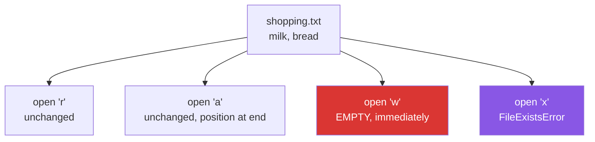

# 2.1 — `open()`, the mode string, and what each letter costs

## One-line answer

`open(path, mode)` hands back a file object, and the mode is a one- or two-letter word that decides
whether you can read, whether you can write, whether the existing contents survive, and whether you get
text or bytes — and one of those letters, `w`, empties the file the instant you open it.

---

## The story

The shopping list has milk and bread on it. You want to add eggs.

There are two obviously different things you could do, and everybody has done both. You can open the
file and type at the bottom, or you can open the file, select everything, and start again.

Nobody confuses those two when they are holding a pen. In a program they are one character apart:
`"a"` and `"w"`. And the second one does its damage **at the moment the file is opened**, before you have
written anything — so a program that opens for writing and then crashes has already destroyed the list,
without having written a single new word.

That is the whole of this document. The mode is a small word that decides what happens to what is
already there, and it decides it immediately.

---

## The idea in plain language

`open(path, mode, encoding=...)` returns a **file object** — sometimes called a *file handle* or a
*stream* — which is a thing you read from or write to, and which must be closed when you are done
([4.1](../04-context-managers/4.1-with-the-block-that-cleans-up.md) is how).

The mode is a short string. The first letter says what you are doing:

| Letter | If the file exists | If it does not | Where you start |
|---|---|---|---|
| `r` | read it | `FileNotFoundError` | the beginning |
| `w` | **empty it immediately** | create it | the beginning |
| `a` | keep it | create it | **the end**, always |
| `x` | `FileExistsError` | create it | the beginning |

And an optional second character says what you get:

- **nothing, or `t`** — *text mode*: you read and write `str`, and Python decodes the bytes for you.
- **`b`** — *binary mode*: you read and write `bytes`, and nothing is decoded or translated.

You can add `+` to any of them for "and the other thing too" — `r+` is read and write without
truncating, `w+` truncates and then allows reading. They are rarely the clearest way to express what you
want, and mixing reads and writes on one handle brings position bugs that a second `open` avoids.

The three that matter in almost all real code are **`r`**, **`w`** and **`a`**, and the one to be careful
about is `w`. Two facts about it:

**It truncates on open, not on write.** `open(p, "w")` and then an exception on the next line leaves an
empty file.

**It is the default for `write_text`.** `Path.write_text` and `Path.write_bytes` are the one-line
convenience forms, and they replace the file's contents. That is usually what you want and it is worth
knowing rather than discovering.

For anything you would be sad to lose, `x` is the mode that refuses rather than overwrites, and it does
the check and the create as one operation so there is no gap
([1.4](../01-the-path/1.4-exists-mkdir-and-the-race.md)).

---

## Why Setu needs it

- **Day 227's scraper appends as it goes.** Getting `a` and `w` the wrong way round means each batch
  replaces the last, and the file looks fine — it just holds one batch instead of forty.
- **`Path.read_text` and `write_text` are what you will actually use for small files**, and knowing that
  they are `open` with a mode and a close is what stops them being magic.
- **Phase 18 writes a vector index in binary** and Phase 4 reads CSVs as text. The `b` is not decoration:
  reading binary data in text mode corrupts it, which is [2.2](2.2-encoding.md)'s subject.
- **Principle 11's blast radius.** `open(computed_path, "w")` is a destructive operation on a path your
  code worked out, and it is worth being able to see that at a glance in a review.

---

## The mechanism

```python
"""The mode string, one letter at a time."""

from pathlib import Path

p = Path("shopping.txt")
p.write_text("milk\nbread\n", encoding="utf-8")

with open(p, encoding="utf-8") as f:
    print("r  reads      :", repr(f.read()))

with open(p, "a", encoding="utf-8") as f:
    f.write("eggs\n")
print("a  appended   :", repr(p.read_text(encoding="utf-8")))

with open(p, "w", encoding="utf-8") as f:
    f.write("milk\n")
print("w  TRUNCATED  :", repr(p.read_text(encoding="utf-8")))

try:
    with open(p, "x", encoding="utf-8") as f:
        f.write("never")
except FileExistsError as error:
    print("x  refuses    :", type(error).__name__)

with open(p, "rb") as f:
    print("rb gives bytes:", repr(f.read()))
```

Run on Python 3.12.12 on Windows on 2026-09-01:

```
r  reads      : 'milk\nbread\n'
a  appended   : 'milk\nbread\neggs\n'
w  TRUNCATED  : 'milk\n'
x  refuses    : FileExistsError
rb gives bytes: b'milk\r\n'
```

**Line by line:**

- `p.write_text("milk\nbread\n", encoding="utf-8")` — the one-line form. It opens in `"w"`, writes,
  closes, and **replaces whatever was there**.
- `open(p, encoding="utf-8")` with **no mode at all** — `"r"` is the default, and text is the default, so
  this is `"rt"`. Leaving the mode off when you are reading text is idiomatic.
- `with ... as f:` — the block that guarantees the close. Section 4 is entirely about this; for now, read
  it as "open, use, close, whatever happens".
- `f.read()` gives the whole file as one string. `repr` around it so the newlines are visible as `\n`
  rather than as blank space
  ([Day 7, 3.3](../../../day-07-strings/parts/03-formatting/3.3-repr-and-the-debugging-f-string.md)).
- `open(p, "a", ...)` then `f.write("eggs\n")` — appended, and the two existing lines are still there.
  **`a` always writes at the end**, whatever you do with the position beforehand.
- `open(p, "w", ...)` then one write — the file now holds **only** `milk\n`. `bread` and `eggs` are gone,
  and nothing warned about it. That is the line to remember.
- `open(p, "x", ...)` raises `FileExistsError` **before the `write` runs**, which is exactly what makes
  it useful: it is a create-if-absent that cannot clobber.
- `open(p, "rb")` — binary, no `encoding=` (passing one is a `ValueError`, because there is nothing to
  decode). It returns `bytes`, printed with a `b` prefix.
- **Look hard at that last line: `b'milk\r\n'`.** The file was written with `\n` and the bytes on disk
  are `\r\n`. Text mode translated it on the way out, and translated it back on the way in, which is why
  the `r` read showed `\n`. That is [2.3](2.3-newlines.md), and this is where it first shows up.

What each mode does to what is already there:



---

## When it breaks

**`w` on a file you meant to add to:**

```text
$ uv run python -c "
from pathlib import Path
p = Path('batch.txt')
p.write_text('batch 1\n', encoding='utf-8')
for n in (2, 3):
    with open(p, 'w', encoding='utf-8') as f:
        f.write(f'batch {n}\n')
print(repr(p.read_text(encoding='utf-8')))
"
'batch 3\n'
```

**What it means.** Three batches went in and one came out. Every iteration truncated the file and wrote
its own line, so the result is the last batch — which looks like a working file with plausible content,
not like an error. **A loop that opens with `w` is almost always meant to open once outside the loop, or
to use `a`.** The version that opens once and writes three times is both correct and faster.

**`w` and then a crash:**

```text
$ uv run python -c "
from pathlib import Path
p = Path('precious.txt')
p.write_text('milk\nbread\neggs\n', encoding='utf-8')
print('before:', repr(p.read_text(encoding='utf-8')))
try:
    with open(p, 'w', encoding='utf-8') as f:
        raise RuntimeError('something went wrong before we wrote anything')
except RuntimeError as e:
    print('failed:', e)
print('after :', repr(p.read_text(encoding='utf-8')))
"
before: 'milk\nbread\neggs\n'
failed: something went wrong before we wrote anything
after : ''
```

**What it means.** Not one byte was written and the file is empty. **`w` truncates when the file is
opened**, so the destruction happens at the `open` and the failure happens afterwards. This is why a
program that regenerates a file should write to a temporary name and rename at the end
([1.4](../01-the-path/1.4-exists-mkdir-and-the-race.md)) — then a crash leaves the old file intact.

**Reading a file that is not there:**

```text
$ uv run python -c "
open('no-such-list.txt', encoding='utf-8')
"
Traceback (most recent call last):
  File "<string>", line 2, in <module>
FileNotFoundError: [Errno 2] No such file or directory: 'no-such-list.txt'
```

**What it means.** `r` refuses to invent a file, which is the right default — a silent empty read would
turn a wrong path into "the data was empty". The fix is not to check `exists()` first
([1.4](../01-the-path/1.4-exists-mkdir-and-the-race.md)) but to catch `FileNotFoundError` where you can
do something about it.

**Writing text to a binary handle:**

```text
$ uv run python -c "
with open('bin.txt', 'wb') as f:
    f.write('milk\n')
"
Traceback (most recent call last):
  File "<string>", line 3, in <module>
TypeError: a bytes-like object is required, not 'str'
```

**What it means.** Binary mode deals in `bytes` and you handed it a `str`. The two are genuinely
different types ([Day 7, 1.1](../../../day-07-strings/parts/01-text/1.1-a-string-is-code-points.md)), and
the `b` in the mode is the moment you take responsibility for the conversion yourself:
`f.write("milk\n".encode("utf-8"))`. The mirror-image mistake — passing `encoding=` to a binary open —
raises `ValueError: binary mode doesn't take an encoding argument`.

---

## In production

**The professional habit is that a write to an important file is never done in place.** Write to
`out.jsonl.tmp` in the same folder, `flush` and `fsync`
([3.2](../03-buffering/3.2-flush-fsync-and-what-saved-means.md)), then `Path.replace` onto the final
name. A rename within one filesystem is atomic, so any reader sees either the whole old file or the whole
new one and never a truncated one — which the `w`-then-crash failure above shows is otherwise the normal
outcome.

**What changes at scale is that `a` becomes the only sane mode for a growing file.** Append is cheap
regardless of how big the file is, and on most systems a single `write` of a modest size is not
interleaved with another process's append — which is why log files and JSONL are written that way
([2.5](2.5-jsonl.md)). Rewriting a whole file to add one record is fine at a thousand lines and
impossible at fifty million.

**The failure that only appears with real data is the file opened `w` by two processes at once.** Both
truncate, both write, and the result is a mixture whose length is whichever one finished last — with no
error from either. Nothing in `open` prevents it. The defences are the same as everywhere else: append
instead of rewrite, write-then-rename, or a lock file created with `x` so only one process can hold it.

**The review comment a senior engineer leaves.** *"`open(out, 'w')` inside the per-batch loop truncates
on every iteration, so the file only ever holds the last batch — and the integration test passes because
it uses one batch. Open once outside the loop, or use `'a'` and delete the file at the start."*

**The interview question.** *"What is the difference between `w` and `a`?"* The obvious answer is
truncate versus append. What makes it a good one is *when*: `w` empties the file at the moment it is
opened, before anything is written, so a failure between the open and the write leaves nothing at all —
which is the argument for write-to-temporary-and-rename. Adding that `x` creates only if absent, as one
atomic operation, and that binary mode takes no `encoding` because there is nothing to decode, rounds it
off.

---

## Check yourself

```bash
uv run python -c "
from pathlib import Path

p = Path('modes.txt')
p.write_text('milk\n', encoding='utf-8')

with open(p, 'a', encoding='utf-8') as f:
    f.write('bread\n')
print('after a:', repr(p.read_text(encoding='utf-8')))

with open(p, 'w', encoding='utf-8') as f:
    f.write('eggs\n')
print('after w:', repr(p.read_text(encoding='utf-8')))

try:
    open(p, 'x', encoding='utf-8')
except FileExistsError as e:
    print('x      :', type(e).__name__)
"
```

Two writes, and the second one destroyed the first. Now predict what `open(p, "w")` followed by an
immediate `KeyboardInterrupt` would leave behind.

**Answer out loud, without scrolling up:**

> What does `w` do, and at what moment does it do it? Then say what `x` is for and what binary mode
> changes about the values you read and write.

---

**Next:** [2.2 — the encoding argument you must always pass](2.2-encoding.md), which is the difference
between the bytes on disk and the text in your program.
