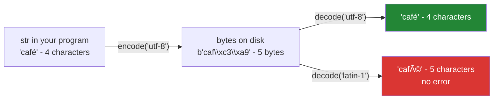

# 2.2 — The `encoding=` argument you must always pass

## One-line answer

A file holds bytes, text mode turns them into characters, and the rule for which byte means which
character is the *encoding* — so leaving `encoding=` off means Python guesses from the machine's
settings, and two machines guess differently.

---

## The story

The shopping list has a café on it, because you are meeting somebody there.

You write the list on your laptop, send the file to somebody else, and they open it. Where you wrote
**café** their screen says **café**.

Nothing was corrupted in transit; the file that arrived is byte-for-byte the file that left. What
differs is the rule each machine used to turn those bytes into letters. Yours wrote the é as two bytes
under one rule; theirs read those two bytes under a different rule and got two letters, both of which
are real letters that somebody somewhere needs.

The part worth noticing is that **neither machine did anything wrong and neither reported a problem.**
Reading is a decision, the decision was made silently by each machine's default, and the two defaults
disagreed.

---

## The idea in plain language

A file on disk is a run of bytes: numbers from 0 to 255. A `str` in Python is a run of characters —
code points ([Day 7, 1.1](../../../day-07-strings/parts/01-text/1.1-a-string-is-code-points.md)). Text
mode converts between the two, and an **encoding** is the rule it uses.

- **UTF-8** is the one to use. It represents every character there is, uses one byte for the ASCII range,
  and is what essentially all data on the internet uses.
- **latin-1** (also called ISO-8859-1) maps each of the 256 byte values to one character. It never fails
  — which sounds like a feature and is the reason mangled text spreads silently.
- **cp1252** is the traditional Windows default in western Europe, and is what `locale.getpreferredencoding()`
  returns on the machine this was written on.
- **ascii** covers 128 characters and refuses everything else.

Now the rule, and it is short: **pass `encoding="utf-8"` to every text-mode `open`, `read_text` and
`write_text`.**

Without it, Python uses the locale's preferred encoding, which depends on the operating system, the
region it was installed for, and environment variables. That means:

- A file written on one machine and read on another can decode differently.
- The same code passes in your editor and fails in CI, where the locale is usually UTF-8.
- The failure mode is either an exception on a byte the encoding cannot handle, or — worse — **no
  exception and wrong characters**.

Two failure shapes are worth telling apart:

**A crash** — `UnicodeDecodeError`. Loud, immediate, and honestly the good outcome, because it happens
where the mistake is.

**Mojibake** — the text decodes into different characters and travels on. `café` read as latin-1 becomes
`café`, which is five characters where there were four. Every downstream comparison, hash and
deduplication is now working on different text, and nothing raised.

The situation has been improving. *PEP 597 — Add optional EncodingWarning* (2019,
<https://peps.python.org/pep-0597/>) added a warning you can switch on with the `-X warn_default_encoding`
flag, and *PEP 686 — Make UTF-8 mode default* (2022, <https://peps.python.org/pep-0686/>) sets a direction
for future versions. Neither changes the rule today: write the argument.

---

## Why Setu needs it

- **Paper titles are full of non-ASCII text** — accented names, dashes, Greek letters in mathematics.
  Day 227's ingestion meets all of it, and a title that decodes differently on two runs is two papers
  ([Day 15, 3.3](../../../day-15-constructors-and-dunders/parts/03-the-dunders/3.3-eq-and-the-duplicate.md)).
- **This project is written on Windows and tested on Linux**
  ([Day 2, 5.2](../../../day-02-quality-gate/parts/05-ci/5.2-the-workflow-file-block-by-block.md)), which
  is exactly the pair of machines whose defaults differ.
- **[Day 7, 4.2](../../../day-07-strings/parts/04-normalising/4.2-unicode-normalisation.md) established
  that two spellings of one character exist even within Unicode.** Encoding is the layer below that: get
  it wrong and normalisation has nothing correct to work on.
- **Principle 9's provenance** is worthless if the bytes were read under a rule nobody wrote down. The
  encoding is part of the format, and a `SOURCE.md` should say it.

---

## The mechanism

```python
"""Text is bytes plus a decision about how to read them."""

import locale
from pathlib import Path

p = Path("cafe.txt")
p.write_bytes("café\n".encode("utf-8"))


def codes(text):
    """Print the characters as code points, so the terminal cannot lie."""
    return [f"U+{ord(c):04X}" for c in text.rstrip()]


print("on disk, raw     :", p.read_bytes())
print("read as utf-8    :", codes(p.read_text(encoding="utf-8")))
print("read as latin-1  :", codes(p.read_text(encoding="latin-1")))
print(
    "how many chars   :",
    len(p.read_text(encoding="utf-8").rstrip()),
    "vs",
    len(p.read_text(encoding="latin-1").rstrip()),
)
print("preferred locale :", locale.getpreferredencoding(False))

try:
    p.read_text(encoding="ascii")
except UnicodeDecodeError as error:
    print("read as ascii    :", type(error).__name__, "-", error.reason)
```

Run on Python 3.12.12 on Windows on 2026-09-01. **`preferred locale` will differ on your machine**, and
that is the point:

```
on disk, raw     : b'caf\xc3\xa9\n'
read as utf-8    : ['U+0063', 'U+0061', 'U+0066', 'U+00E9']
read as latin-1  : ['U+0063', 'U+0061', 'U+0066', 'U+00C3', 'U+00A9']
how many chars   : 4 vs 5
preferred locale : cp1252
read as ascii    : UnicodeDecodeError - ordinal not in range(128)
```

**Line by line:**

- `p.write_bytes("café\n".encode("utf-8"))` — writing **bytes** deliberately, so the file's contents are
  known exactly and nothing is left to a default. `.encode()` is the `str`-to-`bytes` direction, and
  `.decode()` is the other way.
- `def codes(text)` prints each character's code point as `U+XXXX`. **This exists because a terminal has
  its own encoding and will happily draw the wrong glyph**, so printing the characters themselves would
  be evidence about the terminal rather than about the file.
- `p.read_bytes()` shows `b'caf\xc3\xa9\n'` — seven bytes. The `é` is **two** of them, `\xc3` and `\xa9`,
  because UTF-8 uses more than one byte for anything outside ASCII.
- `read_text(encoding="utf-8")` gives four code points ending in `U+00E9`, which is `é`. Correct.
- `read_text(encoding="latin-1")` gives **five** code points, `U+00C3` and `U+00A9` — `Ã` and `©`. Each
  byte became one character, because that is what latin-1 does. **No exception.** This is mojibake, and
  the only way to see it here is by counting.
- `4 vs 5` — one file, two lengths. Every `len`, slice, comparison and hash downstream is now working on
  different data.
- `locale.getpreferredencoding(False)` is what an `open` with no `encoding=` would have used. `cp1252`
  here, `UTF-8` on the Linux runner this project's CI uses.
- `read_text(encoding="ascii")` raises `UnicodeDecodeError`, and `.reason` is `ordinal not in
  range(128)`. **This is the good failure** — loud, at the read, naming the problem.

The two directions:



---

## When it breaks

**The default that differs between machines:**

```text
$ uv run python -c "
import locale
from pathlib import Path
p = Path('cafe.txt')
p.write_bytes('café\n'.encode('utf-8'))
print('this machine would use:', locale.getpreferredencoding(False))
print('chars with the default:', len(p.read_text().rstrip()))
print('chars with utf-8      :', len(p.read_text(encoding='utf-8').rstrip()))
"
this machine would use: cp1252
chars with the default: 5
chars with utf-8      : 4
```

**What it means.** Two reads of one file gave two different lengths, and only the second one passed an
`encoding`. On the Linux machine that runs this project's CI the first line would say `UTF-8` and both
counts would be `4` — so the same code is correct there and wrong here, with nothing in the source to
explain the difference. **This is the entire argument for always passing `encoding=`.**

**Round-tripping through the wrong encoding:**

```text
$ uv run python -c "
from pathlib import Path
p = Path('round.txt')
p.write_bytes('café\n'.encode('utf-8'))
wrong = p.read_text(encoding='latin-1')
p.write_text(wrong, encoding='utf-8')
print('after one bad round trip:', p.read_bytes())
print('and again               :', end=' ')
wrong2 = p.read_text(encoding='latin-1')
p.write_text(wrong2, encoding='utf-8')
print(p.read_bytes())
"
after one bad round trip: b'caf\xc3\x83\xc2\xa9\r\n'
and again               : b'caf\xc3\x83\xc2\x83\xc3\x82\xc2\xa9\r\n'
```

**What it means.** Read wrong, written back, and the damage is now **in the file** — the é has become
two mangled characters stored as four bytes. Do it again and it is eight. This is how a corpus rots: each
pass through a pipeline with one wrong encoding doubles the mess, and because every stage succeeds there
is nothing to alert on. **Mojibake compounds, and it is not recoverable once two passes have run.**

**A `UnicodeDecodeError` in the middle of a big file:**

```text
$ uv run python -c "
from pathlib import Path
p = Path('mixed.txt')
p.write_bytes(b'milk\nbread\n' + 'café\n'.encode('utf-8') + b'eggs\n')
lines = []
with open(p, encoding='ascii') as f:
    for line in f:
        lines.append(line.strip())
print(lines)
"
Traceback (most recent call last):
  File "<string>", line 7, in <module>
  File "...\Lib\encodings\ascii.py", line 26, in decode
    return codecs.ascii_decode(input, self.errors)[0]
UnicodeDecodeError: 'ascii' codec can't decode byte 0xc3 in position 14: ordinal not in range(128)
```

**What it means.** Two lines were read successfully and the third killed the loop, so a partial result
sits in `lines` and the exception says nothing about which record. Note the useful part of the message:
**`position 14`** is the byte offset in the file, which is how you find the offending line. Real ingestion
code either fixes the encoding or passes `errors="replace"` deliberately and counts the replacements —
never `errors="ignore"`, which deletes data silently.

**A BOM at the start of a file:**

```text
$ uv run python -c "
from pathlib import Path
p = Path('bom.csv')
p.write_bytes(b'\xef\xbb\xbftitle,year\nThe Kitchen Table,2019\n')
first = p.read_text(encoding='utf-8').splitlines()[0]
print('utf-8      :', repr(first))
print('columns    :', first.split(','))
print('utf-8-sig  :', repr(p.read_text(encoding='utf-8-sig').splitlines()[0]))
"
utf-8      : 'title,year'
columns    : ['title', 'year']
utf-8-sig  : 'title,year'
```

**What it means.** The file begins with a *byte order mark*, three bytes some Windows tools write at the
front of a UTF-8 file. Decoded as plain `utf-8` it becomes character `U+FEFF`, glued to the first column
name — so the first column is `'title'` and `row["title"]` raises `KeyError` on a header that looks
exactly right in every editor. **Only `repr` shows it**; printed plainly it is invisible, which is why
this bug survives being stared at. `encoding="utf-8-sig"` strips it, and behaves identically on a file
that has no BOM.

---

## In production

**The professional habit is a project-wide rule: UTF-8 everywhere, written explicitly at every call.**
Linters enforce it — `ruff`'s `PLW1514` flags a text-mode `open` with no `encoding` — and it is worth
turning on precisely because the mistake is invisible on the machine you are writing on. For data
arriving from outside, `utf-8-sig` is a safe default for reading, since it handles a BOM and behaves
identically when there is not one.

**What changes at scale is that you stop controlling the input.** A corpus assembled from many sources
has files in several encodings, some of them mislabelled, and there is no way to be certain from the
bytes alone — encoding detection is guesswork with a confidence score, not a lookup. The professional
shape is to decode with `errors="replace"`, **count the replacement characters per document**, and route
anything above a threshold to a queue for a human. That turns silent corruption into a number on a
dashboard, which is the most you can honestly do.

**The failure that only appears with real data is the mojibake that reaches the index.** A title
decoded wrongly is not equal to the same title decoded correctly, so deduplication misses it, a search
for it returns nothing, and its embedding sits in a different part of the vector space
([Day 15, 3.4](../../../day-15-constructors-and-dunders/parts/03-the-dunders/3.4-hash-and-the-broken-set.md)).
None of that shows up as an error; it shows up as recall being quietly worse than it should be, which is
the hardest kind of bug to attribute.

**The review comment a senior engineer leaves.** *"`open(path)` with no `encoding` picks up the locale,
so this parses differently on your laptop and on the runner — and the fixture has an accent in it, so the
test is passing for the wrong reason. Pass `encoding='utf-8'`, and use `utf-8-sig` for the exported CSVs
because they come out of Excel with a BOM."*

**The interview question.** *"What does `encoding='utf-8'` do, and what happens if you leave it out?"*
The answer that lands separates the two failure modes: leaving it out means Python uses the locale's
encoding, which differs between machines, and the result is either a `UnicodeDecodeError` — loud and
findable — or mojibake, which is silent, compounds on every round trip, and breaks equality and
deduplication downstream. Adding the BOM case, and that `utf-8-sig` handles it, is the detail that shows
you have loaded somebody else's CSV.

---

## Check yourself

```bash
uv run python -c "
import locale
from pathlib import Path

p = Path('cafe.txt')
p.write_bytes('café\n'.encode('utf-8'))
print('bytes    :', p.read_bytes())
print('utf-8    :', len(p.read_text(encoding='utf-8').rstrip()), 'chars')
print('latin-1  :', len(p.read_text(encoding='latin-1').rstrip()), 'chars')
print('default  :', locale.getpreferredencoding(False))
try:
    p.read_text(encoding='ascii')
except UnicodeDecodeError as e:
    print('ascii    :', e.reason)
"
```

One file, three answers, and only one of them raised. Say which of the other two is wrong and how you
would find out without counting characters.

**Answer out loud, without scrolling up:**

> What does Python use when you leave `encoding=` off, and why is that a problem across machines? Then
> describe the difference between a `UnicodeDecodeError` and mojibake, and say which one you would
> rather have.

---

**Next:** [2.3 — newlines, and the file that grew a character](2.3-newlines.md), the other translation
text mode performs without being asked.
