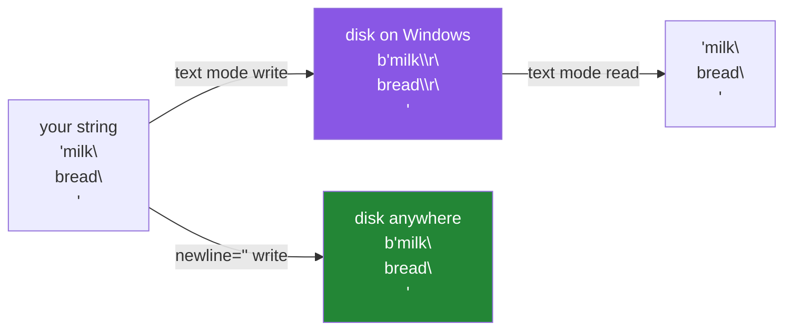

# 2.3 — Newlines, and the file that grew a character

## One-line answer

Text mode translates line endings on the way in and on the way out, so a `\n` written on Windows becomes
two bytes on disk and comes back as one — which is invisible until something counts bytes, compares
hashes, or reads the file as binary.

---

## The story

You write the shopping list on a Windows laptop: three lines, milk, bread, eggs. Fourteen characters
plus three line breaks — seventeen, you would have said.

Somebody checks the file size and it says twenty.

Nothing is wrong with the file. It opens correctly, it has three lines, and every program that reads it
shows exactly what you typed. But the way a line ending is written down differs between systems — one
character on some, two on others — and this laptop writes two.

You would never notice, and mostly it does not matter. It matters the day the file's checksum is
compared against the one produced on a different machine, or the day the file is read as raw bytes and
something counts them. Then a file that is identical in every way anyone cares about is *not* identical,
and the difference is three characters nobody typed.

---

## The idea in plain language

Two conventions for "end of line" are in use:

- **`\n`** — one byte, `0x0A`, called *line feed*. Used by Linux and macOS.
- **`\r\n`** — two bytes, *carriage return* then *line feed*. Used by Windows.

Python's text mode hides the difference, using what it calls **universal newlines**:

**Reading.** Any of `\n`, `\r\n` or a bare `\r` is turned into `\n` before your code sees it. So text
read in Python always has `\n`, whatever the file contains.

**Writing.** Every `\n` you write is translated into `os.linesep` — `\r\n` on Windows, `\n` elsewhere.

That is a genuinely good default. It means the same code reads files from any system, and writes files
that local tools are happy with. It also means **the bytes on disk are not the characters you wrote**,
and that gap is where the surprises live.

The `newline=` parameter on `open` controls it:

| `newline=` | Reading | Writing |
|---|---|---|
| not passed | any ending becomes `\n` | `\n` becomes `os.linesep` |
| `""` | any ending becomes `\n`, and `\r\n` is *kept* in the returned string | no translation |
| `"\n"` | only `\n` splits lines | no translation |

The two rules that follow are short:

**When the file is for other programs, pass `newline="\n"`.** JSONL, a data export, anything whose bytes
will be hashed or compared across machines. Then the file is byte-identical wherever it was written.

**When you use the `csv` module, pass `newline=""`.** This is not optional and the standard library
documents it — the `csv` writer emits `\r\n` itself, and letting text mode translate the `\n` inside that
produces `\r\r\n` and a blank line between every row.

Binary mode does no translation at all, which is why reading a text file with `"rb"` is the way to see
what is actually there.

---

## Why Setu needs it

- **Day 2's `ruff format` and Git both normalise line endings**, and a file this project writes must not
  fight them. A JSONL file whose bytes differ between Windows and CI shows up as a permanently dirty
  working tree.
- **[2.5](2.5-jsonl.md) writes JSONL**, which is a byte format: one record, one `\n`. Writing `\r\n`
  works with Python's own reader and breaks strict parsers elsewhere.
- **Day 233's eval suite compares output files against expected ones.** A test that compares bytes fails
  on the wrong machine for a reason nothing in the diff will show.
- **Phase 4 reads CSVs**, and the `newline=""` rule is the first thing that goes wrong when somebody
  writes one.

---

## The mechanism

```python
"""The newline that grew a character, and the one that did not."""

from pathlib import Path

text = Path("nl-text.txt")
with open(text, "w", encoding="utf-8") as f:
    f.write("milk\nbread\n")

binary = Path("nl-binary.txt")
with open(binary, "wb") as f:
    f.write(b"milk\nbread\n")

explicit = Path("nl-explicit.txt")
with open(explicit, "w", encoding="utf-8", newline="") as f:
    f.write("milk\nbread\n")

for p in (text, binary, explicit):
    raw = p.read_bytes()
    print(f"{p.name:18} {len(raw):>3} bytes  {raw!r}")

print("read back, text mode:", repr(text.read_text(encoding="utf-8")))
```

Run on Python 3.12.12 **on Windows** on 2026-09-01. On Linux or macOS all three lines would show 11
bytes, and that difference is the subject:

```
nl-text.txt         13 bytes  b'milk\r\nbread\r\n'
nl-binary.txt       11 bytes  b'milk\nbread\n'
nl-explicit.txt     11 bytes  b'milk\nbread\n'
read back, text mode: 'milk\nbread\n'
```

**Line by line:**

- All three files are written with the **same string**, `"milk\nbread\n"` — eleven characters.
- `open(text, "w", encoding="utf-8")` — ordinary text mode, no `newline=`. The file is **13 bytes**:
  each `\n` became `\r\n`.
- `open(binary, "wb")` — binary, so the bytes go down exactly as given. **11 bytes.** Binary mode never
  translates.
- `open(explicit, "w", encoding="utf-8", newline="")` — text mode with translation turned off. **11
  bytes**, the same as binary, but you are still writing `str` and the encoding still applies. This is
  the combination you want for a portable text format.
- `p.read_bytes()` is how the difference is made visible. `read_text` would show `'milk\nbread\n'` for
  all three, because reading translates back.
- `f"{len(raw):>3}"` right-aligns the count so the three numbers line up
  ([Day 7, 3.2](../../../day-07-strings/parts/03-formatting/3.2-the-format-spec.md)).
- The last line reads the 13-byte file in text mode and gets **eleven characters** back. **Both
  translations happened and cancelled out**, which is exactly why nobody notices until they look at the
  bytes.
- Note what this means for `len`: the string is 11 and the file is 13, so `len(text)` and
  `path.stat().st_size` disagree by the number of lines. Any code that seeks by character count into a
  text file is wrong on Windows for this reason.

The two translations:



---

## When it breaks

**`csv` without `newline=""`:**

```text
$ uv run python -c "
import csv
from pathlib import Path

p = Path('rows.csv')
with open(p, 'w', encoding='utf-8') as f:
    csv.writer(f).writerows([['title', 'year'], ['The Kitchen Table', 2019]])
print('without newline=:', p.read_bytes())

with open(p, 'w', encoding='utf-8', newline='') as f:
    csv.writer(f).writerows([['title', 'year'], ['The Kitchen Table', 2019]])
print('with newline=  :', p.read_bytes())
"
without newline=: b'title,year\r\r\nThe Kitchen Table,2019\r\r\n'
with newline=  : b'title,year\r\nThe Kitchen Table,2019\r\n'
```

**What it means.** `\r\r\n` — the `csv` writer produced `\r\n`, and text mode then translated the `\n`
part into `\r\n` as well. Opened in a spreadsheet this shows a **blank row between every row of data**,
and the file is bigger for no reason. `newline=""` is documented as required for `csv` for exactly this,
and it is the single most common CSV bug in Python.

**A hash that differs between machines:**

```text
$ uv run python -c "
import hashlib
from pathlib import Path

a, b = Path('h-default.txt'), Path('h-explicit.txt')
with open(a, 'w', encoding='utf-8') as f:
    f.write('milk\nbread\n')
with open(b, 'w', encoding='utf-8', newline='\n') as f:
    f.write('milk\nbread\n')

print('default :', hashlib.sha256(a.read_bytes()).hexdigest()[:16])
print('newline :', hashlib.sha256(b.read_bytes()).hexdigest()[:16])
print('same text?', a.read_text(encoding='utf-8') == b.read_text(encoding='utf-8'))
"
default : 604c70bcf08d8a4d
newline : a6fb55c103b69eb0
same text? True
```

**What it means.** Two files with **identical text** and different checksums. Any pipeline that
deduplicates by content hash, caches on a file digest, or asserts a fixture's checksum in a test will
see them as different data — and the difference appears only when one was produced on Windows and the
other on Linux. `newline="\n"` on every machine-readable output removes the whole class.

**Splitting on `\r\n` that is not there:**

```text
$ uv run python -c "
from pathlib import Path
p = Path('nl-text.txt')
with open(p, 'w', encoding='utf-8') as f:
    f.write('milk\nbread\n')
text = p.read_text(encoding='utf-8')
print('bytes on disk :', p.read_bytes())
print('split on rn   :', text.split('\r\n'))
print('split on n    :', text.split('\n'))
print('splitlines    :', text.splitlines())
"
bytes on disk : b'milk\r\nbread\r\n'
split on rn   : ['milk\nbread\n']
split on n    : ['milk', 'bread', '']
splitlines    : ['milk', 'bread']
```

**What it means.** The file contains `\r\n` and splitting the *read* text on `\r\n` found nothing —
because reading already translated it away. Somebody who inspected the file in a hex editor and then
wrote the split to match got one item where they expected two. `splitlines()` is the method that handles
every convention and drops the trailing empty piece
([Day 7, 2.2](../../../day-07-strings/parts/02-methods/2.2-split-and-join.md)), and it is what to use
unless you have a specific reason not to.

**A bare `\r` from a very old file:**

```text
$ uv run python -c "
from pathlib import Path
p = Path('classic.txt')
p.write_bytes(b'milk\rbread\reggs\r')
print('default read :', repr(p.read_text(encoding='utf-8')))
print('lines        :', len(p.read_text(encoding='utf-8').splitlines()))
with open(p, encoding='utf-8', newline='\n') as f:
    print('newline n    :', repr(f.read()))
    f.seek(0)
    print('lines        :', len(f.readlines()))
"
default read : 'milk\nbread\neggs\n'
lines        : 3
newline n    : 'milk\rbread\reggs\r'
lines        : 1
```

**What it means.** With universal newlines a classic-Mac file reads as three lines; with `newline="\n"`
the whole file is **one line** of 16 characters, because nothing splits it. Passing `newline="\n"` for
*reading* therefore turns off the leniency that makes files portable — the rule from the idea section is
about **writing**. For reading, leave it alone.

---

## In production

**The professional habit is `newline="\n"` on every file another program will parse, and `newline=""`
whenever the `csv` module is involved.** The first makes the bytes identical everywhere, which is what
content hashing, caching and reproducible builds require; the second is a documented requirement rather
than a preference. For reading, the default is right, because leniency about what arrives is the correct
posture for input.

**What changes at scale is that line endings become a version-control and diff problem.** A repository
where some files were written with `\r\n` and some with `\n` produces diffs where every line appears
changed, and code review becomes impossible. That is what `.gitattributes` and `core.autocrlf` exist for,
and it is why a `.gitattributes` marking data files as `text eol=lf` is standard on any project touched
from more than one operating system.

**The failure that only appears with real data is the trailing `\r` in a parsed field.** A CSV or TSV
written with `\r\n` and read in binary, or split by hand on `\n`, leaves a `\r` at the end of the last
field on every row. The value looks right in a print, compares unequal to the same string without it, and
fails a lookup — `"2019\r"` is not `"2019"`, and `int("2019\r")` happens to work, which makes the
diagnosis worse. `.strip()` on parsed fields hides it; using `splitlines()` or a real CSV reader prevents
it.

**The review comment a senior engineer leaves.** *"The exporter opens with `'w'` and no `newline`, so on
Windows every record ends `\r\n` and the checksum test fails there. Pass `newline='\n'` — this file is
consumed by a parser, not by Notepad. And the CSV writer three lines down needs `newline=''` or you get a
blank row between every row."*

**The interview question.** *"What does `newline=` do in `open`?"* The answer that lands describes both
directions: text mode translates any line ending to `\n` on read and `\n` to the platform's ending on
write, so the same code works everywhere but the bytes on disk differ between machines. Then the two
practical rules — `newline="\n"` for files another program parses, so hashes and diffs match, and
`newline=""` for the `csv` module, or you get `\r\r\n` and a blank row between every row — and, if you
have hit it, the trailing `\r` on the last field of a hand-split line.

---

## Check yourself

```bash
uv run python -c "
from pathlib import Path

a, b = Path('a.txt'), Path('b.txt')
with open(a, 'w', encoding='utf-8') as f:
    f.write('milk\nbread\n')
with open(b, 'w', encoding='utf-8', newline='\n') as f:
    f.write('milk\nbread\n')

print('default :', len(a.read_bytes()), 'bytes', a.read_bytes())
print('newline :', len(b.read_bytes()), 'bytes', b.read_bytes())
print('same text?', a.read_text(encoding='utf-8') == b.read_text(encoding='utf-8'))
print('same bytes?', a.read_bytes() == b.read_bytes())
"
```

On Linux the two byte counts match; on Windows they do not. Say which of the last two lines a
content-hash cache would care about.

**Answer out loud, without scrolling up:**

> What does text mode do to line endings when reading, and when writing? Then say when you would pass
> `newline="\n"` and when you would pass `newline=""`.

---

**Next:** [2.4 — reading a big file without holding it](2.4-reading-a-big-file.md), where the generator
from Day 11 comes back with a measurement.
