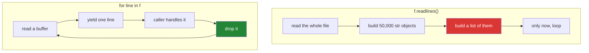

# 2.4 — Reading a big file without holding it

## One-line answer

A file object is already an iterator over its own lines, so `for line in f:` reads one line at a time and
holds one line at a time — where `f.read()` and `f.readlines()` both put the entire file in memory before
your code sees a single character of it.

---

## The story

The shopping list stopped being a shopping list a while ago.

Somebody started logging every receipt into the same file: one line per item, every shop, every week.
It is fifty thousand lines now, and the question is still small — *how many times did we buy milk?*

There are two ways to answer it.

You can print the whole thing out, put the stack on the table, and go through it. That works, and it
needs a table big enough for fifty thousand lines, and you cannot start counting until the last page has
printed.

Or you can read it one line at a time, keep a tally in your head, and drop each line as you go. Same
answer. One line on the table at any moment, and you start counting immediately.

The second way is not clever. It is the way anybody would do it with paper. It only looks like a
technique in a program because the first way is so easy to type.

---

## The idea in plain language

An open file object is an **iterator over its lines**
([Day 11, 1.1](../../../day-11-iterators-and-generators/parts/01-iterators/1.1-iterable-and-iterator.md)).
That single fact is the whole document. `for line in f:` works directly, and it pulls one line at a time
from a small internal buffer.

Four ways to read, and what each holds:

| Written | Gives you | In memory at once |
|---|---|---|
| `f.read()` | one string, the whole file | the whole file |
| `f.readlines()` | a list of strings | the whole file, **plus a list object per line** |
| `f.readline()` | the next line | one line |
| `for line in f:` | each line in turn | one line |

The third column is what decides. A 1.4 megabyte file is nothing; a 5 gigabyte one does not fit, and the
program dies with `MemoryError` or, on a machine with swap, becomes unusably slow — which is worse,
because it does not fail, it just stops finishing.

Three details worth having straight:

**The line keeps its `\n`.** `for line in f` yields `"milk\n"`, not `"milk"`. Use `line.rstrip("\n")`
when you need the content — plain `.strip()` also removes leading spaces, which matters if the data has
meaningful indentation.

**You get one pass.** A file object is an iterator, so once it is exhausted a second loop sees nothing
([Day 11, 1.3](../../../day-11-iterators-and-generators/parts/01-iterators/1.3-exhaustion.md)). `f.seek(0)`
rewinds if you genuinely need two passes; needing two is usually a sign that one pass should have
computed both things.

**Streaming is not always right.** If you need to sort the whole file, or look backwards, or make several
passes, the data has to be somewhere — and then the honest answer is a real tool, not a clever loop.
[Day 11, 2.5](../../../day-11-iterators-and-generators/parts/02-generators/2.5-when-a-generator-is-wrong.md)
made that argument in general; it applies here unchanged.

The pattern that comes out of this, and that the rest of the curriculum uses constantly: **a generator
function that opens the file, yields one parsed record per line, and closes it**. The caller writes an
ordinary `for` loop and never learns how big the file was.

---

## Why Setu needs it

- **The plan's named example for `PY-19` is writing a 50 000-line JSONL without a memory spike.** This
  document is the reading half and [3.3](../03-buffering/3.3-fifty-thousand-lines.md) is the writing
  half.
- **[Day 11, 2.3](../../../day-11-iterators-and-generators/parts/02-generators/2.3-streaming-a-file.md)
  built the streaming reader** and [Day 11, 4.2](../../../day-11-iterators-and-generators/parts/04-the-gate/4.2-the-streaming-reader.md)
  put it in `src/setu/`. This is the same idea with the file-mode details filled in and a measurement
  attached.
- **Day 227's ingestion reads corpora larger than this laptop's memory**, and Phase 19's retrieval
  evaluation walks every document in an index.
- **Principle 5 makes RAM the currency.** On free tiers there is no bigger machine to move to, so
  "does this fit in memory" is a design constraint rather than an optimisation.

---

## The mechanism

```python
"""Reading it all, and reading it one line at a time."""

import tracemalloc
from pathlib import Path

big = Path("big.txt")
with open(big, "w", encoding="utf-8") as f:
    for n in range(50_000):
        f.write(f"line {n}: milk bread eggs\n")

print("file size on disk:", f"{big.stat().st_size:,} bytes")

tracemalloc.start()
with open(big, encoding="utf-8") as f:
    lines = f.readlines()
    count_all = sum(1 for line in lines if "milk" in line)
peak_all = tracemalloc.get_traced_memory()[1]
tracemalloc.stop()

tracemalloc.start()
with open(big, encoding="utf-8") as f:
    count_stream = sum(1 for line in f if "milk" in line)
peak_stream = tracemalloc.get_traced_memory()[1]
tracemalloc.stop()

print("readlines() answer:", count_all, "peak:", f"{peak_all:,} bytes")
print("streaming  answer:", count_stream, "peak:", f"{peak_stream:,} bytes")
print("ratio            :", round(peak_all / peak_stream))
```

Run on Python 3.12.12 on 2026-09-01. The exact byte counts will differ on your machine; the ratio is
what to read:

```
file size on disk: 1,438,890 bytes
readlines() answer: 50000 peak: 3,901,191 bytes
streaming  answer: 50000 peak: 34,501 bytes
ratio            : 113
```

**Line by line:**

- `tracemalloc` is the standard library's memory tracker. `start()`, do the work, then
  `get_traced_memory()[1]` for the **peak** — the high-water mark, which is the number that decides
  whether a program survives.
- The two blocks compute **exactly the same answer** by two routes, so the only difference between them is
  how much was held at once.
- `f.readlines()` builds a list of 50 000 strings. Peak is **3.9 MB** for a **1.4 MB** file — nearly three
  times, because each `str` object carries about 49 bytes of overhead on top of its characters, and the
  list holds 50 000 pointers as well.
- `sum(1 for line in f if "milk" in line)` — a generator expression inside `sum`
  ([Day 9, 2.3](../../../day-09-comprehensions/parts/02-dict-set-gen/2.3-the-generator-expression.md)).
  **Nothing is stored**; each line is tested and dropped.
- Peak while streaming is **34 KB** — a small buffer and one line. It would be the same 34 KB for a five
  gigabyte file.
- `ratio : 113` — and note that this ratio *grows with the file*, because one side scales and the other
  does not.
- Both use `with`, so both close ([4.1](../04-context-managers/4.1-with-the-block-that-cleans-up.md)),
  and both pass `encoding=` ([2.2](2.2-encoding.md)).
- The `for` loop over `f` needs no method call at all. **`for line in f:` is the idiom** —
  `f.readlines()` and `for line in f.readlines():` are the two spellings to unlearn.

What is in memory at each moment:



---

## When it breaks

**The trailing newline nobody stripped:**

```text
$ uv run python -c "
from pathlib import Path
p = Path('names.txt')
p.write_text('milk\nbread\neggs\n', encoding='utf-8')
with open(p, encoding='utf-8') as f:
    for line in f:
        print(repr(line), '| == milk?', line == 'milk')
        break
    f.seek(0)
    print('stripped:', [l.rstrip(chr(10)) for l in f])
"
'milk\n' | == milk? False
stripped: ['milk', 'bread', 'eggs']
```

**What it means.** `line == "milk"` is `False` because the line is `"milk\n"`. Every comparison, every
dictionary lookup and every `int()` on an unstripped line is affected, and `int("2019\n")` happens to
work — which makes it worse, because the one case that would have failed loudly does not. **Strip once,
at the top of the loop**, and note `rstrip("\n")` rather than `strip()` when leading whitespace is data.

**Reading the same file object twice:**

```text
$ uv run python -c "
from pathlib import Path
p = Path('names.txt')
p.write_text('milk\nbread\neggs\n', encoding='utf-8')
with open(p, encoding='utf-8') as f:
    total = sum(1 for _ in f)
    milks = sum(1 for line in f if 'milk' in line)
print('lines:', total, '| milk lines:', milks)
"
lines: 3 | milk lines: 0
```

**What it means.** The first pass consumed the file and the second found nothing
([Day 11, 1.3](../../../day-11-iterators-and-generators/parts/01-iterators/1.3-exhaustion.md)). The
answer is `0` rather than an error, so it reads as a fact about the data. Counting and filtering in one
pass is both the fix and the better design: `total, milks = 0, 0` and one loop.

**`read()` on something much bigger than you expected:**

```text
$ uv run python -c "
import tracemalloc
from pathlib import Path
p = Path('big.txt')
tracemalloc.start()
text = p.read_text(encoding='utf-8')
peak = tracemalloc.get_traced_memory()[1]
tracemalloc.stop()
print('file    :', f'{p.stat().st_size:,} bytes')
print('peak    :', f'{peak:,} bytes')
print('ratio   :', round(peak / p.stat().st_size, 1))
"
file    : 1,438,890 bytes
peak    : 4,326,120 bytes
ratio   : 3.0
```

**What it means.** Reading a file costs about **three times** its size on disk while it is happening —
the bytes are read, then decoded into a `str`, and for a moment both exist alongside the decoder's own
working buffer. So the rule of thumb for `read_text` is *"do I have several times this much memory to
spare?"*, and the answer for anything user-supplied
is that you do not know, because you do not control the size.

**A `MemoryError` that arrives as a stall:**

```text
$ uv run python -c "
from pathlib import Path
p = Path('big.txt')
lines = open(p, encoding='utf-8').readlines()
print('held', len(lines), 'strings')
print('bytes of pointers alone:', len(lines) * 8, 'plus 50,000 str objects')
"
held 50000 strings
bytes of pointers alone: 400000 plus 50,000 str objects
```

**What it means.** No error here — 50 000 lines is small. The point is the arithmetic: multiply by a
hundred and the list of pointers alone is 40 MB before any characters, and the per-object overhead is
several times the data. **On a machine with swap this does not raise `MemoryError`; it starts paging**, so
the program does not crash, it becomes a thousand times slower and looks like it has hung. That is the
failure people actually meet, and it is why "it worked on the sample" is not evidence.

---

## In production

**The professional shape is a generator function per format**: `read_papers(path)` opens the file, yields
one `Paper` per line and closes it, and every caller writes an ordinary `for` loop. The size of the file
stops being anybody's business but that one function's, and swapping JSONL for Parquet later changes one
place. That is exactly the reader
[Day 11, 4.2](../../../day-11-iterators-and-generators/parts/04-the-gate/4.2-the-streaming-reader.md)
put into `src/setu/`.

**What changes at scale is that the line stops being the right unit.** Ten million small records means
ten million iterations of Python-level work, and the interpreter overhead dominates the actual reading —
which is when a columnar format read in batches, or a library that does the loop in C, wins by an order
of magnitude that no amount of careful streaming can match. Streaming solves memory; it does not solve
per-record cost, and knowing which of the two you have is the difference between the right fix and a
week of tuning.

**The failure that only appears with real data is the single enormous line.** Streaming protects you
from a big *file*, not from a big *line* — one JSON document written without newlines, a CSV with an
unclosed quote swallowing the rest of the file, or a log line containing a megabyte of base64. `for line
in f` will happily read all of it into one string. Real ingestion caps the line length and rejects
anything past it, because the alternative is a memory limit set by whoever produced the file.

**The review comment a senior engineer leaves.** *"`readlines()` on the input holds the whole corpus, and
the corpus is 40 GB in production even though the fixture is 2 MB. Iterate the file directly — the loop
body does not change — and while you are there, take the count from the same pass instead of opening it
twice."*

**The interview question.** *"How do you process a file too big to fit in memory?"* Iterating the file
object is the answer, and what makes it a good one is knowing why it works: a file object is an iterator
over its lines, so `for line in f` holds one line and a small buffer regardless of the file's size.
Adding the limits — that it is one pass, that the line keeps its `\n`, and that streaming does not save
you from a single enormous line or from per-record interpreter cost — is the answer of somebody who has
run it against real input.

---

## Check yourself

```bash
uv run python -c "
import tracemalloc
from pathlib import Path

p = Path('big.txt')
with open(p, 'w', encoding='utf-8') as f:
    for n in range(50_000):
        f.write(f'line {n}: milk bread eggs\n')

for label, reader in (('readlines', lambda h: sum(1 for l in h.readlines() if 'milk' in l)),
                      ('streaming', lambda h: sum(1 for l in h if 'milk' in l))):
    tracemalloc.start()
    with open(p, encoding='utf-8') as h:
        answer = reader(h)
    print(f'{label:10} answer={answer} peak={tracemalloc.get_traced_memory()[1]:,}')
    tracemalloc.stop()
"
```

Same answer twice, two very different peaks. Now change `50_000` to `500_000` and predict which number
grows.

**Answer out loud, without scrolling up:**

> What is in memory during `for line in f:`, and what is in memory during `f.readlines()`? Then say two
> things streaming does *not* protect you from.

---

**Next:** [2.5 — JSONL, one record per line](2.5-jsonl.md), the format this whole section has been
building towards.
