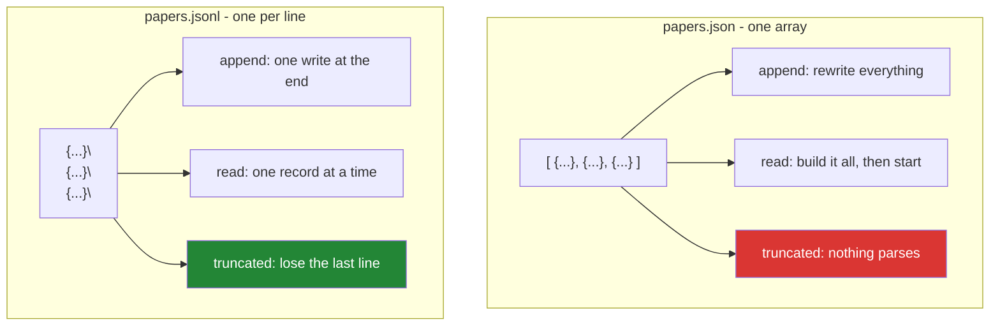

# 2.5 — JSONL: one record per line, and why the whole pipeline uses it

## One-line answer

JSONL is one JSON object per line with nothing wrapping them, and that one decision makes a file
appendable, streamable line by line, and survivable when it is cut off half way — none of which is true
of a single JSON array.

---

## The story

The receipts file is one line per item, and it has been for years. Nobody designed that; it is just what
you do when you are adding to a list.

Now imagine somebody had instead decided that the file should be *one thing*, opened with a bracket at
the top and closed with a bracket at the bottom, with every item inside it.

Adding an item to that file means going to the bottom, taking the closing bracket off, adding a comma,
adding the item, and putting the bracket back. Every time. And if the power goes half way through that,
the file is not a list with a missing item — it is not a list at all, because the bracket never came
back. Everything in it, going back years, is unreadable until somebody repairs it by hand.

The line-per-item version has none of those properties, and it did not get them by being clever. It got
them by not wrapping everything in one thing.

---

## The idea in plain language

**JSON Lines** — JSONL, sometimes called NDJSON — is a format with one rule: **each line is a complete
JSON value, and the lines are separated by `\n`.** No opening bracket, no commas between records, no
closing bracket. The convention is documented at <https://jsonlines.org/>.

Four properties follow directly, and each of them is the reason somebody chose it:

**You can append.** A new record is a `write` at the end of the file
([2.1](2.1-open-and-the-mode-string.md)), which costs the same whether the file has ten records or ten
million. Adding to a JSON array means rewriting the whole file.

**You can stream it.** One line is one record, so
[2.4](2.4-reading-a-big-file.md)'s `for line in f` gives you records one at a time and memory stays flat.
`json.load` on an array must build the entire structure before returning anything.

**A truncated file loses one record, not all of them.** If the process dies mid-write, the last line is
incomplete and every line before it still parses. A truncated JSON array parses as nothing.

**It is splittable.** Any line boundary is a safe place to cut, so a large file can be divided into
chunks and processed in parallel without understanding its contents.

The cost of all that is real and worth stating: **JSONL is not valid JSON**, so a tool that expects one
JSON document will reject it. It is also text, so it is larger and slower to parse than a binary format —
which is what Parquet is for, and Phase 4 meets it.

Three conventions that keep a JSONL file honest:

- **One record per line, no pretty printing.** `json.dumps` without `indent=`, because an indented object
  spans lines and breaks the one rule.
- **`newline="\n"` when writing** ([2.3](2.3-newlines.md)), so the file is byte-identical on every
  machine.
- **`encoding="utf-8"`, always** ([2.2](2.2-encoding.md)). `ensure_ascii=False` is worth passing too: it
  writes real characters instead of `é` escapes, which is smaller and readable.

---

## Why Setu needs it

- **It is this project's interchange format from here to the end.** Day 227's scraper writes it, Phase 18
  indexes from it, Day 233's eval reads it, and every intermediate stage in between hands the next one a
  `.jsonl`.
- **Day 227's ingestion is resumable**, and resumability is exactly the append-plus-count-lines property.
  A run that stops half way is restarted by reading how many records are already there.
- **[Day 15's `Paper`](../../../day-15-constructors-and-dunders/parts/04-the-paper-api/4.3-which-dunders-and-when-to-stop.md)
  has a `from_row` classmethod**, and a JSONL line is exactly the dictionary it takes.
- **Principle 5 means a run can be interrupted by a rate limit at any moment.** A format where an
  interruption costs one record rather than the whole file is not a nicety on a free tier.

---

## The mechanism

```python
"""JSONL: one record per line, appendable, streamable, resumable."""

import json
from pathlib import Path

records = [
    {"title": "The Kitchen Table", "year": 2019},
    {"title": "Weeknight Bread", "year": 2021},
    {"title": "One Pot", "year": 2024},
]

jsonl = Path("papers.jsonl")
with open(jsonl, "w", encoding="utf-8", newline="\n") as f:
    for record in records:
        f.write(json.dumps(record, ensure_ascii=False) + "\n")

whole = Path("papers.json")
whole.write_text(json.dumps(records, ensure_ascii=False), encoding="utf-8")

print("jsonl bytes :", jsonl.read_bytes())
print()
print("stream it   :")
with open(jsonl, encoding="utf-8") as f:
    for number, line in enumerate(f, start=1):
        print("   ", number, json.loads(line)["title"])

with open(jsonl, "a", encoding="utf-8", newline="\n") as f:
    f.write(json.dumps({"title": "Sunday Roast", "year": 2026}) + "\n")
print("after appending:", sum(1 for _ in open(jsonl, encoding="utf-8")), "records")

truncated = Path("truncated.jsonl")
truncated.write_bytes(jsonl.read_bytes()[:-12])
good, bad = 0, 0
with open(truncated, encoding="utf-8") as f:
    for line in f:
        try:
            json.loads(line)
            good += 1
        except json.JSONDecodeError:
            bad += 1
print("truncated file: kept", good, "lost", bad)

broken = Path("broken.json")
broken.write_bytes(whole.read_bytes()[:-12])
try:
    json.loads(broken.read_text(encoding="utf-8"))
except json.JSONDecodeError as error:
    print("truncated json: kept 0 -", error.msg)
```

Run on Python 3.12.12 on 2026-09-01:

```
jsonl bytes : b'{"title": "The Kitchen Table", "year": 2019}\n{"title": "Weeknight Bread", "year": 2021}\n{"title": "One Pot", "year": 2024}\n'

stream it   :
    1 The Kitchen Table
    2 Weeknight Bread
    3 One Pot
after appending: 4 records
truncated file: kept 3 lost 1
truncated json: kept 0 - Unterminated string starting at
```

**Line by line:**

- `open(jsonl, "w", encoding="utf-8", newline="\n")` — all three arguments matter.
  [2.2](2.2-encoding.md) for the encoding, [2.3](2.3-newlines.md) for the newline, and `"w"` because this
  is the first write ([2.1](2.1-open-and-the-mode-string.md)).
- `json.dumps(record, ensure_ascii=False) + "\n"` — dump **one record**, add the separator by hand. No
  `indent=`: an indented object would span several lines and the file would no longer be JSONL.
- `jsonl.read_bytes()` shows the whole file, and the shape is the point: three objects, three `\n`, **no
  brackets and no commas** between them.
- `for number, line in enumerate(f, start=1)` — streaming, one record at a time
  ([2.4](2.4-reading-a-big-file.md)), and `enumerate` gives a line number for error messages
  ([Day 6, 1.3](../../../day-06-loops/parts/01-iteration/1.3-enumerate-and-zip.md)).
- `json.loads(line)` — `loads` takes a string, `load` takes a file object. Here the string is one line, so
  it is `loads`.
- `open(jsonl, "a", ...)` and one write — the fourth record is added without reading or rewriting the
  first three. **That is the append property**, and it is why the count goes to 4.
- `sum(1 for _ in open(jsonl, encoding="utf-8"))` counts lines without holding them.
- `jsonl.read_bytes()[:-12]` chops the last twelve bytes off, standing in for a process that died
  mid-write. **Three lines still parse and one does not**: `kept 3 lost 1`.
- The same twelve bytes off the end of the JSON array gives `Unterminated string starting at` and
  **nothing at all is recoverable** without hand-repair. Same data, same damage, and one format lost one
  record while the other lost the file.

The two shapes:



---

## When it breaks

**Pretty-printed JSON in a JSONL file:**

```text
$ uv run python -c "
import json
from pathlib import Path
p = Path('pretty.jsonl')
with open(p, 'w', encoding='utf-8', newline='\n') as f:
    for r in [{'title': 'The Kitchen Table'}, {'title': 'One Pot'}]:
        f.write(json.dumps(r, indent=2) + '\n')

with open(p, encoding='utf-8') as f:
    for n, line in enumerate(f, 1):
        try:
            json.loads(line)
        except json.JSONDecodeError as e:
            print(f'line {n}: {e.msg} -> {line!r}')
"
line 1: Expecting property name enclosed in double quotes -> '{\n'
line 2: Extra data -> '  "title": "The Kitchen Table"\n'
line 3: Expecting value -> '}\n'
line 4: Expecting property name enclosed in double quotes -> '{\n'
line 5: Extra data -> '  "title": "One Pot"\n'
line 6: Expecting value -> '}\n'
```

**What it means.** `indent=2` split each record across three lines, so **every line** fails to parse. The
file looks beautiful in an editor and is not JSONL. This is the most common way the format is broken,
usually by somebody adding `indent=` to make debugging easier. Note that the six failures produce **three
different messages**, none of which says "this file is not JSONL" — each line failed for its own local
reason, so the diagnosis has to come from you.

**One bad line killing the whole run:**

```text
$ uv run python -c "
import json
from pathlib import Path
p = Path('mixed.jsonl')
p.write_text('{\"t\": 1}\n{oops}\n{\"t\": 3}\n', encoding='utf-8')

records = []
with open(p, encoding='utf-8') as f:
    for line in f:
        records.append(json.loads(line))
print(records)
"
Traceback (most recent call last):
  File "<string>", line 10, in <module>
  File "...\Lib\json\decoder.py", line 354, in raw_decode
    obj, end = self.scan_once(s, idx)
json.decoder.JSONDecodeError: Expecting property name enclosed in double quotes: line 1 column 2 (char 1)
```

**What it means.** One malformed record out of three and the job died with two-thirds of the work done
and nothing written. Note `line 1 column 2` — that is the position **within the line** `json` was given,
not within the file, so the message cannot tell you which record was bad. Real readers wrap the
`json.loads` in a `try`, count failures, log the file line number from `enumerate`, and carry on — because
one bad record in a million-line corpus must not be fatal.

**Forgetting the trailing newline:**

```text
$ uv run python -c "
import json
from pathlib import Path
p = Path('nonewline.jsonl')
with open(p, 'w', encoding='utf-8', newline='\n') as f:
    f.write(json.dumps({'t': 1}))
    f.write(json.dumps({'t': 2}))
print('bytes:', p.read_bytes())
print('lines:', sum(1 for _ in open(p, encoding='utf-8')))
"
bytes: b'{"t": 1}{"t": 2}'
lines: 1
```

**What it means.** Two records went in and the file has **one line**, which parses as nothing. The `+
"\n"` is not decoration — it is the entire format. The same failure appears more subtly when the last
record has no trailing newline and a later append is concatenated onto it, corrupting a record that was
written correctly hours earlier. **Always end every record with `\n`, including the last one.**

**Appending after a partial write:**

```text
$ uv run python -c "
import json
from pathlib import Path
p = Path('partial.jsonl')
p.write_bytes(b'{\"t\": 1}\n{\"t\": 2')
with open(p, 'a', encoding='utf-8', newline='\n') as f:
    f.write(json.dumps({'t': 3}) + '\n')
for n, line in enumerate(open(p, encoding='utf-8'), 1):
    try:
        json.loads(line)
        print(f'line {n}: ok')
    except json.JSONDecodeError as e:
        print(f'line {n}: BROKEN - {e.msg}')
"
line 1: ok
line 2: BROKEN - Expecting ',' delimiter
```

**What it means.** The file ended mid-record, and the append glued the new record onto the broken one —
so **two records are now lost instead of one**, and the good record that was appended is inside the
damage. A resumable writer must therefore check that the file ends with `\n` before appending, and
truncate the partial line if it does not. That check is three lines and it is the difference between a
format that survives interruption and one that only appears to.

---

## In production

**The professional habit is that a JSONL reader never lets one bad record stop the run.** It parses
inside a `try`, keeps a count of failures and a sample of them, and raises only if the failure *rate*
crosses a threshold — because one corrupt line in ten million is data quality and one in ten is a bug in
the writer, and those want different responses. That is the same shape as
[Day 13, 4.2](../../../day-13-inheritance-and-abstraction/parts/04-abstraction/4.2-the-loader-family.md)'s
`load_all`, which collects failures rather than stopping at the first.

**What changes at scale is that JSONL stops being the right format for reading.** Text parsing costs
real time — a JSON line is parsed character by character — and every field of every record is read even
when the query needs one column. A columnar binary format like Parquet stores each field together,
compresses far better, and lets a reader skip whole columns; Phase 4 introduces it. The professional
split is: **JSONL for writing and interchange, because it is appendable and human-readable; a columnar
format for repeated analytical reads.** Converting once is cheap next to reading badly a hundred times.

**The failure that only appears with real data is the record that is enormous.** JSONL guarantees one
record per line and says nothing about how long a line may be, so a document with a megabyte-long field
becomes a megabyte-long line, and `for line in f` reads all of it into one string
([2.4](2.4-reading-a-big-file.md)'s last trap). Real ingestion caps the record size on the way in, because
after that point the size is decided by whoever produced the data.

**The review comment a senior engineer leaves.** *"The writer opens with `'w'` on every batch, so the
output only ever holds the last batch — use `'a'`, and check the file ends with a newline before you
append, or a partial write from a killed job will swallow the first record of the next one. And drop the
`indent=2`; that makes every line invalid."*

**The interview question.** *"Why JSONL rather than a JSON array?"* The three properties are the answer —
appendable in constant time, streamable one record at a time, and a truncated file loses one record
instead of all of them — and the fourth, that it is splittable at any line for parallel processing, is
worth adding. What shows real use is naming the costs: it is not valid JSON so generic tooling rejects it,
it is slower and larger than a binary columnar format for repeated reads, and it makes no promise about
line length, so a single huge record still has to be guarded against.

---

## Check yourself

```bash
uv run python -c "
import json
from pathlib import Path

p = Path('papers.jsonl')
with open(p, 'w', encoding='utf-8', newline='\n') as f:
    for r in [{'title': 'The Kitchen Table', 'year': 2019}, {'title': 'One Pot', 'year': 2024}]:
        f.write(json.dumps(r, ensure_ascii=False) + '\n')

with open(p, 'a', encoding='utf-8', newline='\n') as f:
    f.write(json.dumps({'title': 'Sunday Roast', 'year': 2026}) + '\n')

print('bytes :', p.read_bytes())
print('count :', sum(1 for _ in open(p, encoding='utf-8')))
for n, line in enumerate(open(p, encoding='utf-8'), 1):
    print(' ', n, json.loads(line)['title'])
"
```

Three records, two opens, no rewriting. Now chop the last ten bytes off with
`p.write_bytes(p.read_bytes()[:-10])` and count how many still parse.

**Answer out loud, without scrolling up:**

> Name the three things JSONL can do that a single JSON array cannot, and say which one matters most for
> a job that can be interrupted. Then say what `indent=2` does to a JSONL file.

---

**Next:** section 3 opens with
[3.1 — the write that had not happened yet](../03-buffering/3.1-the-write-that-had-not-happened.md),
which is why "the process died mid-write" is the normal case rather than the unlucky one.
