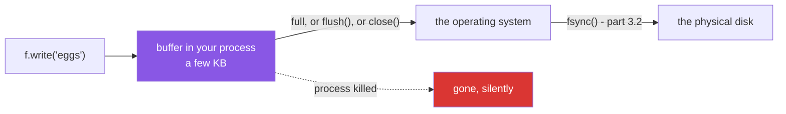

# 3.1 — The write that had not happened yet

## One-line answer

`f.write(...)` does not put anything on the disk — it copies your bytes into a buffer in memory, and the
buffer is only handed to the operating system when it fills up, when you call `flush()`, or when the file
is closed.

---

## The story

You add eggs to the shopping list and the screen shows eggs.

You do not save. Nobody thinks about saving any more, because everything saves itself these days, and
anyway the line is *right there*.

The laptop's battery gives out. When it comes back, the file is open, and it says milk and bread.

The thing worth sitting with is not that the eggs are missing. It is that the file **exists**, and it is
**not empty**, and it looks exactly like a file that was saved correctly at some earlier point. There is
no gap, no error, no half-written word. Everything you can see is consistent, and one thing you typed is
simply not there.

That is what a buffer is. The line was written *somewhere* — just not to the place that survives losing
power — and nothing along the way said so.

---

## The idea in plain language

Writing to a disk is slow compared to writing to memory, and writing five bytes costs almost exactly as
much as writing five thousand. So nobody writes five bytes. Instead there is a **buffer**: a block of
memory, typically a few kilobytes, that `f.write` copies into. When it fills up, the whole block goes to
the operating system in one go.

That means `f.write("eggs\n")` does three things people usually assume it does not:

- **It returns immediately**, having touched no disk.
- **It may leave the file on disk completely unchanged**, including at zero bytes.
- **It gives no way to know** whether this particular call was the one that filled the buffer.

Three things empty the buffer, and they are the whole of this document:

- **The buffer fills.** Automatic and unpredictable from your side.
- **`f.flush()`** — hand everything in the buffer to the operating system, now.
- **`f.close()`** — flush, then release the file. This is what `with` guarantees
  ([4.1](../04-context-managers/4.1-with-the-block-that-cleans-up.md)).

The consequence that matters: **if the process stops without closing the file, whatever is still in the
buffer is gone.** Not corrupted — gone, and the file looks like a smaller, perfectly valid file. A
`KeyboardInterrupt`, an unhandled exception, `os._exit`, a crash, a container killed for using too much
memory: all of them lose the buffer.

Normal exceptions are less dangerous than they sound, because Python's own cleanup usually closes the
file on the way out. The dangerous cases are the ones that bypass cleanup entirely, and "the machine
stopped" is one of them.

There is a second layer underneath this one — the operating system has its own cache, so even a flushed
write is not necessarily on the physical disk — and that is
[3.2](3.2-flush-fsync-and-what-saved-means.md). This document is about the first layer, which is the one
inside your own process and the one you can lose most easily.

---

## Why Setu needs it

- **Day 227's scraper writes JSONL for hours** and can be interrupted by a rate limit, a network failure
  or a laptop lid. What is on disk when it stops is decided by this.
- **[2.5](../02-reading-and-writing/2.5-jsonl.md) chose JSONL partly because a truncated file loses one
  record.** Buffering is what makes truncation the *expected* outcome rather than a rare one.
- **Principle 1 says no commit, no day** — and a `./m done` that appears to have written a file which is
  actually still in a buffer is the same class of mistake at a different level.
- **Day 232's durable checkpoints exist to survive a restart.** A checkpoint sitting in a buffer is not
  durable, whatever the code says.

---

## The mechanism

```python
"""The write that had not happened yet."""

from pathlib import Path

p = Path("buffered.txt")
p.unlink(missing_ok=True)

f = open(p, "w", encoding="utf-8")
f.write("milk\n")
f.write("bread\n")

print("after two writes, on disk:", p.stat().st_size, "bytes")
print("what the program thinks  : 2 lines")

f.flush()
print("after flush(), on disk   :", p.stat().st_size, "bytes")

f.write("eggs\n")
print("after a third write      :", p.stat().st_size, "bytes")
f.close()
print("after close()            :", p.stat().st_size, "bytes")
print("contents                 :", repr(p.read_text(encoding="utf-8")))
```

Run on Python 3.12.12 on Windows on 2026-09-01:

```
after two writes, on disk: 0 bytes
what the program thinks  : 2 lines
after flush(), on disk   : 13 bytes
after a third write      : 13 bytes
after close()            : 19 bytes
contents                 : 'milk\nbread\neggs\n'
```

**Line by line:**

- `p.unlink(missing_ok=True)` — start clean, using the safe delete from
  [1.4](../01-the-path/1.4-exists-mkdir-and-the-race.md) so the example can be run twice.
- `open(p, "w", ...)` **without** `with`. That is deliberate and it is the only place in this day it
  happens: the point is to look at the file *between* the writes and the close, which a `with` block
  makes impossible.
- Two `write` calls, then `p.stat().st_size` reports **0 bytes**. Both writes returned successfully. The
  file exists, and it is empty.
- `f.flush()` and the size jumps to **13 bytes** — `milk\r\nbread\r\n`, thirteen because of the newline
  translation from [2.3](../02-reading-and-writing/2.3-newlines.md).
- A third `write`, and the size is **still 13**. The new line went into the buffer that was just emptied,
  and there it stays.
- `f.close()` and the size reaches **19 bytes**. Closing flushed the last line, which is why a file
  closed properly is complete.
- `p.read_text(...)` shows all three lines — and note that this is only true *after* the close. Reading
  the file before it would have given a shorter file with no error.
- **The whole document is in the first two printed lines.** Two successful writes, zero bytes on disk, no
  warning of any kind.

Where the bytes actually are:



---

## When it breaks

**A process that stops without closing:**

```text
$ cat > lost.py <<'PY'
import os
from pathlib import Path

p = Path("lost.txt")
p.unlink(missing_ok=True)

f = open(p, "w", encoding="utf-8")
f.write("milk\n")
f.write("bread\n")
f.write("eggs\n")
os._exit(0)
PY
$ uv run python lost.py
$ uv run python -c "
from pathlib import Path
p = Path('lost.txt')
print('the file exists  :', p.exists())
print('its size         :', p.stat().st_size, 'bytes')
print('its contents     :', repr(p.read_text(encoding='utf-8')))
"
the file exists  : True
its size         : 0 bytes
its contents     : ''
```

**What it means.** Three successful writes, exit code **zero**, and an empty file. `os._exit` ends the
process immediately without running any cleanup, which is exactly what a crash, a `SIGKILL` or a
container's out-of-memory killer does. **The program reported success and produced nothing**, and there is
no error anywhere to find. This is the story from the top of the document, reproduced.

**A partial record from a bigger write:**

```text
$ uv run python -c "
import os
from pathlib import Path
p = Path('partial.txt')
p.unlink(missing_ok=True)
f = open(p, 'w', encoding='utf-8')
for n in range(2000):
    f.write('{\"id\": ' + str(n) + ', \"title\": \"paper ' + str(n) + '\"}\n')
size = p.stat().st_size
f.close()
print('bytes on disk before close:', f'{size:,}')
print('bytes after close         :', f'{p.stat().st_size:,}')
"
bytes on disk before close: 65,749
bytes after close         : 71,780
```

**What it means.** This time the buffer did fill, several times, so **most** of the file was written —
and the boundary between what made it and what did not falls wherever the buffer happened to be, which is
**in the middle of a line**. That is why
[2.5](../02-reading-and-writing/2.5-jsonl.md)'s truncated-file case is the realistic one: a killed writer
does not stop neatly at a record boundary, it stops at a buffer boundary.

**Reading a file another process is still writing:**

```text
$ uv run python -c "
from pathlib import Path
p = Path('inprogress.txt')
p.unlink(missing_ok=True)
w = open(p, 'w', encoding='utf-8')
w.write('milk\nbread\n')
print('reader sees:', repr(p.read_text(encoding='utf-8')))
print('reader thinks the file is complete and empty')
w.close()
print('after the writer closed:', repr(p.read_text(encoding='utf-8')))
"
reader sees: ''
reader thinks the file is complete and empty
after the writer closed: 'milk\nbread\n'
```

**What it means.** A reader that arrives while a writer still holds the file gets whatever has been
flushed — here, nothing — and **no indication that more is coming**. This is why a pipeline stage must
never pick up a file just because its name exists
([1.5](../01-the-path/1.5-globbing.md)): the standard patterns are to write under a temporary name and
rename when complete, or to write a separate marker file at the end.

**The same write with a different buffering setting:**

```text
$ uv run python -c "
from pathlib import Path

for label, buffering in (('default', -1), ('line buffered', 1)):
    p = Path(f'buf-{buffering}.txt')
    p.unlink(missing_ok=True)
    f = open(p, 'w', encoding='utf-8', buffering=buffering)
    f.write('milk\n')
    print(f'{label:14} after one write: {p.stat().st_size} bytes')
    f.close()
    print(f'{label:14} after close    : {p.stat().st_size} bytes')
"
default        after one write: 0 bytes
default        after close    : 6 bytes
line buffered  after one write: 6 bytes
line buffered  after close    : 6 bytes
```

**What it means.** Identical code, one argument different, and the file is on disk after the write in one
case and not in the other. `buffering=1` means *flush at every newline*, which is what `print` gets when
standard output is a terminal — and **not** what it gets when output is redirected to a file, which is
block buffered like everything else. That is why a program whose progress appears promptly on screen
produces a log file that stays empty for a long time and then arrives in bursts, and why a redirected
program that is killed loses its last few hundred lines. `print(..., flush=True)` or `python -u` forces
it, at the cost of the buffering.

---

## In production

**The professional habit is that anything that must survive a crash is closed, or flushed, at a point you
chose.** `with` handles the ordinary case
([4.1](../04-context-managers/4.1-with-the-block-that-cleans-up.md)), and a long-running writer flushes
at a meaningful boundary — every N records, or every checkpoint — so the amount at risk is bounded and
known rather than "however big the buffer is". The `logging` module does this for you, which is one of
the reasons to prefer it to `print`.

**What changes at scale is that buffering becomes the thing that makes the write possible.** Fifty
thousand unbuffered writes is fifty thousand system calls; buffered, it is a few hundred. Turning
buffering off to feel safe makes a job ten to a thousand times slower
([3.2](3.2-flush-fsync-and-what-saved-means.md) measures it), which is not a trade anybody wants. The
professional position is not *less buffering* but *deliberate flush points*.

**The failure that only appears with real data is the file that looks finished.** A killed writer leaves
a file with a plausible size and valid content, so the next stage reads it, produces a smaller output, and
reports success. Nothing anywhere is red. The defences are all about making completeness **visible**:
write to a temporary name and rename atomically, write a record count in a companion file, or make the
last line a marker the reader checks for. A pipeline that trusts a filename trusts a buffer boundary.

**The review comment a senior engineer leaves.** *"The exporter writes for twenty minutes and only closes
at the end, so a killed job leaves a truncated file with no way to tell it is truncated. Flush every
thousand records, and write to `.tmp` then `Path.replace` onto the final name — that way the real
filename only appears when the file is complete."*

**The interview question.** *"What happens when you call `f.write`?"* The answer that lands is that it
copies into a buffer in your process and usually touches no disk at all, so the file can be zero bytes
after several successful writes, and the buffer is only handed over when it fills, on `flush`, or on
`close`. The consequence is the interesting half: a process killed without cleanup loses the buffer
silently, and because the cut falls at a buffer boundary rather than a record boundary, a truncated file
with a half-written last record is the *normal* result — which is why writers rename into place rather
than writing directly.

---

## Check yourself

```bash
uv run python -c "
from pathlib import Path

p = Path('buffered.txt')
p.unlink(missing_ok=True)
f = open(p, 'w', encoding='utf-8')
f.write('milk\n')
print('after write :', p.stat().st_size, 'bytes')
f.flush()
print('after flush :', p.stat().st_size, 'bytes')
f.write('bread\n')
print('after write :', p.stat().st_size, 'bytes')
f.close()
print('after close :', p.stat().st_size, 'bytes')
"
```

Four sizes, two of them the same. Say which two, and why.

**Answer out loud, without scrolling up:**

> Where do the bytes go when you call `f.write`, and what are the three things that move them on? Then
> say what a process killed without cleanup leaves behind, and why the cut is usually mid-record.

---

**Next:** [3.2 — `flush()`, `os.fsync()`, and what "saved" means](3.2-flush-fsync-and-what-saved-means.md),
which is the layer underneath this one.
