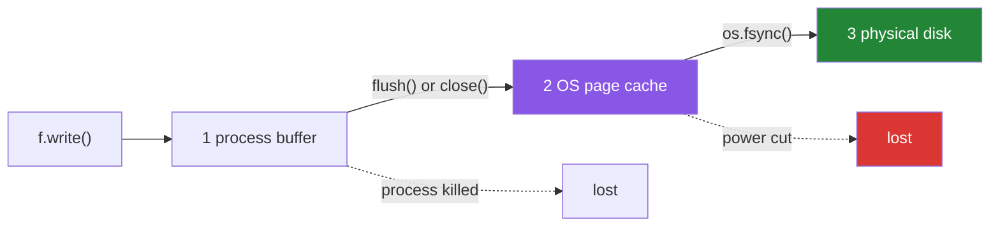

# 3.2 — `flush()`, `os.fsync()`, and what "saved" means

## One-line answer

There are three levels of "saved" — in your program's buffer, in the operating system's cache, and on
the physical disk — and `flush()` only moves you from the first to the second, so `os.fsync()` is what
"the power can go now" actually costs, and it costs about a thousand times more.

---

## The story

Somebody hands you a note to give to the office upstairs.

You take it, and now it is in your hand. That is not the same as the office having it.

You walk to the desk in the lobby and hand it over. Now the desk has it, and everyone treats that as
done — the desk always gets things upstairs, and it will be up there within the hour. You go home.

The office still does not have it. It is in a tray at the desk, along with everything else that arrived
this afternoon, waiting for the next trip up. If the building burns down tonight the note is gone, and
you would have told anybody who asked that you had delivered it.

To be genuinely certain, you would have had to walk it up yourself and watch somebody take it — which is
much slower, and which is why nobody does it for a note about biscuits and everybody does it for a
signed contract.

---

## The idea in plain language

Three places your bytes can be, and each is a different promise:

| Level | Where | Survives |
|---|---|---|
| 1 | your process's buffer | nothing — a crash loses it ([3.1](3.1-the-write-that-had-not-happened.md)) |
| 2 | the operating system's page cache | your process dying, **not** the machine losing power |
| 3 | the physical disk | power loss |

And the two calls that move between them:

- **`f.flush()`** — level 1 to level 2. Hands the buffer to the operating system.
- **`os.fsync(f.fileno())`** — level 2 to level 3. Asks the operating system to push its cache for this
  file onto the physical device and wait until it says it is done.

Notice what this means for the words people use. "Saved" almost always means level 2, and level 2 is
genuinely enough for almost everything: your program can crash, the file will be complete, another
process can read it. What level 2 does not survive is the machine stopping.

`f.close()` does level 1 and nothing more. **Closing a file does not `fsync` it.** So a program that
wrote, closed, and reported success can still lose data to a power cut, and this surprises people who
assume `close` is the strong guarantee.

The reason nobody `fsync`s everything is cost. A `flush` is a copy in memory; an `fsync` waits for a
physical device, and on the machine this was written on the difference is over a thousand times. That is
not an argument against it — it is the reason it is a *decision*: databases `fsync` on commit and nowhere
else, because that is the point at which they promised somebody something.

`os.fsync` is documented at <https://docs.python.org/3/library/os.html#os.fsync>, and the documentation
is careful to say that on some systems it may not reach the physical platters, because the drive has its
own cache. That is honest and it is the general shape of durability: each layer can only ask the next one
nicely.

One more thing that is not fsync and is often what you actually want: **rename is atomic.** Writing to a
temporary file and renaming it onto the real name means readers see the old file or the new file and never
a partial one — which solves visibility rather than power loss, and is cheap.

---

## Why Setu needs it

- **Day 232's durable checkpoints** are the one place in this whole plan where the word *durable* is a
  promise. This document is what that word costs.
- **[3.3](3.3-fifty-thousand-lines.md) writes fifty thousand records**, and doing it with an `fsync` per
  record is the difference between a job that finishes and one that does not.
- **Day 226's Postgres does exactly this internally** — it `fsync`s the write-ahead log on commit and
  nothing else — so knowing the mechanism is how the database's settings stop being magic.
- **Principle 5's free tiers get interrupted.** Knowing which level your data reached when a job is
  killed is how you decide whether it is safe to resume.

---

## The mechanism

```python
"""Three different meanings of 'saved', and what the strongest one costs."""

import os
import time
from pathlib import Path

p = Path("levels.txt")
p.unlink(missing_ok=True)

with open(p, "w", encoding="utf-8") as f:
    f.write("milk\n")
    print("1 in the program's buffer :", p.stat().st_size, "bytes on disk")
    f.flush()
    print("2 after flush()           :", p.stat().st_size, "bytes on disk")
    os.fsync(f.fileno())
    print("3 after os.fsync()        :", p.stat().st_size, "bytes on disk")

start = time.perf_counter()
with open("nofsync.txt", "w", encoding="utf-8") as f:
    for n in range(2000):
        f.write(f"line {n}\n")
plain = time.perf_counter() - start

start = time.perf_counter()
with open("fsync.txt", "w", encoding="utf-8") as f:
    for n in range(2000):
        f.write(f"line {n}\n")
        f.flush()
        os.fsync(f.fileno())
synced = time.perf_counter() - start

print(f"2000 lines, buffered      : {plain:.4f}s")
print(f"2000 lines, fsync each    : {synced:.4f}s")
print("times slower              :", round(synced / plain))
```

Run on Python 3.12.12 on Windows on 2026-09-01. **The ratio depends enormously on your disk** — an older
spinning drive is far worse, a fast SSD better — and the order of magnitude is the point:

```
1 in the program's buffer : 0 bytes on disk
2 after flush()           : 6 bytes on disk
3 after os.fsync()        : 6 bytes on disk
2000 lines, buffered      : 0.0012s
2000 lines, fsync each    : 1.4405s
times slower              : 1190
```

**Line by line:**

- `p.stat().st_size` after the write is `0` — level 1, the buffer
  ([3.1](3.1-the-write-that-had-not-happened.md)).
- After `f.flush()` it is `6` — `milk\r\n`, six bytes with the newline translation
  ([2.3](../02-reading-and-writing/2.3-newlines.md)). Level 2.
- After `os.fsync(...)` it is **still 6**, and that is the crucial observation: **the size does not change
  and nothing visible happens.** From your program's point of view, and from any other program's point of
  view, levels 2 and 3 look identical. The difference is only visible when the power goes.
- `f.fileno()` is the low-level file descriptor — an integer the operating system uses. `os.fsync` works
  at that layer, which is why it takes the number rather than the Python file object.
- The two timing blocks write **exactly the same 2000 lines**; the only difference is the `flush` and
  `fsync` inside the loop.
- `0.0012s` against `1.4405s` — **1190 times slower**. Each `fsync` waits for the device, so the loop is
  now bounded by the disk rather than by the processor.
- `time.perf_counter` and not `time.time`, for the reason measured on
  [Day 14, 2.4](../../../day-14-decorators/parts/02-writing-a-decorator/2.4-timed-the-first-real-one.md).
- Note what the `with` block does and does not do: it closes, so it flushes to level 2. **It does not
  `fsync`.** A file that has been closed cleanly is at level 2 unless you asked for more.

The three levels:



---

## When it breaks

**Assuming `close()` means durable:**

```text
$ uv run python -c "
from pathlib import Path
p = Path('closed.txt')
p.unlink(missing_ok=True)
with open(p, 'w', encoding='utf-8') as f:
    f.write('milk\n')
print('closed cleanly    :', p.stat().st_size, 'bytes')
print('another process   :', repr(p.read_text(encoding='utf-8')))
print('level reached     : 2 - the OS has it, the disk may not')
"
closed cleanly    : 6 bytes
another process   : 'milk\n'
level reached     : 2 - the OS has it, the disk may not
```

**What it means.** Everything looks complete, and it is — for every purpose except a power cut. Another
process reads the full contents, `stat` reports the right size, and nothing in the language will ever tell
you the difference between this and a synced file. **The only way to know you are at level 3 is to have
asked**, which is why durability is a design decision rather than something you can check for afterwards.

**`fsync` on the file but not on its directory:**

```text
$ uv run python -c "
import os
from pathlib import Path
p = Path('newfile.txt')
p.unlink(missing_ok=True)
with open(p, 'w', encoding='utf-8') as f:
    f.write('milk\n')
    f.flush()
    os.fsync(f.fileno())
print('file synced :', p.stat().st_size, 'bytes')
print('but the directory entry that NAMES it is a separate write')
"
file synced : 6 bytes
but the directory entry that NAMES it is a separate write
```

**What it means.** Syncing the file's contents does not sync the **folder** that records the file's
existence. On a crash you can get a durable file that nothing points at, or a name with no contents. Code
that genuinely needs a newly created file to survive power loss syncs the directory too — on POSIX by
opening the parent and calling `fsync` on it. This is the level of detail databases live at, and it is
worth knowing exists so that "I called fsync" is not mistaken for a complete answer.

**`fsync` inside the hot loop:**

```text
$ uv run python -c "
import os, time
from pathlib import Path

for label, sync in (('every record', True), ('every 500', False)):
    p = Path('sync-' + label.replace(' ', '-') + '.txt')
    start = time.perf_counter()
    with open(p, 'w', encoding='utf-8') as f:
        for n in range(2000):
            f.write(f'line {n}\n')
            if sync or n % 500 == 0:
                f.flush()
                os.fsync(f.fileno())
    print(f'{label:12} {time.perf_counter() - start:.4f}s')
"
every record 1.6087s
every 500    0.0064s
```

**What it means.** Syncing every five hundredth record instead of every one is **250 times faster** and
the worst case is losing up to five hundred records rather than one. That trade — how much work am I
prepared to redo — is the actual decision, and it is the same one a database exposes as a commit
interval. "Sync everything" and "sync nothing" are both refusals to make it.

**Reading `st_size` as a completion check:**

```text
$ uv run python -c "
from pathlib import Path
p = Path('growing.txt')
p.unlink(missing_ok=True)
f = open(p, 'w', encoding='utf-8')
for n in range(3):
    f.write(f'record {n}\n')
    f.flush()
    print(f'after record {n}: {p.stat().st_size} bytes - is it finished?')
f.close()
print('actually finished:', p.stat().st_size, 'bytes')
"
after record 0: 10 bytes - is it finished?
after record 1: 20 bytes - is it finished?
after record 2: 30 bytes - is it finished?
actually finished: 30 bytes
```

**What it means.** Every one of those four sizes is a real, valid, complete-looking file, and there is no
way from the outside to tell the third from the fourth. **A file's size is never evidence that it is
finished.** The standard answers are all about making completion explicit: rename into place, write a
marker file, or record an expected count somewhere the reader can check.

---

## In production

**The professional habit is that `fsync` appears at commit points and nowhere else.** A job flushes on a
cadence it chose — every N records, every checkpoint — and syncs when it has promised somebody something:
a transaction committed, a batch accepted, an offset advanced. Everywhere else it relies on level 2,
because level 2 survives the failure that actually happens most often, which is the process dying rather
than the building losing power.

**What changes at scale is that durability is bought elsewhere.** A single machine's `fsync` protects
against that machine's power failure and nothing against the disk itself failing. Real systems get
durability from replication — the write is on three machines before it is acknowledged — and from
write-ahead logs, where one sequential `fsync` covers many logical writes. That is why a database can
promise durability and still be fast: it is not syncing your table, it is syncing one append-only log.

**The failure that only appears with real data is the crash-consistency bug.** A pipeline that writes an
output file and then updates a "last processed" marker has an ordering requirement — if the marker is
durable before the data, a crash between them means the job skips work it never finished. The rule is to
make the data durable first and the marker second, and to design the marker so that doing the work twice
is harmless
([Day 14, 3.3](../../../day-14-decorators/parts/03-decorators-with-arguments/3.3-the-retry-that-made-it-worse.md)'s
idempotency, arriving at the filesystem).

**The review comment a senior engineer leaves.** *"`os.fsync` per record makes this loop disk-bound —
that is why the export takes all afternoon. Sync every thousand records instead and say in the docstring that a crash
can lose up to a thousand. Also, syncing the file does not sync the directory entry, so if this file is
newly created you have not got what you think you have."*

**The interview question.** *"What is the difference between `flush` and `fsync`?"* The three levels are
the answer: `flush` moves data from your process's buffer to the operating system, which survives your
process dying; `fsync` asks the operating system to put it on the physical device, which survives power
loss; and `close` does the first and not the second. What shows real experience is the cost — a thousandfold
on ordinary hardware — and the conclusion drawn from it: sync at commit points chosen deliberately, not
per write, and remember that a newly created file also needs its directory synced.

---

## Check yourself

```bash
uv run python -c "
import os, time
from pathlib import Path

p = Path('levels.txt')
p.unlink(missing_ok=True)
with open(p, 'w', encoding='utf-8') as f:
    f.write('milk\n')
    print('buffer :', p.stat().st_size, 'bytes')
    f.flush()
    print('flush  :', p.stat().st_size, 'bytes')
    os.fsync(f.fileno())
    print('fsync  :', p.stat().st_size, 'bytes')

start = time.perf_counter()
with open('t1.txt', 'w', encoding='utf-8') as f:
    for n in range(1000):
        f.write(f'line {n}\n')
print(f'1000 buffered : {time.perf_counter() - start:.4f}s')

start = time.perf_counter()
with open('t2.txt', 'w', encoding='utf-8') as f:
    for n in range(1000):
        f.write(f'line {n}\n')
        f.flush()
        os.fsync(f.fileno())
print(f'1000 synced   : {time.perf_counter() - start:.4f}s')
"
```

The size after `fsync` is the same as after `flush`, and the two timings are not remotely the same. Say
what changed between them, given that nothing observable did.

**Answer out loud, without scrolling up:**

> Name the three levels of "saved" and say which failure each one survives. Then say what `close()`
> guarantees and what it does not.

---

**Next:** [3.3 — fifty thousand lines without a memory spike](3.3-fifty-thousand-lines.md), which is the
plan's named example for this ID.
