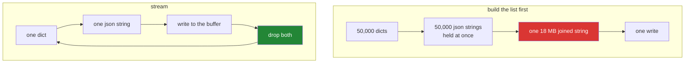

# 3.3 — Writing 50 000 lines without a memory spike

## One-line answer

Build the records one at a time and write each as you go, instead of building a list of all of them and
writing the list — the file is byte-for-byte the same, and the peak memory is a few kilobytes instead of
tens of megabytes.

---

## The story

The receipts file has to be rebuilt: fifty thousand lines, one per item, formatted properly this time.

There are two ways to do it, and the difference is not obvious until you watch somebody do it.

One way is to write out all fifty thousand on loose sheets, stack them on the table, and then put the
stack in the folder. The table needs to be big enough for the whole stack, and there is a moment — just
before it goes in the folder — where every sheet exists twice: once on the table and once being copied.

The other way is to write one line, put it in the folder, write the next. The table never holds more than
one sheet. It takes the same amount of writing and the folder ends up identical.

Nobody would choose the first way with paper. It is only tempting in a program because building the list
first is the shape that comes to mind, and because on a small enough job it costs nothing you notice.

---

## The idea in plain language

This is the writing half of [2.4](../02-reading-and-writing/2.4-reading-a-big-file.md), and the same
principle: **hold one record, not all of them.**

The shape that costs memory:

```text
rows = [json.dumps(r) for r in records]      # every row, in memory
f.write("\n".join(rows) + "\n")              # and now one enormous string too
```

The shape that does not:

```text
for record in records:
    f.write(json.dumps(record) + "\n")       # one row at a time
```

The second version is not merely leaner, it has three separate advantages:

**Peak memory is flat.** One record and the file buffer
([3.1](3.1-the-write-that-had-not-happened.md)), regardless of how many records there are.

**Something is on disk early.** The buffer fills and flushes as it goes, so a job killed half way leaves
half a file. The list version has written nothing at all until the very end, so a job killed at 99 per
cent leaves an empty file.

**The source can be a generator.** If `records` is a generator function
([Day 11, 2.1](../../../day-11-iterators-and-generators/parts/02-generators/2.1-yield-the-function-that-pauses.md))
reading from a database or an API, the whole pipeline is streaming end to end and nothing ever holds the
dataset. The list version forces it to be materialised.

That third point is the one that generalises. A source that yields, a loop that writes, and no list in
between is a pipeline whose memory does not depend on its input size — which is the property that makes
the difference between "works on the sample" and "works".

One caution to keep this honest: **`f.write` in a loop is buffered, so the loop is not making a system
call per record.** The buffer is doing the batching for you, which is why the streaming version is not
slower. If you find yourself building a batch by hand to "reduce writes", the buffer already did it.

---

## Why Setu needs it

- **This is the plan's named example for `PY-19`**: writing a 50 000-line JSONL without a memory spike.
  It is the day's build.
- **Day 227's scraper writes as it fetches**, so what is on disk after an interruption is what it managed
  — and that only works if it is writing as it goes rather than at the end.
- **[2.5](../02-reading-and-writing/2.5-jsonl.md)'s append property is what makes it resumable**, and
  appending record by record is this pattern with the file opened `"a"`.
- **Principle 5 makes RAM the limit.** A job that peaks at 80 MB on a free tier where 512 MB is shared
  with everything else is a job that gets killed, and the kill looks like a crash with no message.

---

## The mechanism

```python
"""Writing 50 000 records without holding 50 000 records."""

import json
import tracemalloc
from pathlib import Path


def records(count):
    """A generator: builds one record at a time (day 11, part 2.1)."""
    for n in range(count):
        yield {"id": n, "title": f"paper {n}", "abstract": "milk bread eggs " * 20}


tracemalloc.start()
rows = [json.dumps(r) for r in records(50_000)]
with open("all-at-once.jsonl", "w", encoding="utf-8", newline="\n") as f:
    f.write("\n".join(rows) + "\n")
peak_list = tracemalloc.get_traced_memory()[1]
tracemalloc.stop()

tracemalloc.start()
with open("streamed.jsonl", "w", encoding="utf-8", newline="\n") as f:
    for record in records(50_000):
        f.write(json.dumps(record) + "\n")
peak_stream = tracemalloc.get_traced_memory()[1]
tracemalloc.stop()

size = Path("streamed.jsonl").stat().st_size
print(f"file written        : {size:,} bytes")
print(f"peak, list first    : {peak_list:,} bytes")
print(f"peak, streamed      : {peak_stream:,} bytes")
print("times more memory   :", round(peak_list / peak_stream))
print(
    "same bytes?         :",
    Path("all-at-once.jsonl").read_bytes() == Path("streamed.jsonl").read_bytes(),
)
```

Run on Python 3.12.12 on 2026-09-01:

```
file written        : 18,677,780 bytes
peak, list first    : 58,487,314 bytes
peak, streamed      : 27,971 bytes
times more memory   : 2091
same bytes?         : True
```

**Line by line:**

- `def records(count)` is a **generator function** — it `yield`s, so calling it produces a generator and
  builds nothing until iterated
  ([Day 11, 2.1](../../../day-11-iterators-and-generators/parts/02-generators/2.1-yield-the-function-that-pauses.md)).
  Both versions use the same source, so the source is not what differs.
- `"milk bread eggs " * 20` makes each abstract about 320 characters, so an 18 MB file comes out of 50 000
  small records — realistic, and small enough to run in a moment.
- `rows = [json.dumps(r) for r in records(50_000)]` — the list comprehension is where the memory goes.
  50 000 strings, held at once.
- `"\n".join(rows) + "\n"` — and now **a second copy**, as one 18 MB string, while the list is still
  alive. That is why the peak is over 58 MB for an 18 MB file: the list, plus the joined string, plus
  overhead.
- `for record in records(50_000): f.write(...)` — one record built, one string made, one write, and both
  dropped before the next. Peak **28 KB**.
- `newline="\n"` on both ([2.3](../02-reading-and-writing/2.3-newlines.md)) — without it on one of them
  the last line would report `False` for a reason that has nothing to do with this document.
- `tracemalloc.get_traced_memory()[1]` — the **peak**, not the current. Current would be near zero for
  both by the time it is read, which is exactly the measurement that would hide the problem.
- `2091` times more memory, for **the same 18 MB file**.
- `same bytes? : True` — and that is the line that makes the argument. **This is not a trade-off.** The
  output is identical; one version simply asked for 58 MB it did not need.

The two shapes:



---

## When it breaks

**A generator materialised by accident:**

```text
$ uv run python -c "
import json, tracemalloc

def records(count):
    for n in range(count):
        yield {'id': n, 'title': 'paper ' + str(n)}

tracemalloc.start()
with open('a.jsonl', 'w', encoding='utf-8', newline='\n') as f:
    for r in list(records(50_000)):
        f.write(json.dumps(r) + '\n')
print('with list():', f'{tracemalloc.get_traced_memory()[1]:,} bytes')
tracemalloc.stop()

tracemalloc.start()
with open('b.jsonl', 'w', encoding='utf-8', newline='\n') as f:
    for r in records(50_000):
        f.write(json.dumps(r) + '\n')
print('without    :', f'{tracemalloc.get_traced_memory()[1]:,} bytes')
tracemalloc.stop()
"
with list(): 13,862,707 bytes
without    : 38,307 bytes
```

**What it means.** One `list(...)` — six characters, often added to "see how many there are" — put the
whole dataset in memory, 13.8 MB against 38 KB, and the loop below it is unchanged. `len(list(gen))` and
`sorted(gen)` do the same thing, and so does passing a generator to anything that needs to see all of it.
**The streaming property is lost by the first function that has to know the total.**

**Counting before writing:**

```text
$ uv run python -c "
import json, tracemalloc

def records(count):
    for n in range(count):
        yield {'id': n, 'title': 'paper ' + str(n)}

tracemalloc.start()
rows = list(records(50_000))
print('total to write:', len(rows))
with open('c.jsonl', 'w', encoding='utf-8', newline='\n') as f:
    for r in rows:
        f.write(json.dumps(r) + '\n')
print('peak          :', f'{tracemalloc.get_traced_memory()[1]:,} bytes')
tracemalloc.stop()
"
total to write: 50000
peak          : 13,862,926 bytes
```

**What it means.** The list exists only so a progress message can say `50000`, and it costs 13.8 MB. A
generator cannot be counted without being consumed, so wanting a total up front forces materialisation —
which is a real design pressure and the reason progress bars over streams show a count of what has been
done rather than a percentage. `enumerate` in the loop gives the running number for free.

**Building the whole string with `+=`:**

```text
$ uv run python -c "
import json, time, tracemalloc

def records(count):
    for n in range(count):
        yield {'id': n}

tracemalloc.start()
start = time.perf_counter()
text = ''
for r in records(20_000):
    text += json.dumps(r) + '\n'
open('d.jsonl', 'w', encoding='utf-8', newline='\n').write(text)
print(f'concatenating: {time.perf_counter()-start:.3f}s peak {tracemalloc.get_traced_memory()[1]:,}')
tracemalloc.stop()

tracemalloc.start()
start = time.perf_counter()
with open('e.jsonl', 'w', encoding='utf-8', newline='\n') as f:
    for r in records(20_000):
        f.write(json.dumps(r) + '\n')
print(f'streaming    : {time.perf_counter()-start:.3f}s peak {tracemalloc.get_traced_memory()[1]:,}')
tracemalloc.stop()
"
concatenating: 0.455s peak 547,394
streaming    : 0.210s peak 60,617
```

**What it means.** `text += ...` in a loop is the accidental quadratic from
[Day 6, 4.1](../../../day-06-loops/parts/04-loop-cost/4.1-the-accidental-quadratic.md) — strings are
immutable ([Day 4, 1.4](../../../day-04-objects/parts/01-objects/1.4-strings-are-immutable.md)), so each
`+=` builds a new one. CPython has an in-place optimisation that
sometimes rescues the time, and here it did not: the concatenating version is more than twice as slow
**and** holds nine times the memory. Keeping a second reference to `text` disables that optimisation
entirely and the time goes properly quadratic.

**Writing without `newline="\n"` and comparing bytes:**

```text
$ uv run python -c "
import json
from pathlib import Path

def records(n):
    for i in range(n):
        yield {'id': i}

with open('f1.jsonl', 'w', encoding='utf-8') as f:
    for r in records(3):
        f.write(json.dumps(r) + '\n')
with open('f2.jsonl', 'w', encoding='utf-8', newline='\n') as f:
    for r in records(3):
        f.write(json.dumps(r) + '\n')

print('default :', Path('f1.jsonl').read_bytes())
print('newline :', Path('f2.jsonl').read_bytes())
print('same?   :', Path('f1.jsonl').read_bytes() == Path('f2.jsonl').read_bytes())
"
default : b'{"id": 0}\r\n{"id": 1}\r\n{"id": 2}\r\n'
newline : b'{"id": 0}\n{"id": 1}\n{"id": 2}\n'
same?   : False
```

**What it means.** Same records, same code, different bytes — because one of them let text mode translate
the newlines ([2.3](../02-reading-and-writing/2.3-newlines.md)). Both files parse identically in Python,
so this only shows up when the bytes are compared: a checksum test, a `git diff` on a committed fixture,
or a strict JSONL parser in another language. It is the reason the mechanism above passes `newline="\n"`
to both handles.

---

## In production

**The professional shape is a generator source, a loop that writes, and no list in between** — and the
discipline is to keep it that way, because it is lost by a single `list()`, `sorted()` or `len()`
somewhere in the middle. A useful review habit is to look for those three calls on anything that came out
of a generator, and ask whether the total was really needed.

**What changes at scale is that the writer needs flush points and a resume story.** Fifty thousand
records is a moment; fifty million is long enough to be interrupted, so a real writer flushes on a cadence
([3.2](3.2-flush-fsync-and-what-saved-means.md)), writes to a temporary name and renames at the end, or —
for a resumable job — appends and records how far it got. Streaming makes those possible; it does not
provide them.

**The failure that only appears with real data is the memory limit you did not know you had.** A
container with a memory limit does not raise `MemoryError` when the peak is exceeded — the kernel kills
the process, and what you see is an exit code and no traceback at all. So a job that peaks at 58 MB on the
sample and 6 GB on the real corpus does not fail with a helpful error; it disappears. Peak memory that
does not depend on input size is the only version of this that is safe.

**The review comment a senior engineer leaves.** *"`rows = [json.dumps(r) for r in papers]` then
`f.write('\n'.join(rows))` holds the whole export twice — that is the container getting OOM-killed on the
full corpus. Write inside the loop; the buffer already batches the system calls, so it is not slower. And
pass `newline='\n'` so the checksum test passes on Linux and on Windows."*

**The interview question.** *"How do you write a very large file?"* Streaming the records is the answer,
and what makes it a good one is knowing there is no trade: the output is byte-identical, the buffer
already batches the system calls so it is not slower, and peak memory stops depending on the input size.
Adding the two ways the property is lost — a stray `list()` for a count, and a `+=` accumulating the whole
text — and the observation that an exceeded memory limit in a container shows up as a silent kill rather
than a `MemoryError`, is the answer of somebody who has had the job disappear.

---

## Check yourself

```bash
uv run python -c "
import json, tracemalloc
from pathlib import Path

def records(count):
    for n in range(count):
        yield {'id': n, 'title': f'paper {n}', 'abstract': 'milk bread eggs ' * 20}

tracemalloc.start()
rows = [json.dumps(r) for r in records(50_000)]
with open('a.jsonl', 'w', encoding='utf-8', newline='\n') as f:
    f.write('\n'.join(rows) + '\n')
print(f'list first : {tracemalloc.get_traced_memory()[1]:,} bytes')
tracemalloc.stop()

tracemalloc.start()
with open('b.jsonl', 'w', encoding='utf-8', newline='\n') as f:
    for r in records(50_000):
        f.write(json.dumps(r) + '\n')
print(f'streamed   : {tracemalloc.get_traced_memory()[1]:,} bytes')
tracemalloc.stop()

print('same bytes :', Path('a.jsonl').read_bytes() == Path('b.jsonl').read_bytes())
"
```

Two peaks, one file. Now put `list(...)` around the generator in the second block and watch the second
number move.

**Answer out loud, without scrolling up:**

> What is held in memory in each of the two versions, and what does the output file look like in each?
> Then name two ways the streaming property is accidentally lost.

---

**Next:** section 4 opens with
[4.1 — `with`, the block that cleans up after itself](../04-context-managers/4.1-with-the-block-that-cleans-up.md),
the syntax every example on this day has been using without explanation.
