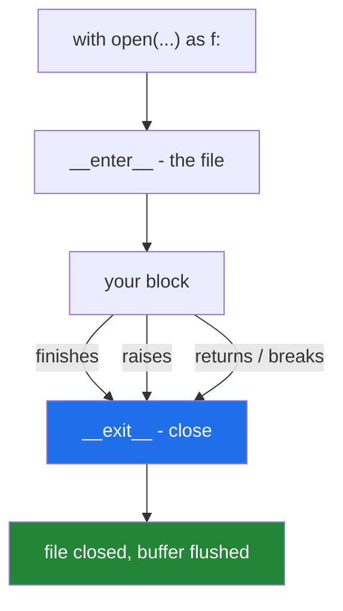

# 4.1 — `with`: the block that cleans up after itself

## One-line answer

`with open(...) as f:` guarantees the file is closed when the block ends — whether it ended normally,
returned early, or blew up half way through — and closing is what flushes the buffer, so `with` is what
makes the write actually happen.

---

## The story

The shopping list is on the shared computer, and somebody left it open.

You cannot edit it. The program says it is in use by another person, and that person went home at five.
Nothing is broken; the file is fine; it is simply being held by a program that never let go, and it will
be held until somebody restarts that machine.

Everybody knows the rule — close what you open — and everybody breaks it, because the closing is at the
end and the interesting part is in the middle. You open it to check one thing, get distracted, and the
open file outlives the reason you opened it.

The fix that works is not remembering harder. It is the kind of door that closes itself: you go in, you
do what you came for, and it shuts behind you whether you were thinking about it or not — including when
you leave in a hurry because something is on fire.

---

## The idea in plain language

A file handle is a resource the operating system gives your process and expects back. So are a database
connection, a network socket and a lock. Every one of them has the same shape: **acquire, use, release**,
and the release must happen even when the use goes wrong.

`with` is the syntax for that shape:

```text
with open(path, encoding="utf-8") as f:
    ...use f...
# f is closed here, whatever happened above
```

The object after `with` is a **context manager**: something with `__enter__` and `__exit__`
([Day 15, 3.1](../../../day-15-constructors-and-dunders/parts/03-the-dunders/3.1-what-a-dunder-method-is.md)'s
dunder methods, arriving with a job). Python calls `__enter__` on the way in, binds the result to the
name after `as`, runs the block, and calls `__exit__` on the way out — and *on the way out* means:

- the block finished normally,
- the block hit a `return`, `break` or `continue`,
- **the block raised an exception**.

That last one is the whole point. Without it, a `close()` written on the last line of a function is
skipped by any exception above it, and skipped exactly when things are already going wrong.

For files, closing does two jobs, and the first is easy to overlook:

**It flushes the buffer.** Everything from [3.1](../03-buffering/3.1-the-write-that-had-not-happened.md):
until the file is closed the last few kilobytes may not exist on disk. `with` is not tidiness, it is
correctness.

**It returns the handle.** A process may hold only so many at once — a few hundred by default on Windows,
a few thousand on Linux — and a leaked handle also keeps a lock on the file on Windows, which is the story
above.

Two conveniences worth knowing:

- **`Path.read_text` and `write_text` do all of this in one line**, and are the right choice for a small
  whole file ([2.1](../02-reading-and-writing/2.1-open-and-the-mode-string.md)).
- **CPython usually closes a file when nothing refers to it**, through reference counting. That is why
  forgetting sometimes appears to work — and it is an implementation detail, not a promise, and it does
  not hold under an exception that keeps a traceback alive.

---

## Why Setu needs it

- **Every file in this project is opened with `with`.** This document is where the syntax that has been
  in every example since Day 2 stops being taken on trust.
- **[3.1](../03-buffering/3.1-the-write-that-had-not-happened.md) showed a process losing its buffer.**
  `with` is the ordinary defence, and it works for every exception except the ones that end the process
  outright.
- **Day 226 opens Postgres and Mongo connections**, which are far scarcer than file handles — a leaked
  connection holds a slot in a pool with a hard limit, and on a free tier that limit is small.
- **Principle 11's blast radius.** A resource nobody released is a resource somebody else cannot have,
  and the failure lands on a different part of the system from the bug.

---

## The mechanism

```python
"""with closes the file, whatever happens in the block."""

from pathlib import Path

p = Path("shopping.txt")
p.write_text("milk\nbread\n", encoding="utf-8")

f = open(p, encoding="utf-8")
print("opened by hand, closed?", f.closed)
f.read()
f.close()
print("after close()         ,", f.closed)

with open(p, encoding="utf-8") as g:
    print("inside the block      ,", g.closed)
print("after the block       ,", g.closed)

try:
    with open(p, encoding="utf-8") as h:
        raise RuntimeError("something went wrong halfway through")
except RuntimeError as error:
    print("the block blew up     :", error)
print("and the file is       ,", "closed" if h.closed else "STILL OPEN")
```

Run on Python 3.12.12 on 2026-09-01:

```
opened by hand, closed? False
after close()         , True
inside the block      , False
after the block       , True
the block blew up     : something went wrong halfway through
and the file is       , closed
```

**Line by line:**

- `f.closed` is a boolean attribute every file object has. It is how the state is made visible here;
  ordinary code never reads it.
- The first three lines are the manual version: open, use, close. It works, and it works only because
  nothing went wrong between the second and third line.
- `with open(p, encoding="utf-8") as g:` — `open` returns the file object, `__enter__` returns it too, so
  `g` **is** the file. For files, entering the block and having the object are the same thing; for other
  context managers they need not be ([4.3](4.3-enter-and-exit-by-hand.md)).
- `g.closed` is `False` inside and `True` immediately after. **Nothing in the block closed it** — the
  block ending did.
- `h` is still a live name after the `with` statement, because `with` does not create a scope
  ([Day 10, 2.1](../../../day-10-functions/parts/02-scope/2.1-legb-where-a-name-is-found.md) — only
  functions and classes do). That is what lets the last line ask about it.
- The third block raises **immediately** on entering, so nothing was read and nothing was written — and
  the file is still closed. `__exit__` ran on the way out, carrying the exception with it, and then let
  the exception continue to the caller.
- The `try` / `except RuntimeError` around it is the caller's ordinary error handling, still working. **A
  `with` block does not swallow the exception**, which is a decision `__exit__` makes and
  [4.4](4.4-the-exit-that-swallowed-the-exception.md) is about.
- Nothing here mentioned flushing, and flushing is what mattered most: had the block been writing, the
  close on the way out is what put the bytes on disk
  ([3.1](../03-buffering/3.1-the-write-that-had-not-happened.md)).

The two exits from the block:



---

## When it breaks

**A handle nobody closed:**

```text
$ uv run python -W error::ResourceWarning -c "
from pathlib import Path
p = Path('shopping.txt')
def read_it():
    f = open(p, encoding='utf-8')
    return f.read()
print(repr(read_it()))
import gc
gc.collect()
"
Exception ignored in: <_io.FileIO name='shopping.txt' mode='rb' closefd=True>
Traceback (most recent call last):
  File "<string>", line 7, in <module>
ResourceWarning: unclosed file <_io.TextIOWrapper name='shopping.txt' mode='r' encoding='utf-8'>
'milk\nbread\n'
```

**What it means.** The read worked and the answer is right — and Python noticed the leak. Note two
things: the warning had to be **asked for** with `-W error::ResourceWarning`, because it is off by
default, and it says `Exception ignored`, meaning the interpreter reported it and carried on. **A leaked
file handle is not an error and never becomes one until you run out**, which is why this is worth turning
on in a test suite: `filterwarnings = ["error::ResourceWarning"]` in `pyproject.toml` makes a leak fail a
test instead of surviving to production.

**A `close()` skipped by an exception:**

```text
$ uv run python -c "
from pathlib import Path
p = Path('nowrite.txt')
p.unlink(missing_ok=True)

f = open(p, 'w', encoding='utf-8')
try:
    f.write('milk\n')
    raise RuntimeError('boom')
    f.close()
except RuntimeError as e:
    print('caught:', e)
print('bytes on disk:', p.stat().st_size)
print('closed?      :', f.closed)
"
caught: boom
bytes on disk: 0
closed?      : False
```

**What it means.** The `close()` was written, and it was written **after** the line that raised, so it
never ran. The file is open, the buffer holds the only copy of `milk`, and the disk has zero bytes
([3.1](../03-buffering/3.1-the-write-that-had-not-happened.md)). This is the shape `with` exists to make
impossible, and it is the shape that appears whenever a function grows a second `return` or an early
raise between the open and the close.

**Running out of handles:**

```text
$ uv run python -c "
from pathlib import Path
p = Path('shopping.txt')
handles = []
try:
    for n in range(20_000):
        handles.append(open(p, encoding='utf-8'))
except OSError as error:
    print('opened', len(handles), 'then:', type(error).__name__, '-', error)
"
opened 8189 then: OSError - [Errno 24] Too many open files: 'shopping.txt'
```

**What it means.** The limit is real and it is reached by a loop that opens without closing — which in
practice is a function called in a loop, not a loop full of `open` calls. **`Too many open files` names
the file it happened to fail on**, which is almost never the file with the bug in it, so the message
points at an innocent line. The count also differs between machines and between operating systems, so a
leak that never bites in development bites in production where the limit is lower or the loop is longer.

**Reading from a file after the block:**

```text
$ uv run python -c "
from pathlib import Path
p = Path('shopping.txt')
with open(p, encoding='utf-8') as f:
    pass
print(f.read())
"
Traceback (most recent call last):
  File "<string>", line 6, in <module>
ValueError: I/O operation on closed file.
```

**What it means.** `f` is still a name — `with` creates no scope — but the object it points at is closed.
This is the mistake behind *"I opened the file and then it was empty"*: the work moved out of the block
during a refactor and the read now happens after the close. The message is precise and the fix is to move
the work back inside, not to reopen the file.

---

## In production

**The professional habit is that no resource is acquired outside a `with` unless there is a specific
reason, and the reason is written down.** Files, connections, cursors, locks, temporary directories,
subprocess handles and HTTP sessions all support it, and a codebase where they are used consistently has
one fewer category of bug. When something genuinely has to outlive a block — a connection pool held for
the process's life — it is created once at start-up and closed in a shutdown handler, which is the same
discipline at a different scale.

**What changes at scale is that the scarce resource is not the file handle.** A database connection pool
might allow ten connections, so one leaked connection is ten per cent of the system's capacity gone until
a restart, and the failure lands on unrelated requests as timeouts. The same is true of sockets, of file
locks, and of anything with a licence limit. The diagnosis is always confusing, because the symptom
appears in code that did nothing wrong.

**The failure that only appears with real data is the leak inside the error path.** The happy path is
tested and closes correctly; the branch that runs when a record is malformed returns early, and that
branch was written after the `close()` line and never exercised by a test. Then a corpus with a few bad
records leaks a handle per bad record, and the job dies partway through a long run with `Too many open
files` — pointing at a perfectly good filename.

**The review comment a senior engineer leaves.** *"`open` here without a `with`, and there is a `return`
in the middle of the function, so the file is only closed on one of the three paths out. Wrap it — and
while you are there, add `filterwarnings = ['error::ResourceWarning']` to the pytest config so the next
one fails a test rather than a production run."*

**The interview question.** *"What does `with` do?"* Naming `__enter__` and `__exit__` is the mechanism.
What makes it a good answer is *why it matters*: `__exit__` runs on every way out of the block, including
an exception and an early `return`, so cleanup written after the work is skipped exactly when things have
gone wrong. For files specifically, closing is what flushes the buffer, so `with` is not tidiness — a
file that is never closed may have nothing on disk at all.

---

## Check yourself

```bash
uv run python -c "
from pathlib import Path

p = Path('shopping.txt')
p.write_text('milk\nbread\n', encoding='utf-8')

with open(p, encoding='utf-8') as f:
    print('inside :', f.closed)
print('after  :', f.closed)

try:
    with open(p, encoding='utf-8') as g:
        raise RuntimeError('boom')
except RuntimeError:
    pass
print('after a raise:', g.closed)
print(g.read())
"
```

The last line raises, and the one before it is `True`. Say which one proves `with` did its job.

**Answer out loud, without scrolling up:**

> Name the three ways a block can end, and say which of them run `__exit__`. Then say what closing a file
> does besides releasing the handle.

---

**Next:** [4.2 — `try` / `finally` is what `with` is](4.2-try-finally-is-what-with-is.md), which shows the
same guarantee written out by hand.
