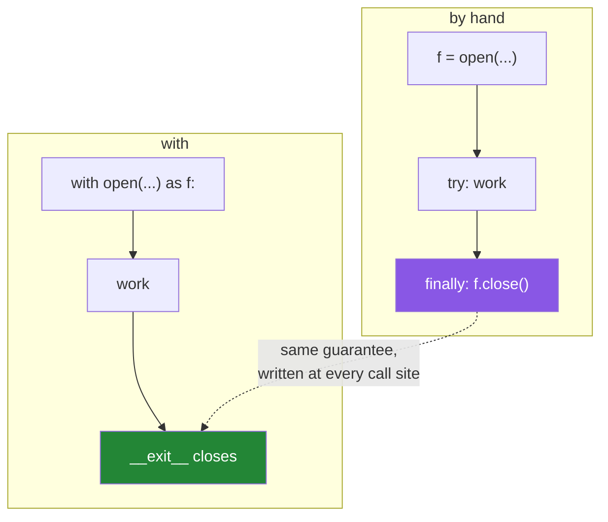

# 4.2 — `try` / `finally`, which is what `with` is

## One-line answer

`with` is `try` / `finally` with the cleanup written once, in the object, instead of once at every call
site — so understanding `finally` is understanding `with`, and knowing that is what lets you tell when
`with` is not available to you.

---

## The story

The shared computer has a rule taped to the monitor: **close the list before you get up**.

It works, mostly. People read it and mostly do it. What it cannot cover is the times somebody does not
*get up* — the phone rings and they walk off, the fire alarm goes, they get called into a meeting mid-
sentence. The rule was written for the normal way of leaving, and the abnormal ways are exactly when
nobody is thinking about a rule on a monitor.

The version that works is a door that shuts itself. Then the leaving does not have to be normal, and
nobody has to have read anything.

Both arrangements have the same *intent*. One of them depends on the person and one of them does not.

---

## The idea in plain language

`try` / `finally` is Python's "however this block ends, do this next" construct:

```text
f = open(path, encoding="utf-8")
try:
    ...use f...
finally:
    f.close()
```

The `finally` block runs when the `try` block ends, and it does not care how it ended: normally, with a
`return`, with a `break`, or with an exception. If there was an exception it runs first and the exception
then continues on its way, uncaught.

That is exactly the guarantee `with` gives, and it is not a coincidence — it is what `with` compiles to.
The language reference for the `with` statement spells the translation out at
<https://docs.python.org/3/reference/compound_stmts.html#the-with-statement>, and `with A() as a: BODY`
is, near enough:

```text
manager = A()
a = manager.__enter__()
try:
    BODY
finally:
    manager.__exit__(...)
```

So what does `with` actually add? Three things, and they are all about **where the cleanup lives**:

**It is written once, in the object.** Every caller of `open` gets the closing for free; with `finally`
every caller writes it, and one of them will not.

**It cannot be got wrong at the call site.** A `finally` block can be forgotten, put in the wrong
function, or made conditional. A `with` line either exists or does not.

**It reads as one thing.** `with open(...) as f:` is four fewer lines of framing around the work, and the
work is what a reader came for.

Two facts about `finally` worth carrying, because they explain behaviour you will meet:

**`finally` runs even after a `return` in the `try`.** The return value is computed, then `finally` runs,
then the function returns. That is why `try` / `finally` is the right way to guarantee cleanup in a
function with several exits.

**A `return` inside `finally` replaces the exception.** If the `finally` block itself returns, any
exception on its way out is discarded — silently. It is a small, sharp trap and the reason `finally`
blocks should only clean up.

`try` / `finally` is still needed when there is no context manager to hand: a resource from an older
library with `open()` and `close()` methods and no `__enter__`. And even then the better move is usually
to wrap it — `contextlib.closing` does exactly that in one line
([4.6](4.6-a-connection-that-always-closes.md)).

---

## Why Setu needs it

- **[4.3](4.3-enter-and-exit-by-hand.md) writes a context manager**, and `__exit__` is the `finally`
  block moved into the class. Seeing the two side by side is what makes that document short.
- **[Day 14, 2.4](../../../day-14-decorators/parts/02-writing-a-decorator/2.4-timed-the-first-real-one.md)
  put `@timed`'s measurement in a `finally`** for exactly this reason: a slow failure is the case you
  most want reported.
- **Day 226's database work meets libraries with `close()` and no `with`**, and knowing what `with`
  compiles to is what lets you decide between a `finally` and a wrapper.
- **Principle 7's tests need cleanup that runs on failure.** A fixture that tidies up only when the test
  passes leaves rubbish behind exactly when you are debugging.

---

## The mechanism

```python
"""with is try/finally, written once instead of everywhere."""

from pathlib import Path

p = Path("shopping.txt")
p.write_text("milk\nbread\n", encoding="utf-8")


def by_hand():
    f = open(p, encoding="utf-8")
    try:
        return f.read().count("\n")
    finally:
        print("  finally ran; closing")
        f.close()


def with_block():
    with open(p, encoding="utf-8") as f:
        return f.read().count("\n")


def forgot():
    f = open(p, encoding="utf-8")
    lines = f.read().count("\n")
    if lines:
        return lines
    f.close()
    return 0


print("by hand   :", by_hand())
print("with block:", with_block())
print("forgot    :", forgot(), "- and the file was never closed on that path")
```

Run on Python 3.12.12 on 2026-09-01:

```
  finally ran; closing
by hand   : 2
with block: 2
forgot    : 2 - and the file was never closed on that path
```

**Line by line:**

- `by_hand` has the `return` **inside the `try`**, and the `finally` still ran — the printed line appears
  *before* `by hand : 2`, because the value was computed, then `finally` ran, then the function returned.
  **That ordering is the whole reason `finally` is trustworthy.**
- `with_block` is the same function with three lines removed and the same behaviour. Nothing about the
  work changed.
- `forgot` is the realistic bug, and it is worth reading slowly: the `close()` is there, it is correct,
  and it is **below an early `return`**. The common path — a file with lines in it — never reaches it.
- This is what a function looks like after somebody adds a guard clause. The `close()` was right when it
  was written; a later `if` moved it out of reach, and nothing in the diff would have looked wrong.
- `f.read().count("\n")` counts lines by counting newlines, which is enough here and is not how you would
  count lines in real code ([2.4](../02-reading-and-writing/2.4-reading-a-big-file.md)).
- All three return `2`. **The bug is invisible in the output**, which is why it survives.
- `print("  finally ran; closing")` inside the `finally` is the demonstration's device — it is the only
  way to see the ordering from outside.

The same guarantee, two spellings:



---

## When it breaks

**`finally` running after a `return`, and changing the answer:**

```text
$ uv run python -c "
def sneaky():
    try:
        return 'from try'
    finally:
        return 'from finally'

def worse():
    try:
        raise RuntimeError('the real problem')
    finally:
        return 'swallowed'

print('sneaky() ->', sneaky())
print('worse()  ->', worse())
"
sneaky() -> from finally
worse()  -> swallowed
```

**What it means.** A `return` inside `finally` **replaces** whatever was happening — the earlier return
value, or an exception on its way out. `worse()` raised a `RuntimeError` and the caller got a string,
with no trace of the error anywhere. This is the reason for the rule: **a `finally` block cleans up and
does nothing else**. `ruff`'s `B012` flags `return`, `break` and `continue` inside `finally` for exactly
this.

**Cleanup below an early return:**

```text
$ uv run python -c "
from pathlib import Path
p = Path('shopping.txt')
p.write_text('milk\nbread\n', encoding='utf-8')

def forgot():
    f = open(p, encoding='utf-8')
    text = f.read()
    if 'milk' in text:
        return 'found milk'
    f.close()
    return 'no milk'

print(forgot())
import gc, warnings
warnings.simplefilter('error', ResourceWarning)
gc.collect()
"
found milk
```

**What it means.** The function returned the right answer and leaked the handle, and turning
`ResourceWarning` into an error did not catch it — because the file object is still referenced by the
frame that is being cleaned up, or is collected quietly enough not to warn. **A leak on one code path is
almost undetectable from outside**, which is why the defence has to be structural: `with`, so there is no
path that skips the close.

**Cleanup that itself fails:**

```text
$ uv run python -c "
def cleanup_fails():
    try:
        raise RuntimeError('the real problem')
    finally:
        raise ValueError('the cleanup also failed')

try:
    cleanup_fails()
except Exception as e:
    print('caller saw   :', type(e).__name__, '-', e)
    print('and its cause:', type(e.__context__).__name__, '-', e.__context__)
"
caller saw   : ValueError - the cleanup also failed
and its cause: RuntimeError - the real problem
```

**What it means.** Two exceptions, and the caller catches the **second** one — the cleanup failure hides
the real problem. Python keeps the original on `__context__` and prints it as *"During handling of the
above exception, another exception occurred"*, so it is recoverable from a traceback but not from an
`except` clause. Cleanup code that can fail should catch its own errors and log them, rather than
replacing the diagnosis somebody actually needs.

**`finally` that never runs:**

```text
$ uv run python -c "
import os
try:
    print('in the try')
    os._exit(0)
finally:
    print('this never prints')
"
```

**What it means.** There is no output at all — not even `in the try`. `os._exit` ends the process
immediately, so the `finally` does not run, and **the already-executed `print` is lost too**, because
standard output was buffered and nothing flushed it
([3.1](../03-buffering/3.1-the-write-that-had-not-happened.md)). Two lessons in an empty result: `finally`
is skipped, and so is every buffer in the process. The same is true of a `SIGKILL`, a segmentation fault
in a C extension, and a container's out-of-memory killer. **`with` and `finally` protect against
exceptions, not against the process ceasing to exist** — which is why durability needs
[3.2](../03-buffering/3.2-flush-fsync-and-what-saved-means.md) rather than tidy resource handling.

---

## In production

**The professional habit is `with` everywhere it exists and `try` / `finally` only where it does not** —
and in the second case, wrapping the resource so the next caller gets a `with` too. A codebase littered
with bare `finally` blocks around resources is one where somebody will eventually add a `return` above
one of them; a codebase that wraps once has that problem in one place.

**What changes at scale is that cleanup ordering starts to matter.** Several resources acquired in
sequence must be released in the opposite order, and nested `try` / `finally` blocks to do that quickly
become unreadable — five levels of indentation before any work happens. `with A() as a, B() as b:`
handles the fixed case and `contextlib.ExitStack` handles the case where the number is decided at run
time ([4.6](4.6-a-connection-that-always-closes.md)).

**The failure that only appears with real data is the cleanup that runs but does not finish.** A
`finally` that closes a network connection can itself block for a long time when the other end is gone,
so a failure that should have taken a millisecond takes the socket timeout — and under load every worker
is now sitting in a `finally` block. Cleanup should be bounded: timeouts on close, and a `try` around the
cleanup so one slow resource does not hold up the rest.

**The review comment a senior engineer leaves.** *"There is a `return` inside the `finally` here, so the
`ValidationError` raised in the `try` never reaches the caller — that is the "silent success" ticket from
last week. `finally` cleans up and returns nothing; put the value on the normal path."*

**The interview question.** *"What does `with` actually do?"* The answer is the translation — `__enter__`,
a `try` whose `finally` calls `__exit__` — and what makes it good is why that is better than writing the
`try` yourself: the cleanup lives once in the object rather than once per call site, so it cannot be
forgotten or stranded below an early `return`. Adding the two `finally` traps — a `return` inside it
discards the exception, and an exception inside it replaces the real one — shows you have debugged the
hand-written version.

---

## Check yourself

```bash
uv run python -c "
def order():
    try:
        print('  1 in the try')
        return 'the answer'
    finally:
        print('  2 in the finally')

print('calling:')
result = order()
print('  3 got:', result)

def sneaky():
    try:
        return 'from try'
    finally:
        return 'from finally'

print('sneaky ->', sneaky())
"
```

The three numbered lines print in order, which means the `finally` ran between the `return` and the
caller seeing it. Say what that implies about where the return value was stored.

**Answer out loud, without scrolling up:**

> Write `with open(p) as f: ...` as a `try` / `finally` with no `with` in it. Then say two things `with`
> adds that the hand-written version does not have.

---

**Next:** [4.3 — `__enter__` and `__exit__` by hand](4.3-enter-and-exit-by-hand.md), where you write the
object that makes `with` work.
