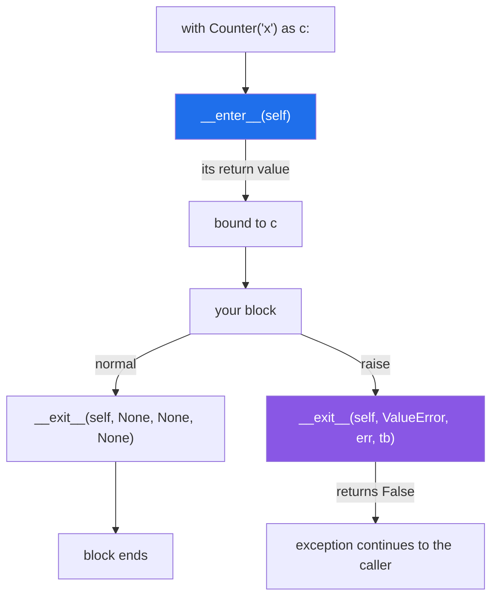

# 4.3 — `__enter__` and `__exit__`, written by hand

## One-line answer

Any object with `__enter__` and `__exit__` can go after `with`: `__enter__` runs on the way in and its
return value is what `as` binds, `__exit__` runs on every way out and is told which exception — if any —
is leaving.

---

## The story

The desk in the lobby is back, and this time somebody has written the job down as two halves.

**On the way in:** take the visitor's name, write it in the book, note the time, hand them a badge.

**On the way out:** take the badge back, write the time, and — this is the part that was added after an
incident — write down whether they left normally or whether the fire alarm went. Both are ways of
leaving. The book records which.

Everything in between is the visit, and the desk has no opinion about it. It does not know what happened
on the third floor and does not need to. Its whole job is the two halves, and the second half runs
whichever way the visit ended.

---

## The idea in plain language

A **context manager** is any object with two methods:

- **`__enter__(self)`** — run on the way in. Whatever it returns is bound by `as`. If there is nothing
  useful to hand back, return `self`.
- **`__exit__(self, exc_type, exc_value, traceback)`** — run on the way out. Its three arguments describe
  the exception that is leaving the block, and they are all `None` when the block ended normally.

Those three arguments are how `__exit__` knows what happened:

| Left the block by | `exc_type` | `exc_value` |
|---|---|---|
| finishing, `return`, `break` | `None` | `None` |
| raising | the exception's class | the exception object |

So a `__exit__` that does the same thing either way can ignore them, and one that behaves differently on
failure — roll back rather than commit, delete the half-written file rather than rename it — checks
`exc_type is None`.

The return value matters too, and it has a sharp edge: **returning a true value suppresses the
exception.** That is a real feature and an easy accident, and it gets its own document in
[4.4](4.4-the-exit-that-swallowed-the-exception.md). For now: return `False`, or return nothing, which is
the same thing.

Two things worth being clear about.

**`__enter__` need not return `self`.** `open` happens to return the file, so `with open(...) as f` gives
you the file. A context manager that manages something can return that something instead — a connection
returning a cursor, a lock returning nothing useful. What `as` binds is entirely `__enter__`'s choice.

**They are looked up on the type.** Like every dunder
([Day 15, 3.1](../../../day-15-constructors-and-dunders/parts/03-the-dunders/3.1-what-a-dunder-method-is.md)),
so attaching `__enter__` to one instance does nothing.

When you would write one rather than reaching for something existing: when the acquire-and-release pair
belongs to an object you own — a client, a session, a transaction, a temporary state — and you want
callers to get the release for free. When the pair is a one-off, [4.5](4.5-contextmanager-decorator.md)'s
decorator is shorter.

---

## Why Setu needs it

- **Day 226's database work wraps a connection**, and a transaction that commits on success and rolls
  back on failure is the classic `__exit__` that reads `exc_type`.
- **Day 232's checkpoints need "write a temporary file, rename it on success, delete it on failure"** —
  which is a context manager whose `__exit__` behaves differently on the two paths.
- **[Day 14's `@timed`](../../../day-14-decorators/parts/02-writing-a-decorator/2.4-timed-the-first-real-one.md)
  times a whole function**, and often what you want is to time a *block*. That is a context manager, and
  it is the thing a decorator cannot do.
- **Principle 12 puts a human checkpoint before external writes.** A context manager that acquires the
  approval on entry and records the outcome on exit is how that becomes a shape rather than a convention.

---

## The mechanism

```python
"""__enter__ and __exit__, written by hand."""


class Counter:
    """Counts what happened inside the block, and always reports."""

    def __init__(self, name):
        self.name = name
        self.lines = 0

    def __enter__(self):
        print(f"  [{self.name}] __enter__ - opening")
        return self

    def add(self, line):
        self.lines += 1

    def __exit__(self, exc_type, exc_value, traceback):
        print(f"  [{self.name}] __exit__  - {self.lines} lines, exc_type={exc_type}")
        return False


print("the happy path:")
with Counter("ok") as c:
    c.add("milk")
    c.add("bread")

print("the unhappy path:")
try:
    with Counter("boom") as c:
        c.add("milk")
        raise ValueError("the list is on fire")
except ValueError as error:
    print("  caller still saw:", type(error).__name__, "-", error)
```

Run on Python 3.12.12 on 2026-09-01:

```
the happy path:
  [ok] __enter__ - opening
  [ok] __exit__  - 2 lines, exc_type=None
the unhappy path:
  [boom] __enter__ - opening
  [boom] __exit__  - 1 lines, exc_type=<class 'ValueError'>
  caller still saw: ValueError - the list is on fire
```

**Line by line:**

- `def __enter__(self):` takes **only `self`**. Whatever it returns is what `as c` binds — here `self`,
  which is the common case and the reason `with X() as x` usually gives you the `X`.
- `return self` and not `return None`. Returning nothing is legal and means `c` would be `None`, which is
  right for a context manager that manages something invisible and wrong here.
- `def __exit__(self, exc_type, exc_value, traceback):` — **four parameters, always, whatever happens**.
  Python passes three `None`s on the happy path rather than calling it differently.
- On the happy path `exc_type=None`. On the unhappy one it is `<class 'ValueError'>` — the class, not the
  instance; the instance is `exc_value`.
- `2 lines` and then `1 lines` — the exit sees the state as it was when the block ended, so a
  half-finished block reports what it managed. **That is what makes `__exit__` useful for reporting**, and
  it is the same argument as the `finally` in
  [Day 14, 2.4](../../../day-14-decorators/parts/02-writing-a-decorator/2.4-timed-the-first-real-one.md).
- `return False` — do not suppress. The next line of output proves it: the caller's `except ValueError`
  caught the exception, which means it survived the exit. [4.4](4.4-the-exit-that-swallowed-the-exception.md)
  is what happens when this returns `True`.
- `raise ValueError(...)` in the middle of the block, and **`__exit__` still ran** — before the exception
  reached the caller. Read the output order: exit line first, caller's message second.
- `add` is an ordinary method. A context manager is an ordinary class that happens to have two extra
  methods; there is no base class and nothing to inherit
  ([Day 13, 4.3](../../../day-13-inheritance-and-abstraction/parts/04-abstraction/4.3-protocol-versus-abc.md)'s
  structural typing).

What Python passes, and when:



---

## When it breaks

**A class with `__enter__` and no `__exit__`:**

```text
$ uv run python -c "
class Half:
    def __enter__(self):
        print('entered')
        return self

with Half() as h:
    print('in the block')
"
Traceback (most recent call last):
  File "<string>", line 7, in <module>
TypeError: 'Half' object does not support the context manager protocol (missed __exit__ method)
```

**What it means.** The message is unusually kind: it names the protocol and the missing method. Note that
`entered` never printed — Python checks for **both** methods before calling either, so a half-implemented
context manager fails at the `with` line rather than half way through. The mirror-image message, for a
missing `__enter__`, says the same thing about the other method.

**`__exit__` with the wrong number of parameters:**

```text
$ uv run python -c "
class Wrong:
    def __enter__(self):
        return self
    def __exit__(self):
        print('cleaning up')

with Wrong():
    print('in the block')
"
Traceback (most recent call last):
  File "<string>", line 8, in <module>
TypeError: Wrong.__exit__() takes 1 positional argument but 4 were given
in the block
```

**What it means.** Python always passes three exception arguments, so `__exit__` always takes four
parameters ([Day 15, 3.1](../../../day-15-constructors-and-dunders/parts/03-the-dunders/3.1-what-a-dunder-method-is.md)'s
"you do not choose a dunder's signature"). Read the order of the output: **the block ran first** and the
failure came at the exit — so the work happened and the cleanup did not, which is the worst of both.
`*args` would silence it, and naming the three parameters is better because their names document what
they are.

**Cleanup that only runs on the happy path:**

```text
$ uv run python -c "
class Careless:
    def __enter__(self):
        self.open = True
        return self
    def __exit__(self, exc_type, exc_value, traceback):
        if exc_type is None:
            self.open = False
        return False

c = Careless()
try:
    with c:
        raise ValueError('boom')
except ValueError:
    pass
print('still open after a failure:', c.open)
"
still open after a failure: True
```

**What it means.** `__exit__` ran — it always does — and the author put the cleanup behind a check that
was `False`. The resource is leaked precisely on the path where leaking hurts most. **`exc_type` is for
deciding between two *actions*, like commit versus roll back; it is never a reason to skip releasing
something.** Anything that must always happen goes before the check.

**An `__enter__` that fails after acquiring something:**

```text
$ uv run python -c "
class Fragile:
    def __enter__(self):
        print('  acquired resource A')
        raise RuntimeError('failed acquiring resource B')
    def __exit__(self, *exc):
        print('  __exit__ ran')
        return False

try:
    with Fragile():
        print('  never reached')
except RuntimeError as e:
    print('caller saw:', e)
"
  acquired resource A
caller saw: failed acquiring resource B
```

**What it means.** `__exit__` **did not run**, because `with` only registers the exit once `__enter__`
has returned successfully. So anything acquired before the failure inside `__enter__` is leaked, and
there is no cleanup hook to catch it. An `__enter__` that acquires more than one thing has to clean up
after itself with its own `try`, or — much better — use an `ExitStack` internally
([4.6](4.6-a-connection-that-always-closes.md)), which is exactly the problem that class exists for.

---

## In production

**The professional habit is that `__enter__` acquires and returns, and `__exit__` releases
unconditionally — with `exc_type` used only to choose *how* to finish, never *whether* to.** A
transaction commits when `exc_type is None` and rolls back otherwise, and **both** paths close the
connection. Writing the release first and the decision second makes that ordering visible in the code.

**What changes at scale is that context managers become the boundary of a unit of work.** A request, a
transaction, a batch, a span in a tracing system — each is a block with a beginning and an end and
something to record either way, and expressing it as `with` means the recording cannot be forgotten by
the next person to add an early `return`. That is why every observability library gives you one.

**The failure that only appears with real data is the exit that is slow on the error path.** A
`__exit__` that rolls back a large transaction, or closes a connection to a host that has gone away, can
take seconds — and it runs while an exception is already propagating, so a fast failure becomes a slow
one and the timeout budget upstream is spent on cleanup. Real implementations bound their exit work and
catch their own exceptions, because an exception raised inside `__exit__` replaces the original
([4.2](4.2-try-finally-is-what-with-is.md)).

**The review comment a senior engineer leaves.** *"`__exit__` closes the connection inside the
`if exc_type is None` branch, so every failed request leaks a connection — that is the pool exhaustion we
saw under load. Close unconditionally, and use `exc_type` only to pick commit or rollback."*

**The interview question.** *"How would you write your own context manager?"* The two methods and the
four parameters are the mechanism. What makes it a good answer is the detail around them: `__enter__`'s
return value is what `as` binds and need not be `self`; `__exit__` always receives three exception
arguments and gets `None`s on the happy path; returning a true value from `__exit__` suppresses the
exception, so return `False` unless suppressing is the point; and `__exit__` is not called at all if
`__enter__` raised, which is why an `__enter__` acquiring several things needs its own cleanup.

---

## Check yourself

```bash
uv run python -c "
class Counter:
    def __init__(self, name):
        self.name, self.lines = name, 0
    def __enter__(self):
        print(f'  [{self.name}] enter')
        return self
    def add(self, line):
        self.lines += 1
    def __exit__(self, exc_type, exc_value, traceback):
        print(f'  [{self.name}] exit  lines={self.lines} exc={exc_type}')
        return False

with Counter('ok') as c:
    c.add('milk'); c.add('bread')

try:
    with Counter('boom') as c:
        c.add('milk')
        raise ValueError('on fire')
except ValueError as e:
    print('caller saw:', e)
"
```

The exit line prints in both cases, with a different `exc` and a different count. Say which of the two
tells you the block did not finish.

**Answer out loud, without scrolling up:**

> What are `__exit__`'s four parameters and what are they on the happy path? Then say what `as` binds,
> and when `__exit__` is *not* called at all.

---

**Next:** [4.4 — the `__exit__` that swallowed the exception](4.4-the-exit-that-swallowed-the-exception.md),
which is the one line of `__exit__` that can hide a crash.
