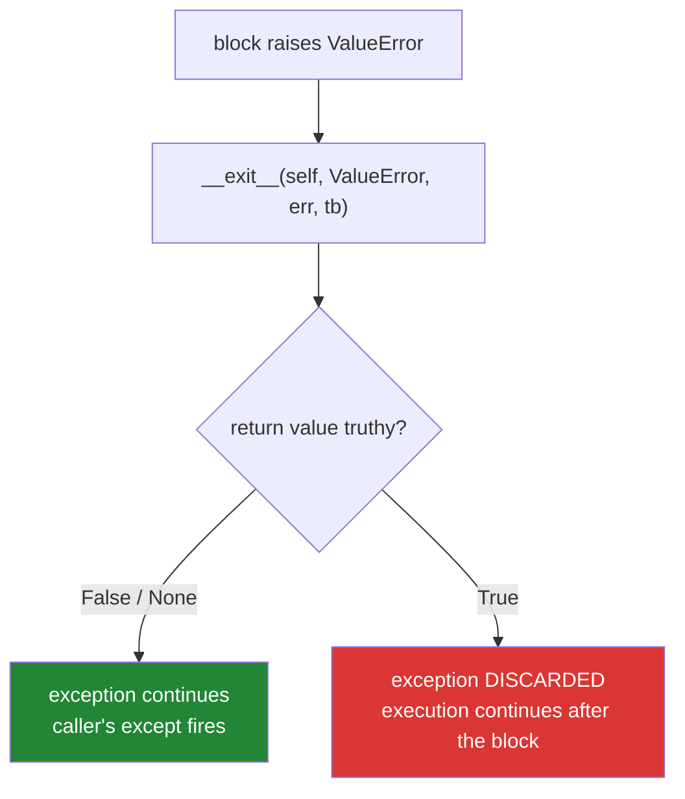

# 4.4 — The `__exit__` that swallowed the exception

## One-line answer

If `__exit__` returns a true value, Python throws the exception away and carries on after the block — so
one stray `return True`, or a `return` on a line that was meant to end a branch, turns a crash into a
silently wrong result for every user of that context manager.

---

## The story

The desk gets a new instruction, and it is a sensible one.

*"If the fire alarm goes while somebody is upstairs, sign them out and note it. Do not let it hold up the
queue."*

The intent is obvious: an alarm should not leave a half-finished entry in the book. But the wording says
something slightly more than intended, and after a while somebody notices what has been happening.
Visitors are being signed out and the queue keeps moving, and **nobody upstairs is being told there was
an alarm.** The desk has been handling it — quietly, correctly by the letter, dozens of times.

The person who wrote the instruction meant *record it and let it continue*. What got written was *record
it, and then behave as though it did not happen*.

---

## The idea in plain language

`__exit__` returns a value, and Python reads it as an answer to one question: *"have you dealt with this
exception?"*

| `__exit__` returns | What Python does |
|---|---|
| `False`, `None`, or nothing | let the exception continue to the caller |
| **any true value** | **discard the exception** and carry on after the block |

The suppressing behaviour is a real feature. `contextlib.suppress(FileNotFoundError)` is built on it, and
it is the honest way to write "if this is not there, never mind":

```text
with contextlib.suppress(FileNotFoundError):
    Path("maybe.txt").unlink()
```

The danger is that **`return True` in `__exit__` looks like ordinary success**. Somebody writing a
context manager, finishing the method, and typing `return True` out of habit has just made every block
using it swallow every exception — and there is no error, no warning, and nothing in the diff to catch
the eye.

Three rules that keep it safe:

**Return nothing.** A method with no `return` returns `None`, which is falsy, which is the correct
default. Do not write `return False` because you think a return is needed; write nothing.

**Suppress a *named* exception type, never all of them.** If suppressing is genuinely wanted, check
`exc_type` and return `True` only for the one type you meant — the same discipline as
[Day 14, 3.2](../../../day-14-decorators/parts/03-decorators-with-arguments/3.2-backoff-jitter-and-which-errors.md)'s
`catching=` parameter.

**Say so in the docstring.** A context manager that can swallow exceptions has changed how the block
behaves, and the caller cannot see that at the call site.

There is a subtler version worth watching for. `__exit__` does not have to *return* `True` to hide an
error — an exception raised **inside** `__exit__` replaces the original
([4.2](4.2-try-finally-is-what-with-is.md)), and the caller then catches something about the cleanup
rather than something about the problem.

---

## Why Setu needs it

- **Day 226's transaction manager and Day 232's checkpoints both write an `__exit__` that reads
  `exc_type`.** A rollback that also returns `True` reports success on a transaction that failed.
- **[Day 14, 2.3](../../../day-14-decorators/parts/02-writing-a-decorator/2.3-returning-the-value.md)
  made exactly this argument about wrappers**: a decorator that swallows an exception turns a crash into
  a wrong answer. Same failure, different mechanism.
- **Principle 7's tests can only go red if the failure reaches them.** A swallowing context manager makes
  a whole category of failure untestable, because nothing propagates.
- **Principle 12 gates external writes on a human.** An approval step whose `__exit__` suppresses the
  "not approved" exception is a gate that is always open.

---

## The mechanism

```python
"""The return value of __exit__ decides whether the exception survives."""


class Honest:
    def __enter__(self):
        return self

    def __exit__(self, exc_type, exc_value, traceback):
        print("  Honest.__exit__ returning False")
        return False


class Swallowing:
    def __enter__(self):
        return self

    def __exit__(self, exc_type, exc_value, traceback):
        print("  Swallowing.__exit__ returning True")
        return True


class Accidental:
    def __enter__(self):
        return self

    def __exit__(self, exc_type, exc_value, traceback):
        print("  Accidental.__exit__ falling off the end")


for cls in (Honest, Accidental, Swallowing):
    print(cls.__name__ + ":")
    try:
        with cls():
            raise ValueError("the list is on fire")
        print("  the caller carried on as if nothing happened")
    except ValueError as error:
        print("  the caller saw:", type(error).__name__)
```

Run on Python 3.12.12 on 2026-09-01:

```
Honest:
  Honest.__exit__ returning False
  the caller saw: ValueError
Accidental:
  Accidental.__exit__ falling off the end
  the caller saw: ValueError
Swallowing:
  Swallowing.__exit__ returning True
  the caller carried on as if nothing happened
```

**Line by line:**

- Three classes with **identical `__enter__` methods** and identical block bodies. The only difference is
  the last line of each `__exit__`.
- `Honest` returns `False` — the exception reaches the caller's `except`.
- `Accidental` **has no `return` at all**, so it returns `None`, which is falsy, and it behaves exactly
  like `Honest`. That is the safe default and it is worth knowing you get it for free.
- `Swallowing` returns `True`, and the line after the `with` block ran — `the caller carried on as if
  nothing happened`. The `except ValueError` never fired, because there was no longer an exception.
- **Read the third block against the first two.** The `raise` executed. The exception existed. And the
  program continued to the next statement with no record of it beyond the print inside `__exit__`, which
  a real implementation would not have.
- `print("  the caller carried on...")` is **inside the `try` and after the `with`** — a line that is
  unreachable when the block raises. Its appearing is the proof.
- `for cls in (Honest, Accidental, Swallowing)` runs all three through the same code, so the difference
  cannot be anything but the return value.
- Nothing here is an error. All three classes are valid context managers, and the one that hides a crash
  is the one that differs by four characters.

The one decision:



---

## When it breaks

**A logging context manager that also suppresses:**

```text
$ uv run python -c "
class Logged:
    def __enter__(self):
        return self
    def __exit__(self, exc_type, exc_value, traceback):
        if exc_type is not None:
            print('  [log] failed:', exc_value)
            return True

def process(record):
    with Logged():
        if record == 'bad':
            raise ValueError('cannot parse ' + record)
        return 'processed ' + record
    return None

for r in ['good', 'bad', 'also good']:
    print(r, '->', process(r))
"
good -> processed good
  [log] failed: cannot parse bad
bad -> None
also good -> processed also good
```

**What it means.** The bad record produced `None` and the loop carried on, because `return True` in the
`if` branch suppressed the error. **This is a very natural thing to write** — "if there was an error, log
it, done" — and the `return True` reads as *"handled"* rather than as *"hidden"*. In a pipeline this is
how a run reports success with a third of its output missing. The fix is to log and then **not** return
anything.

**A `return` that was meant to end a branch:**

```text
$ uv run python -c "
class Rollback:
    def __enter__(self):
        return self
    def __exit__(self, exc_type, exc_value, traceback):
        if exc_type is None:
            print('  commit')
            return
        print('  rollback')
        return True

try:
    with Rollback():
        raise ValueError('constraint violated')
    print('  caller: transaction finished')
except ValueError as e:
    print('  caller saw:', e)
"
  rollback
  caller: transaction finished
```

**What it means.** The rollback happened and the caller was told the transaction **finished**. The bare
`return` in the success branch is correct; the `return True` in the failure branch was almost certainly
meant to mean *"I rolled back"* and instead means *"nothing went wrong"*. **A transaction manager that
suppresses is the most dangerous version of this bug**, because the caller's next action assumes the
write landed.

**Suppressing more than intended:**

```text
$ uv run python -c "
import contextlib
from pathlib import Path

with contextlib.suppress(Exception):
    Path('maybe.txt').unlink(missing_ok=True)
    result = 1 / 0
    print('never printed')
print('carried on, and result is undefined:', 'result' in dir())
"
carried on, and result is undefined: False
```

**What it means.** `suppress(Exception)` was reached for to ignore a missing file and it also ate a
`ZeroDivisionError` — a genuine bug — leaving `result` unassigned and the program running. **`suppress`
takes exception types for a reason**: `suppress(FileNotFoundError)` would have let the division error
through. The rule is the same as
[Day 14, 3.2](../../../day-14-decorators/parts/03-decorators-with-arguments/3.2-backoff-jitter-and-which-errors.md)'s:
name the exception you mean.

**An exception raised inside `__exit__`:**

```text
$ uv run python -c "
class Fragile:
    def __enter__(self):
        return self
    def __exit__(self, exc_type, exc_value, traceback):
        raise RuntimeError('cleanup failed too')

try:
    with Fragile():
        raise ValueError('the real problem')
except Exception as e:
    print('caller saw   :', type(e).__name__, '-', e)
    print('the original :', type(e.__context__).__name__, '-', e.__context__)
"
caller saw   : RuntimeError - cleanup failed too
the original : ValueError - the real problem
```

**What it means.** The original exception was replaced, not suppressed — the caller catches the cleanup's
failure and the real diagnosis is only on `__context__`, which an `except` clause cannot match on. This
is the second way an `__exit__` hides a problem, and it needs no `return True` at all. **Cleanup code
that can fail should catch its own exceptions**, log them, and let the original continue.

---

## In production

**The professional habit is that `__exit__` ends without a `return` statement**, and any suppression is
explicit, narrow and documented — `if exc_type is FileNotFoundError: return True`, with a docstring line
saying so. Reviewers learn to look at the last line of every `__exit__` for exactly this reason, the same
way they look for the `return` in front of a decorator's inner call
([Day 14, 2.3](../../../day-14-decorators/parts/02-writing-a-decorator/2.3-returning-the-value.md)).

**What changes at scale is that a swallowing context manager becomes invisible in monitoring.** A crash
appears in an error tracker; a suppressed exception does not appear anywhere, so the system's dashboards
are green while its output is wrong. The failure is then found by somebody noticing that the numbers are
too small — days or weeks later, with no timestamp to work back from. This is why "errors are up" is a
better place to be than "errors are zero and nobody is sure why".

**The failure that only appears with real data is the context manager written around the happy path.**
The block that raises is the malformed record, the timed-out request, the missing field — none of which
appear in the fixture. So a `return True` written while thinking about clean input is exercised for the
first time by a corpus with a few bad records, and its effect is to make those records disappear rather
than to make the job fail. Testing that a context manager **propagates** — `with pytest.raises(...)`
around a `with` block — is a one-line test and the only one that catches it.

**The review comment a senior engineer leaves.** *"`__exit__` returns `True` in the rollback branch, so
every failed transaction reports success to the caller and the request handler goes on to send the
confirmation email. Log the failure, roll back, and return nothing — and add a test that asserts the
exception reaches the caller."*

**The interview question.** *"What does the return value of `__exit__` mean?"* A true value suppresses the
exception; anything falsy lets it propagate — and the practical advice is to write no `return` at all, so
the default is the safe one. What shows experience is the two ways this goes wrong in real code: a
`return True` written to mean "I handled the logging" or "I rolled back", which turns a crash into a
silently wrong result across every user of that manager; and an exception raised *inside* `__exit__`,
which replaces the original so the caller diagnoses the cleanup instead of the bug.

---

## Check yourself

```bash
uv run python -c "
class Honest:
    def __enter__(self): return self
    def __exit__(self, *exc): pass

class Swallowing:
    def __enter__(self): return self
    def __exit__(self, *exc): return True

for cls in (Honest, Swallowing):
    try:
        with cls():
            raise ValueError('boom')
        print(cls.__name__, '-> carried on')
    except ValueError:
        print(cls.__name__, '-> exception reached the caller')
"
```

Two classes, one word of difference, two completely different programs. Say which one you would get by
writing `__exit__` and forgetting to return anything.

**Answer out loud, without scrolling up:**

> What happens when `__exit__` returns `True`, and what should it return instead? Then name the other way
> an `__exit__` can hide the real problem without returning anything at all.

---

**Next:** [4.5 — `@contextmanager`, the generator that is a context manager](4.5-contextmanager-decorator.md),
which writes both halves as one function.
