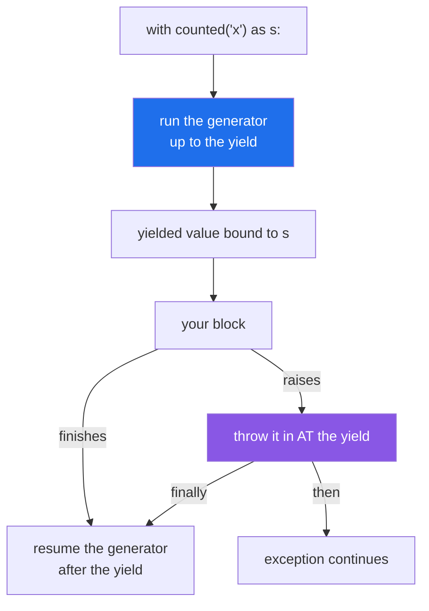

# 4.5 — `@contextmanager`: the generator that is a context manager

## One-line answer

`contextlib.contextmanager` turns a generator with exactly one `yield` into a context manager —
everything before the `yield` is `__enter__`, everything after it is `__exit__`, and the `try` / `finally`
around the `yield` is what makes the second half run when the block fails.

---

## The story

The desk's two halves — sign in, sign out — were written on two separate cards, and somebody kept picking
up one without the other.

So they were rewritten as one sheet, in order, the way you would say it out loud: *take the name, write
the time, hand over the badge …* — then a gap where the visit happens — *… take the badge back, write the
time again.*

Same job. It is easier to get right, because the two halves are next to each other and read top to
bottom, and because nobody can pick up the first card and leave the second in the drawer.

The gap in the middle is the interesting part of the sheet. It is not an instruction; it is a space where
somebody else's work goes.

---

## The idea in plain language

Writing `__enter__` and `__exit__` as two methods ([4.3](4.3-enter-and-exit-by-hand.md)) puts the setup
and the cleanup in different places, with a class around them, for a job that is often four lines.

`contextlib.contextmanager` is a decorator
([Day 14, 1.4](../../../day-14-decorators/parts/01-functions-as-values/1.4-the-at-sign-is-two-lines.md))
that lets you write both halves as one generator:

```text
@contextlib.contextmanager
def managed():
    setup()                # this is __enter__
    try:
        yield something    # this is what `as` binds
    finally:
        cleanup()          # this is __exit__
```

The mapping is exact:

- **Before the `yield`** — runs when the block is entered.
- **The value yielded** — what `as` binds. Yield nothing if there is nothing to hand over.
- **After the `yield`** — runs when the block ends.

The mechanism is Day 11's generator, used for its pausing rather than for its values
([Day 11, 2.1](../../../day-11-iterators-and-generators/parts/02-generators/2.1-yield-the-function-that-pauses.md)).
`__enter__` runs the generator up to the `yield`; `__exit__` resumes it. Exactly one `yield` must run, so
a generator that yields twice, or not at all, is an error.

Two rules, and the first one is the whole document:

**The `yield` must be inside a `try` with a `finally`.** When the block raises, Python throws that
exception *into* the generator at the `yield`. Without a `try`, the generator dies there and everything
after the `yield` never runs — so the cleanup silently stops happening on exactly the path you wanted it
for.

**Do not swallow.** A bare `except:` around the `yield` that does not re-raise suppresses the exception,
the same as returning `True` from `__exit__` ([4.4](4.4-the-exit-that-swallowed-the-exception.md)). If you
mean to suppress one type, catch that type and say so.

Which form to use, in practice: **the decorator for a one-off pair of actions**, especially a
function-shaped one — timing a block, a temporary setting, a transaction. **A class when the object has
other methods too**, or is used outside a `with`, or needs to be entered more than once. A generator-based
manager is single-use; entering it twice raises.

`contextlib` also has ready-made ones worth knowing: `suppress`, `closing`, `redirect_stdout`,
and `ExitStack` ([4.6](4.6-a-connection-that-always-closes.md)). The full list is at
<https://docs.python.org/3/library/contextlib.html>.

---

## Why Setu needs it

- **Timing a block is the obvious first use**, and it is the thing
  [Day 14's `@timed`](../../../day-14-decorators/parts/02-writing-a-decorator/2.4-timed-the-first-real-one.md)
  cannot do — a decorator wraps a function, and often the interesting unit is three lines in the middle
  of one.
- **Day 226's transaction wrapper is four lines with this** and about twenty as a class, for identical
  behaviour.
- **Day 233's eval suite needs temporary settings** — a fixed random seed, a stubbed clock, a different
  model name — set on the way in and restored on the way out whatever happened.
- **Principle 5's request budget wants a "count the calls in this block" manager**, which is a counter
  before the `yield` and a report after it.

---

## The mechanism

```python
"""@contextmanager: one generator, one yield, a try/finally around it."""

import contextlib


@contextlib.contextmanager
def counted(name):
    """Everything before yield is __enter__; everything after is __exit__."""
    print(f"  [{name}] before yield")
    state = {"lines": 0}
    try:
        yield state
    finally:
        print(f"  [{name}] after yield - {state['lines']} lines")


print("the happy path:")
with counted("ok") as state:
    state["lines"] += 2

print("the unhappy path:")
try:
    with counted("boom") as state:
        state["lines"] += 1
        raise ValueError("the list is on fire")
except ValueError as error:
    print("  caller still saw:", type(error).__name__)
```

Run on Python 3.12.12 on 2026-09-01:

```
the happy path:
  [ok] before yield
  [ok] after yield - 2 lines
the unhappy path:
  [boom] before yield
  [boom] after yield - 1 lines
  caller still saw: ValueError
```

**Line by line:**

- `@contextlib.contextmanager` above `def counted(name)` — a decorator that takes a **generator
  function** and returns something that builds context managers. Calling `counted("ok")` produces one;
  `with` then enters it.
- `def counted(name)` takes arguments like any function, which is one of the real advantages over a class:
  the setup is parameterised without writing an `__init__`.
- `print(f"  [{name}] before yield")` — this is `__enter__`. It runs when the `with` line executes.
- `state = {"lines": 0}` — a mutable object so the block can change what the exit will see. **A dictionary
  rather than an integer**, because the block needs to mutate it and rebinding a local would not be
  visible here ([Day 10, 2.3](../../../day-10-functions/parts/02-scope/2.3-global-and-nonlocal.md)).
- `yield state` — the pause. `state` is what `as state` binds in the caller's block. There is **exactly
  one** `yield`, and it is the only one there may be.
- `try:` / `finally:` around it — **the most important two lines in the document**. The `finally` is what
  makes the second half run when the block raises, and the first failure below is what happens without
  it.
- The unhappy path printed `after yield - 1 lines` **before** the caller's message. The exception was
  thrown into the generator at the `yield`, the `finally` ran, and then the exception continued outward.
- `1 lines` — the count as it was when the block died, which is the reporting property from
  [4.3](4.3-enter-and-exit-by-hand.md).
- Nothing here suppresses. There is no `except`, so the exception travels
  ([4.4](4.4-the-exit-that-swallowed-the-exception.md)).
- Nine lines total, against about eighteen for the equivalent class, and the two halves are adjacent.

Where the generator pauses:



---

## When it breaks

**No `try` / `finally` around the `yield`:**

```text
$ uv run python -c "
import contextlib

@contextlib.contextmanager
def careless(name):
    print(f'  [{name}] opening')
    yield
    print(f'  [{name}] closing')

try:
    with careless('boom'):
        raise ValueError('the list is on fire')
except ValueError as e:
    print('  caller saw:', type(e).__name__)
"
  [boom] opening
  caller saw: ValueError
```

**What it means. `closing` never printed.** The exception was thrown in at the `yield`, the generator had
no handler, so it propagated out of the generator and the line after the `yield` was never reached — the
resource was not released, the connection was not closed, the setting was not restored. **On the happy
path this code works perfectly**, which is why it survives review and testing. The `try` / `finally` is not
a style preference; it is the whole difference between a context manager and a pair of prints.

**More than one `yield`:**

```text
$ uv run python -c "
import contextlib

@contextlib.contextmanager
def twice():
    yield 1
    yield 2

with twice() as v:
    print('got', v)
"
got 1
Traceback (most recent call last):
  File "<string>", line 9, in <module>
  File "...\Lib\contextlib.py", line 149, in __exit__
    raise RuntimeError("generator didn't stop")
RuntimeError: generator didn't stop
```

**What it means.** The block ran with the first value and the exit failed: `contextmanager` resumes the
generator expecting it to finish, and it yielded again instead. The message, `generator didn't stop`, is
precise once you know the mechanism and baffling before. The usual cause is a `yield` inside a loop —
somebody writing "for each item, hand it over" — which is a generator function, not a context manager.

**Reusing a generator-based manager:**

```text
$ uv run python -c "
import contextlib

@contextlib.contextmanager
def once():
    print('  enter')
    try:
        yield
    finally:
        print('  exit')

cm = once()
with cm:
    print('  first block')
with cm:
    print('  second block')
"
  enter
  first block
  exit
Traceback (most recent call last):
  File "<string>", line 15, in <module>
  File "...\Lib\contextlib.py", line 135, in __enter__
    del self.args, self.kwds, self.func
AttributeError: '_GeneratorContextManager' object has no attribute 'args'
```

**What it means.** The manager was used up by the first block
([Day 11, 1.3](../../../day-11-iterators-and-generators/parts/01-iterators/1.3-exhaustion.md)) — it
deletes the arguments it would need to build the generator again, which is what the message is about, and
that message names an internal class rather than anything you wrote. **A generator-based context manager
is single-use**, and the fix is to call the function again — `with once():` twice, not `cm = once()` once.
A class-based manager can be written to support re-entry; this one cannot, and that is the main reason to
reach for a class.

**Swallowing with a bare `except`:**

```text
$ uv run python -c "
import contextlib

@contextlib.contextmanager
def quiet():
    try:
        yield
    except Exception as e:
        print('  [log]', e)

try:
    with quiet():
        raise ValueError('the real problem')
    print('  caller: carried on')
except ValueError:
    print('  caller saw the error')
"
  [log] the real problem
  caller: carried on
```

**What it means.** Catching the exception at the `yield` and not re-raising is exactly
[4.4](4.4-the-exit-that-swallowed-the-exception.md)'s `return True`, in generator form — and it looks
even more innocent, because `except Exception as e: log(e)` is a shape people write constantly. In a
generator-based context manager, **catching is suppressing**. Log and then `raise`, or use `finally`
instead of `except`.

---

## In production

**The professional habit is `try` / `finally` around the `yield`, always, written before the body** —
typed as one motion the way `@functools.wraps` is
([Day 14, 2.2](../../../day-14-decorators/parts/02-writing-a-decorator/2.2-functools-wraps.md)). A
reviewer's first look at any `@contextmanager` is whether the `yield` is inside a `try`, because that
single fact decides whether it works on the path that matters.

**What changes at scale is that these become the shape of every cross-cutting concern.** Tracing spans,
request contexts, database transactions, feature-flag overrides, temporary credentials — all of them are
"set something up, let a block run, tear it down whatever happened", and expressing each as a
`@contextmanager` means they compose: `with span("query"), transaction(), timed("fetch"):` on one line,
each releasing in the right order. That composability is why libraries offer them rather than
setup and teardown functions.

**The failure that only appears with real data is the manager that assumes the block succeeded.** Code
after the `yield` often reads state the block was supposed to have filled in — a result, a count, a
committed id — and on the failure path that state is missing or half-formed, so the cleanup raises and
replaces the original exception ([4.2](4.2-try-finally-is-what-with-is.md)). The habit is to write the
`finally` block defensively: it runs at the worst moment, on the least complete state, and it must not be
the thing that fails.

**The review comment a senior engineer leaves.** *"The `yield` here is not inside a `try`, so the
temporary directory is only cleaned up when the block succeeds — every failing test leaves one behind,
which is the disk filling up on the runner. Wrap it in `try` / `finally`. And the `except Exception` two
lines down suppresses the error; make it `finally`."*

**The interview question.** *"How do you write a context manager without a class?"* The generator plus
`@contextlib.contextmanager` is the answer, and the part that separates a recited answer from a used one
is *why the `try` / `finally` is mandatory*: when the block raises, the exception is thrown into the
generator at the `yield`, so without a handler the code after it never runs and cleanup silently stops
happening on the failure path. Adding that catching the exception there *suppresses* it, and that a
generator-based manager is single-use, is the rest of it.

---

## Check yourself

```bash
uv run python -c "
import contextlib

@contextlib.contextmanager
def counted(name):
    print(f'  [{name}] enter')
    state = {'lines': 0}
    try:
        yield state
    finally:
        total = state['lines']
        print(f'  [{name}] exit lines={total}')

with counted('ok') as s:
    s['lines'] += 2

try:
    with counted('boom') as s:
        s['lines'] += 1
        raise ValueError('on fire')
except ValueError:
    print('  caller saw it')
"
```

The exit line prints on both paths. Now delete the `try` and the `finally`, leaving the `yield` bare, and
run it again.

**Answer out loud, without scrolling up:**

> Which part of the generator is `__enter__` and which is `__exit__`? Then say what happens when the block
> raises and the `yield` is not inside a `try`.

---

**Next:** [4.6 — a connection that always closes, and `ExitStack`](4.6-a-connection-that-always-closes.md),
the last document of the day.
