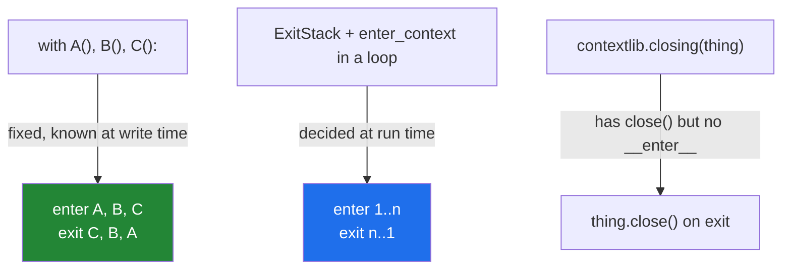

# 4.6 — A connection that always closes, and `ExitStack`

## One-line answer

Several resources on one `with` line are released in reverse order and released even if a later one
fails to open — and when the number is not known until run time, `contextlib.ExitStack` gives you the
same guarantee for a list you build as you go.

---

## The story

The shopping list is not one file any more. There is the list, the receipts, and the notes about what the
neighbours want, and a job that reconciles all three has to have all three open at once.

Opening them is easy. The awkward question is what happens when the second one will not open — the file
is missing, or somebody else has it. The first one is already open, and the code that closes it is at the
bottom, after the work that is not going to happen.

And it gets worse with a fourth file, and worse again when the number of files depends on how many
neighbours there are that week, so nobody can write the closing code in advance because nobody knows how
many closings there will be.

The arrangement that works is the one a person would use with actual paper: **keep a pile of what you
have opened, and when you leave, put back everything in the pile** — however many that turned out to be,
and in the opposite order to how you picked them up, so nothing is trapped underneath.

---

## The idea in plain language

For a **fixed, known** number of resources, `with` takes several, separated by commas:

```text
with open(a) as fa, open(b) as fb:
    ...
```

That is not a special feature — it is nested `with` blocks written on one line, so three things follow:

- They are entered **left to right**.
- They are exited **right to left**, which is what you want: the thing opened last is released first.
- If the second `open` fails, the first is still closed, because by then it is inside a block.

For a number **decided at run time** — one file per neighbour, one connection per shard — that syntax
cannot help, because you cannot write a `with` line whose length depends on a variable. Nesting in a loop
does not work either: a `with` inside a loop closes at the end of each iteration.

`contextlib.ExitStack` is the answer. It is itself a context manager, and it holds a stack of others:

```text
with contextlib.ExitStack() as stack:
    files = [stack.enter_context(open(p)) for p in paths]
    ...use all of them...
# every one closed here, in reverse order
```

`stack.enter_context(cm)` enters the context manager, returns whatever `__enter__` returned, and
**registers it to be exited when the stack exits** — however many you add, and whatever goes wrong in
between, including inside the loop that is still adding them.

Two more things it does, both worth knowing they exist:

- **`stack.callback(fn, *args)`** — register any plain function to be called on the way out, for cleanup
  that is not a context manager.
- **`stack.pop_all()`** — hand the registered cleanups to a new stack, which is how "clean up on failure,
  keep on success" is written: build everything inside the stack, and `pop_all()` at the end so the
  cleanups do not run.

And one small tool for the other common shape: **`contextlib.closing(thing)`** turns anything with a
`close()` method into a context manager, which is what you reach for when an older library gives you
`open()` and `close()` and no `with`
([4.2](4.2-try-finally-is-what-with-is.md)).

---

## Why Setu needs it

- **Day 226 opens Postgres and Mongo in the same job.** Two connections on one `with` line, released in
  reverse, both released if the second fails to open — and a free-tier connection limit that makes the
  leak matter.
- **[Day 13's `load_all`](../../../day-13-inheritance-and-abstraction/parts/04-abstraction/4.2-the-loader-family.md)
  takes a list of loaders whose length is decided by the caller.** Giving each one a file is exactly the
  run-time-length case.
- **Day 227's scraper writes one output per source**, and the set of sources comes from configuration.
- **Principle 11's blast radius.** A resource left open is a resource somebody else cannot have, and the
  failure surfaces somewhere unrelated ([4.1](4.1-with-the-block-that-cleans-up.md)).

---

## The mechanism

```python
"""A connection that always closes, and a stack of unknown length."""

import contextlib


class FakeConnection:
    """Stands in for a database connection. Four lines, no library."""

    def __init__(self, name):
        self.name = name
        self.closed = False

    def __enter__(self):
        print(f"  open  {self.name}")
        return self

    def __exit__(self, exc_type, exc_value, traceback):
        self.closed = True
        print(f"  close {self.name}")
        return False


print("nested with, two connections:")
with FakeConnection("postgres") as a, FakeConnection("mongo") as b:
    print("   using both")

print("one of them fails to be used:")
try:
    with FakeConnection("postgres") as a, FakeConnection("mongo") as b:
        raise RuntimeError("query blew up")
except RuntimeError:
    print("   both still closed:", a.closed and b.closed)

print("a stack whose size is not known until run time:")
names = ["papers.jsonl", "authors.jsonl", "venues.jsonl"]
with contextlib.ExitStack() as stack:
    conns = [stack.enter_context(FakeConnection(n)) for n in names]
    print("   holding", len(conns), "at once")
print("   all closed:", all(c.closed for c in conns))
```

Run on Python 3.12.12 on 2026-09-01:

```
nested with, two connections:
  open  postgres
  open  mongo
   using both
  close mongo
  close postgres
one of them fails to be used:
  open  postgres
  open  mongo
  close mongo
  close postgres
   both still closed: True
a stack whose size is not known until run time:
  open  papers.jsonl
  open  authors.jsonl
  open  venues.jsonl
   holding 3 at once
  close venues.jsonl
  close authors.jsonl
  close papers.jsonl
   all closed: True
```

**Line by line:**

- `FakeConnection` is a four-line stand-in with `__enter__` and `__exit__`
  ([4.3](4.3-enter-and-exit-by-hand.md)) — **no library and no network**, which is why this example runs
  offline (Principle 5) and is the same technique as
  [Day 13, 4.2](../../../day-13-inheritance-and-abstraction/parts/04-abstraction/4.2-the-loader-family.md)'s
  `RaisingReader`.
- `with A() as a, B() as b:` — **open postgres, open mongo, close mongo, close postgres.** Read the first
  block's output: entered left to right, exited right to left, which is the only order that is safe when
  the second depends on the first.
- The second block raises inside, and **both close lines still appear** before the caller's message.
  Reverse order, on the failure path, with no extra code.
- `both still closed: True` — `a` and `b` are still live names after the block
  ([4.1](4.1-with-the-block-that-cleans-up.md)), so the state can be checked.
- `with contextlib.ExitStack() as stack:` — the stack is itself a context manager, so it gets its own
  `with`, and everything registered on it exits when it does.
- `stack.enter_context(FakeConnection(n))` — **it enters and it registers**. The return value is what
  `__enter__` gave back, so it can be used exactly like `as` in a `with` line.
- The list comprehension builds three connections and holds three at once. **The number came from
  `names`**, which could have come from a file or a command line, and no `with` line could have been
  written for it.
- The three closes come out in reverse: `venues`, `authors`, `papers`.
- `all(c.closed for c in conns)` is `True` — and note that if the second `enter_context` had raised, the
  first would still have been closed by the stack, which is the property that makes this better than a
  loop of `open` calls with a `finally` at the end.

Reverse order, and where each form applies:



---

## When it breaks

**A `with` inside a loop, closing every iteration:**

```text
$ uv run python -c "
class Conn:
    def __init__(self, n): self.n, self.closed = n, False
    def __enter__(self):
        print('  open ', self.n)
        return self
    def __exit__(self, *exc):
        self.closed = True
        print('  close', self.n)
        return False

held = []
for n in ('a', 'b', 'c'):
    with Conn(n) as c:
        held.append(c)
print('all closed already:', all(c.closed for c in held))
"
  open  a
  close a
  open  b
  close b
  open  c
  close c
all closed already: True
```

**What it means.** Nothing is open at the end, because a `with` inside a loop closes at the end of **each
iteration**. That is correct behaviour and it is exactly wrong when you wanted all three open at once —
and the failure is not an error, it is a list of closed connections that raise `ValueError: I/O operation
on closed file` the moment you use them. `ExitStack` is the shape that keeps them open until the outer
block ends.

**A hand-rolled list of opens with one `finally`:**

```text
$ uv run python -c "
class Conn:
    def __init__(self, n):
        self.n, self.closed = n, False
        if n == 'b':
            raise RuntimeError('cannot open b')
    def close(self):
        self.closed = True
        print('  close', self.n)

conns = []
try:
    for n in ('a', 'b', 'c'):
        conns.append(Conn(n))
finally:
    for c in conns:
        c.close()
print('closed:', [c.n for c in conns])
"
Traceback (most recent call last):
  File "<string>", line 14, in <module>
  File "<string>", line 6, in __init__
RuntimeError: cannot open b
  close a
```

**What it means.** This one actually **works** — `a` was closed by the `finally` — and it works only
because the author remembered to append before anything could fail and to put the loop in a `finally`. It
is four more lines than `ExitStack`, it closes in the wrong order (`a` first, not last), and the version
where the append comes after some other setup leaks. `ExitStack` gets the ordering and the partial-failure
case right by construction.

**Forgetting `enter_context` and just calling the thing:**

```text
$ uv run python -c "
import contextlib

class Conn:
    def __init__(self, n): self.n, self.closed = n, False
    def __enter__(self):
        print('  open ', self.n)
        return self
    def __exit__(self, *exc):
        self.closed = True
        print('  close', self.n)
        return False

with contextlib.ExitStack() as stack:
    conns = [Conn(n) for n in ('a', 'b')]
    print('  in the block')
print('closed?', [c.closed for c in conns])
"
  in the block
closed? [False, False]
```

**What it means.** The stack was created and nothing was registered on it, so nothing was entered and
nothing was closed — **and there is no error**, because an empty `ExitStack` exits perfectly happily. The
`open` lines never printed, which is the clue, and in real code with a silent `__enter__` there would be
no clue at all. `stack.enter_context(...)` is the line that does the work; the `ExitStack` on its own does
nothing.

**`closing()` on something with no `close`:**

```text
$ uv run python -c "
import contextlib

class NoClose:
    pass

with contextlib.closing(NoClose()) as thing:
    print('  in the block')
"
  in the block
Traceback (most recent call last):
  File "<string>", line 8, in <module>
  File "...\Lib\contextlib.py", line 360, in __exit__
    self.thing.close()
AttributeError: 'NoClose' object has no attribute 'close'
```

**What it means.** `closing` does not check anything on the way in — it calls `.close()` on the way out
and finds there is none, **after the block has already run**. So the work happens and then the exit
fails, replacing whatever the block was doing ([4.2](4.2-try-finally-is-what-with-is.md)). It is a thin
wrapper by design; the check is your job, and the message names `contextlib.py` rather than your code.

---

## In production

**The professional habit is `ExitStack` wherever the count is not a literal**, and a comma-separated
`with` where it is. The rule of thumb is that if you are writing a `for` loop that opens things, you want
a stack — and if you are nesting more than two `with` blocks by hand, you want the comma form. Both are
about the same property: nothing that was successfully acquired is left behind, including when the
acquiring itself fails part way.

**What changes at scale is that the reverse order stops being a detail.** A connection wrapped in a
transaction wrapped in a span has to unwind outward: commit before closing the connection, end the span
after both, or the trace is wrong and the commit fails. `with` and `ExitStack` both guarantee that
ordering; hand-written cleanup does not, and the failure shows up as an intermittent error during
shutdown rather than as anything obviously ordering-related.

**The failure that only appears with real data is the partial acquisition.** Opening thirty files works
every time in testing and fails in production at file seventeen — a permission, a missing shard, a
connection limit reached — and what happens to the first sixteen is decided by which shape you used.
`ExitStack` closes them; a loop with a `finally` at the bottom usually does too, if it was written
carefully; a loop with the cleanup after the work does not, and leaks sixteen at a time on every retry.

**The review comment a senior engineer leaves.** *"This opens one file per shard in a loop with the
closes at the end, so a failure part way through the loop leaks every handle opened so far — and with the
retry above it, that is a leak per attempt. Use `ExitStack` and `enter_context`; it also fixes the close
ordering, which is currently first-opened-first-closed."*

**The interview question.** *"How do you manage several resources whose number you do not know in
advance?"* `contextlib.ExitStack` with `enter_context` is the answer, and what makes it a good one is
naming the two properties it buys: everything is released in reverse order, and everything acquired
before a mid-way failure is still released. Adding that `with A(), B():` is the fixed-count form and
compiles to nested blocks — so the second failing to open still closes the first — and that
`contextlib.closing` adapts an old `close()`-only object, covers the shape of the whole problem.

---

## Check yourself

```bash
uv run python -c "
import contextlib

class Conn:
    def __init__(self, n): self.n, self.closed = n, False
    def __enter__(self):
        print('  open ', self.n)
        return self
    def __exit__(self, *exc):
        self.closed = True
        print('  close', self.n)
        return False

with Conn('postgres') as a, Conn('mongo') as b:
    print('   both open')

with contextlib.ExitStack() as stack:
    conns = [stack.enter_context(Conn(n)) for n in ('one', 'two', 'three')]
    print('   holding', len(conns))
print('all closed:', all(c.closed for c in conns))
"
```

Both blocks close in reverse order. Now remove `stack.enter_context(...)` from the comprehension, leaving
just `Conn(n)`, and see how many `close` lines you get.

**Answer out loud, without scrolling up:**

> In what order does `with A(), B(), C():` release its three resources, and what happens if `B()` raises
> while opening? Then say what `ExitStack` gives you that a comma-separated `with` cannot.

---

**That is the last document of Day 16.** Back to the hub — [`../../LESSON.md`](../../LESSON.md) §4 — to
build `src/setu/jsonl.py` and `src/setu/paths.py`, and the tests in §5 that go red before either exists.
