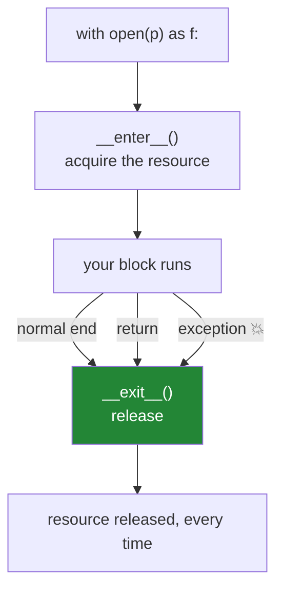

# Day 16 — Files, `pathlib`, buffering, and context managers

**Phase 2 · Module 2** · IDs: **PY-19** (file handling, buffered read/write), **PY-20** (context managers)

> **Yesterday:** properties and dunders — `Paper` now sorts, hashes and prints properly.
> **Today:** getting data in and out without corrupting it, and the `with` statement you have used
> since Day 1 without knowing how it works.
> **Tomorrow:** modules, packages and imports.

```bash
./m start 16 && ./m scaffold 16
```

**Time:** 100 minutes. **Request budget:** 0 model calls.

---

## §1 The story

Three file bugs cost people a day each, and all three are invisible until they are expensive.

**One: the un-closed file.** Write without closing and your data may sit in an OS buffer, unwritten,
when the process ends badly. The file exists. It is empty or truncated. `with` fixes this and it is
why every example in this repo uses it.

**Two: encoding.** `open(path)` with no `encoding=` uses whatever your *machine* defaults to. On your
Windows laptop that may be `cp1252`; in the Docker container on Day 236 it is UTF-8. The same code
reads the same file differently in two places, and a paper title containing `é` either mangles or
raises. **Always pass `encoding="utf-8"`.** This is not pedantry — it is the most common
works-on-my-machine bug in data work.

**Three: reading it all.** `f.read()` on a 2 GB corpus asks for 2 GB of RAM. Day 11's generators
exist for this, and today they meet real files.

Then the mechanism behind `with`. A **context manager** is any object with `__enter__` and
`__exit__`. `with X as y:` calls `X.__enter__()`, binds the result to `y`, runs the block, and calls
`X.__exit__()` **whether the block succeeded, returned early, or raised**.



That guarantee — *release on every path out* — is the whole point, and it generalises far beyond
files: database connections on Day 42, a timer, a temporary directory, a model's eval mode on
Day 135.

---

## §2 Setup — run this

```bash
mkdir -p days/day-16/lab
touch days/day-16/lab/files.py
touch src/setu/io.py
touch tests/test_io.py
```

`pathlib`, `json`, `csv`, `tempfile` and `contextlib` are standard library. No new packages.

---

## §3 PY-19 — `pathlib` and reading files properly

`days/day-16/lab/files.py`:

```python
"""PY-19 / PY-20: paths, encodings, buffering, and the with-statement protocol."""

from __future__ import annotations

import csv
import json
import tempfile
from pathlib import Path


def paths() -> None:
    p = Path("data") / "raw" / "papers.jsonl"
    print(f"\n{p=}")
    print(f"{p.name=} {p.stem=} {p.suffix=} {p.parent=}")
    print(f"{p.with_suffix('.json')=}")
    print(f"{p.parts=}")
    print(f"{Path('a/b/../c').resolve().name=}   <- resolve() normalises")

    tmp = Path(tempfile.mkdtemp())
    (tmp / "nested" / "deep").mkdir(parents=True, exist_ok=True)
    (tmp / "nested" / "a.txt").write_text("hi", encoding="utf-8")
    print(f"\n{sorted(x.name for x in tmp.rglob('*'))=}")
    print(f"{(tmp / 'nested' / 'a.txt').read_text(encoding='utf-8')=}")
    print(f"{(tmp / 'nope.txt').exists()=}")


def encoding_matters() -> None:
    tmp = Path(tempfile.mkdtemp()) / "accents.txt"
    tmp.write_text("Café Müller — naïve", encoding="utf-8")

    print(f"\nutf-8:  {tmp.read_text(encoding='utf-8')!r}")
    try:
        print(f"latin-1: {tmp.read_text(encoding='latin-1')!r}   <- mojibake, no error")
    except UnicodeDecodeError as exc:
        print(f"  decode error: {exc}")
    print("  Neither is a crash you can rely on. ALWAYS pass encoding='utf-8'.")


def modes_and_buffering() -> None:
    tmp = Path(tempfile.mkdtemp()) / "log.txt"

    with open(tmp, "w", encoding="utf-8") as f:
        f.write("first\n")
    with open(tmp, "a", encoding="utf-8") as f:      # append, do not truncate
        f.write("second\n")

    print(f"\n{tmp.read_text(encoding='utf-8')!r}")

    with open(tmp, encoding="utf-8") as f:
        print(f"{f.readline()!r}   <- one line, file position advanced")
        print(f"{f.read()!r}       <- the rest")

    with open(tmp, encoding="utf-8") as f:
        print(f"lazy iteration: {[line.rstrip() for line in f]}")


def structured_formats() -> None:
    tmp = Path(tempfile.mkdtemp())

    jsonl = tmp / "papers.jsonl"
    rows = [{"id": "p1", "title": "Attention"}, {"id": "p2", "title": "BERT"}]
    with open(jsonl, "w", encoding="utf-8") as f:
        for row in rows:
            f.write(json.dumps(row, ensure_ascii=False) + "\n")
    with open(jsonl, encoding="utf-8") as f:
        print(f"\njsonl round-trip: {[json.loads(line) for line in f]}")

    csv_path = tmp / "papers.csv"
    with open(csv_path, "w", encoding="utf-8", newline="") as f:
        writer = csv.DictWriter(f, fieldnames=["id", "title"])
        writer.writeheader()
        writer.writerows(rows)
    with open(csv_path, encoding="utf-8", newline="") as f:
        print(f"csv round-trip:   {list(csv.DictReader(f))}")
```

**Line by line:**

- `Path("data") / "raw" / "papers.jsonl"` — `/` joins path components (Day 1's `__truediv__`, now
  explained by Day 15's dunders). It produces the right separator on every OS.
- `p.stem` is the filename without the suffix; `p.name` includes it; `p.parts` is the tuple of
  components. `with_suffix` swaps the extension without string surgery.
- `.resolve()` — makes it absolute and normalises `..`. Do this before comparing two paths; two
  strings pointing at the same file are frequently unequal.
- `.mkdir(parents=True, exist_ok=True)` — create intermediates, do not raise if present. The same
  idempotence rule as Day 0's `mkdir -p` and Day 1's `ensure_dirs`.
- `.rglob("*")` — recursive glob, returning a generator of paths. Day 26's chained-assignment guard used it.
- `read_text` / `write_text` — open, do the thing, close, in one call. Perfect for small files;
  wrong for a 2 GB one, because it reads the whole thing.
- `read_text(encoding="latin-1")` on UTF-8 content — usually produces **mojibake without an
  exception**. That silence is why encoding bugs survive to production. Pass `encoding="utf-8"` at
  every single call site, including `write_text`.
- `open(tmp, "w")` truncates; `"a"` appends. Getting these backwards destroys a log file.
- `for line in f` — **lazy**: the file object is its own iterator (Day 11), reading a buffer at a time.
  `f.read()` is the eager version. Use the loop.
- `line.rstrip()` — the trailing `\n` is part of the line. Strip it or it rides along into your data.
- `json.dumps(row, ensure_ascii=False)` — without `ensure_ascii=False`, non-ASCII characters are
  escaped to `\uXXXX`. Valid, but unreadable in the file and larger on disk.
- **JSONL** — one JSON object per line. Streamable, appendable, and diffable, unlike one giant JSON
  array. It is the format Day 227's ingestion writes.
- `newline=""` on CSV — **required** by the `csv` module. Without it, Windows writes `\r\r\n` and you
  get a blank line between every row. This is the single most common CSV bug in Python.

---

## §4 PY-20 — writing a context manager

Add to the same file:

```python
import contextlib
import time


class Timer:
    """The protocol, written out by hand."""

    def __init__(self, label: str) -> None:
        self.label, self.elapsed = label, 0.0

    def __enter__(self) -> Timer:
        self._start = time.perf_counter()
        return self                      # this is what `as t` binds to

    def __exit__(self, exc_type, exc, tb) -> bool:
        self.elapsed = time.perf_counter() - self._start
        print(f"    {self.label}: {self.elapsed:.4f}s (error: {exc_type is not None})")
        return False                     # False = do NOT suppress the exception


@contextlib.contextmanager
def timer(label: str):
    """The same thing, as a generator. Everything before yield is __enter__."""
    start = time.perf_counter()
    try:
        yield
    finally:
        print(f"    {label}: {time.perf_counter() - start:.4f}s")


def context_managers() -> None:
    print()
    with Timer("class-based") as t:
        sum(range(100_000))
    print(f"    captured {t.elapsed:.4f}s after the block")

    with contextlib.suppress(ZeroDivisionError):
        1 / 0
    print("    suppress() swallowed it deliberately")

    try:
        with timer("failing block"):
            raise ValueError("boom")
    except ValueError:
        print("    ...timing still printed, exception still propagated")


if __name__ == "__main__":
    paths()
    encoding_matters()
    modes_and_buffering()
    structured_formats()
    context_managers()
```

**Line by line:**

- `__enter__` returns `self` — whatever it returns is what `as t` binds. Returning `self` lets you
  read `t.elapsed` after the block. Returning `None` (the default if you forget) makes `as t` bind
  `None`, which is a confusing five-minute bug.
- `__exit__(self, exc_type, exc, tb)` — three arguments describing the exception, all `None` if the
  block succeeded. **This runs on every exit path.**
- `return False` from `__exit__` — do not suppress. Returning **`True` swallows the exception**, which
  is almost never what you want and is a genuinely dangerous accident: a stray `return True` makes
  errors disappear silently.
- `@contextlib.contextmanager` — turns a generator into a context manager. Code before `yield` is
  `__enter__`; code after is `__exit__`; the value yielded is what `as` binds. Shorter than the class
  for anything without state to expose.
- `try: yield finally:` inside the generator — **the `finally` is mandatory.** Without it, an
  exception in the block skips your cleanup entirely, which defeats the purpose.
- `contextlib.suppress(ZeroDivisionError)` — a deliberate, narrow, readable "ignore this specific
  error". Better than a bare `try/except: pass` because you cannot accidentally widen it.

---

## §5 Build brief — `src/setu/io.py`

Day 227's ingestion writes through these.

```python
"""File I/O for Setu. Always UTF-8, always streaming, always atomic on write."""

from __future__ import annotations

import contextlib
from collections.abc import Iterable, Iterator
from pathlib import Path
from typing import Any

ENCODING = "utf-8"


def read_jsonl(path: Path) -> Iterator[dict[str, Any]]:
    """TODO(me): yield one parsed object per line, lazily.

    - UTF-8 explicitly
    - skip blank lines
    - a malformed line raises ValueError naming the LINE NUMBER (1-based)
    - must not read the whole file into memory
    """
    raise NotImplementedError


def write_jsonl(path: Path, rows: Iterable[dict[str, Any]]) -> int:
    """TODO(me): write one object per line, return the count.

    - create parent directories if needed
    - ensure_ascii=False
    - ATOMIC: write to path.with_suffix('.tmp'), then rename over the target.
      A crash mid-write must leave the original file untouched, never half-written.
    """
    raise NotImplementedError


@contextlib.contextmanager
def atomic_write(path: Path):
    """TODO(me): yield an open temp file; on clean exit rename it over `path`.

    On exception, delete the temp file and let the exception propagate.
    Do NOT return True from the cleanup.
    """
    raise NotImplementedError


def read_csv_rows(path: Path) -> Iterator[dict[str, str]]:
    """TODO(me): stream rows as dicts. Remember newline='' on open."""
    raise NotImplementedError
```

- **Atomic write** is today's real idea. `write → rename` is atomic on every mainstream filesystem, so
  a reader either sees the old file or the complete new one — never a half-written one. On Day 227
  you ingest for forty minutes; a crash at minute thirty-nine must not destroy the previous run.
- `read_jsonl` naming the line number: "invalid JSON" in a 500 000-line file is not an error message.
  "line 41 892" is.

---

## §6 The eval that must be able to fail

`tests/test_io.py`:

```python
import json

import pytest

from setu.io import atomic_write, read_csv_rows, read_jsonl, write_jsonl


def test_jsonl_round_trip(tmp_path):
    path = tmp_path / "a.jsonl"
    rows = [{"id": "p1", "title": "Café"}, {"id": "p2", "title": "BERT"}]
    assert write_jsonl(path, rows) == 2
    assert list(read_jsonl(path)) == rows


def test_write_jsonl_does_not_escape_non_ascii(tmp_path):
    path = tmp_path / "a.jsonl"
    write_jsonl(path, [{"t": "Café"}])
    assert "Café" in path.read_text(encoding="utf-8")


def test_write_jsonl_creates_parent_directories(tmp_path):
    path = tmp_path / "deep" / "nested" / "a.jsonl"
    write_jsonl(path, [{"a": 1}])
    assert path.exists()


def test_read_jsonl_skips_blank_lines(tmp_path):
    path = tmp_path / "a.jsonl"
    path.write_text('{"a": 1}\n\n{"a": 2}\n', encoding="utf-8")
    assert list(read_jsonl(path)) == [{"a": 1}, {"a": 2}]


def test_read_jsonl_reports_the_line_number(tmp_path):
    path = tmp_path / "a.jsonl"
    path.write_text('{"a": 1}\nnot json\n', encoding="utf-8")
    with pytest.raises(ValueError, match="2"):
        list(read_jsonl(path))


def test_read_jsonl_is_lazy(tmp_path):
    path = tmp_path / "big.jsonl"
    write_jsonl(path, ({"n": i} for i in range(50_000)))
    stream = read_jsonl(path)
    assert next(stream) == {"n": 0}


def test_atomic_write_leaves_no_temp_file(tmp_path):
    path = tmp_path / "a.txt"
    with atomic_write(path) as f:
        f.write("done")
    assert path.read_text(encoding="utf-8") == "done"
    assert list(tmp_path.iterdir()) == [path], "a temp file was left behind"


def test_atomic_write_preserves_the_original_on_failure(tmp_path):
    path = tmp_path / "a.txt"
    path.write_text("original", encoding="utf-8")
    with pytest.raises(RuntimeError):
        with atomic_write(path) as f:
            f.write("partial")
            raise RuntimeError("crash mid-write")
    assert path.read_text(encoding="utf-8") == "original", "the original was destroyed"
    assert list(tmp_path.iterdir()) == [path], "a temp file was left behind"


def test_atomic_write_does_not_suppress_the_exception(tmp_path):
    with pytest.raises(RuntimeError):
        with atomic_write(tmp_path / "a.txt"):
            raise RuntimeError("boom")


def test_write_jsonl_is_atomic(tmp_path):
    path = tmp_path / "a.jsonl"
    write_jsonl(path, [{"a": 1}])

    def exploding():
        yield {"a": 2}
        raise RuntimeError("crash")

    with pytest.raises(RuntimeError):
        write_jsonl(path, exploding())
    assert list(read_jsonl(path)) == [{"a": 1}], "a failed write clobbered the good file"


def test_csv_rows_round_trip(tmp_path):
    path = tmp_path / "a.csv"
    path.write_text("id,title\np1,Attention\np2,BERT\n", encoding="utf-8", newline="")
    assert [r["title"] for r in read_csv_rows(path)] == ["Attention", "BERT"]


def test_utf8_is_explicit_everywhere():
    from pathlib import Path as P

    source = P("src/setu/io.py").read_text(encoding="utf-8")
    assert "encoding" in source
    assert source.count("open(") <= source.count("encoding"), "an open() without encoding="
```

**Line by line:**

- `test_atomic_write_preserves_the_original_on_failure` — **the day's real assessment.** Three
  assertions: the exception propagated, the original survived intact, and no `.tmp` file was orphaned.
  A naive `open(path, "w")` implementation passes the round-trip test and fails this one with the
  original file destroyed — which is exactly the production incident it is modelling.
- `list(tmp_path.iterdir()) == [path]` — asserts the directory contains **only** the target. Litter is
  a bug; `.tmp` files that accumulate over 500 000 documents fill a disk.
- `test_write_jsonl_is_atomic` — the generator raises **mid-write**, after one row has been yielded.
  This is the realistic failure: not a bad argument, but a stream that dies halfway.
- `pytest.raises(ValueError, match="2")` — asserts the **line number** is in the message, not merely
  that something failed.
- `test_read_jsonl_is_lazy` — writes 50 000 rows and asserts the first arrives immediately. An
  implementation calling `f.readlines()` passes every content test and fails this.
- `test_utf8_is_explicit_everywhere` — a crude source-level guard, in the same family as Day 26's
  chained-assignment check. It will not catch everything; it catches the one you will actually type.

```bash
uv run python -m pytest tests/test_io.py -v
```

---

## §7 Request budget

| Resource | Spent today |
|---|---|
| LLM calls | **0** |

---

## §8 Traps

- **`open()` without `encoding=`.** Machine-dependent. Different in Docker on Day 236.
- **`csv` without `newline=""`.** Blank line between every row on Windows.
- **`f.read()` on a large file.** Iterate the file object instead.
- **Forgetting `line.rstrip()`.** The `\n` becomes part of your data.
- **Writing in place.** A crash leaves a half-file. Write to `.tmp`, then rename.
- **`return True` from `__exit__`.** Silently swallows every exception in the block.
- **A `@contextmanager` generator without `try/finally`.** Cleanup is skipped on error.
- **`"w"` when you meant `"a"`.** Truncates.
- **Comparing paths as strings.** `.resolve()` first.
- **`json.dump` without `ensure_ascii=False`.** Unreadable escapes, bigger files.

---

## §9 Verify before you code

Written **2026-08-21**:

- <https://docs.python.org/3/library/pathlib.html> — `Path` API surface.
- <https://docs.python.org/3/library/functions.html#open> — modes, `encoding`, `newline`, `buffering`.
- <https://docs.python.org/3/library/csv.html#id4> — the official note on why `newline=""` is required.
- <https://docs.python.org/3/library/contextlib.html> — `contextmanager`, `suppress`, `ExitStack`.

---

## §10 Say it in an interview

> "Every `open` in that codebase passes `encoding='utf-8'` explicitly, because the default is
> machine-dependent and the bug only shows up when the container's locale differs from the laptop's.
> Writes go through an atomic-write context manager — write to a temp file, then rename over the
> target — so a crash mid-ingestion leaves the previous good file untouched instead of a half-written
> one. There's a test that raises inside the `with` block and asserts three things: the exception
> propagated, the original file is intact, and no temp file was orphaned. And `__exit__` returns
> `False`; a stray `return True` there is how exceptions disappear."

---

## §11 Done when

Tick [`CHECKLIST.md`](CHECKLIST.md), then `./m check && ./m done 16`.
