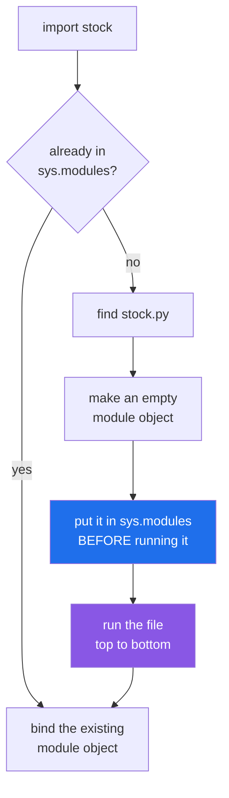

# 1.1 — A module is a file that has already run

## One-line answer

`import stock` does not "load the names in `stock.py`" — it **runs `stock.py` from top to bottom, once**,
and then hands you one object holding whatever names were left behind.

---

## The story

The shared kitchen keeps its recipes on cards in a binder.

Somebody wrote the card for stock. At the top: what goes in it. In the middle: how long to simmer it. And
at the bottom, in the same pen, on the same card: **"put a pot on now"**.

That last line made sense the evening it was written. They were about to make stock, and they wrote
themselves a reminder on the card they had in front of them.

But the card is in the binder now. So every time anybody opens the binder to look up how long stock
simmers — not to make it, just to check — they read "put a pot on now", and some of them do it.

The card has no way of telling the difference between *here is how this is done* and *do this now*. Both
are marks on the card, and reading the card means reading all of it.

That is the whole of this document. A file of Python is the card.

---

## The idea in plain language

You have been writing functions into files since
[Day 10, 3.1](../../../day-10-functions/parts/03-the-module/3.1-from-notebook-to-module.md), where the
word for a file of Python was introduced: a **module**. What that day did not say is what happens at the
moment another file asks for one.

Here is the sequence, in order:

1. Python finds the file. Where it looks is [2.1](../02-finding-it/2.1-sys-path.md); assume for now that
   it finds it.
2. Python **makes an empty module object** — a container with nothing in it yet — and puts it in a
   register of loaded modules under the name you asked for.
3. Python **executes the file, top to bottom**, exactly as if you had typed it in. Every line runs. A
   `def` runs, and its effect is to build a function and bind it to a name. An assignment runs. A `print`
   runs. A loop runs. A line that deletes a file deletes the file.
4. Whatever names exist when the last line finishes are the names the module object now carries.
5. The name `stock` is bound in *your* file, pointing at that module object.

Step 3 is the one that surprises people. There is no separate "definition mode". Python does not scan the
file for functions and skip the rest. **A module is a script that ran, and its contents are the
leftovers.**

Two consequences follow, and they are the two halves of the rest of this section.

**Anything at the outer level of the file happens on import.** Not when you call something. On import.
Reading a configuration file, opening a database connection, downloading a model, printing a banner — if
it is written at the left margin, it happens the moment somebody says `import`.

**It happens once.** The register in step 2 is checked first, so a second `import stock` in the same
program finds the module already there and does nothing at all. That is [1.3](1.3-sys-modules.md), and it
is why the module object is the same object every time.

One piece of vocabulary, because it appears in every error message from here on. The **outer level** of a
file — also called the *top level* or *module level* — means the lines that start at the left margin,
with no indentation. Those are the lines that run at import. Lines inside a `def` do not run at import;
they run when the function is called.

---

## Why Setu needs it

- **`src/setu/config.py` reads your `.env` file.** It was written on
  [Day 3](../../../day-03-keys-and-budget/parts/01-secrets/1.2-dotenv-and-os-environ.md), and it does
  that work at the outer level. Every module in this project that imports it therefore reads the disk,
  once, at import. Knowing that is the difference between "why is my test suite touching my home
  directory" being a mystery and being obvious.
- **From Day 172 this project has one model router.** If it builds its provider clients at the outer
  level, every test that imports anything downstream of it builds four clients, and `./m check` starts
  needing network. The fix is not clever; it is knowing that the outer level runs.
- **Day 233's eval suite imports every module in `src/setu/` to find its checks.** Any module that does
  real work at the outer level does that work once per suite run, in an order nobody chose.
- **Today's own build** — `src/setu/__init__.py`, in [3.3](../03-the-package/3.3-what-goes-in-init.md) —
  is a file whose entire job is to run at import. You cannot decide what belongs in it without first
  believing that it runs.

---

## The mechanism

Two files, side by side. This is the recipe card:

```python
"""Vegetable stock - one card in the binder."""

SIMMER_MINUTES = 45

print("[stock] the card is being read")


def make(litres):
    """Return the instruction, do not follow it."""
    return f"simmer {litres} litres for {SIMMER_MINUTES} minutes"


print("[stock] put a pot on now")
```

**Line by line:**

- `"""Vegetable stock - one card in the binder."""` — the docstring. It is an expression at the outer
  level, so it too runs; Python keeps its value as the module's `__doc__`.
- `SIMMER_MINUTES = 45` — an assignment at the outer level. It runs on import, and afterwards the module
  object carries the name `SIMMER_MINUTES`.
- `print("[stock] the card is being read")` — **this is the point of the file.** It is an ordinary
  statement at the outer level, so it runs on import, and there is nothing anywhere that suppresses it.
- `def make(litres):` — a statement, not a declaration. Running it builds a function object and binds it
  to the name `make`. The **body does not run**; only the `def` line does.
- `return f"simmer {litres} …"` — inside the function, so it runs when `make` is called and not before.
  This is the *only* kind of line in the file that does not run at import.
- `print("[stock] put a pot on now")` — the note-to-self from the story, and the reason this file is a
  trap. Nothing about its position after a `def` protects it.

And this is the file that opens the binder:

```python
"""Tomato soup, which needs stock."""

print("[soup] starting")

import stock

print("[soup] first import done")

import stock as stock_again

print("[soup] second import done, same object:", stock is stock_again)
print("[soup]", stock.make(2))
print("[soup] the card's own name:", stock.__name__)
print("[soup] my name:", __name__)
```

**Line by line:**

- `print("[soup] starting")` — printed **before** the import, so the run order below is readable rather
  than guessable.
- `import stock` — the five steps from above, all of them, right here. Everything `stock.py` prints is
  printed at this line, in the middle of `soup.py`'s own output.
- `import stock as stock_again` — the same module, asked for a second time under a second local name.
  Watch for what is *missing* from the output after this line.
- `stock is stock_again` — `is` asks whether these are the same object
  ([Day 4, 3.2](../../../day-04-objects/parts/03-identity-trap/3.2-is-versus-equals.md)), not whether
  they are equal. One import, one object, two names for it.
- `stock.make(2)` — reaching a name *through* the module object. `stock` is a plain object with
  attributes, and `.make` is an ordinary attribute lookup
  ([Day 12, 2.1](../../../day-12-classes/parts/02-attribute-lookup/2.1-the-instance-dict.md)).
- `stock.__name__` — every module knows the name it was loaded under. This matters more than it looks,
  and [1.4](1.4-the-name-that-changes.md) is entirely about it.
- `__name__` on its own — the name of the file **you are in**. Run directly, it is not `soup`.

Run on Python 3.12.12 on 2026-09-02:

```
[soup] starting
[stock] the card is being read
[stock] put a pot on now
[soup] first import done
[soup] second import done, same object: True
[soup] simmer 2 litres for 45 minutes
[soup] the card's own name: stock
[soup] my name: __main__
```

Four things to read off that output, in order:

- **`stock.py`'s two prints appear in the middle of `soup.py`'s output**, between "starting" and "first
  import done". The import is not a lookup; it is a detour into another file.
- **They appear once.** The second `import` printed nothing, because the module was already in the
  register.
- **`same object: True`.** Two names, one module.
- **`stock` and `__main__`.** The imported file knows itself as `stock`; the file you launched knows
  itself as `__main__`. That is [1.4](1.4-the-name-that-changes.md).

What the import statement actually does:



The blue box comes before the purple one on purpose, and that ordering is the whole explanation of
circular imports in [4.2](../04-the-project/4.2-the-circular-import.md). The module goes into the
register *empty*, and only then is it filled in.

---

## When it breaks

**A module that does real work at the outer level fails at the import line.** Here is `oven.py`, three
lines long:

```python
"""Reads the oven settings when the card is opened."""

with open("oven-settings.txt", encoding="utf-8") as f:
    TEMPERATURE = int(f.read())
```

**Line by line:**

- `with open("oven-settings.txt", …)` at the **left margin** — the whole problem. It is not inside a
  function, so it is not something `oven.py` offers to do; it is something `oven.py` does.
- `encoding="utf-8"` — correct, and irrelevant here
  ([Day 16, 2.2](../../../day-16-files-and-context-managers/parts/02-reading-and-writing/2.2-encoding.md)).
  The file is missing, so nothing gets as far as decoding.
- `TEMPERATURE = int(f.read())` — the name the importer wants. To reach it, the importer must survive the
  two lines above it.

And `bake.py` is one import and one print:

```text
$ uv run python bake.py
Traceback (most recent call last):
  File "...\bake.py", line 1, in <module>
    import oven
  File "...\oven.py", line 3, in <module>
    with open("oven-settings.txt", encoding="utf-8") as f:
         ^^^^^^^^^^^^^^^^^^^^^^^^^^^^^^^^^^^^^^^^^^^
FileNotFoundError: [Errno 2] No such file or directory: 'oven-settings.txt'
```

**What it means.** Read the traceback from the bottom up and it is honest, but the shape is unusual: two
`in <module>` frames stacked, one for the file you ran and one for the file it imported. `bake.py` line 1
did nothing wrong. It asked for `oven`, and asking ran `oven.py`, and `oven.py` reads a file relative to
the working directory
([Day 16, 1.3](../../../day-16-files-and-context-managers/parts/01-the-path/1.3-relative-absolute-and-the-cwd.md)),
which is wherever you happened to be standing. **The smallest fix is to move the work inside a function**,
so that importing costs nothing and the caller decides when to pay:

```python
"""Reads the oven settings when somebody asks for them."""

from pathlib import Path

SETTINGS = Path(__file__).with_name("oven-settings.txt")


def temperature() -> int:
    """Read the setting now, on purpose, at a moment the caller chose."""
    return int(SETTINGS.read_text(encoding="utf-8"))
```

**Line by line:**

- `SETTINGS = Path(__file__).with_name(...)` — still at the outer level, and that is fine: building a
  `Path` touches no disk. The rule is not "nothing at the outer level"; it is "no *work* at the outer
  level".
- `Path(__file__)` — the module's own file, so the settings are found beside the code instead of beside
  whoever launched the program
  ([Day 16, 1.3](../../../day-16-files-and-context-managers/parts/01-the-path/1.3-relative-absolute-and-the-cwd.md)).
- `def temperature() -> int:` — the read is now inside a function. Importing `oven` is free; calling
  `oven.temperature()` is when the disk is touched, and the traceback then points at the caller who chose
  to touch it.

**The import that succeeded and did something you did not ask for:**

```text
$ uv run python -c "import stock; print('I only wanted the number:', stock.SIMMER_MINUTES)"
[stock] the card is being read
[stock] put a pot on now
I only wanted the number: 45
```

**What it means.** Nothing raised. There is no error to search for. The program printed two lines it was
never asked to print, and in a real module those two lines are a network call, a log file created in the
current directory, or a plotting backend chosen for the whole process. **This is the failure mode that
matters**, precisely because it is not a failure — it is a module having effects on a program that only
wanted one number out of it.

**The import that is slow, with nothing to point at:**

```text
$ uv run python -X importtime -c "import json" 2>&1 | tail -3
import time:       672 |       5616 |   json.decoder
import time:       549 |        549 |   json.encoder
import time:       539 |       6703 | json
```

**What it means.** `-X importtime` prints what every import cost in microseconds — `self` in the first
column, `cumulative` in the second, and the indentation showing what imported what. This is the tool for
the day a test suite takes ten seconds to collect and nobody knows why. The answer is nearly always one
module doing work at its outer level, and this flag names it instead of you guessing.

---

## In production

**The professional habit is that importing a module must be free.** A module may define classes,
functions and constants, and may compute cheap things from other constants. It may not open sockets, read
files, create directories, configure logging for the whole process, or start threads. This is not
fussiness — it is what makes a module safe to import from a test, from a documentation build, from a
worker that needs one helper out of it, and from a tool that imports every module in a package to
discover what is in there.

**The scale at which this stops being a style question is the moment there is more than one entry
point.** With one script, outer-level setup is indistinguishable from a program that works. Add a test
suite, a scheduled job and a web process, and that setup now runs three times in three environments in an
order nobody chose. The failures take the form "the tests pass locally and the container exits at
start-up with a traceback in a file nobody edited". The standard shape is the opposite: modules define,
and one small entry point at the edge of the system does the work, in an order it controls.

**The failure that only appears with real data is import-time configuration freezing a stale value.** A
module that writes `TIMEOUT = int(os.environ["TIMEOUT"])` at the outer level fixes that value at the
moment the module was first imported which — because of the register in [1.3](1.3-sys-modules.md) — may
be long before your code ran, and in a test may be before the fixture that sets the variable. The symptom
is a setting that "does not take effect", and the cause is that it did take effect, once, earlier than
you thought. Reading it inside a function costs one dictionary lookup and removes the entire class of
bug.

**The review comment a senior engineer leaves.** *"This module builds an HTTP client at the outer level.
That means every test that imports anything from this package opens a connection pool, and the
constructor runs before our fixtures can set the base URL. Move it into a `client()` function, or behind
`functools.cache` if you want one per process
([Day 14, 4.2](../../../day-14-decorators/parts/04-the-toolkit/4.2-functools-cache-and-its-trap.md)) —
either way, not at the left margin."*

**The interview question.** *"What actually happens when you write `import x`?"* The recited answer is
"it makes the names in `x` available". The used answer is: Python checks a register of already-loaded
modules; if it is not there, it locates the file, creates an empty module object, **inserts it into the
register before executing it**, then runs the file top to bottom — so every outer-level line in it,
including the ones with side effects, happens at that moment, once per process. The follow-up is usually
"so what goes wrong?", and the answer is import-time side effects and, if you mentioned that the module
is registered *before* it is executed, circular imports
([4.2](../04-the-project/4.2-the-circular-import.md)).

---

## Check yourself

```bash
uv run python -c "
from pathlib import Path
Path('stock.py').write_text('SIMMER_MINUTES = 45\nprint(\"[stock] put a pot on now\")\n')
print('before')
import stock
print('after, and the number is', stock.SIMMER_MINUTES)
import stock
print('asked again - nothing printed between these two lines')
Path('stock.py').unlink()
"
```

The `[stock]` line appears once, in the middle. Now put the `print` inside a `def` and run it again.

**Answer out loud, without scrolling up:**

> A file has a `def` in it and a `print` in it, both at the left margin. Which one of them happens when
> somebody imports the file, and why is the answer "both"?

---

**Next:** [1.2 — the four import forms, and what name each one leaves behind](1.2-the-four-import-forms.md).
