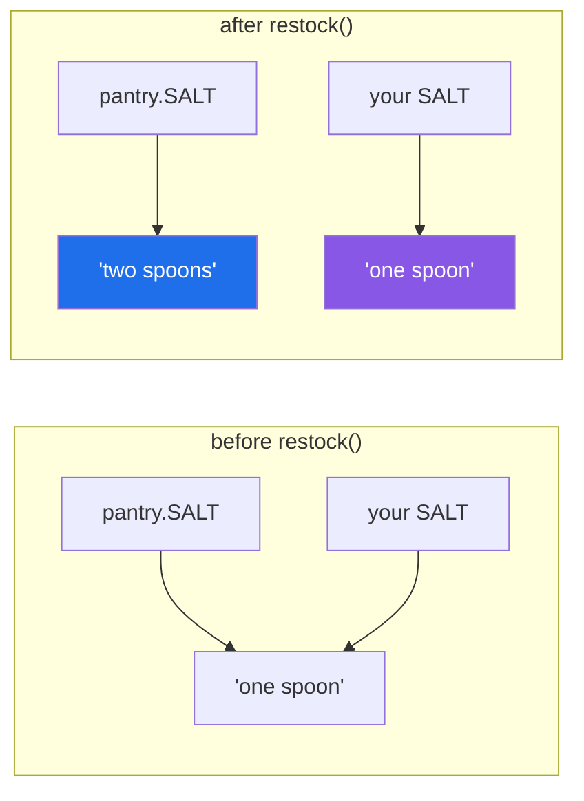

# 1.2 — The four import forms, and what name each one leaves behind

## One-line answer

All four forms run the module exactly once; they differ only in **which names end up in your file** —
and `from x import y` copies the binding, so it stops tracking `x.y` the moment `x` changes it.

---

## The story

Two people share the binder, and they fetch recipes differently.

The first one carries the whole binder to the counter. When she needs the simmering time she opens it and
reads it off the page. If somebody corrects the page while she is cooking, she sees the correction the
next time she looks.

The second one does not like carrying the binder. He goes to the shelf, opens it once, **writes the
simmering time on a sticky note**, brings the note back to the counter, and puts the binder away.

Both of them get the same number off the page: 45. Both of them are right.

Then somebody works out that the stock is better simmered for less time, and corrects the page to
say 30.

The woman with the binder looks again and sees 30. The man with the sticky note is still cooking to 45,
and he has no way of finding out, because his note is not connected to the binder any more. It never was.
It was a copy, made at one moment, of what the page said at that moment.

Nobody did anything wrong. They fetched the same thing two different ways, and only one of those ways
stays in touch with the page.

---

## The idea in plain language

There are four ways to write an import, and every one of them does the same work under the hood — the
run-the-file-once from [1.1](1.1-a-module-is-a-file-that-has-already-run.md). What they differ in is the
**name they leave behind in your file**.

| Form | The name you get | What it points at |
|---|---|---|
| `import stock` | `stock` | the module object |
| `import stock as broth` | `broth` | the same module object |
| `from stock import make` | `make` | the function itself |
| `from stock import *` | every public name | each of those objects |

The first two are the binder. You keep a reference to the module, and every time you write `stock.make`
you look the name up *on the module*, right then. If the module changes what `make` means, your next
lookup sees the change.

The last two are the sticky note. `from stock import make` runs `stock.py`, then does one lookup of
`make` on the finished module, then binds that object to a name in your file. **After that instant there
is no link.** Your name and the module's name happen to point at the same object; they are not the same
name.

For a function that never changes, that difference does not matter, which is why this is a surprise
rather than a daily annoyance. It matters when the thing you imported is a value the module reassigns —
a counter, a cached client, a flag, a configuration value that a test wants to patch.

**`from x import *` deserves its own paragraph, because it is the one to avoid.** It takes every name from
the module that does not begin with an underscore and binds all of them in your file. Two things follow.
Nobody reading your file can tell where a name came from, including the editor and the linter — this is
why `ruff` reports `F403` on it. And a second star import silently overwrites names from the first, with
no warning at all; the failure below is exactly that.

A module can state its own public surface by setting `__all__`, a list of strings. When `__all__` exists,
`from x import *` takes those names and nothing else. It changes nothing about the other three forms —
`from x import _private` still works fine — so `__all__` is documentation with one small piece of teeth,
not a lock. It matters most in a package's `__init__.py`, which is [3.3](../03-the-package/3.3-what-goes-in-init.md).

One more piece of vocabulary. **Binding** a name means making a name in some scope point at an object; it
is the word Day 10 used for what `=` does
([Day 10, 2.1](../../../day-10-functions/parts/02-scope/2.1-legb-where-a-name-is-found.md)). Every import
form is, in the end, an assignment. That is why the sticky note behaves the way it does: `from stock
import make` is `make = stock.make` with extra steps.

---

## Why Setu needs it

- **The router built on Day 172 rebinds its client** when a provider is rate-limited and it fails over.
  A module that did `from router import client` at its outer level holds the first client for the life of
  the process and never fails over — the sticky note, exactly.
- **Every test that patches something patches it on the module.** `monkeypatch.setattr("setu.config.MODEL",
  "fake")` changes `setu.config`'s name. Code that did `from setu.config import MODEL` is unaffected by
  that patch and keeps the old value, which is the single most common reason a mock "does not work". Day
  233's eval suite is built on patching, so this is not a corner case there.
- **`src/setu/__init__.py`** — today's build, in [3.3](../03-the-package/3.3-what-goes-in-init.md) —
  chooses a public surface with exactly these forms, and states it in `__all__`.
- **`from numpy import *` is the reason Day 20 opens the way it does.** Star-importing two numerical
  libraries into one notebook gives you a `sum` and an `array` from whichever one you imported last, and
  no error anywhere.

---

## The mechanism

All four forms, in one file, against the `stock.py` from [1.1](1.1-a-module-is-a-file-that-has-already-run.md):

```python
"""The four import forms, and what name each one leaves behind."""

import stock
import stock as broth
from stock import SIMMER_MINUTES, make
from stock import *  # noqa: F403

print("1 import stock            ->", stock.SIMMER_MINUTES)
print("2 import stock as broth   ->", broth.SIMMER_MINUTES)
print("3 from stock import make  ->", make(1))
print("4 from stock import *     ->", SIMMER_MINUTES)
print()
print("stock is broth            :", stock is broth)
print("make is stock.make        :", make is stock.make)
print("is 'stock' a local name?  :", "stock" in dir())
```

**Line by line:**

- `import stock` — binds one name, `stock`, to the module object. Nothing else from the file becomes
  visible here; `SIMMER_MINUTES` on its own would be a `NameError`.
- `import stock as broth` — the same module, a second local name. **This does not import twice**; the
  register in [1.3](1.3-sys-modules.md) sees to that, and the missing `[stock]` lines in the output below
  are the proof.
- `from stock import SIMMER_MINUTES, make` — two lookups on the finished module, two bindings in this
  file. `stock` itself is *not* bound by this line.
- `from stock import *  # noqa: F403` — the star form. The comment silences `ruff`'s `F403`, which is
  telling the truth: it cannot see what this line defines. **The `noqa` is here so the demonstration
  runs; it is not a pattern to copy.**
- `stock is broth` — one module object, two names, so `True`.
- `make is stock.make` — also `True`, and this is the point people miss: the sticky note starts out
  pointing at the same object. It is only when the module **rebinds** its own name that the two part
  company.
- `"stock" in dir()` — `dir()` with no argument lists the names in the current scope, so this asks "did
  any of those lines leave the name `stock` behind here". It did, from line one.

Run on Python 3.12.12 on 2026-09-02:

```
[stock] the card is being read
[stock] put a pot on now
1 import stock            -> 45
2 import stock as broth   -> 45
3 from stock import make  -> simmer 1 litres for 45 minutes
4 from stock import *     -> 45

stock is broth            : True
make is stock.make        : True
is 'stock' a local name?  : True
```

**`stock.py` printed once**, at the very top, even though four import statements mention it.

Now the sticky note, on its own. Two files:

```python
"""What is in the pantry today."""

SALT = "one spoon"


def restock():
    global SALT
    SALT = "two spoons"
```

**Line by line:**

- `SALT = "one spoon"` — a module-level name bound to a string. Strings are immutable
  ([Day 7, 1.1](../../../day-07-strings/parts/01-text/1.1-a-string-is-code-points.md)), so the only way to
  change what `SALT` means is to rebind it.
- `global SALT` — says that the assignment below rebinds the *module's* `SALT` rather than making a local
  one ([Day 10, 2.3](../../../day-10-functions/parts/02-scope/2.3-global-and-nonlocal.md)). Without it
  `restock` would change nothing at all, which is a different bug in the same neighbourhood.
- `SALT = "two spoons"` — the rebinding. **The module's name now points somewhere new.** Nothing that
  copied the old binding hears about it.

```python
import pantry
from pantry import SALT

print("before restock  module:", pantry.SALT, "| imported name:", SALT)
pantry.restock()
print("after  restock  module:", pantry.SALT, "| imported name:", SALT)
```

**Line by line:**

- `import pantry` — the binder. `pantry.SALT` is looked up on the module at the moment it is written.
- `from pantry import SALT` — the sticky note. One lookup, now, and a local name that will never be
  looked up on the module again.
- `pantry.restock()` — rebinds `SALT` inside `pantry`. Note that we call it *through the module*, which
  is the form that keeps working.
- The two prints are identical apart from when they run, so any difference between them is caused by
  `restock` and nothing else.

Run on Python 3.12.12 on 2026-09-02:

```
before restock  module: one spoon | imported name: one spoon
after  restock  module: two spoons | imported name: one spoon
```

**The two names agreed until the module changed its own, and then they did not.** No error, no warning,
and both values are perfectly reasonable-looking strings.

Why they part company:



Nothing moved. `restock` pointed the module's arrow somewhere new, and your arrow was never attached to
the module's arrow — only to the same target.

---

## When it breaks

**The name is not in the module:**

```text
$ uv run python -c "from stock import SIMMER_HOURS"
[stock] the card is being read
[stock] put a pot on now
Traceback (most recent call last):
  File "<string>", line 1, in <module>
ImportError: cannot import name 'SIMMER_HOURS' from 'stock' (...\stock.py)
```

**What it means.** `ImportError`, not `ModuleNotFoundError`
([2.2](../02-finding-it/2.2-modulenotfounderror.md) draws that line clearly). The module was found and
run — its two prints are right there, *above* the traceback, which tells you the failure came after the
file executed. Only then did the lookup of `SIMMER_HOURS` fail. The parenthesised path is the file Python
actually used, and it is worth reading: on the day this error is confusing, it is usually because the
path is not the file you have open.

**Two star imports, and the one that quietly won:**

```text
$ uv run python -c "
from stock import *
from salt import *
print(make(2))
"
[stock] the card is being read
[stock] put a pot on now
a pinch of salt for 2
```

Where `salt.py` also defines a `make`:

```python
def make(x):
    return f"a pinch of salt for {x}"
```

**Line by line:**

- `def make(x)` — the same name as `stock.make`, which is entirely legal and, in two unrelated modules,
  entirely likely. `make`, `load`, `run`, `parse`, `config` and `main` collide constantly.
- `return f"a pinch of salt for {x}"` — different behaviour, same call signature, so nothing downstream
  raises.

**What it means. There is no error, and that is the failure.** The second star import rebound `make`, so
the call went to the salt module. Had `salt.make` taken different arguments you would get a `TypeError`
somewhere far away; because it takes one argument, you get a wrong answer instead. Swap the order of the
two lines and the program's behaviour changes, with nothing in the file to suggest that the order matters.
`ruff` flags this as `F405` — "may be undefined, or defined from star imports" — and the smallest fix is
to name what you want: `from stock import make as make_stock`.

**A star import where it is not allowed:**

```text
$ uv run python -c "
def f():
    from stock import *
"
  File "<string>", line 3
SyntaxError: import * only allowed at module level
```

**What it means.** A `SyntaxError`, raised before anything ran. Inside a function Python decides at
compile time which names are local
([Day 10, 2.2](../../../day-10-functions/parts/02-scope/2.2-unboundlocalerror.md)), and a star import
adds names it cannot know about until run time, so the two are incompatible. The error is unusually
honest: this form is only allowed at the outer level, and the reason is that the outer level's names are
looked up in a dictionary at run time rather than fixed in advance.

**`__all__` narrowing the star, and the underscore that was already hidden:**

```text
$ uv run python -c "
from herbs import *
print('basil  :', basil)
print('oregano is here?', 'oregano' in dir())
print('_bay is here?   ', '_bay' in dir())
"
basil  : sweet
oregano is here? False
_bay is here?    False
```

Where `herbs.py` is:

```python
"""Herbs, with a stated public surface."""

__all__ = ["basil"]

basil = "sweet"
_bay = "private"
oregano = "dried"
```

**Line by line:**

- `__all__ = ["basil"]` — a list of **strings**, not of objects. A common slip is writing `[basil]`, which
  is a list containing the string `"sweet"` and produces a confusing failure at the star import.
- `basil = "sweet"` — in `__all__`, so the star brings it.
- `_bay = "private"` — the leading underscore already excludes it from a star import, with or without
  `__all__`; it is the convention introduced on
  [Day 13, 3.1](../../../day-13-inheritance-and-abstraction/parts/03-encapsulation/3.1-public-protected-private.md).
- `oregano = "dried"` — public by name, but **not listed**, so the star skips it. Remove `__all__` and
  `oregano` comes back while `_bay` still does not.

**What it means.** `__all__` is the module saying "this is what I offer". It is worth setting on anything
other people import, and it is the one place where a star import is defensible — a package's
`__init__.py` re-exporting a surface it controls.

---

## In production

**The professional default is `import x` or `from x import y`, chosen deliberately, and never `import *`
in a file that is committed.** The reasoning is not aesthetic. A reader — or a linter, or an editor's
jump-to-definition, or the person doing a security review — must be able to answer "where did this name
come from" from the file in front of them. A star import makes that question unanswerable without running
the program.

**The rule that decides between the two good forms, at scale, is what the name is.** Import the *module*
for anything that might be patched, replaced, or reassigned — configuration, clients, counters, module
state — so that every use is a fresh lookup. Import the *name* for things that are stable and used often:
classes, exception types, pure functions. And import the module when the bare name would be ambiguous:
`config.load`, `json.load` and `yaml.load` all read fine at the call site; three bare `load`s do not.

**The failure that only appears with real data is the patch that does not take.** A test sets
`setu.config.MODEL` to a fake and the code under test keeps calling the real provider, because that code
did `from setu.config import MODEL` at its outer level and holds the value from process start. The test
passes locally, where the real value happens to be harmless, and burns free-tier quota in CI. `unittest.mock`
documents this as "patch where it is used, not where it is defined", and the underlying reason is this
document: the importing module has its own binding.

**The review comment a senior engineer leaves.** *"`from .settings import TIMEOUT` at the top of this
module freezes the value at import time, so the override in `conftest.py` will not be seen. Import the
module and read `settings.TIMEOUT` at the point of use — one extra attribute lookup, and the test can
actually control it."*

**The interview question.** *"What is the difference between `import os` and `from os import path`?"* The
weak answer is "one is shorter". The used answer is that both run the module once, but the first binds
the module — so every use is a lookup on it, and later changes are visible — while the second binds the
object once, at import, and never consults the module again. Then the consequence, which is the part they
are actually asking about: that is why you patch `module.name` and why code doing `from module import
name` is immune to the patch.

---

## Check yourself

```bash
uv run python -c "
from pathlib import Path
Path('pantry.py').write_text(
    'SALT = \"one spoon\"\n\n\ndef restock():\n    global SALT\n    SALT = \"two spoons\"\n'
)
import pantry
from pantry import SALT
print('before:', pantry.SALT, '|', SALT)
pantry.restock()
print('after :', pantry.SALT, '|', SALT)
Path('pantry.py').unlink()
"
```

The left value changes and the right one does not. Now change the last print to read `pantry.SALT` twice
and watch both change.

**Answer out loud, without scrolling up:**

> You wrote `from config import TIMEOUT` at the top of your module. A test patches `config.TIMEOUT`. Does
> your module see the new value, and why?

---

**Next:** [1.3 — `sys.modules`, and the import that only happened once](1.3-sys-modules.md).
