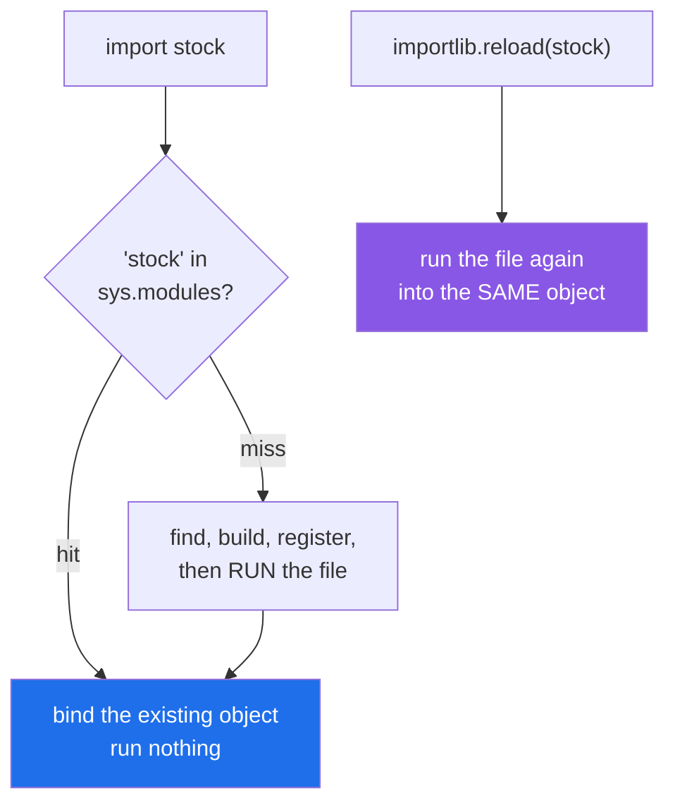

# 1.3 — `sys.modules`, and the import that only happened once

## One-line answer

Python keeps one dictionary of every module it has already loaded, checks it before every import, and
never runs the same file twice — which is why editing a file changes nothing in a program that is already
running.

---

## The story

The binder has a contents page at the front, and somebody added a rule that has saved a lot of walking:
**before you go and fetch a card, look at the contents page**. If the card is already out on the counter,
use the one on the counter.

It works. Nobody fetches the same card twice in an evening, and everybody is looking at the same piece of
paper, so a note written on it is seen by everyone.

Then somebody goes to the shelf and corrects the master copy of the stock card. Thirty minutes, not
forty-five.

And nothing happens. The card on the counter still says forty-five, and it will say forty-five all
evening, because the rule is working exactly as designed: nobody goes to the shelf for a card that is
already on the counter.

The correction is real. It is simply not where anybody is looking.

---

## The idea in plain language

The register from step 2 of [1.1](1.1-a-module-is-a-file-that-has-already-run.md) has a name and an
address: it is a dictionary called `sys.modules`, its keys are module names as strings, and its values
are module objects.

Every import statement starts by looking in it. On a hit, the import is finished — the existing module
object is bound to your name and the file is not touched. On a miss, Python does the finding, the
building and the running from [1.1](1.1-a-module-is-a-file-that-has-already-run.md), and puts the result
in the dictionary so the next import hits.

Three things follow, and each one explains something that otherwise looks like magic.

**A module is a singleton for the life of the process.** There is one `setu.config` object, and everyone
who imports it gets that one. Module-level state is therefore shared state: a counter defined at the
outer level of a module is one counter, shared by every module that imports it, whether or not anybody
intended that.

**Editing a file does not affect a running program.** This is why a notebook keeps giving you the old
answer after you have fixed the bug in the module and saved it
([Day 0, 1.5](../../../day-00-setup/parts/01-toolchain/1.5-the-editor-and-the-interpreter-trap.md) was
about a related confusion). Re-running the cell with the `import` in it does nothing at all, because the
import hits the cache. Restarting the kernel works because it throws the whole dictionary away.

**The register is filled in before the file runs, not after.** That ordering is what allows circular
imports to half-work, and it is the entire content of
[4.2](../04-the-project/4.2-the-circular-import.md). Hold on to it.

There is a tool that seems to solve the second point and mostly does not: `importlib.reload(module)`. It
re-runs the file into the *same* module object, so anything reached *through* the module sees the new
code. But every name that was copied out — the sticky notes of
[1.2](1.2-the-four-import-forms.md) — still points at the old object, and every instance built from the
old class still has the old class. You end up with two versions of the same class in one process, which
compare unequal and fail `isinstance` checks against each other. `reload` is a debugging convenience, not
a deployment mechanism, and the honest answer to "my edit did not take" is almost always to restart the
process.

---

## Why Setu needs it

- **Restarting the kernel is the fix, and now you know why.** From Day 20 onward every notebook imports
  from `src/setu/`, edits it, and re-runs. Understanding the cache turns "sometimes I have to restart"
  into a rule you can state.
- **Day 172's router keeps its rate-limit counters at module level.** They are shared across the whole
  process precisely because of this dictionary, and that is the design, not an accident — one process,
  one budget (Principle 5).
- **`pytest` imports your modules once per session.** A test that mutates module-level state changes it
  for every test that runs afterwards, in file order. When a test suite passes alone and fails in the
  full run, this dictionary is where to look first.
- **Day 233's eval suite discovers checks by importing modules by name**, using `importlib.import_module`,
  which is the function form of the `import` statement and consults the same dictionary.

---

## The mechanism

```python
"""The import that only happened once."""

import importlib
import sys

print("1 is stock loaded yet?   :", "stock" in sys.modules)

import stock

print("2 is stock loaded now?   :", "stock" in sys.modules)
print("3 what is in the register:", sys.modules["stock"])

import stock

print("4 imported a second time - nothing printed above this line")

stock.SIMMER_MINUTES = 5
import stock

print("5 my edit survived       :", stock.SIMMER_MINUTES)

importlib.reload(stock)
print("6 after reload           :", stock.SIMMER_MINUTES)
```

**Line by line:**

- `import sys` — `sys.modules` is the register itself, not a copy of it. You can read it, and you can
  break the interpreter by writing to it.
- `"stock" in sys.modules` **before** any import of `stock` — a plain dictionary membership test, and the
  answer is `False`, which is what makes the next line's `True` mean something.
- `import stock` — the miss. The file runs here, and `stock.py`'s prints appear at this point in the
  output.
- `sys.modules["stock"]` — printing a module shows its name and the file it came from. **When an import
  is behaving strangely, print this**; it names the file Python actually used, which is not always the
  file you are editing ([2.3](../02-finding-it/2.3-shadowing-the-standard-library.md)).
- the second `import stock` — the hit. It binds the same object again and runs nothing, which the missing
  `[stock]` lines in the output prove.
- `stock.SIMMER_MINUTES = 5` — writing to the module object. This is legal; a module is a mutable object
  like any other.
- the third `import stock` — still a hit, so **the edit survives it**. This is the line that surprises
  people: an import cannot "reset" a module.
- `importlib.reload(stock)` — re-runs `stock.py` into the same module object, so `SIMMER_MINUTES` goes
  back to what the file says. Note it prints `[stock]`'s two lines again — the file really does run a
  second time.

Run on Python 3.12.12 on 2026-09-02:

```
1 is stock loaded yet?   : False
[stock] the card is being read
[stock] put a pot on now
2 is stock loaded now?   : True
3 what is in the register: <module 'stock' from '...\d17\stock.py'>
4 imported a second time - nothing printed above this line
5 my edit survived       : 5
[stock] the card is being read
[stock] put a pot on now
6 after reload           : 45
```

Read the `[stock]` pairs: they appear **twice** in a program with four `import stock` statements and one
`reload`. Imports do not run files; cache misses do.

The check every import starts with:



---

## When it breaks

**`reload` updated the module and left your references behind:**

```text
$ uv run python -c "
import importlib
from pathlib import Path

import card

old_instance = card.Card()
OldCard = card.Card
print('1 before edit          :', old_instance.read())

Path('card.py').write_text('class Card:\n    def read(self):\n        return \"version two\"\n')

importlib.reload(card)
print('2 new instance         :', card.Card().read())
print('3 the instance I kept  :', old_instance.read())
print('4 the class I kept     :', OldCard().read())
print('5 same class object?   :', OldCard is card.Card)
"
1 before edit          : version one
2 new instance         : version two
3 the instance I kept  : version one
4 the class I kept     : version one
5 same class object?   : False
```

Where `card.py` started as:

```python
class Card:
    def read(self):
        return "version one"
```

**Line by line:**

- `class Card:` — a class statement at the outer level, so it runs at import like everything else
  ([Day 12, 1.1](../../../day-12-classes/parts/01-the-blank-form/1.1-a-class-is-a-blank-form.md)), and
  running it builds a class object and binds the name.
- `def read(self)` — the method that changes between versions, so the version is visible from the outside
  with no other machinery.

**What it means.** Line 2 says the reload worked. Lines 3, 4 and 5 say what it cost: **there are now two
`Card` classes in this process**, the old one still reachable through every name and instance that
existed before the reload, and the new one reachable only through the module. Line 5 is the sharp end —
`OldCard is card.Card` is `False`, so `isinstance(old_instance, card.Card)` is also `False`, and an
object that plainly *is* a card is not an instance of `Card`. In a notebook this shows up as
`isinstance` failing on an object you just built, or a `pickle` that will not load. **The smallest fix is
to restart the process**, and the only reliable rule is that `reload` is for interactive poking, never
for anything that keeps references.

**The edit that had no effect at all:**

```text
$ uv run python -c "
import stock
print('first :', stock.SIMMER_MINUTES)
import stock
print('second:', stock.SIMMER_MINUTES)
"
[stock] the card is being read
[stock] put a pot on now
first : 45
second: 45
```

**What it means.** Nothing is wrong here — this is the correct, designed behaviour — but it is exactly
what a notebook looks like when you have fixed the bug, saved the file, and re-run the cell. Re-running
`import stock` is a dictionary hit. There is no signal, no warning and no error; the old code simply
keeps running. **The fix is to restart the kernel or the process**, and the reason it feels like magic
until now is that nothing on screen mentions a cache.

**Deleting from the register to force a fresh run:**

```text
$ uv run python -c "
import sys

import stock
del sys.modules['stock']
import stock
print('it ran twice, and there are now two module objects for one file')
"
[stock] the card is being read
[stock] put a pot on now
[stock] the card is being read
[stock] put a pot on now
it ran twice, and there are now two module objects for one file
```

**What it means.** It works, and you should not do it. The file ran twice, so its outer-level side
effects happened twice, and any name bound before the deletion still points at the first module object.
Every problem `reload` has, this has, plus a second copy of the module's state. It is worth knowing only
so that you recognise it in somebody else's test fixture and can say why it is causing the trouble it is
causing.

---

## In production

**The professional habit is to treat module state as process-global state, and to have as little of it as
possible.** One dictionary, one module object, one copy of everything at the outer level, shared by every
importer for the life of the process. That is fine for constants and functions. It is a hazard for
anything mutable, because two unrelated parts of the system now share it without either of them saying
so.

**What changes at scale is that this cache becomes an accidental cross-test and cross-request channel.**
A cache dictionary at the outer level of a module is shared by every request a worker handles; a counter
is shared by every test in the session; a client with a stale token is handed to everyone. The standard
answer is not to ban module state but to make it explicit and resettable: build state inside a function,
hand it to callers, and where a genuine process-wide single instance is wanted, say so out loud with
`functools.cache` ([Day 14, 4.2](../../../day-14-decorators/parts/04-the-toolkit/4.2-functools-cache-and-its-trap.md))
so that the intent is written down and there is one obvious place to clear it.

**The failure that only appears with real data is test pollution.** One test imports a module and appends
to a module-level list; forty tests later, an assertion about "how many records were processed" is off by
one. Alone, that test passes. In the suite, in file order, it fails — and it fails differently when
someone adds a test above it. `pytest -p no:randomly` and bisecting the test file are the usual tools;
the actual cause is that the module was imported once and everything after that shared it.

**The review comment a senior engineer leaves.** *"`SEEN = set()` at module level in the loader means
every test in the session shares one set, and so does every request in a worker. Move it onto the loader
instance, or add a fixture that clears it — right now the second call to this function behaves
differently from the first for reasons the caller cannot see."*

**The interview question.** *"You edited a module and your program is still running the old code. Why?"*
The answer is `sys.modules`: the first import cached the module object, and every later import is a
dictionary hit that runs nothing. The follow-up is "so use `reload`?", and the good answer names its
limits — it re-runs the file into the same module object, but pre-existing references and instances keep
the old classes, so you get two versions of one class in one process and `isinstance` starts returning
`False` for objects that obviously are instances. In anything that is not an interactive session, restart.

---

## Check yourself

```bash
uv run python -c "
import sys
from pathlib import Path

Path('stock.py').write_text('SIMMER_MINUTES = 45\n')
import stock
print('in the register :', 'stock' in sys.modules)
Path('stock.py').write_text('SIMMER_MINUTES = 30\n')
import stock
print('after the edit  :', stock.SIMMER_MINUTES)
print('modules loaded  :', len(sys.modules))
Path('stock.py').unlink()
"
```

The file on disk says 30 and the running program says 45. Now print ten of the names in `sys.modules` and
notice how many were loaded before your first line ran.

**Answer out loud, without scrolling up:**

> Your notebook is still running the old version of a function you fixed and saved. Say what is holding
> the old version, and why re-running the cell with the `import` in it does not help.

---

**Next:** [1.4 — `__name__`, and the same file under two names](1.4-the-name-that-changes.md).
