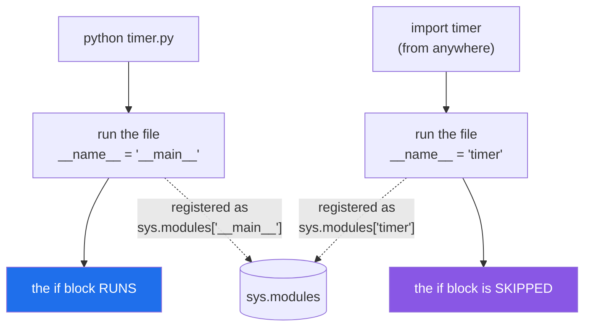

# 1.4 — `__name__`, and the same file under two names

## One-line answer

Every file knows the name it was loaded under; the one you launched is always called `__main__`, and
`if __name__ == "__main__":` is how a file offers to be both a card in the binder and a thing you can run
on its own.

---

## The story

The kitchen timer has its own card, and the card ends with a line in different handwriting: *"tested it —
rang after three minutes, works."*

That line is not part of the recipe. It is what the person who wrote the card did to check the card was
right, and they left it there because it was useful to them.

Now the card is in the binder, and everybody who opens it to look up the timer also runs that test, and
the timer goes off in a kitchen where nobody is cooking.

The fix everybody eventually finds is a line drawn across the card, near the bottom, with a heading above
it: **"only if you are checking this card, not if you are using it."** Same piece of paper. The top half
is for everyone. The bottom half is for the person holding it on purpose.

The card needs one thing to make that work: it has to be able to tell which of those two is happening.

---

## The idea in plain language

Every module has an attribute called `__name__`, a string, set by Python at the moment the module is
created. Its value is the name the module was loaded under: `import stock` makes `stock.__name__` the
string `"stock"`.

With one exception, and the exception is the point. **The file you launched is not loaded under its own
name.** When you run `python timer.py`, Python does not import a module called `timer`; it runs that file
as the program, and the program's module is always called `__main__`. So `timer.py`, run directly, sees
`__name__ == "__main__"`, and `timer.py`, imported, sees `__name__ == "timer"`.

That single difference is what the well-known line tests:

```text
if __name__ == "__main__":
    ...
```

Everything indented under it runs when the file is the program and does not run when the file is
imported. It is not a special form and not magic. It is an ordinary comparison of two strings, in a place
where those two strings differ.

What belongs under it: a demonstration, a small command-line entry point, a sanity check. What does not
belong under it: anything another module needs, because another module will never see it.

There is a second, sharper consequence, and it is the one that ruins afternoons. Because `__main__` and
`timer` are two different keys in `sys.modules`
([1.3](1.3-sys-modules.md)), a file that is *both* run directly *and* imported gets loaded **twice**, as
two independent module objects. Its outer level runs twice. Its module-level lists are two lists. Its
classes are two classes, which are not equal to each other. Everything from
[1.3](1.3-sys-modules.md)'s reload failure happens, without anyone calling `reload`.

The general rule that avoids all of it is in [4.3](../04-the-project/4.3-script-versus-module.md):
launch packages with `python -m`, not files with `python file.py`. This part is about seeing the problem;
that part is about the habit that prevents it.

---

## Why Setu needs it

- **Every script in `scripts/` in this repository uses it.** `scripts/tracker.py` ends with
  `if __name__ == "__main__": sys.exit(main(sys.argv[1:]))`, which is what lets `./m tracker` run it and
  lets `tests/test_projections.py` import it and call `main` without regenerating anything.
- **`./m check` imports test modules, and `pytest` imports your test files.** A test file that does work
  at the outer level does it at collection time; the same file's work under `if __name__ == "__main__":`
  never runs under `pytest` at all, which is exactly what you want for a hand-run debugging block.
- **Day 172's router gets a `python -m setu.router --probe` entry point**, so that the same module can be
  a library for the rest of the project and a diagnostic you can run when a provider looks down.
- **Day 240's capstone ships a command-line entry point**, and the `__main__.py` convention it uses is
  the package-level version of this same idea ([4.3](../04-the-project/4.3-script-versus-module.md)).

---

## The mechanism

One file, two lives:

```python
"""A kitchen timer card."""

RINGS = []

print(f"[timer] this card is called {__name__!r}")


def ring(what):
    RINGS.append(what)
    return f"ding: {what}"


if __name__ == "__main__":
    print(ring("test run"))
    print("[timer] rings so far:", RINGS)
```

**Line by line:**

- `RINGS = []` — outer-level state, so there is exactly one of these per loaded module
  ([1.3](1.3-sys-modules.md)). Keep an eye on it; the failure below is about there being two.
- `print(f"[timer] this card is called {__name__!r}")` — at the outer level, so it runs both ways. `!r`
  asks for the `repr`, which puts quotes round the string and makes it obvious that this is text
  ([Day 7, 3.3](../../../day-07-strings/parts/03-formatting/3.3-repr-and-the-debugging-f-string.md)).
- `def ring(what)` — the module's actual offering. Defined at the outer level, so it exists both ways.
- `if __name__ == "__main__":` — a string comparison, nothing more. It is written with the dunder name on
  the left by convention only.
- `print(ring("test run"))` — indented under the `if`, so it runs only when this file is the program. It
  mutates `RINGS`, which is why the two runs below differ.

Run directly, on Python 3.12.12 on 2026-09-02:

```
[timer] this card is called '__main__'
ding: test run
[timer] rings so far: ['test run']
```

Imported by another file that does `import timer` and prints `timer.RINGS`:

```
[timer] this card is called 'timer'
[twice] timer.RINGS is []
[twice] timer.__name__ is timer
```

Three differences, all from one string: the name printed, whether the block ran, and therefore whether
`RINGS` has anything in it.

The two doors into the same file:



The dotted arrows are the part that causes trouble: **two different keys**, so a program that does both
has two of everything.

---

## When it breaks

**The same file loaded twice, with two copies of its state:**

```text
$ uv run python shopping.py
[shopping] running as '__main__'
[shopping] running as 'shopping'
[shopping] my ITEMS      : ['milk']
[shopping] shopping.ITEMS: ['bread']
```

Where `shopping.py` is:

```python
"""One list, or so everybody thought."""

print(f"[shopping] running as {__name__!r}")
ITEMS = []


def add(thing):
    ITEMS.append(thing)


if __name__ == "__main__":
    import shopping

    add("milk")
    shopping.add("bread")
    print("[shopping] my ITEMS      :", ITEMS)
    print("[shopping] shopping.ITEMS:", shopping.ITEMS)
```

**Line by line:**

- `print(f"[shopping] running as {__name__!r}")` — at the outer level, so it prints once per load. **It
  prints twice**, which is the whole demonstration.
- `ITEMS = []` — one list per load, and there are two loads, so two lists.
- `import shopping` **inside the `if`** — the file importing itself. This looks absurd written out like
  this, and it is exactly what happens in real code when `python tools/report.py` is launched directly and
  something it imports says `from tools import report`.
- `add("milk")` — calls the local `add`, which appends to `__main__`'s `ITEMS`.
- `shopping.add("bread")` — calls the *other* module's `add`, which appends to `shopping`'s `ITEMS`.
- The two prints show the two lists. Same file. Same source line. Two lists.

**What it means.** `sys.modules` has both `__main__` and `shopping` in it, pointing at two module objects
built from the same source file. Every function is defined twice, every class is defined twice, and the
two `Shopping` classes would fail `isinstance` against each other exactly as in
[1.3](1.3-sys-modules.md). In real code the symptom is "my registry is empty", "my singleton is not a
singleton", or "my cache never hits". **The smallest fix is not to launch the file directly** — use
`python -m package.module` ([4.3](../04-the-project/4.3-script-versus-module.md)), which loads it under
its real name and makes the self-import a cache hit.

**Work put under the `if` that another module needed:**

```text
$ uv run python -c "
import timer
print(timer.RINGS)
"
[timer] this card is called 'timer'
[]
```

**What it means.** No error, and an empty list. Somebody put the setup — the registry population, the
default configuration, the first entry — under `if __name__ == "__main__":`, tested it by running the
file, and it worked. Imported, that setup never happens, and the failure appears far away as an empty
collection or a missing key. **The rule that prevents it: the block under `if __name__ == "__main__":`
may only contain things no importer could ever need.** If you are tempted to put a `def` or an assignment
in there, it belongs above.

**`pytest` and the two-modules-one-file collision:**

```text
$ uv run python -m pytest -q
=================================== ERRORS ====================================
___________________ ERROR collecting tests/test_shopping.py ___________________
import file mismatch:
imported module 'test_shopping' has this __file__ attribute:
  C:\...\pt\other\tests\test_shopping.py
which is not the same as the test file we want to collect:
  C:\...\pt\tests\test_shopping.py
HINT: remove __pycache__ / .pyc files and/or use a unique basename for your test file modules
=========================== short test summary info ===========================
ERROR tests/test_shopping.py
!!!!!!!!!!!!!!!!!!! Interrupted: 1 error during collection !!!!!!!!!!!!!!!!!!!!
1 error in 0.15s
```

**What it means.** Two files with the same basename in two folders, neither folder having an
`__init__.py`, so both want the module name `test_shopping` and only one can have it. It is the same
collision as above, arrived at from the other direction: one name, two files. The hint is real — the fix
is either unique basenames or making the test folders into packages
([3.1](../03-the-package/3.1-a-package-is-a-folder.md)), and this repository's `tests/__init__.py` exists
for precisely that reason.

---

## In production

**The professional shape is that the `if __name__ == "__main__":` block is three lines and calls
something.** Not a program — a call. `main()`, or `sys.exit(main(sys.argv[1:]))`. Everything the program
does lives in named functions above it, so the same behaviour is reachable from a test, from another
module and from a scheduler, and the block at the bottom is only the door. `scripts/tracker.py` in this
repository is written that way and can therefore be both `./m tracker` and an import inside
`tests/test_projections.py`.

**What changes at scale is that direct file launching stops working at all.** A script inside a package
that is launched as `python pkg/tool.py` cannot import its own siblings with relative imports
([3.5](../03-the-package/3.5-absolute-and-relative-imports.md)) and gets the double-load above if anything
imports it. Every mature project therefore ships console entry points — declared in `pyproject.toml`, or
a `__main__.py` in the package so that `python -m pkg` works — and nobody types a path to a `.py` file.

**The failure that only appears with real data is the registry that is silently half-full.** A plugin
system where modules register themselves at import time gets two registries when one module is loaded
under two names: things registered by `__main__` are invisible to code looking at `pkg.module`, and the
lookup fails for one plugin out of forty, in production, on the one code path that used the direct
launcher. The error is a `KeyError` naming something that is very obviously installed.

**The review comment a senior engineer leaves.** *"This has forty lines under `if __name__ ==
'__main__':`, including the argument parsing and the whole pipeline. Nothing in there is testable and
nothing in there is importable. Pull it into `def main(argv):` and leave `sys.exit(main(sys.argv[1:]))`
under the guard."*

**The interview question.** *"What does `if __name__ == '__main__':` do?"* Everyone can recite "it runs
when the script is run directly". The follow-up that separates people is *why* — because the module a
program is launched into is always registered as `__main__`, never under its own name. And the good
answer continues: which is why a file that is both launched and imported is loaded twice under two keys,
with two copies of its module-level state and two versions of each of its classes.

---

## Check yourself

```bash
uv run python -c "
from pathlib import Path
Path('timer.py').write_text(
    'print(\"loaded as\", __name__)\n'
    'if __name__ == \"__main__\":\n'
    '    print(\"the guarded block ran\")\n'
)
print('--- imported ---')
import timer
Path('timer.py').unlink()
"
echo "--- run directly ---"
```

The guarded block does not run on the import. Now write the same file to disk, run it with
`uv run python timer.py`, and compare.

**Answer out loud, without scrolling up:**

> A file is imported by one module and launched directly by a person. How many entries does it have in
> `sys.modules`, and what does that mean for a list defined at its outer level?

---

**Next:** [2.1 — `sys.path`, and who puts what in it](../02-finding-it/2.1-sys-path.md), which answers the
question this section has been assuming away: how did Python find `stock.py` at all?
