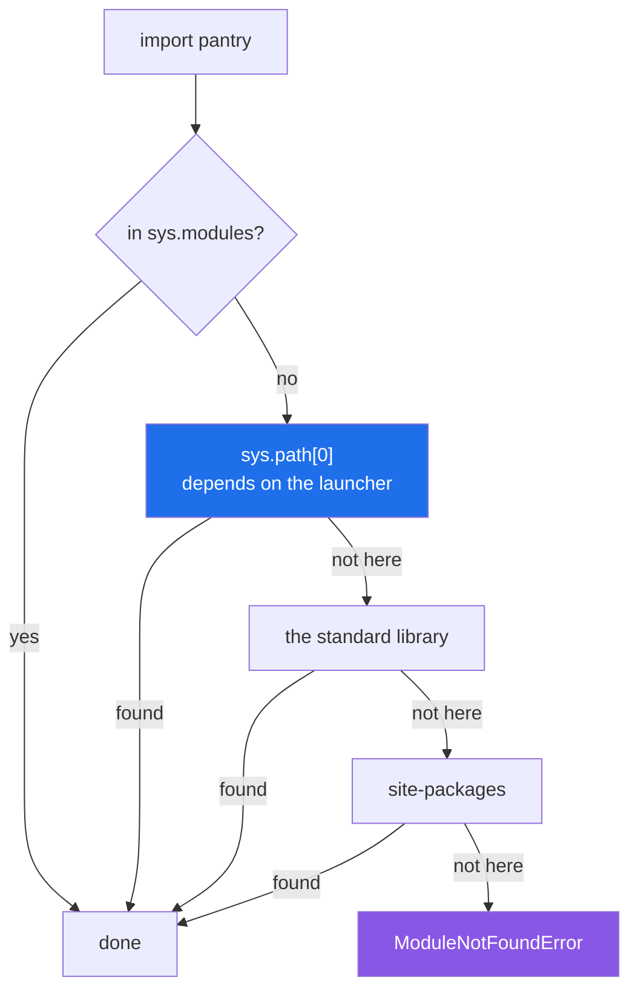

# 2.1 — `sys.path`: the list Python walks, and who puts what in it

## One-line answer

Python finds a module by walking one ordered list of folders, `sys.path`, stopping at the first match —
and the **first entry of that list is decided by how you launched Python**, not by where your files are.

---

## The story

There are three places in the flat where recipes end up: the binder on the kitchen shelf, the drawer in
the hall, and whatever is lying on the counter right now.

When somebody says "get me the stock recipe", everybody looks in the same order. Counter first, because
it is right there. Then the binder. Then the drawer, because nobody really believes anything is in the
drawer.

The order is never written down and nobody argues about it, and it works — until the evening somebody
puts a photocopy on the counter, and from then on everyone who asks for stock gets the photocopy. Not
because the photocopy is better. Because the counter is looked at first, and looking stops at the first
one found.

And there is one more thing, which is the part that catches people. "The counter" does not mean a fixed
place. It means *the surface nearest whoever is standing up*. If you are in the kitchen, it is the
kitchen counter. If you carried the cooking to the dining table, it is the dining table, and the kitchen
counter might as well not exist.

---

## The idea in plain language

When you write `import stock` and `stock` is not already in `sys.modules`
([1.3](../01-the-module/1.3-sys-modules.md)), Python has to find a file. It does that by walking a list
of folders, in order, taking the first place that has something with the right name, and stopping there.

That list is `sys.path`. It is a plain list of strings, it exists at run time, and you can print it. Four
things fill it, in this order:

1. **A first entry that depends on how Python was started.** This is the one that causes the trouble, and
   the table below is worth memorising.
2. **The standard library**, wherever this Python keeps it.
3. **`site-packages`** — where installed packages live for this environment. `.venv/Lib/site-packages`
   here ([Day 0, 2.5](../../../day-00-setup/parts/02-skeleton/2.5-the-venv-you-never-activate.md)).
4. **Anything a `.pth` file in `site-packages` adds**, which is how this project's own `src/` gets on the
   list ([2.4](2.4-uv-run-and-the-editable-install.md)).

The first entry, in full:

| How you started Python | `sys.path[0]` is |
|---|---|
| `python tools/report.py` | **the folder the script is in** — `tools/` |
| `python -m tools.report` | **the current working directory** |
| `python -c "…"` | `''`, the empty string, meaning the current directory |
| an interactive session | `''`, the current directory |

Those rows are not folklore. *Python Setup and Usage — Command line* (2026,
<https://docs.python.org/3/using/cmdline.html>) states both: for a script path, "the directory containing
that file is added to the start of `sys.path`"; for `-m`, "the current directory will be added to the
start of `sys.path`".

Read the first two rows again, because they are the source of most import confusion in Python. Running a
file puts *the file's own folder* first. Running a module with `-m` puts *where you are standing* first.
They are different folders, so the same file can import a sibling in one mode and not the other — and
that is [4.3](../04-the-project/4.3-script-versus-module.md)'s whole subject, seen from underneath.

Two more mechanisms are worth naming now, because you will meet both:

**`PYTHONPATH`** is an environment variable holding folders to insert near the front of `sys.path`. It
works, it is invisible from inside the code, and it is a common way for a program to work on one machine
and not another. It is fine as a deliberate, written-down setting; it is a trap as a fix somebody typed
once.

**`sys.path.append(...)` inside your own code** also works, and is the single most common bad fix in
Python. It edits a global list at run time, it must appear *before* the import that needs it, and it
hard-codes a layout. Every time you feel the urge, the real answer is [2.4](2.4-uv-run-and-the-editable-install.md)
— install the project — and this document exists partly so you can tell somebody why.

---

## Why Setu needs it

- **`import setu.config` works from anywhere in this repository** because of entry 4 above, and nothing
  else. There is no `sys.path` line in this project and there never will be one.
- **`./m check` runs `pytest` from the repository root**, so the root is on the path and `tests/` can
  import `setu`. Run it from inside `tests/` and it breaks — knowing *why* takes ten seconds instead of
  an afternoon.
- **Every day from 20 onward has a notebook that imports `src/setu/`.** A notebook's working directory
  is wherever the kernel started, so this is the mechanism that decides whether that import works
  (Principle 6).
- **Day 240's capstone is deployed into a container** where the working directory, the launcher and the
  installed packages are all different from your laptop. The path list is what those three differences
  add up to.

---

## The mechanism

```python
"""Print where Python will look for modules, and why the first entry is what it is."""

import sys

for i, entry in enumerate(sys.path):
    print(f"  {i}: {entry or '(empty string = the current directory)'}")
```

**Line by line:**

- `import sys` — `sys.path` is a real list on a real module, not a setting. It can be read, and it can be
  changed, and both of those facts matter.
- `enumerate(sys.path)` — the index is the whole point
  ([Day 6, 1.3](../../../day-06-loops/parts/01-iteration/1.3-enumerate-and-zip.md)); position 0 is what
  changes between launch modes and position 0 is what wins a name collision.
- `entry or '(empty string …)'` — `or` returns the first operand that is truthy
  ([Day 5, 2.4](../../../day-05-operators-and-conditionals/parts/02-conditionals/2.4-and-or-return-operands.md)),
  so an empty string prints as the explanation instead of as nothing. The empty string means "the current
  directory", and printing it as blank is how people miss it.

Run three ways from the same folder, on Python 3.12.12 on 2026-09-02. First `python tools/show.py`:

```
  0: ...\pathdemo\tools
  1: ...\cpython-3.12-windows-x86_64-none\python312.zip
  2: ...\cpython-3.12-windows-x86_64-none\DLLs
  3: ...\cpython-3.12-windows-x86_64-none\Lib
  4: ...\cpython-3.12-windows-x86_64-none
  5: ...\setu\.venv
  6: ...\setu\.venv\Lib\site-packages
  7: ...\setu\src
```

Then `python -m tools.show`, from the same folder:

```
  0: ...\pathdemo
  1: ...\cpython-3.12-windows-x86_64-none\python312.zip
```

Then `python -c "…"`, from the same folder:

```
  0: (empty string = the current directory)
  1: ...\cpython-3.12-windows-x86_64-none\python312.zip
```

**Entries 1 to 7 are identical in all three. Only entry 0 moved**, and it moved from `pathdemo/tools` to
`pathdemo` to the current directory. Entries 1–4 are the standard library, 5–6 are this project's virtual
environment, and entry 7 — `setu\src` — is put there by an editable install
([2.4](2.4-uv-run-and-the-editable-install.md)).

The walk:



The blue box is the only one that changes when you change how you launch, and every arrow that leaves it
stops the search. **First match wins**, which is why a file of yours can hide a standard-library module
([2.3](2.3-shadowing-the-standard-library.md)).

---

## When it breaks

**The same file, in the same folder, launched two ways.** Here is the layout:

```text
pathdemo/
├── pantry.py          PANTRY = "salt, oil, rice"
└── tools/
    └── report.py      import pantry
```

And `tools/report.py` is three lines:

```python
"""A tool that needs the pantry list from the folder above it."""

import pantry

print("report sees:", pantry.PANTRY)
```

**Line by line:**

- `import pantry` — an ordinary absolute import. Nothing about it says where `pantry` should be; that is
  entirely `sys.path`'s job.
- `print("report sees:", pantry.PANTRY)` — only reached if the import found something, so the presence of
  this line in the output is the test.

Run as a file, from `pathdemo/`:

```text
$ uv run python tools/report.py
Traceback (most recent call last):
  File "...\pathdemo\tools\report.py", line 3, in <module>
    import pantry
ModuleNotFoundError: No module named 'pantry'
```

Run as a module, from the same folder, with the same file unchanged:

```text
$ uv run python -m tools.report
report sees: salt, oil, rice
```

**What it means. Nothing about the code changed and nothing about the folder changed.** The first command
put `pathdemo/tools` at position 0, and `pantry.py` is not in `tools/`. The second put `pathdemo` at
position 0, and `pantry.py` is right there. This is the single most common "it works on my machine"
in Python, and the machine is usually the same machine — it is the *command* that differs, often because
one person types a path and the other clicks a run button in an editor.

**The environment variable that fixes it invisibly:**

```text
$ PYTHONPATH=/path/to/pathdemo uv run python tools/report.py
report sees: salt, oil, rice
```

**What it means.** It works, and nothing in any file records why. The next person clones the repository,
runs the identical command, and gets the traceback above — because the fix lives in a shell they do not
have. `PYTHONPATH` is legitimate when it is set in a committed file that everyone runs (a `Makefile`, a
CI workflow, a container image), and a trap when it is set in one person's shell profile.

**The fix that everyone reaches for, and what is wrong with it:**

```python
import sys
from pathlib import Path

sys.path.append(str(Path(__file__).resolve().parents[1]))

import pantry  # noqa: E402
```

**Line by line:**

- `sys.path.append(...)` — mutating a global list at import time, so this module changes name resolution
  for **the whole process**, including modules that never asked.
- `Path(__file__).resolve().parents[1]` — the folder above this file
  ([Day 16, 1.3](../../../day-16-files-and-context-managers/parts/01-the-path/1.3-relative-absolute-and-the-cwd.md)).
  This part is at least correct; the hard-coded `1` breaks the day the file moves one folder deeper.
- `append`, not `insert(0, …)` — so it loses to anything already on the path, which is a different bug
  the day a package of the same name is installed.
- `import pantry  # noqa: E402` — the `noqa` is the tell. The import has to come after the path edit, so
  it cannot be at the top of the file, so the linter objects, so the objection gets silenced. **When you
  find yourself silencing a linter to make an import work, the layout is wrong, not the linter.**

**What it means.** It works today, in this one file, launched this one way. It also runs at import time
([1.1](../01-the-module/1.1-a-module-is-a-file-that-has-already-run.md)) and therefore affects every test
that imports this module. The correct fix is [2.4](2.4-uv-run-and-the-editable-install.md): make the
project installed, so the path is arranged once, by the environment, for every launcher.

---

## In production

**The professional habit is that no application code ever touches `sys.path`.** The import path is part
of the environment — set by the virtual environment, the installed distribution and the launcher — and it
is arranged once, at install time. A `sys.path` line in a module is treated in review the way a hard-coded
absolute path is treated: it means the code only runs in one place, and the place is not written down.

**What changes at scale is that the launcher is no longer a person.** In a container the entry point is a
process manager; in CI it is a workflow file; in a scheduler it is a cron line; in a serverless runtime
it is a handler the platform imports by name. Each of those decides `sys.path[0]` differently, and none
of them is "the folder I happen to be standing in". Projects that depend on the working directory work on
a laptop and fail in three of those four, which is why "install the package, launch with `-m` or a
console script" is the shape everything converges on.

**The failure that only appears with real data is a shadowed name in a large dependency tree.** Because
the search stops at the first match, a top-level module of yours called `email.py`, `types.py` or
`logging.py` beats the standard library for the whole process, including for libraries deep inside
`site-packages` that had no idea you existed. The traceback lands in somebody else's file, reporting that
a function they have always used is missing. [2.3](2.3-shadowing-the-standard-library.md) is that failure
in full.

**The review comment a senior engineer leaves.** *"`sys.path.insert(0, ...)` at the top of a test file
means the suite passes locally and fails in CI, where the working directory is different. Delete it — the
project is installed in editable mode, so `import setu` already works, and if it does not, the fix is in
`pyproject.toml`, not here."*

**The interview question.** *"How does Python find the module you import?"* The answer is: `sys.modules`
first, then a walk down `sys.path`, first match wins. What the question is really probing is the next
sentence — that `sys.path[0]` is set by the launcher, being the script's own folder for `python file.py`
and the working directory for `python -m pkg.mod`, which is why the same file imports its sibling in one
mode and not the other. Adding that the real fix is an installed package rather than a `sys.path` edit is
what a senior answer sounds like.

---

## Check yourself

```bash
uv run python -c "
import sys
print('entry 0 :', sys.path[0] or '(current directory)')
print('entries :', len(sys.path))
print('src on it?', any(p.endswith('src') for p in sys.path))
"
```

Now run the same thing as `uv run python -m this_does_not_exist` and read which entry 0 becomes before it
fails.

**Answer out loud, without scrolling up:**

> `tools/report.py` does `import pantry`, and `pantry.py` sits one folder above it. Which of
> `python tools/report.py` and `python -m tools.report` works, and what exactly is different about
> `sys.path` between them?

---

**Next:** [2.2 — `ModuleNotFoundError` is almost never about the module](2.2-modulenotfounderror.md).
