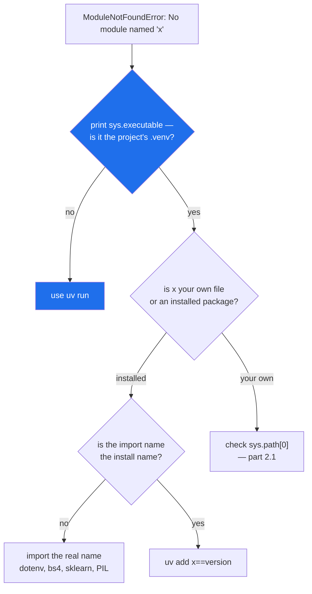

# 2.2 — `ModuleNotFoundError` is almost never about the module

## One-line answer

`No module named 'x'` means "I walked `sys.path` and did not find `x`", so the four things worth checking
are the **interpreter**, the **install**, the **name** and the **launcher** — in that order, and the
module itself is last.

---

## The story

Somebody says the stock recipe is missing from the binder.

It usually is not. What has actually happened, roughly in order of how often, is:

They were looking in the wrong binder — there are two, one in the kitchen and one that went with the
housemate who moved out, and they had the second one open.

Or the recipe was never copied in. Everybody assumed somebody else had done it, because everybody has
made the stock and it feels like it must be written down.

Or it is in there and it is called *broth*, because the person who wrote it calls it that, and searching
the contents page for "stock" finds nothing.

Or they are standing in the hall with the drawer open, and the binder is in the kitchen, and the binder
is fine.

Only after all four of those does anybody find a genuinely missing page. And the fix is different every
time, so the useful question is never "where is the recipe" — it is "which binder are you holding".

---

## The idea in plain language

`ModuleNotFoundError` is raised when the walk from [2.1](2.1-sys-path.md) reaches the end of `sys.path`
without a match. That is all it says. It carries no opinion about *why* there was no match, which is why
the message is so unhelpful the first fifty times you see it.

There are four causes, and they want four different fixes.

**The wrong interpreter.** The package is installed, in an environment, and the Python you ran is a
different Python. This is the most common cause on a machine that has more than one Python, which is
every machine. It is why every command in this project starts with `uv run`
([Day 0, 1.3](../../../day-00-setup/parts/01-toolchain/1.3-uv-the-one-binary.md)) — `uv run` picks the
project's environment, and typing `python` picks whatever is first on your `PATH`.

**Not installed.** Straightforward, and the fix is `uv add name==version` with an exact pin (Principle 4).

**The import name is not the install name.** These are two different names and nothing requires them to
match. `uv add python-dotenv` gives you `import dotenv`. `beautifulsoup4` gives `import bs4`.
`scikit-learn` gives `import sklearn`. `pillow` gives `import PIL`. Guessing from the install name is a
reliable way to produce this error with the package sitting right there in `site-packages`.

**The launcher.** [2.1](2.1-sys-path.md)'s whole subject: your own module exists, on disk, one folder
away, and `sys.path[0]` is not that folder.

Two distinctions are worth having sharp, because they turn one confusing message into two specific ones.

**`ModuleNotFoundError` versus `ImportError`.** The first means the file was never found. The second
means the file *was* found and run, and the name you asked for was not in it. `ModuleNotFoundError` is a
subclass of `ImportError`, so `except ImportError:` catches both — which is what you usually want for an
optional dependency.

**A missing module versus a missing submodule.** `import xml` succeeds and `xml.etree` then raises
`AttributeError`, not `ModuleNotFoundError`, because importing a package does not import its subpackages
([3.1](../03-the-package/3.1-a-package-is-a-folder.md)). The fix is to import the thing you want:
`import xml.etree.ElementTree`.

---

## Why Setu needs it

- **This is the error of Day 0 and Day 1**, and it will be the error of Day 20, Day 138 and Day 172. Every
  new package in this plan arrives with one chance to produce it.
- **`uv run` exists to remove cause one**, and knowing that is what stops you "fixing" a working project
  by installing something globally.
- **Phase 3 onward adds packages whose import name differs from their install name** — `scikit-learn`,
  `beautifulsoup4`, `python-dotenv`, `faiss-cpu`, `google-genai`. `docs/PINS_DS.md` records the install
  names, and the import names are in each library's own documentation.
- **Optional dependencies are handled with `except ImportError`** from Day 209's protocol work onward, and
  that only works if you know `ModuleNotFoundError` is a subclass of it.

---

## The mechanism

Four commands, four different causes, on Python 3.12.12 on 2026-09-02.

**Cause one — the wrong interpreter.** The same import, run twice on one machine:

```text
$ uv run python -c "import setu; print('setu from', setu.__file__)"
setu from C:\...\setu\src\setu\__init__.py

$ C:\Users\...\Programs\Python\Python312\python.exe -c "import setu"
Traceback (most recent call last):
  File "<string>", line 1, in <module>
ModuleNotFoundError: No module named 'setu'
```

Nothing about the project changed between those two lines. The second command used a different Python,
whose `site-packages` has never heard of this project. **The diagnostic that settles it in one line:**

```python
"""Which Python is this, and where is it looking?"""

import sys

print("interpreter :", sys.executable)
print("sys.path[0] :", sys.path[0] or "(the current directory)")
print("site-packages entries:")
for entry in sys.path:
    if "site-packages" in entry:
        print("   ", entry)
```

**Line by line:**

- `sys.executable` — the absolute path of the running interpreter. **This is the first thing to print
  when an import fails**, because it answers "which binder am I holding" and it is the cause more often
  than the other three together.
- `sys.path[0] or "(the current directory)"` — cause four, from [2.1](2.1-sys-path.md), in one line.
- the `if "site-packages" in entry` loop — where installed packages would be. If this prints a folder
  belonging to a different project, or nothing at all, you have found the problem without reading another
  traceback.

**Cause two and three — not installed, or installed under another name:**

```text
$ uv run python -c "import pandas"
Traceback (most recent call last):
  File "<string>", line 1, in <module>
ModuleNotFoundError: No module named 'pandas'

$ uv run python -c "import python_dotenv"
Traceback (most recent call last):
  File "<string>", line 1, in <module>
ModuleNotFoundError: No module named 'python_dotenv'

$ uv run python -c "import dotenv; print('dotenv ok')"
dotenv ok
```

The first is honestly missing — `pandas` arrives on Day 26. The second and third are the *same package*:
`pyproject.toml` says `python-dotenv==1.2.3`, and the module it installs is called `dotenv`. Two
identical-looking errors, two completely different fixes.

**The distinction between the two exception types:**

```text
$ uv run python -c "from json import loadz"
Traceback (most recent call last):
  File "<string>", line 1, in <module>
ImportError: cannot import name 'loadz' from 'json' (...\Lib\json\__init__.py). Did you mean: 'load'?

$ uv run python -c "print(ModuleNotFoundError.__mro__)"
(<class 'ModuleNotFoundError'>, <class 'ImportError'>, <class 'Exception'>, <class 'BaseException'>, <class 'object'>)
```

`ImportError` here, because `json` was found and run; only the name was wrong. Python even offers the
correction. And the second line is the inheritance chain
([Day 13, 1.3](../../../day-13-inheritance-and-abstraction/parts/01-inheritance/1.3-the-mro.md)):
`ModuleNotFoundError` **is an** `ImportError`, so one `except ImportError:` handles both.

The order to check things in:



---

## When it breaks

**The package is installed and the import still fails — because the module is a subpackage:**

```text
$ uv run python -c "
import xml
print(xml.etree)
"
Traceback (most recent call last):
  File "<string>", line 3, in <module>
AttributeError: module 'xml' has no attribute 'etree'
```

**What it means.** Not a `ModuleNotFoundError` at all, and the difference is the clue.
`xml` was found, imported and is sitting right there; it simply does not have an attribute called
`etree`, because **importing a package does not import its subpackages**
([3.1](../03-the-package/3.1-a-package-is-a-folder.md)). The fix is to ask for what you want:
`import xml.etree.ElementTree as ET`. The same shape appears with `os.path` — which works only because
`os` deliberately imports it — and that inconsistency is why people expect `xml.etree` to work.

**The error that names a module you have never heard of:**

```text
$ uv run python -c "import distutils"
Traceback (most recent call last):
  File "<string>", line 1, in <module>
ModuleNotFoundError: No module named 'distutils'
```

**What it means.** Something you installed imports it, and it is gone: `distutils` was removed from the
standard library in Python 3.12 (*PEP 632 — Deprecate distutils module*, 2020,
<https://peps.python.org/pep-0632/>). The module named in the message is not always yours, and when it is
not, the question changes from "what did I forget to install" to "which of my dependencies is too old for
this Python". Read the traceback for the frame *above* the failure: it names the package that needs
fixing.

**Two environments, and a fix applied to the wrong one.** This is cause one wearing a disguise, and it is
worth naming because it does not look like an environment problem: a bare `pip install pandas` reports
success, and `uv run python -c "import pandas"` still raises `ModuleNotFoundError`. Nothing lied. `pip`
was found on `PATH` and installed into whichever environment *it* belongs to, which is not the one
`uv run` uses, so the package genuinely arrived — somewhere else. You can see the two environments for
yourself with the diagnostic above: run it under `uv run` and under a bare `python`, and compare the
`site-packages` lines.

This is the most common way a beginner ends up with four Pythons and a project that only works in one
terminal window. **In this project the fix is that you never type `pip`**: `uv add pandas==3.0.5` writes
the exact pin into `pyproject.toml`, updates `uv.lock`, and installs into the environment `uv run` uses
(Principle 4).

**An optional dependency handled with the wrong exception type:**

```python
try:
    import faiss
except ModuleNotFoundError:
    faiss = None
```

**Line by line:**

- `try:` / `except ModuleNotFoundError:` — catches the case where `faiss` is not installed, which is the
  case the author was thinking about.
- `faiss = None` — the sentinel the rest of the module checks. Reasonable, and worth being explicit about
  rather than leaving the name undefined.
- The bug is the exception type. If `faiss` **is** installed but fails while importing — a missing native
  library, a version mismatch, an error at its outer level
  ([1.1](../01-the-module/1.1-a-module-is-a-file-that-has-already-run.md)) — that raises `ImportError` or
  something else entirely, this `except` does not catch it, and the program dies at import with a
  traceback from inside a library nobody chose.

**What it means.** For an optional dependency the honest catch is `except ImportError:`, which covers both
"not there" and "there but broken". Catching the narrower type says something you did not mean: that a
broken install should crash the program while a missing one should not.

---

## In production

**The professional habit is to print `sys.executable` before doing anything else.** It costs one line, it
answers the most likely cause, and it removes an entire category of guessing. The second habit is that
the environment is never repaired by hand: no `pip install` into a running container, no `sys.path` edit,
no `PYTHONPATH` in a shell profile. The dependency list is a file, the environment is built from that
file, and if the import fails, the file is what changes.

**What changes at scale is that this error moves to start-up in an environment you cannot type into.** A
container starts, imports the application, hits `ModuleNotFoundError` on a module that is on your laptop
because you installed it there months ago and never added it to `pyproject.toml`, and the process exits
before serving anything. This is why a locked, exactly-pinned dependency file and a container build that
installs *only* from it is not ceremony: it converts "works on my machine" into a build-time failure
instead of a 3am one.

**The failure that only appears with real data is the optional import that quietly disabled a feature.**
`except ImportError: faiss = None` is correct, and six months later the vector search is silently doing
nothing in production because the container image lost the package in an unrelated change. The fix is
that a fallback must be *loud*: log at start-up which optional dependencies are absent, and let the
health check report the degraded mode. A silent fallback is a fallback nobody will notice for a quarter.

**The review comment a senior engineer leaves.** *"This catches `ModuleNotFoundError` to make the
dependency optional. Use `ImportError` — a package that is present but broken raises that, and right now
it takes the whole process down at import time. And log a warning when the fallback engages, or nobody
will ever know it did."*

**The interview question.** *"You get `ModuleNotFoundError` for a package you just installed. Walk me
through it."* The answer they want is the ordered list: check `sys.executable` first, because a second
interpreter is the most likely cause; then whether it is installed *in that* environment; then whether
the import name matches the install name, which it often does not; and only then whether it is your own
module and `sys.path[0]` is wrong for the way you launched. Mentioning that `ModuleNotFoundError` is a
subclass of `ImportError`, and that a found-but-broken module raises the parent type, is the detail that
shows you have debugged one rather than read about one.

---

## Check yourself

```bash
uv run python -c "
import sys
print('interpreter:', sys.executable)
print('is it the project venv?', '.venv' in sys.executable)
"
uv run python -c "import python_dotenv" 2>&1 | tail -1
uv run python -c "import dotenv; print('but dotenv imports fine:', dotenv.__name__)"
```

The middle command fails and the last one succeeds, for the same installed package. Now find the install
name for `import bs4` in `docs/PINS_DS.md`.

**Answer out loud, without scrolling up:**

> Name the four causes of `ModuleNotFoundError`, in the order you would check them, and say what single
> line of Python you would print first.

---

**Next:** [2.3 — the file named after a standard-library module](2.3-shadowing-the-standard-library.md).
