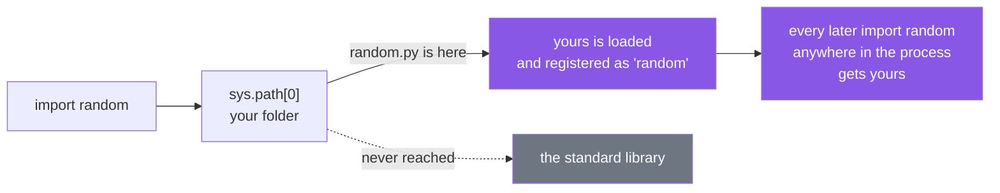

# 2.3 — The file named after a standard-library module

## One-line answer

Because the search stops at the first match and your folder is usually searched first, naming a file
`random.py` or `json.py` replaces the standard library's version **for the whole program**, including for
libraries that have never heard of you.

---

## The story

Somebody made a card for something they cook a lot, and wrote **STOCK** across the top in big letters,
and put it on the counter where they could reach it.

It is a stock cube. Two lines: drop the cube in, add water.

That is a perfectly reasonable card, and for them it was the right card. But the counter gets looked at
first, and looking stops at the first card found, so from that evening on, everyone who asked for the
stock recipe got the cube.

The interesting failures were not in the kitchen. The person making risotto did not ask for stock — the
risotto card told *them* to make stock, and they followed it to the counter and came back with a cube.
And the risotto was wrong, and nobody could see why, because the risotto card is fine and the cube card
is fine and neither of them mentions the other.

The card on the shelf is still there. It is just never reached.

---

## The idea in plain language

Put a file called `random.py` in the folder Python searches first, and `import random` finds *your* file.
Not the one that ships with Python. Yours.

This is not a bug, and there is no warning. It is the direct consequence of two rules you already know:
`sys.path` is walked in order ([2.1](2.1-sys-path.md)), and the first match wins. Your folder is at
position 0 for the two most common ways of launching Python, and the standard library is further down.
So you win.

**And once you have won, you have won for everyone.** `sys.modules`
([1.3](../01-the-module/1.3-sys-modules.md)) holds one entry per name, so the whole process now has your
file registered as `random`. A library buried three levels down in `site-packages` that does `import
random` gets your file. It has no way to ask for a different one.

That is what makes this failure so unpleasant to debug: **the traceback lands in somebody else's code**.
The error appears in `statistics.py`, or in a package you installed, or in `pytest` itself, reporting
that a function that has existed for twenty years is missing.

Two clarifications, because both are commonly got wrong:

**A stale `__pycache__` does not shadow anything.** Deleting the offending `.py` and leaving
`__pycache__/random.cpython-312.pyc` is safe — Python 3 will not import a cached file whose source is
gone. Advice to "delete your `.pyc` files" is folklore from Python 2 in this context; delete the `.py`.

**It is not only the standard library.** Any name on the path can be shadowed, including installed
packages. A file called `types.py` in a project folder, or a package folder called `email/`, breaks things
in the same way, and the more common the name, the deeper the damage.

The names to avoid are the short, obvious, tempting ones: `random`, `json`, `types`, `email`, `logging`,
`string`, `time`, `copy`, `select`, `code`, `test`, `queue`, `socket`, `parser`, `token`, `secrets`,
`platform`, `statistics`, `array`, `operator`. If a name feels like the natural name for the thing you
are writing, that is exactly why the standard library already used it.

---

## Why Setu needs it

- **This project's own module names were chosen with this in mind.** `src/setu/paths.py` rather than
  `path.py`, `src/setu/jsonl.py` rather than `json.py`, `src/setu/config.py` inside a package rather than
  at the top level. Being inside the `setu` package protects them: the importable name is `setu.config`,
  which collides with nothing.
- **Day 18 writes `src/setu/errors.py`** and Day 19 writes `src/setu/models.py` — both names that would be
  hazardous at the top level and are safe inside a package. That is one of the arguments for packages in
  [3.1](../03-the-package/3.1-a-package-is-a-folder.md).
- **Day 20's NumPy work is where this bites hardest for beginners**, because the natural filename for a
  first experiment is `numpy_test.py` and the natural short one is `numpy.py`, and the second one produces
  a truly baffling afternoon.
- **`notebooks/` is the highest-risk folder in this repository**, because a notebook's working directory
  is on the path and scratch files there get short, obvious names (Principle 6).

---

## The mechanism

One file, in the folder you are standing in:

```python
"""Pick a recipe at random - or so I thought."""

import random

RECIPES = ["stock", "soup", "bread"]
print("a random recipe:", random.choice(RECIPES))
```

**Line by line:**

- The file is saved as **`random.py`**, which is the entire experiment. Its contents are ordinary and
  correct.
- `import random` — the author means the standard library's. The interpreter has no way to know that; it
  walks `sys.path`, finds `random.py` at position 0, and that file is this file.
- `RECIPES = [...]` — an outer-level assignment, so it runs during that import
  ([1.1](../01-the-module/1.1-a-module-is-a-file-that-has-already-run.md)).
- `random.choice(RECIPES)` — asks the module it just imported for `choice`. The module it just imported
  is itself, and it does not have one yet, because the file has not finished running.

Run on Python 3.12.12 on 2026-09-02:

```text
$ uv run python random.py
  File "...\shadow\random.py", line 3, in <module>
    import random
  File "...\shadow\random.py", line 6, in <module>
    print("a random recipe:", random.choice(RECIPES))
                              ^^^^^^^^^^^^^
AttributeError: partially initialized module 'random' has no attribute 'choice' (most likely due to a circular import)
```

**Read the two frames.** Both name the same file. The file imported itself, and Python says so: *partially
initialized module*. That phrase is Python telling you the module was in `sys.modules` but had not
finished executing — the ordering from [1.1](../01-the-module/1.1-a-module-is-a-file-that-has-already-run.md)'s
diagram, and the same message you will meet again in
[4.2](../04-the-project/4.2-the-circular-import.md) for a real circular import.

Now the version that matters. A second file, in the same folder, that has nothing to do with any of this:

```python
"""Nothing here mentions the file next door."""

import statistics

print("median of three numbers:", statistics.median([3, 1, 2]))
```

**Line by line:**

- `import statistics` — a standard-library module, imported by name, with no relationship to `random.py`.
- `statistics.median([3, 1, 2])` — a call that cannot fail. Three numbers, one median.
- There is **no line in this file that mentions `random`**. That is the point of showing it.

```text
$ uv run python shuffle_me.py
  File "...\shadow\shuffle_me.py", line 3, in <module>
    import statistics
  File "...\Lib\statistics.py", line 132, in <module>
    import random
  File "...\shadow\random.py", line 6, in <module>
    print("a random recipe:", random.choice(RECIPES))
                              ^^^^^^^^^^^^^
AttributeError: partially initialized module 'random' has no attribute 'choice' (most likely due to a circular import)
```

**The middle frame is the standard library's `statistics.py`, line 132.** A file you did not write,
importing a module you did not intend to affect, getting yours. This is the shape of the failure in a real
project: a package deep in `site-packages` breaks, its traceback accuses its own dependency, and the
actual cause is a filename in your working directory.

A quieter version, without the self-import, so the error is plainer:

```text
$ uv run python -c "
import json
print('json is at:', json.__file__)
print(json.dumps({'a': 1}))
"
json is at: ...\shadow\json.py
Traceback (most recent call last):
  File "<string>", line 4, in <module>
AttributeError: module 'json' has no attribute 'dumps'
```

Where `json.py` in that folder is one line: `TASTE = "sweet"`. **`json.__file__` is the diagnostic.** It
names the file that was actually loaded, and one line of output ends the mystery.

Why yours wins:



---

## When it breaks

**The error names a library you did not write.** That is the case above, and it deserves stating as a
rule: when a traceback's deepest frames are inside `site-packages` or the standard library, and the code
there looks obviously correct, check for a shadowing filename before you check anything else. The command
is one line:

```text
$ uv run python -c "import random; print(random.__file__)"
```

If that prints something inside your project, you have found it.

**A package folder shadowing, which hides even better.** A folder called `email/` with an `__init__.py` in
it beats the standard library's `email` package for the whole process
([3.1](../03-the-package/3.1-a-package-is-a-folder.md)). This is worse than a single file because the
folder looks like organisation rather than like a mistake, and because a partial implementation may
satisfy some imports and not others — so half the program works.

**Deleting the file and still seeing the failure.** Two real causes, and neither is `__pycache__`:

```text
$ uv run python -c "
import json
print('json is at:', json.__file__)
print(json.dumps({'a': 1}))
"
json is at: ...\Lib\json\__init__.py
{"a": 1}
```

That is the same command after deleting `json.py`, with `__pycache__/json.cpython-312.pyc` still sitting
there — and it works. **A stale `.pyc` with no source alongside it is not importable in Python 3**, so
"delete your `.pyc` files" is not the fix here. The two real causes of a failure that survives the delete
are a still-running process holding the module in `sys.modules`
([1.3](../01-the-module/1.3-sys-modules.md)), and a second copy of the file in another folder that is also
on the path.

**A shadowed name that never raises anything.** Suppose your `secrets.py` defines a `token_hex` that
returns a fixed string, for testing. Everything imports, everything runs, every test passes, and every
session identifier your application issues is the same one. There is no traceback anywhere, and no line to
search for. This is why shadowing is treated as a serious mistake and not a beginner's inconvenience: the
error may be a wrong value rather than an exception.

---

## In production

**The professional habit is that application code never lives at the top level of the path.** Everything
goes inside one package — `setu/`, here — so the importable names are `setu.config`, `setu.errors`,
`setu.models`, and there is exactly one top-level name to keep unique instead of forty. That single fact
removes this entire failure class, and it is one of the two reasons the `src/` layout exists
([4.1](../04-the-project/4.1-the-src-layout.md)).

**What changes at scale is that the collision may be with a dependency you have never heard of.** Your
package `tasks` competes with somebody's `tasks`; your `utils` competes with an installed `utils`. Which
one wins depends on install order and path order, and can therefore differ between your laptop, CI and
production, giving the same code three behaviours. Distributions handle this by owning a single
top-level name that matches the project, and putting everything under it.

**The failure that only appears with real data is the partial shadow.** A folder of yours called `email/`
with two modules in it satisfies `import email` and `import email.utils`, and fails on `import
email.mime.text` — so a mail-sending path that only runs for attachments breaks in production and nowhere
else. The traceback is a `ModuleNotFoundError` for a standard-library submodule, which reads as an
impossible error and sends people looking at the Python installation.

**The review comment a senior engineer leaves.** *"`src/setu/logging.py` will shadow the standard
library's `logging` for anything that imports it with an implicit relative import, and it makes every
traceback in this package ambiguous to read. Rename it `log_setup.py`. Same for `types.py` two folders
down."*

**The interview question.** *"What happens if you name a file `random.py`?"* The recited answer is "it
breaks your import of random". The used answer explains the mechanism — `sys.path` is searched in order,
your directory is usually first, and the first match is registered in `sys.modules` under that name for
the whole process — and then the consequence that makes it a real bug: every library in the process that
imports `random` gets yours, so the traceback appears in code you did not write, and if your version
happens to satisfy the calls being made, there is no traceback at all.

---

## Check yourself

```bash
uv run python -c "
from pathlib import Path
Path('json.py').write_text('TASTE = \"sweet\"\n')
import json
print('json came from:', json.__file__)
try:
    json.dumps({'a': 1})
except AttributeError as error:
    print('and so:', error)
Path('json.py').unlink()
"
```

Then run `uv run python -c "import json; print(json.__file__)"` in this repository's root and confirm it
points into the standard library.

**Answer out loud, without scrolling up:**

> You put a file called `random.py` in your project folder. Explain why the traceback you get names a file
> in the standard library that you have never opened.

---

**Next:** [2.4 — `uv run` and the editable install: why `import setu` works at all](2.4-uv-run-and-the-editable-install.md).
