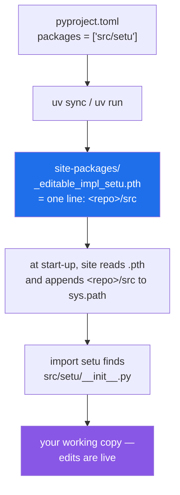

# 2.4 — `uv run` and the editable install: why `import setu` works at all

## One-line answer

`import setu` works from any folder because the project is **installed in editable mode**: a one-line
file in `site-packages` puts `<repo>/src` on `sys.path` for this environment, so the import finds your
working copy rather than a snapshot of it.

---

## The story

The flat solved the binder problem by putting a single card in the front of the kitchen binder, and it
does not contain a recipe.

It says: **the recipes are in the blue folder on the second shelf.**

That is all. One line, one address.

The advantage over copying everything into the binder is that there is nothing to keep in step. When
somebody corrects a recipe in the blue folder, the binder is instantly correct too, because the binder
never held a copy — only directions. Nobody has to remember to re-copy anything, and there is never a
moment where the binder and the folder disagree.

And the housemate who does not know about the blue folder does not need to. They open the binder, follow
the one line, and end up in the right place.

---

## The idea in plain language

There is a question this whole section has been avoiding, and it is time to answer it: `src/setu/` is not
in the folder you are standing in, and it is certainly not in the standard library, so why does
`import setu` work?

Because the project is **installed**, and it is installed in a particular way.

An ordinary install copies a package into `site-packages`. That is right for a library you use and wrong
for the one you are writing — you would have to reinstall after every edit, and until you did, the
version running would be the copy rather than the file open in your editor.

An **editable install** does the other thing. It puts no copy anywhere. It writes one small file into
`site-packages` whose only job is to add your source folder to `sys.path`. In this project that file is
`.venv/Lib/site-packages/_editable_impl_setu.pth`, and its entire contents are one line:

```text
C:\Users\...\Projects\setu\src
```

A file ending in `.pth` in `site-packages` is read at start-up, and each line in it that is a folder is
appended to `sys.path`. That is the whole mechanism. It is why `src` appeared as entry 7 in
[2.1](2.1-sys-path.md)'s output, and it is why `import setu` finds `src/setu/__init__.py` — your actual
working file, not a copy.

Three pieces fit around it.

**`pyproject.toml` names what to install.** The line `packages = ["src/setu"]` under
`[tool.hatch.build.targets.wheel]` is what tells the build backend that the importable package is
`src/setu`, so the folder to put on the path is `src`
([Day 0, 2.4](../../../day-00-setup/parts/02-skeleton/2.4-uv-init-pyproject-and-the-lockfile.md)).

**`uv run` guarantees the right interpreter.** It makes sure the environment matches `pyproject.toml` and
`uv.lock`, then runs your command with that environment's Python — which is the one whose
`site-packages` holds the `.pth` file. Typing a bare `python` gets whatever is first on `PATH`, which is
cause one of [2.2](2.2-modulenotfounderror.md).

**Nothing is copied, so nothing goes stale.** Edit `src/setu/config.py`, and the next process that
imports it gets the edit. Within one running process the cache still applies
([1.3](../01-the-module/1.3-sys-modules.md)) — an editable install does not repeal `sys.modules`.

The name for the arrangement is *editable install*, standardised as *PEP 660 — Editable installs for
pyproject.toml based builds* (2021, <https://peps.python.org/pep-0660/>), which defines how a build
backend advertises this mode. The `.pth` file's behaviour is older and lives in the standard library's
`site` module.

---

## Why Setu needs it

- **Every `from setu.x import y` in this repository depends on it**, starting with
  `tests/test_setup.py` on Day 0 and continuing for 240 days.
- **`./m check` runs `pytest` against `src/setu/` with no `sys.path` line anywhere.** That is not luck;
  it is this file.
- **Day 16's `src/setu/jsonl.py` is imported by `tests/test_jsonl.py`** with no relationship between the
  two folders other than this.
- **Day 240 ships the capstone**, and the same `pyproject.toml` that makes the editable install work is
  what makes a real, non-editable install work in a container. The two modes read the same declaration.

---

## The mechanism

Look at what is actually on disk. First the file that does the work:

```text
$ cat .venv/Lib/site-packages/_editable_impl_setu.pth
C:\Users\nisha_gnzw\OneDrive\Desktop\Projects\setu\src
```

One line, one absolute path, no code. Then the record of *why* it is there:

```text
$ cat .venv/Lib/site-packages/setu-0.1.0.dist-info/direct_url.json
{"url":"file:///C:/Users/nisha_gnzw/OneDrive/Desktop/Projects/setu","dir_info":{"editable":true}}
```

`"editable":true` is the environment writing down that this package is a link to a working tree rather
than a copy of one. And the declaration those two came from, in `pyproject.toml`:

```toml
[build-system]
requires = ["hatchling"]
build-backend = "hatchling.build"

[tool.hatch.build.targets.wheel]
packages = ["src/setu"]
```

Now prove the chain end to end:

```python
"""Why does import setu work? Three lines that answer it."""

import sys

import setu

print("setu.__file__ :", setu.__file__)
print("src on path?  :", [p for p in sys.path if p.endswith("src")])
print("interpreter   :", sys.executable)
```

**Line by line:**

- `import sys` before `import setu` — deliberate ordering, so that `sys.path` is available to inspect
  regardless of whether the second import succeeds when you try this in a broken environment.
- `import setu` — the import under investigation. If this line works, the rest of the file explains why.
- `setu.__file__` — **the file that was actually loaded.** This is the same diagnostic as
  [2.3](2.3-shadowing-the-standard-library.md), used here to prove the opposite point: it should be your
  working copy under `src/`, not something in `site-packages`.
- `[p for p in sys.path if p.endswith("src")]` — a comprehension
  ([Day 9, 1.2](../../../day-09-comprehensions/parts/01-list-comprehensions/1.2-the-filter-clause.md))
  filtering the path down to the entry the `.pth` file added. A list rather than a bare `in` test, so you
  can see *which* `src` it is when there is more than one project on the machine.
- `sys.executable` — which Python, because the `.pth` file belongs to one environment and means nothing
  in another.

Run on Python 3.12.12 on 2026-09-02:

```
setu.__file__ : C:\Users\nisha_gnzw\OneDrive\Desktop\Projects\setu\src\setu\__init__.py
src on path?  : ['C:\\Users\\nisha_gnzw\\OneDrive\\Desktop\\Projects\\setu\\src']
interpreter   : C:\Users\nisha_gnzw\OneDrive\Desktop\Projects\setu\.venv\Scripts\python.exe
```

`setu.__file__` is under `src/`. **There is no copy in `site-packages`** — that is the whole difference
between an editable install and an ordinary one.

The chain, from declaration to import:



---

## When it breaks

**The wrong interpreter, which makes the `.pth` file invisible:**

```text
$ C:\Users\...\Programs\Python\Python312\python.exe -c "import setu"
Traceback (most recent call last):
  File "<string>", line 1, in <module>
ModuleNotFoundError: No module named 'setu'
```

**What it means.** A `.pth` file belongs to one environment's `site-packages`. Another Python has its own
`site-packages`, without that file, so `src` is not on its path and the project does not exist for it.
Nothing is broken; you asked the wrong interpreter. This is why every command in this project is
`uv run …`, and why [2.2](2.2-modulenotfounderror.md) puts `sys.executable` first in the checklist.

**The package was renamed and the install was not redone:**

```text
$ uv run python -c "import setu"
ModuleNotFoundError: No module named 'setu'
```

**What it means.** The `.pth` file points at a folder; the folder must contain a `setu` package. Rename
`src/setu` to `src/setu_core` without changing `pyproject.toml` and the path entry still resolves, but
there is nothing called `setu` inside it. The fix is to change both, then let `uv` rebuild the
environment: `uv sync`, or simply the next `uv run`, which syncs first. This is one of the few times an
"it worked yesterday" failure genuinely is an install problem rather than a path problem.

**Two projects, two `src` folders, one environment.** Install two editable projects into the same
environment and `sys.path` gains two `src` entries. If both contain a package with the same top-level
name, the earlier entry wins for the whole process — [2.3](2.3-shadowing-the-standard-library.md)'s
failure between two of your own projects, and a good reason for one environment per project.

**The `sys.path` line somebody added because they did not know about this:**

```python
import sys
from pathlib import Path

sys.path.insert(0, str(Path(__file__).resolve().parents[2] / "src"))
```

**Line by line:**

- `sys.path.insert(0, ...)` — puts the project's `src` at the front for the whole process, at import time
  ([1.1](../01-the-module/1.1-a-module-is-a-file-that-has-already-run.md)).
- `Path(__file__).resolve().parents[2]` — counts folders upward, so the line is silently wrong the moment
  the file moves. `parents[2]` is correct for `tests/unit/test_x.py` and wrong for `tests/test_x.py`, and
  nothing checks it.
- `/ "src"` — hard-codes the layout, so the day the layout changes there are eleven of these to find.

**What it means.** It works, and it is doing by hand, in every file, per process, what one `.pth` file
already does once for the environment. It also puts `src` at position **0**, ahead of `site-packages`,
which makes shadowing more likely rather than less. Delete it, confirm the project is installed with
`uv run python -c "import setu; print(setu.__file__)"`, and fix `pyproject.toml` if it is not.

---

## In production

**The professional habit is that a project is a package and is installed, even during development.** The
alternative — relying on being in the right folder — works only for the person who set it up, only in
that folder, and only from one launcher. The editable install turns "can this import" from a property of
where you are standing into a property of the environment, and environments are reproducible.

**What changes at scale is that the same declaration serves a different install.** The container build
does an ordinary, non-editable install from the same `pyproject.toml` and `uv.lock`: the package is
copied into `site-packages`, there is no `.pth`, and `import setu` still works with no code change
anywhere. That is the pay-off for having declared the package rather than arranged the path — development
and production differ in one flag rather than in a set of assumptions about the working directory.

**The failure that only appears with real data is the file that was never packaged.** An editable install
puts your whole source folder on the path, so *everything* in it is importable — including files you never
listed. The non-editable build copies only what the declaration covers, so a module in the wrong place, or
a data file with no packaging rule, is present in development and absent in the container. The symptom is
`ModuleNotFoundError` or `FileNotFoundError` at container start-up for something that has always worked.
Building the wheel once and importing from it is what catches this before deployment.

**The review comment a senior engineer leaves.** *"Delete the `sys.path.insert` at the top of
`conftest.py`. The project is an editable install, so `import setu` already works from any directory, and
that line puts `src` ahead of `site-packages` — which means a module of ours shadows an installed package
of the same name, in tests only, which is the worst place for that to differ."*

**The interview question.** *"How does your test suite import your application code?"* The answer to avoid
is "pytest adds the rootdir" or "we set `PYTHONPATH`". The answer to give is that the project is installed
into the virtual environment in editable mode, so `site-packages` holds a `.pth` file pointing at the
source folder and imports resolve the same way for tests, for a REPL and for the application, with no
per-file path manipulation. The follow-up — "what is different in production?" — is answered by: the same
declaration, installed normally, so the package is copied and nothing else changes.

---

## Check yourself

```bash
uv run python -c "
import sys

import setu

print('loaded from   :', setu.__file__)
print('copy in site-packages?', 'site-packages' in setu.__file__)
print('interpreter   :', sys.executable)
"
cat .venv/Lib/site-packages/_editable_impl_setu.pth
```

The second line says `False`, and the `.pth` file is one path. Now run the same import with a bare
`python` instead of `uv run python` and see what changes.

**Answer out loud, without scrolling up:**

> There is no copy of `setu` in `site-packages`, and `import setu` works from any folder. Name the file
> that makes that true and say what is in it.

---

**Next:** [3.1 — a package is a folder Python will import from](../03-the-package/3.1-a-package-is-a-folder.md).
