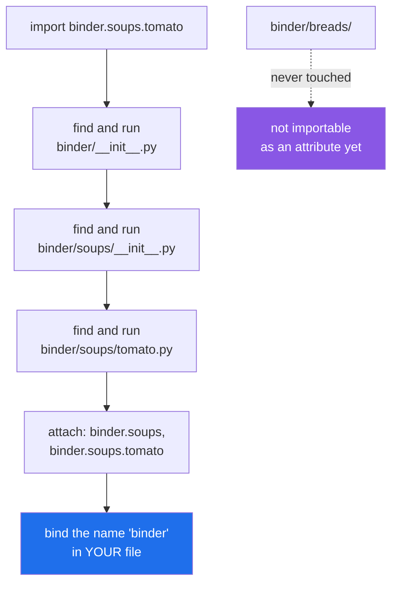

# 3.1 — A package is a folder Python will import from

## One-line answer

A package is a **folder** you can import, its dotted name is its folder path with slashes turned into
dots, and importing one of its modules runs every `__init__.py` on the way down — but does **not** import
its siblings.

---

## The story

The binder was one stack of cards, and it worked until it did not. Somebody wanted the sourdough recipe
and had to go through everything from artichokes to yoghurt to find it.

So it got dividers. Soups behind one, breads behind another, sauces behind a third. Nothing was rewritten
— the cards are the same cards. What changed is that a recipe now has an address instead of a position:
*binder, soups, tomato*. Three words, said in order, narrowing each time.

Two things about the dividers turned out to matter more than anybody expected when they put them in.

Opening the binder at "soups" means walking past the front cover and the soups divider on the way, and
whatever is written on those gets read.

And opening it at soups tells you nothing at all about what is behind "breads". It is the same binder,
but you have not looked there, so as far as you are concerned it might as well be empty.

---

## The idea in plain language

A **package** is a folder that Python treats as importable. Put a folder called `binder` where Python
looks ([2.1](../02-finding-it/2.1-sys-path.md)), put an `__init__.py` in it, and `import binder` works.

The dotted name is the folder path, with the separators replaced by dots. The file
`binder/soups/tomato.py` is imported as `binder.soups.tomato`. Nothing more clever than that is going on.

A package object is a module object with one extra attribute:

- `binder.__file__` points at `binder/__init__.py` — a package's "file" is its `__init__.py`.
- `binder.__path__` is a list holding `binder/`, and it is what makes a package a package. It is the
  list Python searches for `binder`'s children, exactly as `sys.path` is the list it searches for
  top-level names. **`hasattr(x, "__path__")` is how you ask "is this a package or a plain module".**

Three behaviours follow, and each one catches people.

**Importing a deep module runs every `__init__.py` above it.** `import binder.soups.tomato` runs
`binder/__init__.py`, then `binder/soups/__init__.py`, then `tomato.py`, in that order. Whatever those
files do at their outer level ([1.1](../01-the-module/1.1-a-module-is-a-file-that-has-already-run.md))
happens, all the way down.

**It also registers three entries.** After that one statement, `sys.modules` holds `binder`,
`binder.soups` and `binder.soups.tomato`, and the name bound in your file is `binder` — the top one, not
the one you named. That is why `import binder.soups.tomato` is followed by `binder.soups.tomato.SERVES`
and not by `tomato.SERVES`.

**Importing one child does not import its siblings.** `import binder.soups.tomato` gives you nothing
called `binder.breads`. Reaching for it raises `AttributeError`, not `ModuleNotFoundError`, because
`binder` was found perfectly well and simply has no such attribute yet. This is the same surprise as
`xml.etree` in [2.2](../02-finding-it/2.2-modulenotfounderror.md), and it is why `os.path` — which does
work — is the exception rather than the rule.

The word **subpackage** just means a package inside a package: `binder.soups` is a subpackage of
`binder`. Nesting is unlimited and, past about three levels, unwelcome.

---

## Why Setu needs it

- **`src/setu/` is a package, and every module in this plan lives inside it.** That is what makes
  `setu.config`, `setu.paper`, `setu.jsonl` and `setu.errors` collide with nothing on the path
  ([2.3](../02-finding-it/2.3-shadowing-the-standard-library.md)).
- **`tests/__init__.py` exists in this repository** so that `tests` is a package and two test files with
  the same basename cannot collide
  ([1.4](../01-the-module/1.4-the-name-that-changes.md)).
- **From Phase 19, `setu` grows subpackages** — `setu.rag`, `setu.agents`, `setu.evals` — and the rule
  about `__init__.py` files running on the way down is what decides whether importing one of them is
  cheap.
- **Day 240's capstone is one installable distribution** whose importable name is `setu`, and a
  distribution is a package plus the declaration in `pyproject.toml`
  ([2.4](../02-finding-it/2.4-uv-run-and-the-editable-install.md)).

---

## The mechanism

The layout, which is the whole idea:

```text
pkg/
└── binder/
    ├── __init__.py            print("[binder/__init__] the front page is being read")
    ├── soups/
    │   ├── __init__.py        print("[soups/__init__] the soups divider")
    │   └── tomato.py          SERVES = 4
    └── breads/
        ├── __init__.py        print("[breads/__init__] the breads divider")
        └── sourdough.py
```

Every `__init__.py` prints, so the run order is visible instead of theoretical. First, importing the
package and nothing else:

```python
import binder

print("binder is", binder)
print("does it have soups?", hasattr(binder, "soups"))
```

**Line by line:**

- `import binder` — imports the **folder**, which in practice means running `binder/__init__.py`. Nothing
  below it is touched.
- `print("binder is", binder)` — printing a module shows the file it came from, and for a package that
  file is its `__init__.py`. That is worth seeing once.
- `hasattr(binder, "soups")` — asks whether the subpackage is reachable as an attribute. It is not, and
  the folder is sitting right there on disk. **Being on disk is not being imported.**

Run on Python 3.12.12 on 2026-09-02:

```
[binder/__init__] the front page is being read
binder is <module 'binder' from '...\pkg\binder\__init__.py'>
does it have soups? False
```

Now importing one module deep inside:

```python
import binder.soups.tomato

print("serves", binder.soups.tomato.SERVES)
print("now does binder have soups?", hasattr(binder, "soups"))
```

**Line by line:**

- `import binder.soups.tomato` — one statement, three imports. Watch the output: three prints, in
  top-down order.
- `binder.soups.tomato.SERVES` — the full dotted path, because the name this statement bound in your file
  is **`binder`**, not `tomato`. Writing `tomato.SERVES` here is a `NameError`, and that surprise is what
  `from binder.soups import tomato` exists to avoid.
- `hasattr(binder, "soups")` — now `True`. Importing a child **attaches it to its parent** as an
  attribute, which is why the dotted access works at all.

```
[binder/__init__] the front page is being read
[soups/__init__] the soups divider
[soups/tomato] read
serves 4
now does binder have soups? True
```

What the package object actually carries:

```python
import binder

print("__file__ :", binder.__file__)
print("__path__ :", binder.__path__)
print("__name__ :", binder.__name__)
print("is it a package?", hasattr(binder, "__path__"))

import binder.soups.tomato as t

print("t.__name__:", t.__name__)
```

**Line by line:**

- `binder.__file__` — `binder/__init__.py`. A package has no code of its own; its `__init__.py` is its
  code.
- `binder.__path__` — a **list**, holding the package's own folder. This is the search list for
  `binder`'s children, and its existence is the definition of a package. A plain module has no
  `__path__`.
- `hasattr(binder, "__path__")` — the reliable "is this a package" test, and better than guessing from
  the name.
- `import binder.soups.tomato as t` — the `as` form binds the **deepest** module rather than the top one,
  which is the fix for the dotted-access annoyance above.
- `t.__name__` — `binder.soups.tomato`, the full dotted name. A module always knows its own full name,
  which is what makes relative imports possible
  ([3.5](3.5-absolute-and-relative-imports.md)).

```
__file__ : ...\binder\__init__.py
__path__ : ['...\binder']
__name__ : binder
is it a package? True
[soups/__init__] the soups divider
[soups/tomato] read
t.__name__: binder.soups.tomato
```

And the register afterwards:

```python
import sys

import binder.soups.tomato  # noqa: F401

print(sorted(k for k in sys.modules if k.startswith("binder")))
```

**Line by line:**

- `import binder.soups.tomato  # noqa: F401` — the `noqa` silences "imported but unused"; the import is
  the experiment, and the name is never used.
- `sorted(k for k in sys.modules if k.startswith("binder"))` — a generator expression inside `sorted`
  ([Day 9, 2.3](../../../day-09-comprehensions/parts/02-dict-set-gen/2.3-the-generator-expression.md)),
  filtering the register down to this package's entries.

```
['binder', 'binder.soups', 'binder.soups.tomato']
```

**Three entries from one statement**, each a separate module object, each cached separately.

What one import statement really does:



---

## When it breaks

**Reaching for a sibling you did not import:**

```text
$ uv run python -c "
import binder.soups.tomato
print(binder.breads.sourdough.recipe())
"
[binder/__init__] the front page is being read
[soups/__init__] the soups divider
[soups/tomato] read
Traceback (most recent call last):
  File "<string>", line 3, in <module>
AttributeError: module 'binder' has no attribute 'breads'
```

**What it means.** `AttributeError`, not `ModuleNotFoundError`, and the distinction is the diagnosis:
`binder` imported perfectly, so this is not a path problem, an install problem or a spelling problem. The
folder exists; nothing imported it, so nothing attached it. **The fix is one line — `import
binder.breads.sourdough`** — and the reason this is worth knowing is that the same error from a large
library sends people looking for a missing install that is not missing.

**The name you bound is not the name you thought:**

```text
$ uv run python -c "
import binder.soups.tomato
print(tomato.SERVES)
"
[binder/__init__] the front page is being read
[soups/__init__] the soups divider
[soups/tomato] read
Traceback (most recent call last):
  File "<string>", line 3, in <module>
NameError: name 'tomato' is not defined
```

**What it means.** `import a.b.c` binds **`a`**, and only `a`. The dotted form is a single name in the
statement but a single binding of the leftmost part, which is not obvious and is not guessable. The two
fixes are `from binder.soups import tomato` and `import binder.soups.tomato as tomato`; both bind the
short name, and the second one also makes it explicit which module the short name is.

**A folder that is not a package, imported by accident.** Remove `binder/soups/__init__.py` and
`import binder.soups.tomato` still works — which sounds like good news and is
[3.4](3.4-the-missing-init.md)'s entire subject, because what you get is a different kind of package with
different rules.

**An `__init__.py` that fails takes the whole subtree with it:**

```text
$ uv run python -c "import binder.soups.tomato"
Traceback (most recent call last):
  File "<string>", line 1, in <module>
  File "...\binder\__init__.py", line 1, in <module>
    raise RuntimeError("the front page is torn")
RuntimeError: the front page is torn
```

**What it means.** Nothing under `binder/` is importable, whatever is wrong with the front page, because
the walk down cannot get past it. In a real project this is an `__init__.py` that imports an optional
dependency, or reads a configuration file, and the effect is that **one line in one file breaks every
import in the package** — which is the argument [3.3](3.3-what-goes-in-init.md) makes for keeping that
file small.

---

## In production

**The professional habit is one top-level package per project, named after the project, with everything
inside it.** It gives you exactly one name to keep unique on the whole path, it makes every import
readable at the call site (`setu.jsonl.write_jsonl`, not a bare `write_jsonl` from nowhere), and it turns
the folder tree into the documentation for the codebase's shape.

**What changes at scale is that the package tree becomes an architecture statement, not just tidiness.**
The dotted name of a module records which layer it belongs to, and the import graph between subpackages is
something a team can have rules about: `setu.rag` may import `setu.core`, and `setu.core` may not import
`setu.rag`. That rule is enforceable by a test that walks imports, and it is what stops a codebase turning
into one mutually-dependent lump — which is [4.2](../04-the-project/4.2-the-circular-import.md)'s failure,
arrived at slowly.

**The failure that only appears at scale is the deep import that costs a second.** Because every
`__init__.py` on the way down runs, a five-level package whose intermediate `__init__.py` files each
import "the useful things from below" means that `import app.a.b.c.d` loads the entire application. It
shows up as slow test collection and a slow command-line tool, and `python -X importtime`
([1.1](../01-the-module/1.1-a-module-is-a-file-that-has-already-run.md)) is what proves it.

**The review comment a senior engineer leaves.** *"`import setu.rag.retrievers.hybrid` at the top of this
CLI module pulls in the whole RAG subpackage — three `__init__.py` files, each importing its children —
to reach one function. Import it inside the command that needs it, or thin out those `__init__.py` files.
`--help` currently takes a second and a half."*

**The interview question.** *"What is the difference between a module and a package?"* The short answer is
"a package is a folder". The used answer names the machinery: a package is a module whose `__path__`
attribute exists, so it can have children; its code is its `__init__.py`; importing a child runs every
`__init__.py` above it and registers each level separately in `sys.modules`; and importing one child does
not import its siblings, which is why `xml.etree` fails after `import xml` while `os.path` works.

---

## Check yourself

```bash
uv run python -c "
import sys

import setu

print('setu is a package?', hasattr(setu, '__path__'))
print('its __file__     :', setu.__file__)
print('its __path__     :', list(setu.__path__))
import setu.config  # noqa: F401
print('registered       :', sorted(k for k in sys.modules if k.startswith('setu')))
"
```

The last line lists one entry for the package and one for the module, from a single `import`. Now try
`print(setu.paths)` without importing it and read which exception you get.

**Answer out loud, without scrolling up:**

> You wrote `import binder.soups.tomato`. Name the three files that ran, the three entries that appeared
> in `sys.modules`, and the one name that was bound in your own file.

---

**Next:** [3.2 — `__init__.py`: the front page of the section](3.2-init-py-is-the-front-page.md).
