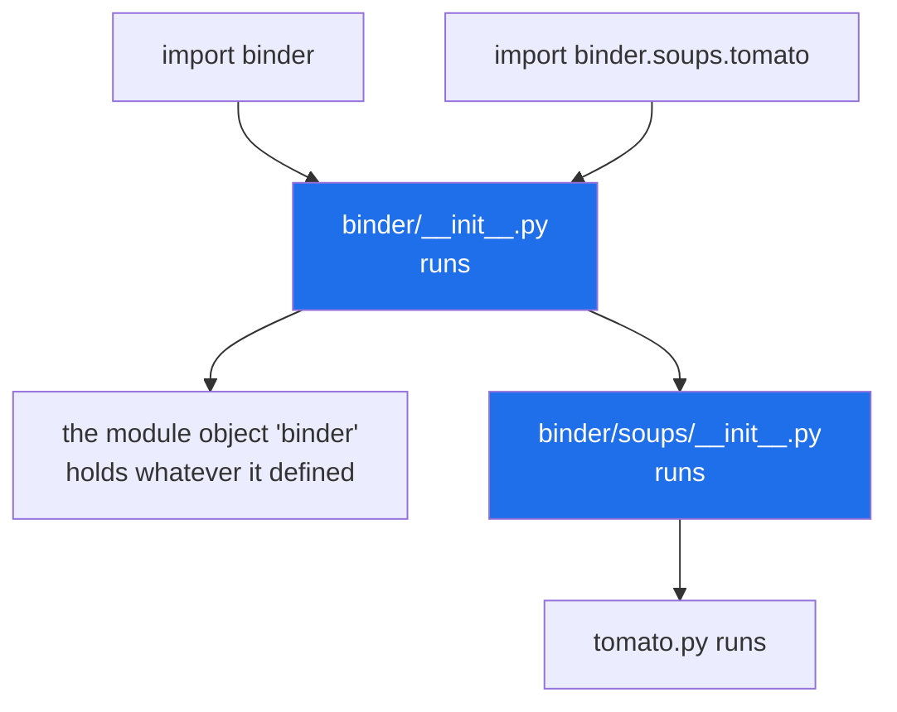

# 3.2 — `__init__.py`: the front page of the section

## One-line answer

`__init__.py` **is** the package's own module: importing the folder runs that one file, and every name it
leaves behind becomes an attribute of the package.

---

## The story

Behind each divider in the binder there is one sheet before the recipes start.

Most of them are blank. They are there because the dividers came in a pack with sheets attached, and
nobody took them out.

One of them is not blank. Behind "soups" somebody has written, on that first sheet: *soups — whose turn
it is to make stock this week, and the pot we do not use because the handle is loose.*

That sheet is not a recipe. You do not cook it. But it is the first thing anybody sees when they open the
binder at soups, and everything written on it applies to the whole section.

And it is read every single time somebody opens that divider, whether they came for the front sheet or
for the tomato soup two pages behind it.

---

## The idea in plain language

`__init__.py` is a normal Python file with a special job: it is the code of the package folder it sits
in. There is nothing else magic about it. Everything you know from
[1.1](../01-the-module/1.1-a-module-is-a-file-that-has-already-run.md) applies unchanged — it runs top to
bottom, once, at the first import of the package.

Two facts, and everything in [3.3](3.3-what-goes-in-init.md) follows from them.

**`import binder` means "run `binder/__init__.py`".** The package object you get back *is* that file's
module object. `binder.__file__` is the path to it.

**Names defined in it are attributes of the package.** Put `OWNER = "the flat"` in `binder/__init__.py`
and `binder.OWNER` works. This is how a package offers a surface of its own, above the modules inside it:
`from setu import Paper` is possible only because something in `setu/__init__.py` bound the name `Paper`.

Three details that people trip over.

**It may be completely empty, and often should be.** An empty `__init__.py` is a valid, deliberate,
common choice: it declares "this folder is a package" and promises nothing else. `src/setu/__init__.py`
in this repository is empty right now, and `src/setu/README.md` says so on purpose.

**`from package import submodule` imports the submodule even if `__init__.py` never mentions it.** This
is a special case built into the `from` form: it looks for the name as an attribute first, and if it is
not there, it tries to import a submodule of that name. So `from binder import breads` works with an
empty front page — which is why `from setu import config` works today.

**It runs on the way to anything below it.** `import binder.soups.tomato` runs `binder/__init__.py` even
though nothing in it was wanted ([3.1](3.1-a-package-is-a-folder.md)). That is the whole cost side of the
argument in [3.3](3.3-what-goes-in-init.md).

One historical note, because it explains code you will read: before Python 3.3 the file was **required**,
and a folder without one was not importable at all. That changed with *PEP 420 — Implicit Namespace
Packages* (2012, <https://peps.python.org/pep-0420/>), which is [3.4](3.4-the-missing-init.md)'s subject.
It is why old advice says "you must always add an empty `__init__.py`", and why the modern answer is "you
usually still should, but for different reasons".

---

## Why Setu needs it

- **`src/setu/__init__.py` exists and is empty**, and today is the day you decide whether it stays that
  way ([3.3](3.3-what-goes-in-init.md)). Deciding needs this document first.
- **`tests/__init__.py` exists for a different reason entirely** — to make `tests` a package so two test
  files with the same basename cannot collide
  ([1.4](../01-the-module/1.4-the-name-that-changes.md)). Same file, same emptiness, different argument.
- **From Phase 19 `setu` gains subpackages**, each with a front page, each of which runs on the way to
  everything under it.
- **Day 240's capstone is imported by a web process** whose start-up time is measured, and the front pages
  are where that time is spent or saved.

---

## The mechanism

A front page that actually says something:

```python
"""The front page of the binder."""

print("[binder/__init__] the front page is being read")

OWNER = "the flat"


def contents():
    return ["soups", "breads"]
```

**Line by line:**

- The file is `binder/__init__.py`. Its **location is its whole specialness**; the contents are ordinary
  Python.
- `"""The front page of the binder."""` — this becomes `binder.__doc__`, which is what `help(binder)`
  shows. A package's docstring lives here and nowhere else.
- `print(...)` — proof that the file runs. In real code nothing at the outer level should print, and this
  is here only to make the run order visible.
- `OWNER = "the flat"` — an outer-level assignment, so after the import `binder.OWNER` exists. **This is
  what "the package has a surface of its own" means.**
- `def contents():` — likewise, `binder.contents` is a function on the package. Note it does not touch
  the subpackages; it returns their names as strings, so importing the package stays cheap.

```python
import binder

print("binder.OWNER    :", binder.OWNER)
print("binder.contents():", binder.contents())
print("binder.__name__ :", binder.__name__)
```

**Line by line:**

- `import binder` — runs the front page and binds the package object.
- `binder.OWNER` — an attribute lookup on the package, resolved in the module object that `__init__.py`
  filled in. It is exactly the mechanism from
  [Day 12, 2.1](../../../day-12-classes/parts/02-attribute-lookup/2.1-the-instance-dict.md), applied to a
  module rather than an instance.
- `binder.__name__` — `binder`, not `binder.__init__`. The file is called `__init__.py` and the module is
  called `binder`; that renaming is the only sleight of hand in the whole mechanism.

Run on Python 3.12.12 on 2026-09-02:

```
[binder/__init__] the front page is being read
binder.OWNER    : the flat
binder.contents(): ['soups', 'breads']
binder.__name__ : binder
```

Now the special case in the `from` form. `binder/__init__.py` says nothing at all about `breads`:

```python
from binder import breads

print("got", breads.__name__)
```

**Line by line:**

- `from binder import breads` — Python runs `binder/__init__.py`, looks for an attribute called `breads`,
  does not find one, and **then tries to import `binder.breads` as a submodule**. That fallback is the
  detail worth knowing.
- `breads.__name__` — prints the full dotted name, proving that what you got is the subpackage and not
  something the front page happened to define.

```
[binder/__init__] the front page is being read
[breads/__init__] the breads divider
got binder.breads
```

**Both front pages ran** — the package's and the subpackage's — and neither file mentions the other.

And the empty case, which is the common one:

```text
$ printf '' > binder/breads/__init__.py
$ uv run python -c "
import binder.breads.sourdough
print('still works:', binder.breads.sourdough.recipe())
"
[binder/__init__] the front page is being read
[breads/sourdough] read
still works: flour, water, starter, salt
```

The `[breads/__init__]` line is gone because that file is now empty, and everything else is unchanged.
**An empty front page costs nothing and promises nothing**, which is exactly what most of them should do.

Where the front page sits:



Every arrow into the blue boxes is a cost you pay for reaching anything below them.

---

## When it breaks

**A front page that raises makes the whole subtree unimportable:**

```text
$ uv run python -c "import binder.soups.tomato"
Traceback (most recent call last):
  File "<string>", line 1, in <module>
  File "...\pkg\binder\__init__.py", line 1, in <module>
    raise RuntimeError("the front page is torn")
RuntimeError: the front page is torn
```

**What it means.** Nothing under `binder/` can be imported, by anyone, for any reason. The most common
real cause is an `__init__.py` that imports an optional dependency at its outer level: the package works
on the developer's machine and every import in it fails in the environment where that dependency is
absent. **The fix is to move the risky import into the module that needs it**, so that only that module
fails and the rest of the package still works.

**The name is there but the module is not:**

```text
$ uv run python -c "
import binder
print(binder.soups)
"
[binder/__init__] the front page is being read
Traceback (most recent call last):
  File "<string>", line 3, in <module>
AttributeError: module 'binder' has no attribute 'soups'
```

**What it means.** [3.1](3.1-a-package-is-a-folder.md)'s sibling problem, seen from the front page's side.
`import binder` runs only `binder/__init__.py`; it does not go looking in the folder. If you want
`binder.soups` to exist after a bare `import binder`, the front page has to say `from . import soups` —
and that is a choice with a cost, which is [3.3](3.3-what-goes-in-init.md).

**A misspelt filename, which produces no error and no package behaviour:**

```text
$ ls binder/
__init___.py    soups/    breads/
$ uv run python -c "import binder; print(binder.__file__)"
None
```

**What it means.** `__init___.py`, with three trailing underscores, is not `__init__.py`. Since Python 3.3
the folder is still importable — as a *namespace package* ([3.4](3.4-the-missing-init.md)) — so there is no
error, and `binder.__file__` is `None` instead of a path. That `None` is the tell. Before 3.3 this typo
produced an immediate `ImportError`, which was less pleasant and far easier to diagnose.

**Import-time work in a front page, timed:**

```text
$ uv run python -X importtime -c "import binder" 2>&1 | tail -2
import time:      2734 |       2734 | binder
```

**What it means.** Nothing is broken; this is the measurement to take before an argument about what
belongs in an `__init__.py`. A front page that imports its whole subtree turns that number into the cost
of the entire package, paid by every process that touches any part of it. Run this on the packages you
depend on and the numbers are sometimes startling.

---

## In production

**The professional default is an empty `__init__.py`, and anything else is a decision with a written
reason.** Empty means the folder is a package and nothing more: importing it is free, it cannot fail, and
it forces callers to name the module they actually want, which makes the import graph readable. Every
line you add moves cost and risk from one module to the whole package.

**What changes at scale is that front pages become the load-bearing part of start-up time.** In a large
codebase, `import app.services.billing` may run eight `__init__.py` files, and if three of them "helpfully"
re-export their subtrees, one import loads half the application. The measurable symptoms are slow test
collection, a command-line tool that pauses before printing `--help`, and cold starts. This is why mature
libraries increasingly keep their top-level `__init__.py` thin, and some define `__getattr__` at module
level to import on first use — *PEP 562 — Module `__getattr__` and `__dir__`* (2017,
<https://peps.python.org/pep-0562/>).

**The failure that only appears with real data is the front page that reads configuration.** A team puts
`SETTINGS = load_settings()` in `app/__init__.py` because it is convenient. It works, until a management
command that touches nothing configurable fails at start-up in an environment with no settings file, and
until a test cannot override the settings because they were read at import
([1.1](../01-the-module/1.1-a-module-is-a-file-that-has-already-run.md)). The failure is always at the
edge — the small script, the migration, the health check — rather than in the application it was written
for.

**The review comment a senior engineer leaves.** *"This `__init__.py` imports `boto3` at the top to build
a client. That makes `import app` require network configuration, so `app.utils.slugify` cannot be used in
a unit test without credentials. Move the client into `app/aws.py` behind a function, and leave the front
page empty."*

**The interview question.** *"What is `__init__.py` for?"* The weak answer is "it marks a folder as a
package", which has not been strictly true since Python 3.3. The used answer is that it *is* the package's
module — importing the folder runs that file, and the names it binds become the package's attributes — and
then the consequence: it runs on the way to every module beneath it, so what goes in it is a cost paid by
everyone, and the default is empty.

---

## Check yourself

```bash
uv run python -c "
import setu

print('setu.__file__ :', setu.__file__)
print('__init__.py is', setu.__file__.endswith('__init__.py'))
print('what it defines:', [n for n in dir(setu) if not n.startswith('_')])
from setu import config
print('and from setu import config still works:', config.__name__)
"
```

The third line is an empty list, and the fourth still works. Say why both of those are true at once.

**Answer out loud, without scrolling up:**

> `binder/__init__.py` is empty and `binder/breads/` is a folder inside it. Explain why
> `from binder import breads` works anyway, and what would have to change for `import binder` alone to
> give you `binder.breads`.

---

**Next:** [3.3 — what to put in `__init__.py`, and what it costs](3.3-what-goes-in-init.md).
