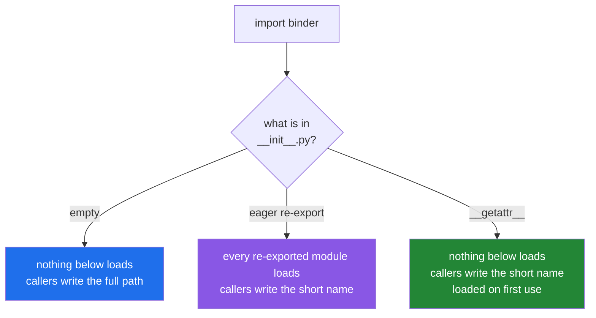

# 3.3 — What to put in `__init__.py`, and what it costs

## One-line answer

Anything you re-export from a front page is loaded by **everyone who touches the package**, so the choice
is between a short import for callers and a cheap import for the process — and you can have both, with
`__getattr__`.

---

## The story

Somebody got tired of saying "binder, soups, tomato" and copied the two recipes everyone actually makes
onto the front page of the binder. Now it is just "binder, tomato". Two words instead of three, and it
genuinely is nicer.

The cost showed up somewhere nobody was looking.

The person who came in to borrow the *bread* recipe now has to read past both copied recipes to get to
the dividers. So does the person checking whose turn it is to buy milk. So does everybody, every time,
because the front page is the first page.

Which is fine with two recipes. The front page has forty on it now — somebody added theirs, then somebody
else did, and no single addition was unreasonable — and opening the binder to check one thing means going
through all forty.

Nobody decided to make it that way. Every step was an improvement.

---

## The idea in plain language

A front page can bind names of its own ([3.2](3.2-init-py-is-the-front-page.md)), so the tempting move is
to pull the good things up from below:

```text
# binder/__init__.py
from binder.soups.tomato import recipe as tomato
```

That is called **re-exporting**, and it gives callers a flat, short surface: `from binder import tomato`
instead of `from binder.soups.tomato import recipe`. Libraries do it constantly, and for a library it is
usually right — the package's public surface is a promise, and a promise is easier to keep when it is
stated in one file.

The cost is exact and easy to state. **Anything a front page imports is loaded whenever the package is
touched at all**, including by somebody who wanted a different module entirely, because that front page
runs on the way down ([3.1](3.1-a-package-is-a-folder.md)). Re-export ten modules and `import
mypkg.anything` loads all ten.

So there are three positions, and each is right somewhere.

**Empty.** Costs nothing, promises nothing, cannot fail. Callers write the full path, which is more typing
and more information at the call site. This is the right default for an application, and it is what
`src/setu/__init__.py` does today — `src/setu/README.md` states it as a rule.

**Re-export a small, stable surface.** Right for a library with a clear public API and a small number of
central names. Pair it with `__all__` so the surface is declared rather than implied
([1.2](../01-the-module/1.2-the-four-import-forms.md)), and keep the list short enough that adding to it
feels like a decision.

**Re-export lazily.** Define `__getattr__` at module level and import on first use. Callers get the short
name, the process pays nothing until the name is actually touched, and `__all__` still documents the
surface. The mechanism is *PEP 562 — Module `__getattr__` and `__dir__`* (2017,
<https://peps.python.org/pep-0562/>): when a name is not found on a module, Python calls the module's
`__getattr__` with it. It is what several large libraries moved to when their import time became a
problem.

Three things that should never be in a front page, in any of the three positions: **work** — no file
reads, no network, no client construction ([1.1](../01-the-module/1.1-a-module-is-a-file-that-has-already-run.md));
**an optional dependency**, because its absence then breaks every import in the package
([3.2](3.2-init-py-is-the-front-page.md)); and **`from .module import *`**, which makes the package's
surface unknowable to a reader and to a linter.

---

## Why Setu needs it

- **Today's build is exactly this decision for `src/setu/`**, written down as two sentences in the hub's
  §4. An undecided front page grows by accident, which is the story above.
- **Day 172's router lives in `setu.router`**, and if `setu/__init__.py` re-exports it, then every test in
  this repository — including ones about string cleaning — imports four provider client libraries.
- **Phase 19's `setu.rag` subpackage will be the first real candidate for a re-export**, because it has a
  genuine public surface of three or four names and a lot of internals.
- **`./m check` runs the whole suite on every push** (Principle 7), so package import cost is multiplied
  by the number of test modules, and this is the file that decides it.

---

## The mechanism

Three front pages for the same package, measured.

**One — empty.** The baseline, on Python 3.12.12 on 2026-09-02:

```text
$ printf '' > binder/__init__.py
$ uv run python -X importtime -c "import binder" 2>&1 | grep -i binder
import time:      2210 |       2210 | binder
```

Two thousand microseconds, and **nothing below the package was loaded**.

**Two — eager re-export:**

```python
"""The binder: a front page that re-exports the two recipes people actually ask for."""

from binder.breads.sourdough import recipe as sourdough
from binder.soups.tomato import recipe as tomato

__all__ = ["sourdough", "tomato"]
```

**Line by line:**

- `from binder.breads.sourdough import recipe as sourdough` — an **absolute** import, naming the package
  from the top. A relative `from .breads.sourdough import recipe` does the same thing and is the more
  common style in a front page; both are covered in
  [3.5](3.5-absolute-and-relative-imports.md).
- `as sourdough` — renaming at the boundary, because two modules both call their function `recipe` and a
  flat surface cannot have two of them. **This is the moment a package designs its vocabulary**, and it is
  the main argument in favour of re-exporting at all.
- `__all__ = [...]` — the declared public surface. It controls `from binder import *` and, more usefully,
  tells a reader and a linter that these two names are exported deliberately rather than left lying
  around ([1.2](../01-the-module/1.2-the-four-import-forms.md)).
- **What is not here:** any call. The file imports and renames, and does no work.

Callers get the short form:

```python
from binder import sourdough, tomato

print("tomato   :", tomato())
print("sourdough:", sourdough())
```

**Line by line:**

- `from binder import sourdough, tomato` — one line, one module named, two functions. Compare with the two
  four-dot imports it replaces; this is the whole benefit.
- `tomato()` — the function is `binder.soups.tomato.recipe`, reached under a name that no longer says
  where it lives. That is the benefit and the cost in one call.

```
[breads/__init__] the breads divider
[breads/sourdough] read
[soups/__init__] the soups divider
[soups/tomato] read
tomato   : tomatoes, stock, basil
sourdough: flour, water, starter, salt
```

Four files ran before the first print. Now measure it:

```text
$ uv run python -X importtime -c "import binder" 2>&1 | grep -i binder
import time:      1382 |       1382 |     binder.breads
import time:      1183 |       2564 |   binder.breads.sourdough
import time:      1242 |       1242 |     binder.soups
import time:      1143 |       2384 |   binder.soups.tomato
import time:      2237 |       7185 | binder
```

**7185 against 2210** — the package costs three times as much to import, and the command asked for nothing
but the package. With two tiny modules that is a rounding error. With twenty modules that each import
`pandas`, it is your test suite's start-up.

**Three — lazy re-export**, which gets the short name without the cost:

```python
"""A front page that promises names without loading them."""

import importlib

_LAZY = {"tomato": "binder.soups.tomato", "sourdough": "binder.breads.sourdough"}

__all__ = sorted(_LAZY)


def __getattr__(name):
    if name in _LAZY:
        return importlib.import_module(_LAZY[name]).recipe
    raise AttributeError(f"module {__name__!r} has no attribute {name!r}")


def __dir__():
    return sorted(__all__)
```

**Line by line:**

- `import importlib` — the function form of the `import` statement, which is what you need when the module
  name is a variable rather than something you can type
  ([1.3](../01-the-module/1.3-sys-modules.md); it consults the same `sys.modules`).
- `_LAZY = {...}` — a dictionary from exported name to the module that provides it. The leading underscore
  keeps it out of star imports and marks it private
  ([Day 13, 3.1](../../../day-13-inheritance-and-abstraction/parts/03-encapsulation/3.1-public-protected-private.md)).
- `__all__ = sorted(_LAZY)` — iterating a dictionary gives its keys
  ([Day 8, 2.3](../../../day-08-containers/parts/02-sets-and-dicts/2.3-a-dict-is-ordered-now.md)), so the
  declared surface cannot drift from the table that implements it. One source of truth, not two.
- `def __getattr__(name):` — **at module level, not in a class.** Python calls it only when normal
  attribute lookup on the module has already failed, so it costs nothing on names that exist.
- `importlib.import_module(_LAZY[name]).recipe` — imports on first use and returns the function.
  `sys.modules` caches the module, so the second lookup is a dictionary hit rather than a second import.
- `raise AttributeError(...)` — **not optional.** Without it, an unknown name returns `None`, `hasattr`
  becomes `True` for everything, and `from binder import nonsense` succeeds. The message copies the
  wording Python itself uses, so the failure is indistinguishable from an ordinary one.
- `def __dir__():` — makes `dir(binder)` and tab-completion show the lazy names, which they otherwise
  would not, because those names do not exist until asked for.

```text
$ uv run python -c "
import binder
print('imported the package; nothing above this line')
print('dir(binder):', dir(binder))
print('now ask for one:', binder.tomato())
"
imported the package; nothing above this line
dir(binder): ['sourdough', 'tomato']
[soups/__init__] the soups divider
[soups/tomato] read
now ask for one: tomatoes, stock, basil
```

**Nothing printed before the first line** — the subpackages were not loaded. `dir()` still advertises both
names. And `binder.tomato()` loaded `soups` at that moment, and only `soups`; `breads` was never touched.

```text
$ uv run python -X importtime -c "import binder" 2>&1 | grep -i binder
import time:      2815 |       5182 | binder
```

Roughly the empty-front-page cost, plus `importlib`, and with the short names still available.

The three positions, side by side:



---

## When it breaks

**A `__getattr__` with no `raise`:**

```text
$ uv run python -c "import binder; binder.risotto"
Traceback (most recent call last):
  File "<string>", line 1, in <module>
  File "...\binder\__init__.py", line 13, in __getattr__
    raise AttributeError(f"module {__name__!r} has no attribute {name!r}")
AttributeError: module 'binder' has no attribute 'risotto'
```

**What it means.** That is the *correct* behaviour, shown so you know what you are protecting. Delete the
`raise` and the function falls off the end returning `None`; `binder.risotto` is then `None`, `hasattr`
is `True` for every name you can spell, and a typo becomes a `TypeError: 'NoneType' object is not
callable` somewhere else entirely. The `raise` is the whole contract.

**A front page that imports an optional dependency.** `binder/__init__.py` re-exports one name from
`binder/scales.py`, and `scales.py` needs a package that is not installed:

```text
$ uv run python -c "import binder.soups.tomato"
Traceback (most recent call last):
  File "<string>", line 1, in <module>
  File "...\pkg\binder\__init__.py", line 3, in <module>
    from binder.scales import weigh
  File "...\pkg\binder\scales.py", line 3, in <module>
    import faiss
ModuleNotFoundError: No module named 'faiss'
```

**What it means.** The command asked for tomato soup. It got a vector-search library. **Every import
anywhere in the package now requires `faiss`**, because the front page runs on the way down
([3.1](3.1-a-package-is-a-folder.md)) and it reaches for `scales`, which reaches for `faiss`. The package
is unusable in any environment without that dependency, and a unit test about string handling now needs a
native library installed. The fix is to stop re-exporting `scales` from the front page, or to make it
lazy — either way the failure moves back to the one module that actually needs the dependency, and only
callers of that module pay.

**Circular imports caused by a helpful front page.** `setu/__init__.py` imports `setu.router`, and
`setu/router.py` does `from setu import config`. That second line runs `setu/__init__.py`, which is
already half-executed, and you get `ImportError: cannot import name 'config' from partially initialized
module 'setu'`. **A re-exporting front page is the most common source of circular imports in a
package**, and [4.2](../04-the-project/4.2-the-circular-import.md) is the full diagnosis.

**`from .module import *` in a front page:**

```python
from binder.soups import *  # noqa: F403
from binder.breads import *  # noqa: F403
```

**Line by line:**

- `from binder.soups import *` — brings whatever `binder/soups/__init__.py` currently exposes, which is
  not written down anywhere in this file.
- The second star import silently overwrites any name the first one brought
  ([1.2](../01-the-module/1.2-the-four-import-forms.md)), and the order of these two lines is now part of
  the package's public behaviour.
- `# noqa: F403` twice — the linter objecting twice, silenced twice.

**What it means.** The package's public surface is now "whatever those two files happen to define today",
so adding a helper called `parse` inside a soup module changes the package's API without anybody touching
the front page. Removing one changes it back. There is no line anywhere that a reader can consult to find
out what `binder` exports. Name the imports and set `__all__`.

---

## In production

**The professional rule is that a front page contains imports and `__all__`, or nothing at all.** For an
application, "nothing at all" is nearly always right: the callers are your own code, the full dotted path
is more informative at the call site, and there is no public API to protect. For a library, a small
declared surface is right, because that surface is a compatibility promise and it should be visible in
one file.

**What changes at scale is that eager re-exports become the dominant cost of importing anything.** Large
libraries have all been through this: a convenient top-level surface grows until `import thelib` takes
half a second, and the fix is either splitting the package or `__getattr__`. If you are writing a package
that other people import, measure `python -X importtime -c "import yourpkg"` before and after every
addition to the front page — it is one command, and it is the only way the number stays honest.

**The failure that only appears with real data is the front page that makes an optional dependency
mandatory.** It passes every test on a developer machine where everything is installed. It fails in the
slim container, in the documentation build, in the tool that only needed one helper, and in the user's
environment who wanted the CSV part of your library and not the GPU part. Every "extras" install option a
library offers is undermined by one eager import in `__init__.py`.

**The review comment a senior engineer leaves.** *"This adds four more re-exports to `__init__.py`, which
takes `import setu` from two milliseconds to forty because two of them pull in `pandas`. If we want the
short names, make the front page lazy with a module-level `__getattr__` and a name-to-module table —
otherwise leave it empty and let callers import `setu.rag.retriever` directly."*

**The interview question.** *"What do you put in `__init__.py`?"* The recited answer is "nothing" or "your
public API". The used answer explains the trade: whatever the front page imports is loaded for everybody
who touches the package, because it runs on the way to every module beneath it — so a re-export buys
callers a shorter name and charges the whole process for it. Then the third option, which is the one
people rarely have: a module-level `__getattr__` gives the short name and defers the import to first use,
with `__all__` and `__dir__` keeping the surface discoverable.

---

## Check yourself

```bash
uv run python -X importtime -c "import setu" 2>&1 | grep -i " setu"
uv run python -c "print('exports:', [n for n in dir(__import__('setu')) if not n.startswith('_')])"
```

An empty front page and an empty export list. Now write one `from setu import config` line into
`src/setu/__init__.py`, re-run the first command, and compare the number — then decide, in writing, whether
you want it.

**Answer out loud, without scrolling up:**

> Your package's front page re-exports ten modules and one of them imports `pandas`. What does that cost
> the person who only wanted `mypkg.utils.slugify`, and what are the two ways to give them the short name
> anyway?

---

**Next:** [3.4 — the missing `__init__.py` that works until it does not](3.4-the-missing-init.md).
