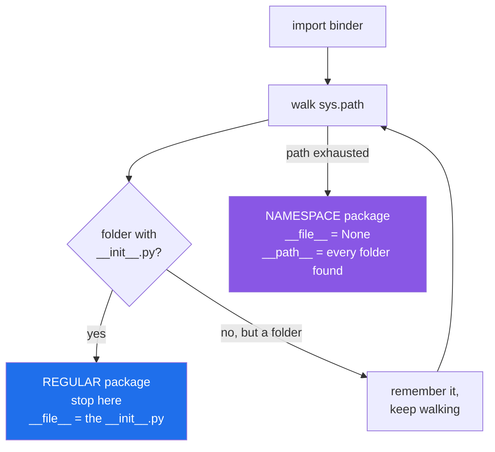

# 3.4 — The missing `__init__.py` that works until it does not

## One-line answer

Since Python 3.3 a folder with no `__init__.py` is still importable — as a **namespace package**, which
silently merges every folder of that name on the path, so a typo becomes an empty module that imports
successfully.

---

## The story

The binder has dividers, and the dividers have front sheets — except one, where the front sheet fell out
and nobody noticed.

For a long time nothing happened. You open the binder at "breads" and the recipes are there, front sheet
or no front sheet.

Then the housemate came back from their parents' with their own binder, and it also has a "breads"
divider, and both binders went on the same shelf.

Now when somebody asks for breads, they get **both sections at once**, joined together as if they had
always been one. That is not what anybody would have designed, and for a while it is even convenient —
there are more bread recipes than there used to be.

The trouble arrives on the day the two disagree. Both binders have a sourdough card, and which one you
get depends on which binder went on the shelf first — a fact nobody wrote down and nobody remembers.

And the other trouble: somebody labelled a divider **breds**, and asking for "breds" now works. There is
a divider with that name. It is empty, but it is there, so nothing tells you anything is wrong.

---

## The idea in plain language

Before Python 3.3, a folder without `__init__.py` was not importable. You got an `ImportError`, and it was
clear.

*PEP 420 — Implicit Namespace Packages* (2012, <https://peps.python.org/pep-0420/>) changed that. Now,
when Python is looking for `binder` and finds a **folder** of that name with no `__init__.py`, it does not
give up and it does not stop: it notes the folder, keeps walking the rest of `sys.path`, collects every
other `binder/` folder it finds, and builds a single module whose `__path__` is all of them.

That thing is a **namespace package**. Two ways to recognise one:

- **`__file__` is `None`.** There is no `__init__.py`, so there is no file to name.
- **`__path__` is a `_NamespacePath`, not a list**, and it holds every contributing folder.

The feature exists for a real reason: it lets separately-installed distributions contribute subpackages
to one shared top-level name. That is how `zope.interface` and `zope.component` used to work, and how
plugin namespaces work today.

For an ordinary application it is almost always an accident, and it causes three specific problems.

**A typo imports.** Misspell a folder, or import a folder that was never meant to be a package, and you
get a namespace package with nothing in it. No error. The failure lands later, as `AttributeError` or as
a mysteriously empty result.

**Two folders merge invisibly.** Two projects on the path, both with a `binder/`, and you now have one
package assembled from both. Which module wins a name collision depends on `sys.path` order, which is set
by install order and by the launcher ([2.1](../02-finding-it/2.1-sys-path.md)).

**Adding one `__init__.py` breaks the merge.** A **regular** package — one with `__init__.py` — stops the
search dead. So the day somebody adds a front page to one of the two folders, the other folder's modules
vanish, and the error is `ModuleNotFoundError` for a folder that is plainly still on disk.

The rule that avoids all of it: **if you meant it to be a package, put an `__init__.py` in it**, even an
empty one. Rely on namespace packages only when you are deliberately splitting one namespace across
distributions, and write down that you are.

---

## Why Setu needs it

- **`src/setu/__init__.py` exists**, and this is the document that says why an empty file is worth
  committing rather than deleting as clutter.
- **`tests/__init__.py` exists too**, and without it `tests/` would be a namespace package — which is one
  of the two things that produce `pytest`'s "import file mismatch"
  ([1.4](../01-the-module/1.4-the-name-that-changes.md)).
- **From Phase 19 every new subpackage gets one on creation.** A subpackage created without one works
  immediately, which is exactly why the omission survives to the day it matters.
- **Day 209's MCP work touches plugin-style layouts**, where namespace packages are the intended
  mechanism rather than an accident — and telling the two apart is this document.

---

## The mechanism

Two separate trees, on two separate path entries, neither with any `__init__.py`:

```text
ns/
├── a/
│   └── binder/
│       └── soups/
│           └── tomato.py       recipe() -> "tomatoes, stock, basil"
└── b/
    └── binder/
        └── breads/
            └── sourdough.py    recipe() -> "flour, water, starter, salt"
```

With both `a` and `b` on the path:

```python
import binder

print("type    :", type(binder).__name__)
print("__file__:", binder.__file__)
print("__path__:", list(binder.__path__))

import binder.breads.sourdough
import binder.soups.tomato

print("soup    :", binder.soups.tomato.recipe())
print("bread   :", binder.breads.sourdough.recipe())
```

**Line by line:**

- `import binder` — succeeds, with no `__init__.py` anywhere in either tree. Before Python 3.3 this line
  was an `ImportError`.
- `type(binder).__name__` — still `module`. A namespace package is an ordinary module object; the
  difference is in its attributes, not its type, so `isinstance` will not tell you.
- `binder.__file__` — **`None`.** This is the single clearest signal, and the first thing to print when a
  package behaves strangely.
- `list(binder.__path__)` — two folders, from two different `sys.path` entries, in path order.
- the two imports and two calls — modules from *both* trees, reachable under one package name, as though
  somebody had designed it that way.

Run on Python 3.12.12 on 2026-09-02, with `PYTHONPATH` naming both folders:

```
type    : module
__file__: None
__path__: ['...\ns\a\binder', '...\ns\b\binder']
soup    : tomatoes, stock, basil
bread   : flour, water, starter, salt
```

And the object that `__path__` is:

```text
$ uv run python -c "
import binder
print(type(binder.__path__).__name__)
print(repr(binder.__path__)[:80])
"
_NamespacePath
_NamespacePath(['C:\\Users\\NISHA_~1\\AppData\\Local\\Temp\\claude\\c--Users-nis
```

`_NamespacePath`, not `list` — it recomputes itself if `sys.path` changes, which a plain list would not.

Now add **one empty `__init__.py`** to `a/binder/` and change nothing else:

```text
$ printf '' > a/binder/__init__.py
$ uv run python -c "
import binder
print('__path__:', [p.split('ns')[-1] for p in binder.__path__])
import binder.breads.sourdough
"
__path__: ['\a\binder']
Traceback (most recent call last):
  File "<string>", line 5, in <module>
ModuleNotFoundError: No module named 'binder.breads'
```

**One empty file removed half the package.** `a/binder/` is now a regular package, so the search stops
there; `b/binder/` is no longer part of `binder` at all, and `binder.breads` does not exist. Nothing was
deleted, nothing moved, and the traceback points at a folder that is still on disk.

Regular against namespace:



---

## When it breaks

**The typo that imports:**

```text
$ uv run python -c "
import bindr
print('imported a folder that has nothing in it')
print('__file__:', bindr.__file__)
print('dir     :', [n for n in dir(bindr) if not n.startswith('_')])
"
imported a folder that has nothing in it
__file__: None
dir     : []
```

**What it means. The import succeeded and there is nothing there.** `a/bindr/` is an empty folder that
somebody created by accident, and it is now a perfectly valid namespace package. Under Python 3.2 this
was an immediate `ImportError` naming the typo. Now the failure is deferred to the first attribute access,
which may be in another file, and reads as "why is this module empty" rather than "you spelled it wrong".
**`__file__ is None` is the diagnosis**, every time.

**The merge that made two projects into one.** Two of your own projects, both installed editable into one
environment ([2.4](../02-finding-it/2.4-uv-run-and-the-editable-install.md)), both with a top-level
`utils/` folder and neither with an `__init__.py`. `import utils.text` resolves into whichever tree comes
first on `sys.path`, which depends on install order. The same source, the same commit, two behaviours on
two machines. It is [2.3](../02-finding-it/2.3-shadowing-the-standard-library.md)'s failure with an extra
twist: the two are *merged*, so half the modules come from each and the mixture looks plausible.

**`pytest` collecting the wrong thing.** Without `tests/__init__.py`, `tests/` is a namespace package and
each test file is imported as a top-level module named after its basename, which is why two
`test_utils.py` files in different folders collide
([1.4](../01-the-module/1.4-the-name-that-changes.md)). Adding an empty `tests/__init__.py` makes the
modules `tests.unit.test_utils` and `tests.integration.test_utils`, and the collision disappears. This
repository has that file for exactly this reason.

**Deleting an `__init__.py` "because it is empty".** It is a real temptation — the file has nothing in it,
and a tidy-up removes it. Everything keeps working, so the commit is merged. The package silently becomes
a namespace package, and months later somebody installs a dependency that happens to contain a folder of
the same name, and the two merge. **An empty `__init__.py` is not clutter; it is an assertion**, and it is
worth a comment saying so if your team is prone to tidying.

**A namespace package that cannot be installed properly.** Build tools have to be told about namespace
packages explicitly, and a package folder that lost its `__init__.py` is easy for a build backend to skip
when copying files into a wheel. The symptom is the one from
[2.4](../02-finding-it/2.4-uv-run-and-the-editable-install.md): it works in development, where the whole
source folder is on the path, and the module is missing from the container image.

---

## In production

**The professional rule is: every folder you intend as a package gets an `__init__.py`, even an empty
one.** It costs one file, it makes the intent explicit, it stops accidental merging, it turns a
misspelled import back into an immediate error, and it keeps build tools from having to guess. Namespace
packages are used deliberately, in the one situation they were designed for, and that use is documented
where somebody will find it.

**What changes at scale is that the merge becomes a supply-chain surface.** If your top-level package is a
namespace package, any distribution that ships a folder of the same name contributes modules to it, and
`sys.path` order decides who wins. In a large dependency tree you do not control that ordering. A regular
package's `__init__.py` ends the search at the first hit, which is the behaviour you want for code you
ship — one owner per name.

**The failure that only appears with real data is the module that is present but empty.** Because a
namespace package imports successfully, `try: import x except ImportError:` does not detect a missing
plugin folder — the import works and the package has no contents, so a feature-detection check reports
"available" and the first real call fails with `AttributeError`. Any code that probes for optional
components should check for the attribute it actually needs, not for the import.

**The review comment a senior engineer leaves.** *"This PR deletes six empty `__init__.py` files as dead
weight. They are not dead: each one makes its folder a regular package, which stops it merging with any
same-named folder on the path and keeps the wheel build from missing it. Put them back, and add a comment
in one of them explaining why they are empty."*

**The interview question.** *"Do you still need `__init__.py`?"* The trap is answering "no, not since
Python 3.3". The used answer is: not to make a folder importable — a folder without one becomes a
namespace package — but yes, in practice, because a namespace package merges every same-named folder on
`sys.path` into one package, makes a misspelled folder import successfully with nothing in it, and gives
`__file__ is None`. You want an implicit namespace package only when you are deliberately splitting one
namespace across distributions.

---

## Check yourself

```bash
uv run python -c "
import setu

import tests

for pkg in (setu, tests):
    print(pkg.__name__, '-> __file__ is', 'None (namespace!)' if pkg.__file__ is None else 'a real file')
"
```

Both say "a real file". Now rename `src/setu/__init__.py` to `src/setu/__init__.bak`, run it again, read
the difference — then rename it back.

**Answer out loud, without scrolling up:**

> You add an empty `__init__.py` to a folder and a colleague's import of a completely different folder
> stops working. Explain what those two folders had in common and what your file changed.

---

**Next:** [3.5 — absolute and relative imports](3.5-absolute-and-relative-imports.md).
