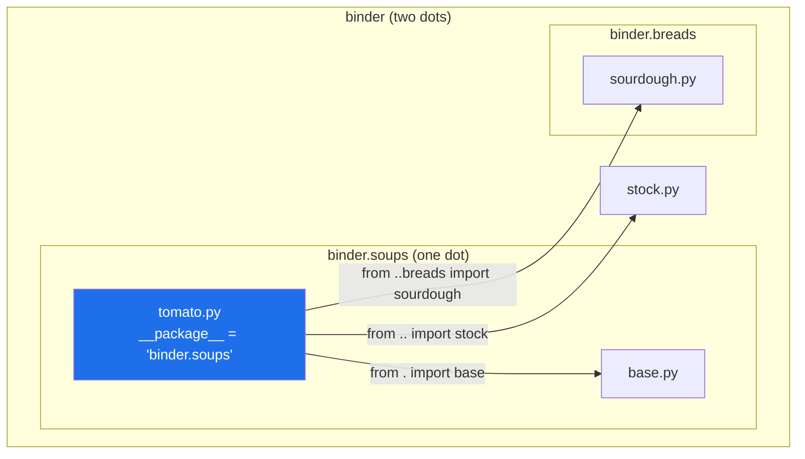

# 3.5 — Absolute and relative imports

## One-line answer

An absolute import names the package from the top; a relative import counts dots outward from **the
package the file is in** — which only works if Python knows what package that is, and it does not when
you launch the file directly.

---

## The story

Two ways to give directions to the sourdough card.

The first: *kitchen shelf, blue binder, breads divider, third card.* It works from anywhere in the flat.
It is longer, and if the binder is moved to the hall you have to correct every set of directions anybody
ever wrote.

The second, said by somebody already standing at the binder with the soups divider open: *one back, then
breads, third card.* Shorter, obviously correct, and it survives the binder moving to the hall without a
word changing.

But it only means anything if you know where the person is standing. Read out over the phone to somebody
in a different flat, "one back, then breads" is not shorter directions — it is not directions at all.

---

## The idea in plain language

Every import you have written so far is **absolute**: it names the module from the top of `sys.path`
downward. `import binder.soups.tomato`. `from setu.config import REQUIRED`. It does not matter which file
the line is in.

A **relative** import names it from the current file's package outward, using leading dots:

| Written in `binder/soups/tomato.py` | Means |
|---|---|
| `from . import base` | `binder.soups.base` — a sibling, same folder |
| `from .base import PAN` | a name out of that sibling |
| `from .. import stock` | `binder.stock` — one package out |
| `from ..breads import sourdough` | `binder.breads.sourdough` — out one, then down |

**One dot means "the package this file is in"**, not "this file" and not "this folder as a path". Each
extra dot is one package further out. The dots are counted against the *package*, so
[Day 16's `pathlib`](../../../day-16-files-and-context-managers/parts/01-the-path/1.1-a-path-is-not-a-string.md)
has nothing to do with it — this is not a filesystem path, and there is no `.` meaning "here" in the shell
sense.

What makes it work is a single attribute. Every module has `__package__`, the dotted name of the package
it belongs to, set when it was imported. In `binder/soups/tomato.py`, `__package__` is `"binder.soups"`,
and `from .. import stock` is resolved by chopping one level off that string. **No `__package__`, no
relative import** — and a file launched directly does not have one, because it was loaded as `__main__`
([1.4](../01-the-module/1.4-the-name-that-changes.md)) rather than as a member of a package.

That is the whole of the famous error, and it is worth reading in advance:
`ImportError: attempted relative import with no known parent package`.

Only the `from` form has a relative version. `import .stock` is a `SyntaxError`, and there is no way to
write it — which is why relative imports always read `from ... import ...`.

**When to use which.** Relative inside a package, for its own siblings and cousins: it says "this is
internal", and a package renamed or vendored keeps working with no edits. Absolute for everything from
outside — the standard library, dependencies, and any code that is not in your package. A common house
rule is "relative within a package, absolute across packages", and it is a good one, but the more
important rule is to pick one and be consistent, because a file with both styles for the same target is
how one module gets imported twice under two names
([1.4](../01-the-module/1.4-the-name-that-changes.md)).

Historical note, because you will see it: implicit relative imports — writing `import stock` inside
`binder/soups/` and getting `binder/soups/stock.py` — were removed in Python 3 by *PEP 328 — Imports:
Multi-Line and Absolute/Relative* (2003, <https://peps.python.org/pep-0328/>). In Python 3 a dotless
import is always absolute. Python 2 code that relies on the old behaviour looks correct and is not.

---

## Why Setu needs it

- **`src/setu/` is one package, so its modules import each other**, and today is when that style is
  chosen: `from setu.config import REQUIRED` or `from .config import REQUIRED`.
- **Phase 19's `setu.rag` subpackage** will have modules that need their siblings, which is where the
  relative form starts genuinely paying — a subpackage that can be moved without editing its own
  internals.
- **`./m done` and the scripts in `scripts/`** are launched directly, so they cannot use relative
  imports at all, which is [4.3](../04-the-project/4.3-script-versus-module.md)'s subject.
- **Day 240 packages the capstone.** A package whose internals use relative imports can be renamed or
  vendored into another distribution by renaming one folder; one that hard-codes its own name from the
  top cannot.

---

## The mechanism

The tree, all `__init__.py` files empty:

```text
rel/
└── binder/
    ├── __init__.py
    ├── stock.py               SIMMER = 45; make(litres)
    ├── soups/
    │   ├── __init__.py
    │   ├── base.py            PAN = "a heavy pan"
    │   └── tomato.py          <- the file below
    └── breads/
        ├── __init__.py
        └── sourdough.py       NAME = "sourdough"
```

And `binder/soups/tomato.py`, using all three shapes at once:

```python
"""Tomato soup, which needs stock from the folder above."""

from .. import stock
from ..breads import sourdough
from . import base


def recipe():
    return f"{base.PAN}, {stock.make(2)}, and {sourdough.NAME} on the side"
```

**Line by line:**

- `from .. import stock` — two dots is `binder`, so this is `binder.stock`. Note the shape:
  `from <package> import <module>`, which is the form that reaches a *module* rather than a name inside
  one.
- `from ..breads import sourdough` — out one to `binder`, then down into `breads`. Dots go outward only;
  there is no syntax for going inward, because down is what the dotted name after the dots is for.
- `from . import base` — one dot is `binder.soups`, this file's own package, so this imports
  `binder.soups.base` and binds the name `base`. **The `from … import` form is compulsory**; `import .base`
  does not exist.
- **The order is not alphabetical and not arbitrary.** `ruff`'s import sorting puts the most dots first,
  so a mis-ordered relative block is an `I001` in this project — run `uv run ruff check --select I` and it
  will tell you.
- `base.PAN`, `stock.make(2)`, `sourdough.NAME` — all three imported the module rather than the name, so
  every use says where it came from. That is the habit
  [1.2](../01-the-module/1.2-the-four-import-forms.md) argued for, and it matters more in a package,
  where short names collide.

```text
$ uv run python -c "
from binder.soups.tomato import recipe
print(recipe())
"
a heavy pan, simmer 2 litres, and sourdough on the side
```

What makes those dots resolvable:

```python
import binder.soups.tomato as t

print("__name__   :", t.__name__)
print("__package__:", t.__package__)

import binder.stock as s

print("stock __package__:", s.__package__)
```

**Line by line:**

- `import binder.soups.tomato as t` — the `as` form so the deep module gets a short name
  ([3.1](3.1-a-package-is-a-folder.md)).
- `t.__name__` — the full dotted name, `binder.soups.tomato`.
- `t.__package__` — **`binder.soups`**: the name with the last component removed, because `tomato` is a
  module and not a package. This string is what the dots count against.
- `s.__package__` for `binder.stock` — `binder`. Same rule.

```
__name__   : binder.soups.tomato
__package__: binder.soups
stock __package__: binder
```

Counting outward:



---

## When it breaks

**The file launched directly:**

```text
$ uv run python binder/soups/tomato.py
Traceback (most recent call last):
  File "...\rel\binder\soups\tomato.py", line 3, in <module>
    from .. import stock
ImportError: attempted relative import with no known parent package
```

**What it means.** The file was loaded as `__main__`
([1.4](../01-the-module/1.4-the-name-that-changes.md)), so its `__package__` is empty, so there is nothing
for one dot to refer to. The message is precise once you know that: *no known parent package*. The fix is
not to remove the relative imports — it is to launch it properly:

```text
$ uv run python -m binder.soups.tomato
```

which loads it as `binder.soups.tomato`, with `__package__` set, and the same file works unchanged. That
is [4.3](../04-the-project/4.3-script-versus-module.md), and this error is the most common way people meet
it.

**Too many dots:**

```text
$ uv run python -c "import binder.soups.toofar"
  File "...\rel\binder\soups\toofar.py", line 1, in <module>
    from ... import nothing
ImportError: attempted relative import beyond top-level package
```

Where `toofar.py` is one line, `from ... import nothing`.

**What it means.** Three dots asks for the package containing `binder`, and `binder` is the top — there is
nothing above it, because above it is `sys.path`, which is not a package. A relative import can never
leave the top-level package it started in, and this is the error that says so. It usually appears after a
folder is moved one level shallower and the dots are not adjusted; the fix is to count again, or to use an
absolute import for anything outside your own package, which cannot go wrong this way.

**The form that does not exist:**

```text
$ uv run python -c "import binder.soups.bad"
  File "...\rel\binder\soups\bad.py", line 1
    import .stock
           ^
SyntaxError: invalid syntax
```

**What it means.** There is no relative `import` statement, only a relative `from … import …`. The caret
points at the dot. The fix is `from . import stock` — and if you wanted the short name for a deeper
module, `from .soups import tomato`, or an absolute `import binder.soups.tomato as tomato`.

**Both styles for the same module, in one project.** `binder/soups/tomato.py` says `from .. import stock`
and `binder/breads/sourdough.py` says `import binder.stock`. Both work, and both resolve to the same
module, because both end up asking for `binder.stock` and `sys.modules` has one entry for it
([1.3](../01-the-module/1.3-sys-modules.md)). It is a readability problem rather than a correctness one —
until the package is launched in a way that loads it under a second name
([1.4](../01-the-module/1.4-the-name-that-changes.md)), at which point the two styles resolve to two
different module objects and the shared state stops being shared. Pick one style per package and let the
linter enforce it.

---

## In production

**The professional convention is relative inside a package, absolute for everything outside it.** The
relative form says "internal" at a glance, so a reader can tell your own modules from your dependencies
without knowing the package name. It also makes the package movable: vendor it into another project, or
rename the top-level folder, and its internals need no edits at all. Absolute for third-party and standard
library, always, because the alternative is ambiguity about whose module you meant.

**What changes at scale is that this becomes a lint rule rather than a habit.** Mixed styles in one
codebase produce mixed error messages and make automated refactoring unreliable, so teams pin one style
in configuration and stop discussing it. `ruff` implements both directions —
`flake8-tidy-imports`'s `TID252` bans relative imports if you want everything absolute, and there is a
matching setting for the opposite — so whichever way the team goes, the tool holds the line.

**The failure that only appears with real data is the entry-point script inside a package.** A module with
relative imports works perfectly for a year, imported by everything, and then somebody adds a `if __name__
== "__main__":` block to it and runs `python pkg/tool.py` in a cron job. It fails at start-up with
*attempted relative import with no known parent package*, in production, on a schedule, in a file nobody
edited. The fix is `python -m pkg.tool`, and the reason it was never caught is that no test launches a
module the way a scheduler does.

**The review comment a senior engineer leaves.** *"Mixed styles in this file: `from ..config import
settings` on line 4 and `import myapp.config` on line 9. They resolve to the same module today, but they
will not if this ever runs as a script, and it makes the file harder to scan. Relative for our own
modules, absolute for everything else — the rule is in `pyproject.toml`."*

**The interview question.** *"When would you use a relative import?"* The answer to give: inside a package,
for its own modules, because it marks them as internal and lets the package be renamed or moved without
editing its insides — and absolute for anything outside. The follow-up is nearly always *"why do relative
imports fail sometimes?"*, and that is `__package__`: a file launched directly is loaded as `__main__` with
no parent package, so there is nothing for the dots to count from, which is why the fix is `python -m` and
not deleting the dots.

---

## Check yourself

```bash
uv run python -c "
import setu.config as c

print('__name__   :', c.__name__)
print('__package__:', c.__package__)
print('one dot from here would mean:', c.__package__)
"
```

Now add `from . import config` to the top of a new `src/setu/scratch.py`, import it with
`uv run python -c "import setu.scratch"`, then try `uv run python src/setu/scratch.py` and read the
difference. Delete the file afterwards.

**Answer out loud, without scrolling up:**

> `from .. import stock` sits in `binder/soups/tomato.py`. Say which module it imports, which attribute of
> `tomato.py` makes that resolvable, and why the same line fails when you run the file directly.

---

**Next:** [4.1 — the `src/` layout, and the bug it prevents](../04-the-project/4.1-the-src-layout.md).
