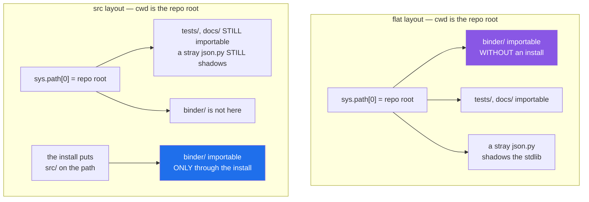

# 4.1 — The `src/` layout, and the bug it prevents

## One-line answer

Putting the package one folder down, in `src/`, means the working directory is no longer a shortcut into
it — so the only way to import your code is the way everyone else will import it, and a broken install
fails on your machine instead of in production.

---

## The story

The binder used to live flat on the kitchen counter, open, with the recipes face up.

Which was convenient. You reached over and read one. Nobody ever had to find the binder, because the
binder was not really a thing you found — it was just what was on the counter.

Then it was lent to somebody in the next flat, and half of it did not work over there. Cards referred to
"the small pan" and "the good salt", which are things on this counter, not things in the binder. Nobody
had noticed, because on this counter you never needed to say where the pan was.

So it went on the shelf, closed, with a cover. And using it became one extra motion: fetch it, open it,
find the divider.

That motion is not overhead. It is the only way to find out whether the binder actually contains what
people think it contains — because now, if a card leaves something out, **you** are the one who discovers
it, standing in your own kitchen, instead of the person in the next flat.

---

## The idea in plain language

There are two ways to arrange a Python project.

**Flat layout** — the package sits at the repository root:

```text
myproject/
├── binder/            <- the package
│   └── __init__.py
├── tests/
└── pyproject.toml
```

**`src` layout** — the package sits one folder down, inside `src/`, which is not itself a package:

```text
myproject/
├── src/
│   └── binder/        <- the package
│       └── __init__.py
├── tests/
└── pyproject.toml
```

The difference looks cosmetic and is not. It comes from [2.1](../02-finding-it/2.1-sys-path.md): the
working directory is usually on `sys.path`. In the flat layout, standing at the repository root means
`binder/` is directly importable — **whether or not the project is installed**. In the `src` layout it is
not, because the importable folder is `src/`, and `src/` is not the directory you are standing in. The
only way `import binder` works is if something put `src/` on the path, and the only thing that does that
is the install ([2.4](../02-finding-it/2.4-uv-run-and-the-editable-install.md)).

That one difference buys one thing, and it is worth the whole trade.

**Your tests import what your users will import.** In a flat layout, `import binder` in a test finds the
source folder, so the tests pass without the package being installed at all. Anything wrong with the
packaging — a module in the wrong place, a missing `__init__.py`, a data file with no rule to copy it — is
invisible, because nothing is ever copied. In the `src` layout the package is reachable only through the
install, so the suite exercises the installed artifact and a packaging mistake fails immediately, on your
machine, instead of at container start-up.

There is a second benefit, narrower and often missed. **An editable install of a flat-layout project puts
the repository root itself on the path** — permanently, for every launcher, not only when you are standing
there — so `conftest.py`, `noxfile.py` and every other root-level file becomes importable from anywhere.
The packaging guide puts it plainly in *src layout vs flat layout* (2026,
<https://packaging.python.org/en/latest/discussions/src-layout-vs-flat-layout/>): that arrangement makes
"certain imports work in editable installations but not regular installations". With `src/`, the editable
install adds one folder holding one thing — this repository's `.pth` file contains the single line
`…\setu\src` ([2.4](../02-finding-it/2.4-uv-run-and-the-editable-install.md)).

Everything else people claim for it follows from those two, and one popular claim does not follow at all,
so it is worth stating what `src/` does **not** do.

**It does not stop the repository root being an import path.** When you run anything from the repository
root, the root is still `sys.path[0]` ([2.1](../02-finding-it/2.1-sys-path.md)), so `days/`, `notebooks/`
and `scripts/` in this repository are all importable right now as namespace packages
([3.4](../03-the-package/3.4-the-missing-init.md)), and a stray `json.py` dropped at the root would still
shadow the standard library ([2.3](../02-finding-it/2.3-shadowing-the-standard-library.md)). Nor does it
make `src/` safe: the editable install puts `src/` itself on the path, so a file placed directly in `src/`
— beside the package rather than inside it — is a top-level module too. **`src/` holds exactly one thing,
and that is a rule you keep, not one the layout enforces.**

The cost is honest and small: you must install the project before you can import it, which in this project
means one `uv sync` — and `uv run` does it for you.

---

## Why Setu needs it

- **This repository is `src/setu/`, and that is why.** `pyproject.toml` says `packages = ["src/setu"]`,
  and everything in [2.4](../02-finding-it/2.4-uv-run-and-the-editable-install.md) follows from it.
- **`./m check` runs `pytest` from the root** and imports `setu` through the install, not through the
  working directory — so a `./m check` that passes is evidence about the package and not just about the
  folder.
- **Day 240 builds and ships the capstone.** With `src/`, the shape it is imported by then is the shape it
  has been imported by since Day 0.
- **`notebooks/`, `days/` and `scripts/` sit at the root and ARE importable from there** — try
  `uv run python -c "import days"` and it works. `src/` does not protect you from that, and knowing which
  problem the layout does and does not solve is what stops you trusting it for the wrong one
  ([2.3](../02-finding-it/2.3-shadowing-the-standard-library.md)).

---

## The mechanism

Two projects, identical apart from one folder. Neither is installed. Both are run from their own
repository root.

**Flat:**

```python
import binder

print("imported without installing:", binder.VERSION)
print("from:", binder.__file__)
```

**Line by line:**

- `import binder` — resolved by `sys.path[0]`, which for `python -c` is the current directory
  ([2.1](../02-finding-it/2.1-sys-path.md)). The current directory contains `binder/`, so it is found.
- `binder.VERSION` — a name from `binder/__init__.py`, proving the package really was imported and not
  something else.
- `binder.__file__` — **the diagnostic that matters**: it points into the working tree, not into
  `site-packages`. Nothing was installed and the import worked anyway.

Run on Python 3.12.12 on 2026-09-02, from `layout/flat/`:

```
imported without installing: 0.1.0
from: ...\layout\flat\binder\__init__.py
```

**`src`, the same command, from `layout/srcish/`:**

```text
$ uv run python -c "
import binder
print('imported:', binder.VERSION)
"
Traceback (most recent call last):
  File "<string>", line 2, in <module>
ModuleNotFoundError: No module named 'binder'
```

**That traceback is the feature.** The package is on disk, one folder away, and it is not importable
because it has not been installed. In the flat project the same mistake is silent.

Now the part that is usually overstated. Both repositories also contain the ordinary furniture — a
`tests/` folder, a `docs/` folder, and a scratch file somebody left at the root called `json.py`. Run from
the flat repository's root:

```python
import binder

print("binder    :", binder.VERSION, "<- no install anywhere")
import tests.test_x  # noqa: F401

print("tests     : importable too")
import json

print("json      :", "the repo root shadowed it" if "flat" in json.__file__ else "stdlib")
```

**Line by line:**

- `import binder` — the package, found because the working directory is `sys.path[0]`. No install.
- `import tests.test_x  # noqa: F401` — the test suite, importable as a top-level package from application
  code, which nobody would choose. `tests/` has no `__init__.py` and imports anyway, as a namespace
  package ([3.4](../03-the-package/3.4-the-missing-init.md)). The `noqa` silences "imported but unused" —
  the import *is* the experiment.
- `import json` — the standard-library name, against a `json.py` sitting at the repository root
  ([2.3](../02-finding-it/2.3-shadowing-the-standard-library.md)).
- the conditional expression — checks the loaded file's path rather than trusting the name
  ([Day 5, 2.5](../../../day-05-operators-and-conditionals/parts/02-conditionals/2.5-the-conditional-expression.md)).

```
binder    : 0.1.0 <- no install anywhere
tests     : importable too
json      : the repo root shadowed it
```

Now the same furniture, in the `src` repository:

```text
$ uv run python -c "
import docs.conf
print('docs.conf : importable ->', docs.conf.TITLE)
try:
    import binder
except ModuleNotFoundError as e:
    print('binder    :', e)
"
docs.conf : importable -> the docs
binder    : No module named 'binder'
```

**Read that carefully, because it is the honest version of the story.** `docs/` is still importable — the
repository root is still on the path, and `src/` did nothing about it. What changed is the one line that
matters: **the package is not reachable without the install.** That is the whole benefit, and it is
enough.

What each layout puts on the path:



The purple box is the bug. The blue box is the fix. Everything in the box beside it is unchanged by the
layout, and pretending otherwise is how people end up surprised.

---

## When it breaks

**The `src` layout's own failure, on day one:**

```text
$ uv run python -c "import setu"
ModuleNotFoundError: No module named 'setu'
```

**What it means.** The project is not installed into this environment, or `pyproject.toml` does not
declare the package. Under a flat layout this error would not have appeared, and that is not a point in
the flat layout's favour — it means the flat layout was hiding the same broken state. The fix is
`uv sync`, and if that does not do it, `pyproject.toml`'s `packages` entry is wrong
([2.4](../02-finding-it/2.4-uv-run-and-the-editable-install.md)).

**Somebody adds a `sys.path` line to "fix" it.** This is the common wrong turn, and
[2.4](../02-finding-it/2.4-uv-run-and-the-editable-install.md) covers it in full: a
`sys.path.insert(0, "src")` in `conftest.py` restores exactly the behaviour the layout was chosen to
prevent, so the tests go back to importing the source tree directly and packaging mistakes go back to
being invisible. If you are going to add that line, you may as well use the flat layout and know that you
did.

**`src` accidentally becoming a package.** Put an `__init__.py` in `src/` and the importable name becomes
`src.binder`, which is not what anything expects:

```text
$ uv run python -c "import src.binder; print(src.binder.VERSION)"
0.1.0
$ uv run python -c "import binder"
ModuleNotFoundError: No module named 'binder'
```

**What it means.** `src/` is a container, not a package, and it must have no `__init__.py`. The tell is an
import line anywhere in the project that starts `from src.` — that is always a bug, and it usually appears
because an editor's auto-import wrote it.

**Tests that pass and a wheel that does not work.** The failure this layout exists to prevent, stated
plainly: in a flat layout, `import mypkg.helpers` in a test finds `mypkg/helpers.py` in the working tree,
whether or not the build ever copies it. Move a module into a subfolder without an `__init__.py`, or add a
data file with no packaging rule, and the tests keep passing while the built wheel is missing the file.
The failure surfaces at container start-up as a `ModuleNotFoundError` or `FileNotFoundError` for something
that is obviously right there in the repository. Under `src/`, the tests import the installed package, so
the same mistake fails locally the moment it is made.

---

## In production

**The professional default for anything that will be installed is the `src` layout.** It is the standard
recommendation in the Python Packaging User Guide, and the reasoning is exactly the one above: it removes
the accidental import path so that development and deployment resolve imports the same way. For a
single-file script or a repository that is never installed, it is unnecessary ceremony; for a package, it
is the difference between testing your project and testing your working directory.

**What changes at scale is that "it worked in CI" stops being evidence.** A large repository has several
launchers — a test runner, a task runner, a container entry point, a scheduler — and only some of them
stand in the repository root. Under a flat layout the ones that do get a free, uninstalled import of the
package, and the ones that do not get whatever the install produced; the two can differ for months. Under
`src/`, all of them go through the install, so there is one answer to "which code is running" rather than
one answer per launcher.

**The failure that only appears with real data is the missing package data file.** An editable install
puts the whole source folder on the path, so a CSV, a template or a JSON schema opened via
`Path(__file__).with_name(...)` is found in development every time. The built wheel copies only what the
packaging rules cover, so the file is absent in the container and the first request that needs it fails.
`src/` does not fix this on its own — you still need the packaging rule — but it is what makes people
build and install the wheel once before shipping, which is what catches it.

**The review comment a senior engineer leaves.** *"`conftest.py` adds `src` to `sys.path`. That undoes the
reason we use this layout: the suite now imports the working tree instead of the installed package, so a
module we forget to package will pass CI and fail in the image. Delete the line — `uv sync` already
installs the project in editable mode."*

**The interview question.** *"Why `src/`?"* The weak answer is "convention" or "tidiness". The used answer
is the import path: without it, the repository root is on `sys.path`, so the package imports whether or
not it is installed — meaning the tests never exercise the packaged artifact and packaging bugs surface in
production. And the second half, which people rarely mention: it also stops every other folder and stray
file at the root from becoming an importable top-level name.

---

## Check yourself

```bash
uv run python -c "
from pathlib import Path

import days
import setu

print('setu from :', setu.__file__)
print('under src?:', Path(setu.__file__).parent.parent.name == 'src')
print('days      : importable, and its __file__ is', days.__file__)
"
```

`setu` lives under `src/` and arrives through the install. `days` imports too, with `__file__` as `None` —
because the repository root is on the path and `days/` is a namespace package. Now say which of those two
facts the `src` layout is responsible for.

**Answer out loud, without scrolling up:**

> Your test suite passes and the container fails at start-up with `ModuleNotFoundError` for one of your own
> modules. Explain how a flat layout lets that happen and what `src/` would have done differently.

---

**Next:** [4.2 — the circular import, reproduced then fixed](4.2-the-circular-import.md).
