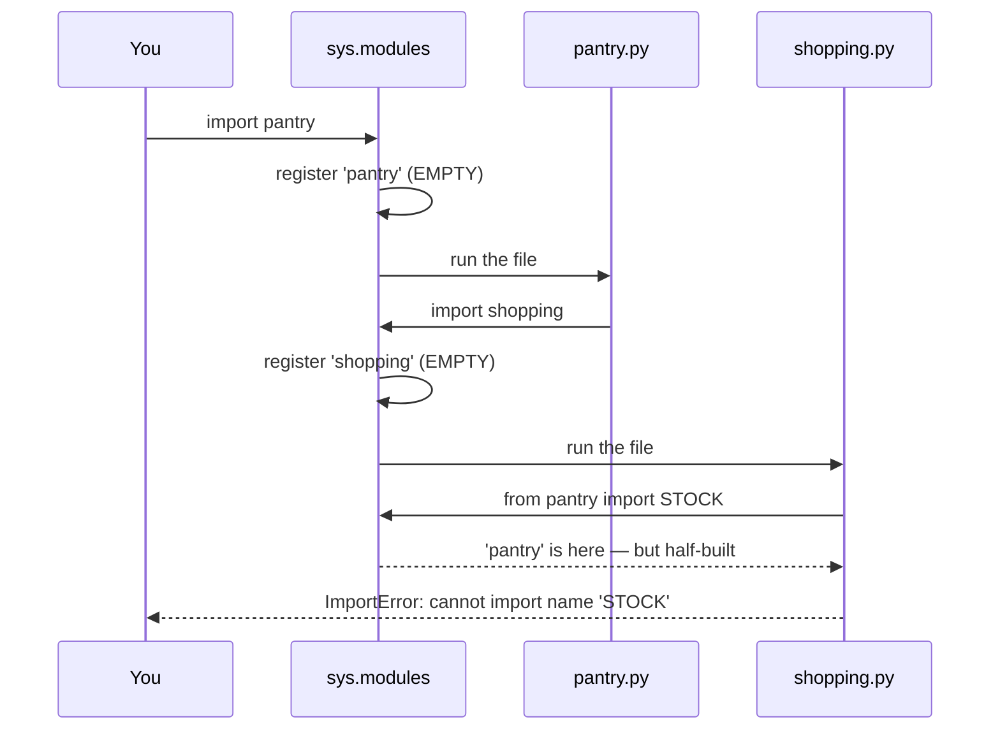

# 4.2 — The circular import, reproduced then fixed

## One-line answer

A module is put in `sys.modules` **before** it runs, so a module that imports back into a half-finished
one finds a real object with the names not filled in yet — which is why the error says *partially
initialized* and why the fix is almost never a clever import.

---

## The story

There are two lists on the fridge.

One says what is in the cupboard. One says what to buy.

They are meant to work together: if the cupboard says no salt, salt goes on the shopping list; and before
adding anything to the shopping list you check the cupboard so you do not buy it twice.

That is sensible, and for a year nobody noticed the shape of it.

Then somebody new moved in and tried to fill both in from scratch, in one go. They started on the
cupboard list, got to salt, and went to write it on the shopping list — and the shopping list said *check
the cupboard first*. The cupboard list was in their other hand, half written, with salt as the last thing
on it and nothing below.

They were not stuck because either list was wrong. Each list is fine. They were stuck because each one
begins by needing the other to be finished, and somebody has to be first.

The fix, when they eventually worked it out, was not a cleverer order. It was that both lists were really
about the same thing — **what is in the house** — and once that was one list on its own, neither of the
other two needed the other at all.

---

## The idea in plain language

A **circular import** is two or more modules that import each other, directly or through a chain.

To see why it fails, go back to the ordering in
[1.1](../01-the-module/1.1-a-module-is-a-file-that-has-already-run.md): Python creates the module object,
**registers it in `sys.modules`, and only then runs the file**. That order is not an implementation
detail; it is what makes recursion terminate. Without it, `pantry` importing `shopping` importing `pantry`
would import forever.

The language reference states the reason outright: *The Python Language Reference, section 5.4 Loading*
(<https://docs.python.org/3/reference/import.html>) says the module "will exist in `sys.modules` before
the loader executes the module code", because "the module code may (directly or indirectly) import
itself; adding it to `sys.modules` beforehand prevents unbounded recursion in the worst case and multiple
loading in the best."

With it, the second import of `pantry` is a cache hit
([1.3](../01-the-module/1.3-sys-modules.md)) — and returns the module object as it stands *right now*,
which is partly built. Everything above the import line in `pantry.py` exists. Everything below it does
not, because those lines have not run yet.

So what you get depends entirely on **which form you used** and **where the names are**:

- `from pantry import STOCK` while `pantry` is half-built raises `ImportError: cannot import name 'STOCK'
  from partially initialized module 'pantry'`. It needs the name *now*, and the name is not there yet.
- `import pantry` succeeds, because it only binds the module object. If the name is used later, inside a
  function, by then the module is finished and it works.
- `import pantry` followed by `pantry.STOCK` **at the outer level** raises `AttributeError: partially
  initialized module 'pantry' has no attribute 'STOCK'`. Same problem, different exception.

Two more things worth knowing before the fixes.

**Which module fails depends on which one you import first.** The cycle is symmetric; the error is not.
That is why one person sees the failure and another does not, and why it can appear when an unrelated
import order changes.

**A re-exporting `__init__.py` is the most common cause in a package**
([3.3](../03-the-package/3.3-what-goes-in-init.md)). `pkg/__init__.py` imports `pkg.router`, and
`pkg/router.py` says `from pkg import config` — which runs the half-finished `__init__.py`.

There are three fixes, in the order you should try them.

**Extract what they share.** Nine times out of ten the cycle exists because two modules both own a piece
of one idea. Pull that idea into a third module that neither of them imports back, and the cycle is gone
rather than worked around. This is the fix; the other two are for when you cannot.

**Import the module, not the name, and use it inside a function.** `import shopping` at the top plus
`shopping.add_to_list(...)` inside a function body works, because the lookup happens after both modules
have finished.

**Move the import into the function.** A local `import` inside the function that needs it defers
everything to first call. It works, it is legal, and it is a marker: a function-level import in a
codebase almost always means either a cycle or an expensive optional dependency, and a comment saying
which one is a kindness.

A fourth exists for one specific case: if the only reason for the import is a **type annotation**, put it
under `if TYPE_CHECKING:` and add `from __future__ import annotations`, so the name exists for the type
checker and is never imported at run time.

---

## Why Setu needs it

- **`src/setu/` is one flat package today, and by Phase 19 it will not be.** `setu.rag` needing
  `setu.core` while `setu.core` reaches back is the exact shape this prevents.
- **Day 172's router imports the provider modules, and each provider wants the router's budget counter.**
  That is a cycle in the making, and the shared-third-module fix — a `setu.budget` — is the answer decided
  now rather than at Day 172.
- **Day 18 writes `src/setu/errors.py`**, and an error module is the classic thing everything imports and
  nothing imports back. Deciding today that it stays leaf-shaped is what keeps it that way.
- **Whatever you choose to put in `src/setu/__init__.py`** in [3.3](../03-the-package/3.3-what-goes-in-init.md)
  is the most likely source of a cycle in this project, because it runs on the way to every module in it.

---

## The mechanism

Two modules, each needing one name from the other:

```python
"""What is in the pantry, and what to buy."""

from shopping import add_to_list

STOCK = {"salt": 0, "rice": 2}


def check(item):
    if STOCK.get(item, 0) == 0:
        add_to_list(item)
    return STOCK.get(item, 0)
```

**Line by line:**

- `from shopping import add_to_list` — **the `from` form, at the outer level**. It needs the name to exist
  in `shopping` at the moment this line runs. That requirement is the whole bug.
- `STOCK = {...}` — defined *below* the import, which is what makes the other module's request fail. Move
  this line above the import and this particular cycle would work, which is a fix nobody should rely on.
- `add_to_list(item)` — used inside a function, so it would have been fine as a deferred lookup. The
  problem is not the use; it is the import.

```python
"""The shopping list, which asks the pantry how much is left."""

from pantry import STOCK

LIST = []


def add_to_list(item):
    LIST.append(item)


def already_have(item):
    return STOCK.get(item, 0) > 0
```

**Line by line:**

- `from pantry import STOCK` — the other half of the cycle, the same form, the same demand for a name
  right now.
- `LIST = []` — module-level mutable state shared by every importer
  ([1.3](../01-the-module/1.3-sys-modules.md)), which is also the hint that these two modules are really
  one idea.

Import `pantry` first, on Python 3.12.12 on 2026-09-02:

```text
$ uv run python -c "import pantry"
Traceback (most recent call last):
  File "<string>", line 1, in <module>
  File "...\circ\pantry.py", line 3, in <module>
    from shopping import add_to_list
  File "...\circ\shopping.py", line 3, in <module>
    from pantry import STOCK
ImportError: cannot import name 'STOCK' from partially initialized module 'pantry' (most likely due to a circular import) (...\circ\pantry.py)
```

Now import `shopping` first, changing nothing else:

```text
$ uv run python -c "import shopping"
Traceback (most recent call last):
  File "<string>", line 1, in <module>
  File "...\circ\shopping.py", line 3, in <module>
    from pantry import STOCK
  File "...\circ\pantry.py", line 3, in <module>
    from shopping import add_to_list
ImportError: cannot import name 'add_to_list' from partially initialized module 'shopping' (most likely due to a circular import)
```

**Same cycle, different accused module.** Whichever one you enter first is the one that ends up "partially
initialized", so two people can look at the same repository and describe two different bugs.

What is happening in the register:



Now change one thing: the **form** of the import. `import shopping` instead of
`from shopping import add_to_list`, and the use moves to `shopping.add_to_list(...)` inside the function:

```python
"""What is in the pantry, and what to buy."""

import shopping

STOCK = {"salt": 0, "rice": 2}


def check(item):
    if STOCK.get(item, 0) == 0:
        shopping.add_to_list(item)
    return STOCK.get(item, 0)
```

**Line by line:**

- `import shopping` — binds the module object and asks for **no names**, so a half-built module is
  perfectly acceptable ([1.2](../01-the-module/1.2-the-four-import-forms.md)). This is the difference
  between this version and the one above.
- `shopping.add_to_list(item)` — the lookup happens when `check` is *called*, long after both modules have
  finished running. That deferral is the whole trick.

With `shopping.py` changed the same way, on Python 3.12.12 on 2026-09-02:

```
pantry imported fine
check salt -> 0
list       -> ['salt']
already?   -> True
```

**It works.** And it is still fragile, which the next failure shows.

---

## When it breaks

**The module form, with one use at the outer level:**

```text
$ uv run python -c "import pantry"
    import shopping
  File "...\circ\shopping.py", line 6, in <module>
    KNOWN = sorted(pantry.STOCK)
                   ^^^^^^^^^^^^
AttributeError: partially initialized module 'pantry' has no attribute 'STOCK' (most likely due to a circular import)
```

Where `shopping.py` gained one line:

```python
"""The shopping list, which reads the pantry AT IMPORT TIME."""

import pantry

LIST = []
KNOWN = sorted(pantry.STOCK)


def add_to_list(item):
    LIST.append(item)
```

**Line by line:**

- `import pantry` — still the safe form, still fine on its own.
- `KNOWN = sorted(pantry.STOCK)` — **at the outer level**, so it looks the name up *during* the import
  rather than after it. `pantry` is half-built and `STOCK` is on a line that has not run.

**What it means.** The `import module` form does not fix a cycle; it *postpones* it to the first
attribute access. Postponing into a function body is safe because functions run later. Postponing into the
outer level postpones nothing. The exception type even changes — `AttributeError` rather than
`ImportError` — which sends people looking for a typo instead of a cycle. **The words "partially
initialized" are the ones to search for**, in either message.

**A cycle that only appears on one machine.** Because the failure depends on which module is imported
first ([1.3](../01-the-module/1.3-sys-modules.md)), a cycle can hide for months and then appear when a
test file is renamed, when `pytest` collects in a different order, or when somebody adds an import to an
`__init__.py`. Nothing in the diff will look related. `python -c "import yourpkg.the_module"` for each
module in turn is the cheap way to find out whether a cycle exists at all.

**The fix that is not a fix.** Moving `STOCK = {...}` above the import in `pantry.py` makes the original
version work, because the name now exists by the time the other module asks. It is real, it is
understood, and it means your program's correctness depends on the order of two lines that look
independent — and it breaks again the moment somebody sorts the imports to the top of the file, which is
what every formatter does. Do not ship it.

---

## In production

**The professional response to a cycle is to treat it as a design signal, not an import problem.** Two
modules that need each other are usually one idea split in the wrong place, or a layering violation where
something low-level reached back up. Extract the shared piece:

```python
"""What both of them actually shared: the numbers."""

STOCK = {"salt": 0, "rice": 2}
LIST = []
```

**Line by line:**

- One module, two names, **no imports at all**. This is what a leaf module looks like, and a leaf module
  cannot participate in a cycle.
- `STOCK` and `LIST` together — they were always one thing, which is exactly why the two modules kept
  reaching for each other.

Both modules then import it, and neither imports the other:

```python
"""What is in the pantry."""

from store import LIST, STOCK


def check(item):
    if STOCK.get(item, 0) == 0:
        LIST.append(item)
    return STOCK.get(item, 0)
```

**Line by line:**

- `from store import LIST, STOCK` — the `from` form is safe again, because `store` imports nothing and is
  therefore always fully built by the time anybody asks.
- `LIST.append(item)` — mutating the imported list, which works because the *object* is shared even though
  the binding was copied ([1.2](../01-the-module/1.2-the-four-import-forms.md)). Rebinding `LIST = [...]`
  here would not be visible to the other module, and that asymmetry is worth being deliberate about.

```
check salt  -> 0
pending     -> ['salt']
already rice-> True
```

And in the other import order:

```
shopping first, also fine: 0 ['salt']
```

**The order no longer matters at all**, which is the property you were actually after.

**What changes at scale is that cycles become invisible without a tool.** A two-module cycle is obvious;
a seven-module cycle through an `__init__.py` and a helper is not, and it will be found by an import
order changing in CI. Large codebases therefore enforce layering mechanically — a test that walks the
import graph and fails on a back-edge, or a linter rule banning imports from a lower layer to a higher
one. `python -X importtime` and a small script over `ast` are enough to build one.

**The failure that only appears with real data is the lazy import that fires under load.** The
function-level import fix defers the import to first call, which means the very first request in
production pays it — and if that import fails there, it fails inside a request handler rather than at
start-up, so a health check reports the service as ready and every request 500s. If you use a
function-level import, import that module at start-up too, so a broken dependency is a start-up failure
rather than a runtime one.

**The review comment a senior engineer leaves.** *"`orders.py` and `customers.py` import each other, and
this PR fixes it by moving one import inside a function. That works, but it hides the real problem — both
of them own part of `Address`. Pull `Address` into `models.py`, which imports neither, and both cycles
go away for good."*

**The interview question.** *"What is a circular import and how do you fix it?"* The recited answer is
"two modules importing each other; move the import inside the function". The used answer starts with
*why* it fails: the module is registered in `sys.modules` before its body runs, so the second import
returns a real but half-built module — which is why `from x import name` raises `ImportError: cannot
import name … from partially initialized module` while a plain `import x` survives until the first
attribute access. And the fix that a senior engineer reaches for first is extracting the shared piece into
a module that imports neither, because the cycle is usually telling you the split is in the wrong place.

---

## Check yourself

```bash
uv run python -c "
from pathlib import Path

Path('m_a.py').write_text('from m_b import B\nA = 1\n')
Path('m_b.py').write_text('from m_a import A\nB = 2\n')
try:
    import m_a
except ImportError as error:
    print('error:', error)
Path('m_a.py').unlink()
Path('m_b.py').unlink()
"
```

Read which name it says it could not import and which module it calls partially initialized. Now swap the
two file contents and predict the message before you run it again.

**Answer out loud, without scrolling up:**

> `from x import name` raises `ImportError` in a cycle and `import x` does not. Explain the difference in
> terms of what is in `sys.modules` at that moment, and say when `import x` fails anyway.

---

**Next:** [4.3 — `python file.py` versus `python -m package.module`](4.3-script-versus-module.md).
