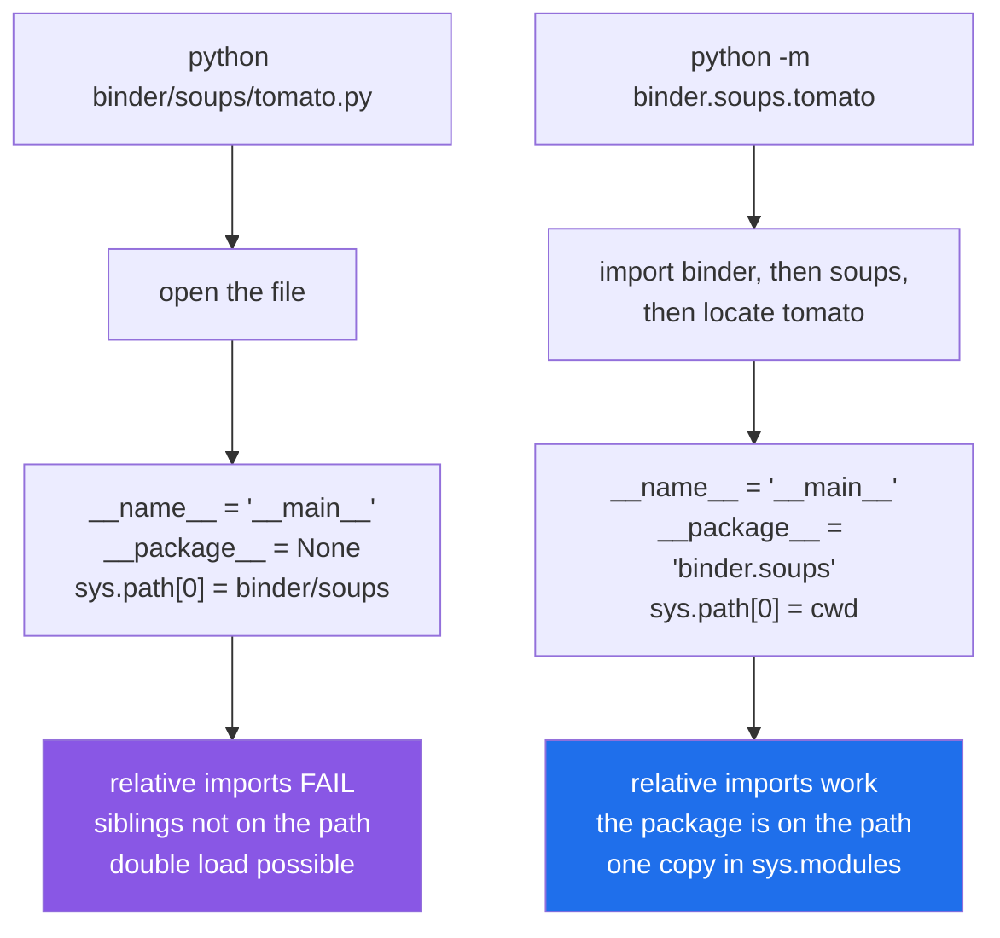

# 4.3 — `python file.py` versus `python -m package.module`

## One-line answer

`python file.py` loads the file as a lone script with no package, so relative imports fail and siblings
are not on the path; `python -m pkg.mod` imports it as a member of its package first, which is why the
same file works one way and not the other.

---

## The story

Two ways of handing somebody a recipe.

The first is to photocopy the card and hand over the loose sheet. They have the recipe. What they do not
have is the divider it came from, the front sheet with "the pot we do not use", or any of the cards it
says to see. If the card says *and make the stock from the card behind this one*, they are stuck, and the
card is not wrong.

The second is to hand over the binder, open at that page. Same recipe, same words, and now "the card
behind this one" means something, because the thing behind it is right there.

Nobody would think the second way is more complicated. It is one motion either way. It just happens to be
the one where the card's own references still work.

---

## The idea in plain language

There are two ways to start a Python program, and they differ in more than syntax.

**`python binder/soups/tomato.py`** — Python opens that path as a file and runs it. The file is loaded as
`__main__`, and `__package__` is `None`
([1.4](../01-the-module/1.4-the-name-that-changes.md)). `sys.path[0]` is **the file's own folder**
([2.1](../02-finding-it/2.1-sys-path.md)).

**`python -m binder.soups.tomato`** — Python resolves that as an import: it finds `binder`, runs its
`__init__.py`, then `soups`, then locates `tomato`, and only then runs it as `__main__`. `__package__` is
**`binder.soups`**. `sys.path[0]` is **the current working directory**.

Three consequences, and every one of them is something you have already met in this day:

**Relative imports work under `-m` and fail under a direct launch**, because the dots need `__package__`
and a direct launch does not set it ([3.5](../03-the-package/3.5-absolute-and-relative-imports.md)).

**Sibling and parent modules are on the path under `-m`**, because `sys.path[0]` is where you are standing
rather than the file's folder ([2.1](../02-finding-it/2.1-sys-path.md)).

**The double load cannot happen under `-m`**, because the module is loaded under its real dotted name, so
anything that imports it later gets a cache hit rather than a second copy
([1.4](../01-the-module/1.4-the-name-that-changes.md)).

There is one more thing `-m` gives a package: **`__main__.py`**. A file with that name inside a package is
what `python -m binder` runs, so a package can be executable without anyone knowing its internal layout.
That is why you type `python -m pytest`, `python -m http.server`, `python -m json.tool` and `python -m
venv` — each of those is a package with a `__main__.py`.

And `-m` has a habit worth adopting on its own: `python -m pip`, `python -m pytest`. Those forms run the
tool with **the interpreter you named**, which removes cause one of
[2.2](../02-finding-it/2.2-modulenotfounderror.md) entirely. A bare `pytest` runs whichever `pytest` is
first on `PATH`, which may belong to a different environment.

The eventual, shippable version of all this is a **console script**: an entry point declared in
`pyproject.toml` that installs a real command, so users type `setu` rather than `python -m setu`. It is
the same mechanism underneath — the entry point names a module and a function.

---

## Why Setu needs it

- **`./m` runs everything as `uv run python scripts/x.py`**, which is a direct launch — which is exactly
  why nothing in `scripts/` uses a relative import, and why each of those files can be imported by a test
  as well.
- **`./m check` runs `uv run python -m pytest`**, not a bare `pytest`, so the test run always uses this
  project's interpreter and the repository root is on the path.
- **Day 172's router gets a `python -m setu.router --probe` diagnostic**, which is the shape this document
  is teaching: a module that is a library first and a command second.
- **Day 240 declares a console script for the capstone**, so the deployed thing is a command rather than a
  path into a source tree.

---

## The mechanism

The tree from [3.5](../03-the-package/3.5-absolute-and-relative-imports.md), plus one new file:

```text
rel/
└── binder/
    ├── __init__.py
    ├── __main__.py        <- what `python -m binder` runs
    ├── stock.py
    └── soups/
        ├── __init__.py
        ├── base.py
        └── tomato.py      uses relative imports
```

```python
"""What `python -m binder` runs."""

import sys

from .soups.tomato import recipe


def main(argv):
    print("binder:", recipe())
    return 0


if __name__ == "__main__":
    sys.exit(main(sys.argv[1:]))
```

**Line by line:**

- The filename `__main__.py` is the whole mechanism. Inside a package, it is what `python -m <package>`
  executes; the name is fixed, like `__init__.py`.
- `from .soups.tomato import recipe` — a **relative** import, which works here only because `-m` sets
  `__package__` ([3.5](../03-the-package/3.5-absolute-and-relative-imports.md)). The failure below is this
  line.
- `def main(argv):` — the real work, in a named function that takes its arguments. **Everything testable
  lives here**, which is the habit from [1.4](../01-the-module/1.4-the-name-that-changes.md).
- `argv` as a parameter rather than reading `sys.argv` inside — so a test can call `main(["--dry-run"])`
  without touching global state.
- `return 0` — an exit code. Zero means success, and returning it rather than calling `sys.exit` inside
  keeps `main` a plain function.
- `if __name__ == "__main__":` — still required. `-m` sets `__name__` to `__main__`, so this is the same
  guard doing the same job.
- `sys.exit(main(sys.argv[1:]))` — `sys.exit` with an integer sets the process exit code, which is what a
  shell, a `Makefile` and CI all read. `sys.argv[1:]` drops the program name.

Run on Python 3.12.12 on 2026-09-02:

```text
$ uv run python -m binder
binder: a heavy pan, simmer 2 litres, and sourdough on the side
```

The same file, launched as a path:

```text
$ uv run python binder/__main__.py
Traceback (most recent call last):
  File "...\rel\binder\__main__.py", line 5, in <module>
    from .soups.tomato import recipe
ImportError: attempted relative import with no known parent package
```

**Nothing about the file changed.** The launcher decided whether it had a package.

The two attributes that differ, printed from the same one-line module:

```text
$ uv run python -m binder.probe
name is __main__ | package is binder

$ uv run python binder/probe.py
name is __main__ | package is None
```

Where `binder/probe.py` is a single line:

```python
print("name is", __name__, "| package is", __package__)
```

**Line by line:**

- `__name__` is `__main__` in **both** cases — which is the point people get wrong. `-m` does not change
  the module's name; the launched module is always `__main__`.
- `__package__` is `binder` under `-m` and `None` under the direct launch. **That one attribute is the
  entire difference**, and every consequence in this document follows from it.

Side by side:



---

## When it breaks

**`-m` run from the wrong folder:**

```text
$ cd binder
$ uv run python -m binder
C:\...\.venv\Scripts\python.exe: No module named binder
```

**What it means.** `-m` puts the **working directory** on the path, not the file's folder, so it must be
run from where the package is visible — the folder *containing* `binder/`, not `binder/` itself. This is
the one way `-m` is fussier than a direct launch, and it is why an installed package
([2.4](../02-finding-it/2.4-uv-run-and-the-editable-install.md)) is better still: once `setu` is installed,
`python -m setu.router` works from anywhere, because it does not depend on the working directory at all.

**`-m` with a path instead of a dotted name:**

```text
$ uv run python -m binder/soups/tomato.py
C:\...\.venv\Scripts\python.exe: Error while finding module specification for 'binder/soups/tomato.py' (ModuleNotFoundError: No module named 'binder/soups/tomato'). Try using 'binder/soups/tomato' instead of 'binder/soups/tomato.py' as the module name.
```

**What it means.** `-m` takes a **module name**, not a filename: dots, no slashes, no `.py`. Python quotes
what you typed back and even offers to drop the extension — but taking that offer would not help either,
because the slashes are still wrong. `python -m binder.soups.tomato` is the form.

**The bare tool name that ran in another environment.** `pytest` and `pip` install a small launcher onto
`PATH`, and which one you get is a `PATH` question rather than a project question. Running `python -m
pytest` guarantees the interpreter, which is why this repository's `./m check` uses that form. The failure
it prevents is [2.2](../02-finding-it/2.2-modulenotfounderror.md)'s cause one, in the confusing shape where
the *tool* reports that your package is missing.

**A `__main__.py` that other code imports.** `python -m binder` loads `binder/__main__.py` as `__main__`;
another module doing `from binder import __main__` loads it a *second* time, under the name
`binder.__main__` ([1.4](../01-the-module/1.4-the-name-that-changes.md)). Two module objects, two copies of
any state. Keep `__main__.py` to argument parsing and a call into real modules, and nothing will want to
import it.

**A relative import that has always worked, in a file somebody schedules.** The most common real
appearance of this whole subject: a module inside a package, with relative imports, imported by everything
for a year. Somebody adds a `if __name__ == "__main__":` block to it and puts `python pkg/tool.py` in a
cron entry. It fails at start-up with *attempted relative import with no known parent package*, in
production, on a schedule, in a file whose last commit is months old. `python -m pkg.tool` is the fix, and
it works immediately.

---

## In production

**The professional habit is that nobody types a path to a `.py` file.** Development and CI use `python -m
pkg.module`; deployment uses a console script declared in `pyproject.toml`. Both go through the import
system, so what runs in production is what the tests imported. Path-based launching survives only in
one-file scripts that import nothing of yours.

**What changes at scale is that entry points become the interface.** A `[project.scripts]` entry in
`pyproject.toml` maps a command name to `module:function`, and the installer generates the launcher for
the right interpreter on the right platform. Users then get `setu` on their `PATH` with no knowledge of
where the code lives, the layout can change underneath them, and the same declaration works on Windows and
Linux. `python -m` remains the fallback that always works, and is what you use to debug a broken console
script.

**The failure that only appears with real data is the entry point that does its work at import time.** A
`__main__.py` that parses arguments and runs the pipeline at the outer level cannot be tested, cannot be
imported by another tool, and — because `-m` imports the whole package first — runs after every
`__init__.py` in the chain has already executed
([3.3](../03-the-package/3.3-what-goes-in-init.md)). If one of those raises in the production environment,
your program fails before its own first line, with a traceback that names none of your code.

**The review comment a senior engineer leaves.** *"The deploy script calls `python /app/svc/worker.py`.
That loads `worker` as `__main__`, so when `tasks.py` imports `svc.worker` we get two copies of the module
and two copies of the in-memory queue — which is why the retry counter resets. Change it to `python -m
svc.worker`, or better, add a console script."*

**The interview question.** *"What is the difference between `python script.py` and `python -m module`?"*
The used answer names the two attributes: both run the target as `__main__`, but `-m` imports it as a
member of its package first, so `__package__` is set and relative imports work — and `sys.path[0]` is the
current directory rather than the script's folder. Then the consequence that shows you have hit it: a file
both launched directly and imported elsewhere is loaded twice under two names, with two copies of its
module-level state.

---

## Check yourself

```bash
uv run python -c "print('name:', __name__, '| package:', __package__)"
echo '{"b":2,"a":1}' | uv run python -m json.tool --sort-keys
uv run python -m pytest --version
```

The first prints `package: None` — `-c` has no package either. The second is a standard-library package
being run as a command, which is what a `__main__.py` buys you. The third runs `pytest` through **this**
interpreter. Now write a two-line module inside `src/setu/` that prints `__package__`, run it both ways,
and delete it.

**Answer out loud, without scrolling up:**

> A module with relative imports is imported happily by ten other modules and fails when a scheduler runs
> it. Name the attribute that is different and the one-word change to the command that fixes it.

---

**Next:** [4.4 — designing `setu`'s public surface](4.4-designing-the-public-surface.md), the last document
of the day.
