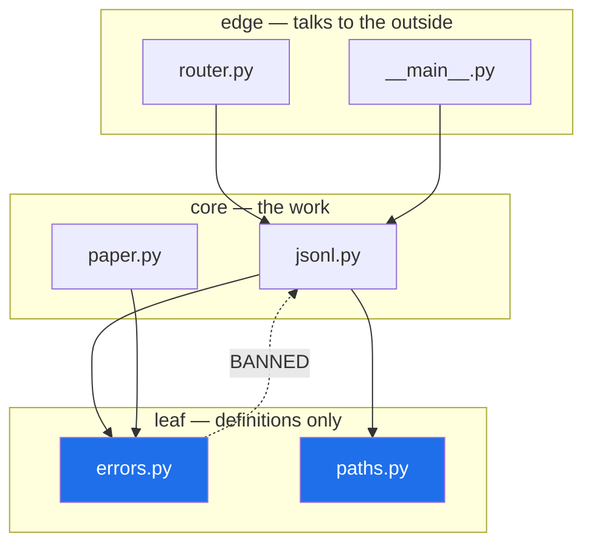

# 4.4 — Designing `setu`'s public surface

## One-line answer

A package's surface is three decisions — **what callers may import, what each module is called, and which
way the arrows point** — and only the third one can be checked by a machine, which is why today's build is
a test that reads the import graph.

---

## The story

The binder is finished. Dividers, front sheets, an address for every card.

The last argument is the one nobody expected to have, and it is about the front cover.

One person wants the ten recipes everyone actually makes copied onto the cover, so you never have to open
it. One person wants the cover to say only *soups, breads, sauces*, so it never goes out of date. One
person points out that half the cards say "see the stock card", and the stock card says "see the soup
card for how much you need", and if you follow those in the wrong order you go round twice.

That last person is the only one describing a problem you can catch.

Whether the cover lists ten recipes or three sections is taste, and either can be lived with. Two cards
that point at each other in a loop is not taste. Somebody will follow it, at eleven at night, and it will
not resolve.

So the rule they wrote on the inside of the cover is not about the cover at all: **a card may point
inward, never back out.**

---

## The idea in plain language

You now have every piece of the day. This part is where they become a decision about `src/setu/`, and
there are exactly three.

**One — what is importable.** The front page: empty, an eager re-export, or lazy
([3.3](../03-the-package/3.3-what-goes-in-init.md)). For **this** project the answer is empty, and the
reason is written in `src/setu/README.md`: this is an application, not a library, so every caller is your
own code, and `from setu.jsonl import write_jsonl` says more at the call site than `from setu import
write_jsonl`. Nothing is exported that has not been asked for, and importing any module costs only that
module.

**Two — what each module is called.** Four rules, all earned earlier today:

- **Never a standard-library name at the top of the package.** `setu.json` and `setu.logging` are legal
  and are a trap in every file that uses an implicit style
  ([2.3](../02-finding-it/2.3-shadowing-the-standard-library.md)). `setu.jsonl` and `setu.log_setup` cost
  nothing.
- **Name the subject, not the shape.** `errors.py`, `paths.py`, `jsonl.py`, `budget.py`. Not `helpers.py`,
  not `common.py`, and never `utils.py` — a module named after its shape has no reason to reject anything,
  so it collects, and a module that everything imports and that imports everything back is the cycle in
  [4.2](4.2-the-circular-import.md) waiting to happen.
- **Singular or plural, but the same one everywhere.** `errors.py` and `paths.py`, or `error.py` and
  `path.py`. Mixed, you will guess wrong for two hundred days.
- **One idea per module.** The same test as a part document: if it needs "and" to describe itself, it is
  two modules.

**Three — which way the arrows point.** This is the one that can be enforced, and the one that decays
without enforcement. Sort the modules into layers, and let imports go one way only:

| Layer | What is in it | May import |
|---|---|---|
| **leaf** | `errors.py`, `paths.py` — definitions, no behaviour | nothing of ours |
| **core** | `jsonl.py`, `paper.py` — the work | leaves |
| **edge** | `router.py`, `__main__.py` — the outside world | leaves and core |

An arrow from a leaf back up to core is not a style violation; it is a cycle in the making
([4.2](4.2-the-circular-import.md)), and it will be found by an import order changing at the worst moment.

The reason this is today's build is Principle 7: **it is the only one of the three that a test can hold**.
A test that reads every module's imports and fails on a back-edge cannot be argued with, does not need
anybody to remember the rule, and goes red in the pull request that breaks it rather than in production
six months later.

---

## Why Setu needs it

- **`src/setu/` will hold roughly forty modules by Day 240.** Forty modules with no layering rule is one
  lump; forty with a rule and a test is a codebase.
- **Day 18 adds `src/setu/errors.py`** — the first deliberate leaf, and the first module the test below
  will assert imports nothing of ours.
- **Day 19 adds `src/setu/models.py`**, which every later phase imports and which must therefore import
  nothing but the standard library and Pydantic.
- **Day 172's router is the first true edge module**, and Phase 19 is where the package grows subpackages
  and the layer rule stops being obvious by inspection.

---

## The mechanism

The check reads the source rather than importing it, so it cannot be defeated by an import that only
happens at run time, and it never executes your modules
([1.1](../01-the-module/1.1-a-module-is-a-file-that-has-already-run.md)). `ast` is the standard library's
parser; `scripts/check_blocks.py` in this repository already uses it for the same reason.

```python
"""Read a package's own import graph without running it."""

from __future__ import annotations

import ast
from pathlib import Path

PACKAGE = Path("src/setu")
TOP = PACKAGE.name


def internal_imports(path: Path) -> set[str]:
    """Every module inside this package that `path` imports, by short name."""
    tree = ast.parse(path.read_text(encoding="utf-8"), filename=str(path))
    found: set[str] = set()
    for node in ast.walk(tree):
        if isinstance(node, ast.Import):
            for alias in node.names:
                if alias.name.startswith(f"{TOP}."):
                    found.add(alias.name.split(".")[1])
        elif isinstance(node, ast.ImportFrom):
            if node.level:
                if node.module:
                    found.add(node.module.split(".")[0])
            elif node.module and node.module.startswith(f"{TOP}."):
                found.add(node.module.split(".")[1])
    return found
```

**Line by line:**

- `import ast` — parses Python into a tree **without executing it**. That is the whole reason this is safe
  to run over a package whose modules might open connections; contrast with importing them and reading
  `sys.modules`.
- `PACKAGE = Path("src/setu")` and `TOP = PACKAGE.name` — the package folder and its importable name. They
  differ from each other in the `src` layout ([4.1](4.1-the-src-layout.md)), which is why both exist.
- `ast.parse(..., filename=str(path))` — the `filename` is only used in error messages, and it is worth
  passing: a syntax error otherwise reports `<unknown>`.
- `ast.walk(tree)` — every node, at any depth. **Depth matters**: an import inside a function is still an
  import, and a check that only looked at the top of the file would miss exactly the deferred imports that
  [4.2](4.2-the-circular-import.md) recommends.
- `isinstance(node, ast.Import)` — the `import setu.jsonl` form. `alias.name` is the full dotted string,
  so `startswith("setu.")` selects ours and `.split(".")[1]` takes the module name.
- `isinstance(node, ast.ImportFrom)` — the `from … import …` form, which carries two different shapes.
- `if node.level:` — `level` is the **number of leading dots**. Non-zero means a relative import
  ([3.5](../03-the-package/3.5-absolute-and-relative-imports.md)), where `node.module` is what follows the
  dots — so `from .errors import SetuError` gives `level=1`, `module="errors"`.
- `elif node.module and node.module.startswith(f"{TOP}.")` — the absolute form, `from setu.errors import
  SetuError`, where `node.module` is the full dotted path.
- `node.module` guarded with `and` — for a bare `from . import errors`, `node.module` is `None`, and
  attribute access on `None` would raise. This is the case that breaks a first draft of this function.
- returning a **set** — a module importing the same sibling twice is one edge, not two.

Run over this repository on Python 3.12.12 on 2026-09-02, with `src/setu/` holding only `config.py`:

```
config       -> (nothing in setu)

leaves (import nothing of ours): ['config']
```

Then the part that can fail: finding a cycle in that graph.

```python
"""Find a cycle in an import graph."""

from __future__ import annotations


def find_cycle(graph: dict[str, set[str]]) -> list[str] | None:
    """The first cycle found, as the path that closes it, or None."""
    seen: set[str] = set()
    stack: list[str] = []

    def walk(node: str) -> list[str] | None:
        if node in stack:
            return stack[stack.index(node) :] + [node]
        if node in seen:
            return None
        seen.add(node)
        stack.append(node)
        for nxt in sorted(graph.get(node, ())):
            found = walk(nxt)
            if found:
                return found
        stack.pop()
        return None

    for start in sorted(graph):
        found = walk(start)
        if found:
            return found
    return None
```

**Line by line:**

- `list[str] | None` as the return type — the cycle if there is one, `None` if there is not. Returning the
  *path* rather than `True` is what makes the failure message useful.
- `seen` and `stack` — two different sets of information. `stack` is the route currently being walked;
  `seen` is everything finished with. **Confusing them is the classic bug here**: with only `seen`, a
  module reachable by two different routes looks like a cycle.
- `def walk(node)` nested inside — a closure over `seen` and `stack`
  ([Day 10, 2.4](../../../day-10-functions/parts/02-scope/2.4-closures-and-late-binding.md)), so the
  recursion does not have to pass them along.
- `if node in stack:` — a cycle, because we have arrived somewhere already on the current route.
- `stack[stack.index(node):] + [node]` — slices the route from where the cycle starts and closes the loop,
  giving `pantry -> shopping -> pantry` rather than a bare "there is a cycle".
- `if node in seen: return None` — already fully explored, so no need to walk it again. This is what keeps
  a large graph from being exponential.
- `sorted(graph.get(node, ()))` — `get` with a default, because a module that nothing imports is not a key
  ([Day 8, 2.4](../../../day-08-containers/parts/02-sets-and-dicts/2.4-get-setdefault-and-counter.md)).
  `sorted` so the reported cycle is the same one on every machine and in every run — a test that names a
  different cycle each time is a bad test.
- `stack.pop()` on the way out — the route is only for the branch being walked. Forgetting this reports
  cycles that are not there.
- `for start in sorted(graph)` — every module gets to be a starting point, because a cycle in a corner of
  the graph is reachable from nowhere else.

```
clean -> None
dirty -> pantry -> shopping -> pantry
```

The layering, drawn:



The dotted arrow is the one the test exists to reject.

---

## When it breaks

**The check that only looked at the top of the file.** Replace `ast.walk(tree)` with `tree.body` and the
function only sees outer-level imports. It then passes a package where every cycle has been "fixed" by
moving the import inside a function ([4.2](4.2-the-circular-import.md)) — which is the workaround, not the
fix, and is exactly what you wanted to be told about. `ast.walk` descends into function bodies, so a
deferred import is still reported as an edge.

**`node.module` is `None` and the check crashes:**

```text
Traceback (most recent call last):
  File "...\graph.py", line 18, in <module>
    internal_imports(Path("probe_mod.py"))
  File "...\graph.py", line 13, in internal_imports
    found.add(node.module.split(".")[0])
              ^^^^^^^^^^^^^^^^^
AttributeError: 'NoneType' object has no attribute 'split'
```

**What it means.** `from . import errors` is an `ImportFrom` with `level=1` and `module=None`, because
there is nothing after the dot. It is a perfectly ordinary line
([3.5](../03-the-package/3.5-absolute-and-relative-imports.md)) and it is the shape a first draft of this
function forgets. The `if node.module:` guard is the fix, and the reason to write a test with that exact
line in it.

**A cycle detector with no `stack.pop()`.** A diamond — `a` imports `b` and `c`, both of which import `d` —
is reported as a cycle, because `d` is still on the route from the first branch when the second branch
reaches it. The test then fails on a perfectly good package, somebody deletes the test, and the real check
is gone. **A checker that cries wolf is worse than no checker**, which is why the "clean" case above is
tested as carefully as the dirty one.

**The layer rule nobody wrote down.** The subtler failure is not in the code: it is a test that checks for
cycles but never states which direction is allowed. A package can be entirely acyclic and still have
`errors.py` importing `router.py`, which is nonsense and is the beginning of a cycle that a later commit
will close. The test worth having asserts both: **no cycles, and no leaf imports anything of ours.**

---

## In production

**The professional habit is that architectural rules live in the test suite, not in a document.** A
convention that is written in a wiki decays at the speed of onboarding; a convention that fails CI does
not. Import direction is unusually well suited to this, because it is cheap to check, has no false
positives once the layer list is right, and catches the class of problem that is hardest to unpick later.

**What changes at scale is that this test becomes the architecture.** In a large system the layer list
grows into a real dependency policy — domain may not import infrastructure, and neither may import the web
layer — and the check is run over subpackages rather than modules. Tools exist for it; the reason to write
the twenty-line version first is that you then understand exactly what the tool is asserting, and can say
why a violation is a violation rather than deferring to a configuration file.

**The failure that only appears with real data is the surface that was never designed.** Nobody ever
decides to have a `utils.py` that imports eleven modules and is imported by thirty. It arrives one helper
at a time, each addition sensible, and by the time it is a problem it cannot be split without touching
every file. The names in this part are cheap to get right on day one and expensive on day two hundred,
which is why this decision is made now, with four modules on disk, rather than later with forty.

**The review comment a senior engineer leaves.** *"`errors.py` now imports `paths.py` to build a default
path in an exception message. That makes our lowest layer depend on a higher one, and `test_no_back_edges`
is only green because `paths` happens not to import `errors` yet — which it will, next week. Pass the path
in from the caller."*

**The interview question.** *"How do you keep a growing codebase from turning into spaghetti?"* The vague
answer is "good structure and code review". The used answer is concrete: define layers, allow imports in
one direction only, and **enforce it with a test that reads the import graph** — parsing with `ast` rather
than importing, so it also catches the deferred imports people use to hide cycles. Then the honest part:
naming and the public surface are judgement and cannot be automated, so those are settled early, when the
package is small enough that changing your mind is free.

---

## Check yourself

```bash
uv run python -c "
import ast
from pathlib import Path

for path in sorted(Path('src/setu').glob('*.py')):
    tree = ast.parse(path.read_text(encoding='utf-8'), filename=str(path))
    names = sorted(
        {n.names[0].name for n in ast.walk(tree) if isinstance(n, ast.Import)}
        | {n.module or '.' for n in ast.walk(tree) if isinstance(n, ast.ImportFrom)}
    )
    print(f'{path.name:14} imports {names}')
"
```

Every module in `src/setu/` and what it imports, without running any of it. Now say which of those names
are ours and which are not, using only the strings.

**Answer out loud, without scrolling up:**

> Name the three decisions that make up a package's public surface, say which one a test can enforce, and
> say why the check parses the files instead of importing them.

---

**That is the day.** Back to the hub: [`LESSON.md`](../../LESSON.md), §4 for the build brief and §5 for
the test that must be able to fail.
