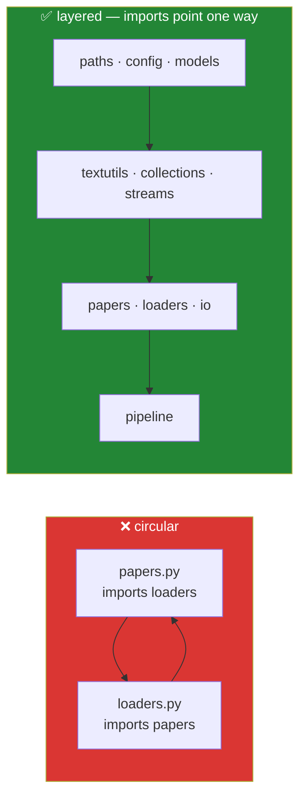

# Day 17 — Modules, packages, imports, and `__init__.py`

**Phase 2 · Module 2** · ID: **PY-21** (importing and managing modules)

> **Yesterday:** files and context managers.
> **Today:** `src/setu/` has eleven modules and no shape. Today it gets one — plus the two import
> failures (circular imports, import-time side effects) that will otherwise find you around Day 180.
> **Tomorrow:** exceptions and custom error types.

```bash
./m start 17 && ./m scaffold 17
```

**Time:** 90 minutes. **Request budget:** 0 model calls.

---

## §1 The story

`import setu.papers` looks like one operation. It is four, and knowing them explains every import
error you will ever see:

1. **Is it already in `sys.modules`?** If yes, hand back the cached module. **A module's body runs
   exactly once per process**, no matter how many files import it.
2. **Find it** by walking `sys.path` — a list of directories, in order.
3. **Execute the whole file, top to bottom.** Every `def`, every class, and **every line of loose
   code at module level**.
4. **Bind the name** in the importing namespace.

Step 3 is where two whole categories of bug live.

**Import-time side effects.** If `papers.py` has `KEYS = load_keys()` at module level, then merely
importing it reads `.env` — and CI, which has no `.env`, fails at *collection* with a confusing error
in a test that never mentions keys. That is why this project's rule since Day 1 has been: **a module
defines names and does nothing else.**

**Circular imports.** `a.py` imports `b`; `b.py` imports `a`. Python starts `a`, hits the import of
`b`, starts `b`, hits the import of `a` — which is already in `sys.modules` but only *half executed*.
`b` then reads a name from `a` that does not exist yet, and you get `ImportError: cannot import name X
(most likely due to a circular import)`.



The cure is not a clever import trick. It is **layering**: decide which module is lower-level, and let
imports point one way only. Today you write that layering down and add a test that enforces it.

---

## §2 Setup — run this

```bash
mkdir -p days/day-17/lab
touch days/day-17/lab/imports.py
mkdir -p src/setu/text
touch tests/test_package.py
```

No new packages.

---

## §3 PY-21 — the import system, observed

`days/day-17/lab/imports.py`:

```python
"""PY-21: what an import actually does, and the two ways it goes wrong."""

from __future__ import annotations

import sys
from pathlib import Path


def modules_run_once() -> None:
    import setu.paths as first
    import setu.paths as second

    print(f"\n{first is second=}   <- same object; the body ran once")
    print(f"{'setu.paths' in sys.modules=}")
    print(f"{sys.modules['setu.paths'].__file__=}")


def where_python_looks() -> None:
    print(f"\nsys.path has {len(sys.path)} entries; the first three:")
    for entry in sys.path[:3]:
        print(f"  {entry or '(cwd)'}")
    print("  ...your project is importable because uv installed it in editable mode")


def import_forms() -> None:
    import setu.textutils                       # bind the module
    from setu.textutils import normalise_whitespace  # bind one name
    from setu import textutils as tu            # bind with an alias

    print(f"\n{setu.textutils.normalise_whitespace('  a  b ')=}")
    print(f"{normalise_whitespace('  a  b ')=}")
    print(f"{tu.normalise_whitespace('  a  b ')=}")
    print("  all three reach the SAME function object in the SAME module")


def module_dunders() -> None:
    import setu.papers as papers

    print(f"\n{papers.__name__=}")
    print(f"{Path(papers.__file__).name=}")
    print(f"{papers.__package__=}")
    print(f"{[n for n in dir(papers) if not n.startswith('_')][:6]=}")


def the_side_effect_trap() -> None:
    print("\n-- why `import` must be free of side effects --")
    print("  BAD:  KEYS = load_keys()        # runs on import; CI has no .env -> collection error")
    print("  BAD:  DATA = pd.read_csv(...)   # runs on import; 4s added to every test run")
    print("  BAD:  ensure_dirs()             # runs on import; creates folders on a build agent")
    print("  GOOD: def get_keys(): ...       # runs when CALLED")


def the_circular_trap() -> None:
    print("\n-- circular import, in words --")
    print("  a.py:  from b import helper")
    print("  b.py:  from a import Thing")
    print("  import a -> starts a -> imports b -> b imports a -> a is in sys.modules")
    print("            but only half-executed -> `Thing` does not exist yet -> ImportError")
    print("  Fix: layer them. Never a try/except around the import.")


if __name__ == "__main__":
    modules_run_once()
    where_python_looks()
    import_forms()
    module_dunders()
    the_side_effect_trap()
    the_circular_trap()
```

**Line by line:**

- `first is second` is `True` — two import statements, **one** module object. `sys.modules` is the
  cache. This is why editing a module mid-session in a REPL does not take effect without a reload.
- `sys.path` — the search path, in order. The first entry is usually the script's directory or the
  current directory. `uv` installed your project in editable mode, which is why `import setu` works
  from anywhere in the repo without path hacks. **If you ever find yourself writing
  `sys.path.append(...)`, your packaging is wrong** — fix that instead.
- `import setu.textutils` versus `from setu.textutils import normalise_whitespace` — the first binds
  the module name, the second binds the function name directly. **Both execute the entire module.**
  `from X import y` is not cheaper; it just imports fewer *names*.
- `import setu.textutils` also binds the top-level name `setu`, which is why `setu.textutils.f(...)`
  works afterwards.
- `papers.__name__` is the dotted import path; `__file__` is where it came from; `__package__` is the
  containing package. These three answer "which file am I actually running?" — a question that comes
  up whenever two files share a name.
- `dir(module)` — every name the module defines. Useful for checking what you have actually exported.

---

## §4 Build brief — give the package a shape

### 4.1 Write the layering down

Create `src/setu/ARCHITECTURE.md`:

```markdown
# Layers — imports point downward only

| Layer | Modules | May import |
|---|---|---|
| 0 · config | `paths`, `versions`, `config`, `models` | standard library only |
| 1 · primitives | `textutils`, `collections`, `streams`, `retry`, `decorators` | layer 0 |
| 2 · domain | `papers`, `loaders`, `io` | layers 0–1 |
| 3 · pipeline | `pipeline` (Day 227+) | layers 0–2 |

**A module never imports from its own layer or above.** If you need to, the shared thing belongs
one layer down. This table is enforced by `tests/test_package.py::test_no_upward_imports`.
```

### 4.2 A subpackage

Split the growing text code:

```bash
mkdir -p src/setu/text
touch src/setu/text/__init__.py
touch src/setu/text/clean.py
touch src/setu/text/split.py
```

- Move `normalise_whitespace`, `is_blank`, `clean_all`, `slugify`, `truncate` → `text/clean.py`
- Move `split_sentences`, `first_non_blank` → `text/split.py`

Then in `src/setu/text/__init__.py`:

```python
"""Text utilities. This is the public surface; the submodules are the implementation."""

from setu.text.clean import (
    clean_all,
    is_blank,
    normalise_whitespace,
    slugify,
    truncate,
)
from setu.text.split import first_non_blank, split_sentences

__all__ = [
    "clean_all",
    "first_non_blank",
    "is_blank",
    "normalise_whitespace",
    "slugify",
    "split_sentences",
    "truncate",
]
```

**Line by line:**

- `__init__.py` — makes the directory a package **and** is the file that runs when someone does
  `import setu.text`. Re-exporting here means callers write `from setu.text import slugify` and never
  need to know it lives in `clean.py`. You can reorganise the submodules later without touching a
  single caller.
- `__all__` — the explicit public surface. It controls `from setu.text import *` (which this project
  never uses) and, more usefully, **documents intent**: anything not listed is internal. Ruff's `F401`
  also stops complaining about the "unused" re-imports because they are listed here.
- Keep `src/setu/textutils.py` as a thin shim re-exporting from `setu.text` for one day, so existing
  tests keep passing while you migrate. Delete it at the end of §6.

### 4.3 The top-level `__init__.py`

`src/setu/__init__.py` — has been empty since Day 0. It stays nearly empty:

```python
"""Project Setu — a 240-day curriculum's working library."""

__version__ = "0.1.0"
```

**Do not** re-export everything here. A top-level `__init__.py` that imports every submodule means
`import setu` pulls in pandas, torch and chromadb by Day 155, and your CLI takes eight seconds to
start. Keep the top level cheap.

---

## §5 The eval that must be able to fail

`tests/test_package.py`:

```python
import ast
import subprocess
import sys
from pathlib import Path

import pytest

SRC = Path("src/setu")

LAYERS = {
    "paths": 0, "versions": 0, "config": 0, "models": 0,
    "textutils": 1, "collections": 1, "streams": 1, "retry": 1, "decorators": 1,
    "text": 1,
    "papers": 2, "loaders": 2, "io": 2,
}


def setu_imports(path: Path) -> set[str]:
    """Every `setu.X` this file imports, as the top-level module name X."""
    tree = ast.parse(path.read_text(encoding="utf-8"))
    found: set[str] = set()
    for node in ast.walk(tree):
        if isinstance(node, ast.ImportFrom) and (node.module or "").startswith("setu"):
            found.add(node.module.split(".")[1]) if "." in node.module else None
        elif isinstance(node, ast.Import):
            for alias in node.names:
                if alias.name.startswith("setu."):
                    found.add(alias.name.split(".")[1])
    return found


@pytest.mark.parametrize("module", sorted(LAYERS))
def test_no_upward_imports(module):
    path = SRC / f"{module}.py"
    if not path.exists():
        path = SRC / module / "__init__.py"
    if not path.exists():
        pytest.skip(f"{module} not written yet")
    for imported in setu_imports(path):
        assert LAYERS.get(imported, 99) < LAYERS[module], (
            f"{module} (layer {LAYERS[module]}) imports {imported} "
            f"(layer {LAYERS.get(imported)}) - see src/setu/ARCHITECTURE.md"
        )


def test_every_module_imports_cleanly_on_its_own():
    """Each module must import in a FRESH interpreter with no .env and no cwd assumptions."""
    for path in sorted(SRC.rglob("*.py")):
        if path.name == "__init__.py":
            continue
        name = ".".join(path.relative_to(Path("src")).with_suffix("").parts)
        result = subprocess.run(
            [sys.executable, "-c", f"import {name}"],
            capture_output=True, text=True, cwd=Path.cwd(),
        )
        assert result.returncode == 0, f"{name} failed to import:\n{result.stderr}"


def test_importing_setu_is_cheap():
    """`import setu` must not drag in the world."""
    result = subprocess.run(
        [sys.executable, "-c", "import setu, sys; print(len(sys.modules))"],
        capture_output=True, text=True,
    )
    assert result.returncode == 0
    assert int(result.stdout) < 400, "importing setu pulled in too much - keep __init__.py thin"


def test_text_package_reexports_everything_in_all():
    import setu.text as text

    for name in text.__all__:
        assert hasattr(text, name), f"__all__ lists {name} but it is not importable"


def test_no_wildcard_imports():
    offenders = [
        f"{p}:{i}"
        for p in SRC.rglob("*.py")
        for i, line in enumerate(p.read_text(encoding="utf-8").splitlines(), 1)
        if line.strip().startswith("from ") and line.strip().endswith("import *")
    ]
    assert not offenders, f"wildcard imports found: {offenders}"


def test_no_sys_path_manipulation():
    offenders = [
        str(p)
        for p in SRC.rglob("*.py")
        if "sys.path" in p.read_text(encoding="utf-8")
    ]
    assert not offenders, f"sys.path hacks found: {offenders} - fix the packaging instead"
```

**Line by line:**

- `ast.parse` — parses the file into a syntax tree **without executing it**. That is essential: you
  cannot detect a circular import by importing the file, because importing it is the thing that
  breaks. Static analysis is the only safe way.
- `ast.walk(tree)` — yields every node. `ast.ImportFrom` is `from X import y`; `ast.Import` is
  `import X`. Two node types, because they are two different statements.
- `test_no_upward_imports` — **the day's real assessment.** It enforces `ARCHITECTURE.md` mechanically.
  Add `from setu.loaders import BaseLoader` to `papers.py` and it goes red naming both layers.
- `subprocess.run([sys.executable, "-c", f"import {name}"])` — imports each module in a **fresh
  interpreter**. This is the only way to catch an import-time side effect: within the current process,
  the module is already cached and its body will not run again. A module doing `load_keys()` at import
  time fails here with the real stderr attached.
- `test_importing_setu_is_cheap` — counts `sys.modules` after `import setu`. A top-level `__init__.py`
  that re-exports everything makes this number explode once Day 155 adds chromadb. The threshold is
  loose on purpose; it catches the disaster, not the drift.
- `test_no_sys_path_manipulation` — a `sys.path` hack is a packaging problem wearing a disguise.

```bash
uv run python -m pytest tests/test_package.py -v
```

---

## §6 Migration order

Do it in this order, running `./m check` after each step:

1. Create `src/setu/text/` with the two submodules and `__init__.py`.
2. Make `textutils.py` a shim: `from setu.text import *  # noqa` — temporarily, for one step only.
3. Update every import across `src/` and `tests/` to `from setu.text import ...`.
4. **Delete `textutils.py`** and remove it from `LAYERS`.
5. Run the full suite. Green.

Step 2 is the only wildcard import allowed in this project's history, and it lives for about ten
minutes. `test_no_wildcard_imports` goes red until you finish step 4 — which is the point: the test
is the reminder to finish the migration.

---

## §7 Request budget

| Resource | Spent today |
|---|---|
| LLM calls | **0** |

---

## §8 Traps

- **Work at module level.** Runs on import, in CI, in every test collection. Define; do not do.
- **Circular imports "fixed" with a local import inside a function.** It works and it hides a
  layering mistake. Fix the layers.
- **`sys.path.append`.** Your packaging is wrong. Fix that.
- **`from X import *`.** Nobody can tell where a name came from; ruff cannot check it.
- **A fat top-level `__init__.py`.** `import setu` should be nearly free.
- **Two modules with the same name** in different folders. `__file__` tells you which one won.
- **Expecting a module body to re-run.** Once per process. Restart the interpreter.
- **Relative imports (`from .clean import x`) in this project.** Absolute imports only — they say
  where they come from and they survive a file move.

---

## §9 Verify before you code

Written **2026-08-21**:

- <https://docs.python.org/3/reference/import.html> — the full import machinery.
- <https://docs.python.org/3/tutorial/modules.html#packages> — `__init__.py` and subpackages.
- <https://docs.python.org/3/library/ast.html> — `parse`, `walk`, `Import`, `ImportFrom`.
- <https://docs.astral.sh/uv/concepts/projects/layout/> — why `src/` layout and editable installs.

---

## §10 Say it in an interview

> "The package is layered — config, primitives, domain, pipeline — and imports only ever point
> downward. That's written in an `ARCHITECTURE.md` and enforced by a test that parses each module's
> AST and checks the layer of everything it imports, so a circular import can't be introduced by
> accident. The other test I'd point at imports every module in a fresh subprocess, because that's the
> only way to catch import-time side effects: within one process the module is already cached, so its
> body never re-runs. That test is what stops someone putting `load_keys()` at module level and
> breaking CI in a file that never mentions keys."

---

## §11 Done when

Tick [`CHECKLIST.md`](CHECKLIST.md), then `./m check && ./m done 17`.
