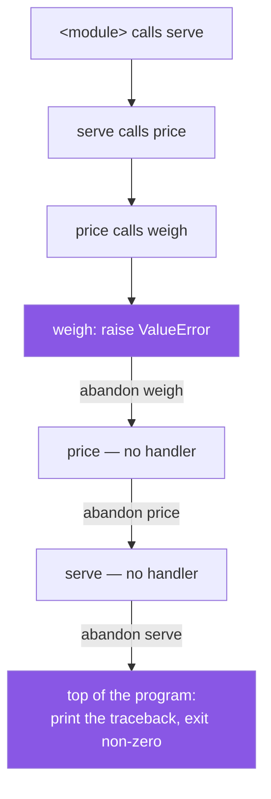

# 1.1 — What raising does: the stack unwinds until somebody catches

## One-line answer

`raise` does not "print an error" — it **stops the current function immediately** and hands an object
upward, function by function, until something catches it or the program ends.

---

## The story

At the post office counter, you hand over a parcel for Bristol.

The clerk weighs it, and it is over the limit for that service. She does not fix it, and she does not
guess. She stops what she is doing, puts the parcel back on the counter, and says *this is too heavy for
this service*.

Now watch what happens to everybody standing behind that.

The person who took your money has not taken your money — that step never happened, because it comes after
the weighing. The label was not printed. The parcel was not put in the Bristol bag. Every step that had
not happened yet does not happen.

And the message does not stay at the counter. It comes back to you, because you are the one who can do
something about it: repack it, split it, or choose a different service. The clerk cannot make any of those
choices, and she does not pretend to.

What she handed back is not a shout. It is a specific, quiet piece of information — *too heavy, this
service* — travelling from the person who found the problem to the person who can act on it.

---

## The idea in plain language

An **exception** is an object that describes something that stopped a piece of code from doing its job.
`raise` is the statement that starts it moving.

Three things happen at the `raise`, in order.

**The current function stops.** Not "returns early" — stops. No lines after the `raise` run, and no value
is returned. This is the part people underestimate: everything below is skipped, including the cleanup
somebody meant to do, unless it is protected by `finally` ([1.3](1.3-else-and-finally.md)).

**The exception travels outward, one caller at a time.** The function that called this one gets the same
treatment: it stops, and hands the exception to *its* caller. That walk back up the chain of callers is
called **unwinding the stack**. The "stack" is the list of functions currently part-way through — `serve`
called `price` called `weigh` — and unwinding is abandoning them from the inside out.

**It stops at the first handler that wants it, or at the top.** If some caller has a `try` / `except` for
that kind of exception ([1.2](1.2-try-except-and-catching-by-type.md)), the walk stops there and normal
execution resumes inside that handler. If nobody does, the walk reaches the top of the program and Python
prints the **traceback** and exits with a non-zero status.

A traceback is worth reading properly, because it is a map of that walk. It lists the functions the
exception passed through, **outermost first**, and the last line is the exception itself. So you read a
traceback from the bottom up: what went wrong, then where, then how the program got there.

Two pieces of vocabulary that people mix up, sorted now.

**Raising is not printing.** A `print` in an error path tells a human, keeps going, and returns something
— usually `None`, which then causes a second, more confusing failure somewhere else. A `raise` stops.

**An exception is not always an error.** It is Python's mechanism for "this cannot continue here", which
covers a bug (`TypeError`), a bad input (`ValueError`), an outside condition you expect (`FileNotFoundError`)
and even normal control flow (`StopIteration`, which is how a `for` loop ends —
[Day 11, 1.1](../../../day-11-iterators-and-generators/parts/01-iterators/1.1-iterable-and-iterator.md)).
The word "exception" means "an exception to the normal path", not "a disaster".

---

## Why Setu needs it

- **Day 6's capped retry loop** ([Day 6, 3.2](../../../day-06-loops/parts/03-capped-retry/3.2-the-capped-retry-from-scratch.md))
  and **Day 14's `@retry`** ([Day 14, 3.1](../../../day-14-decorators/parts/03-decorators-with-arguments/3.1-retry-three-a-decorator-that-takes-an-argument.md))
  both catch exceptions to decide whether to try again. Both were written before this day, on the promise
  that today explains what they are catching.
- **`src/setu/config.py` raises when a key is missing** rather than returning `None`, which is why Day 3's
  gate fails loudly instead of making a request with an empty key
  ([Day 3, 1.2](../../../day-03-keys-and-budget/parts/01-secrets/1.2-dotenv-and-os-environ.md)).
- **Today's build is `src/setu/errors.py`**, the exception types every later provider call raises.
- **Every day from 172 onward handles a rate limit**, and a rate limit arrives as an exception that must be
  told apart from a real failure ([3.2](../03-your-own/3.2-an-exception-that-carries-data.md)).

---

## The mechanism

Four functions, one problem, and a traceback that shows the whole walk:

```python
def weigh(parcel):
    if parcel["grams"] > 2000:
        raise ValueError("too heavy for this counter")
    return parcel["grams"]


def price(parcel):
    return weigh(parcel) * 2


def serve(parcel):
    return price(parcel)


serve({"grams": 5000})
```

**Line by line:**

- `if parcel["grams"] > 2000:` — the check comes **first**, before any work. A function that validates at
  the top and works below is one you can read; one that discovers a problem half way through has already
  changed something.
- `raise ValueError("too heavy for this counter")` — `raise`, then a **call** to an exception class.
  `raise ValueError` without the parentheses also works — Python instantiates it for you — but then there
  is no message, which throws away the useful half.
- `ValueError` — chosen because the argument is the wrong *value*, not the wrong *type*. Picking the right
  built-in is [2.2](../02-the-hierarchy/2.2-which-built-in-to-raise.md).
- `"too heavy for this counter"` — the message. Note what it is not: it does not say "error" or "invalid
  input"; it says what was wrong, in words the caller can act on
  ([3.3](../03-your-own/3.3-the-message-is-an-interface.md)).
- `return parcel["grams"]` — **not reached** when the raise fires. That is the whole point of `raise`
  rather than a return value.
- `return weigh(parcel) * 2` in `price` — this multiplication never happens. `price` did nothing wrong and
  is abandoned anyway.
- `serve({"grams": 5000})` at the outer level — nobody catches, so the traceback below is what the user
  sees.

Run on Python 3.12.12 on 2026-09-02:

```text
Traceback (most recent call last):
  File "<string>", line 16, in <module>
  File "<string>", line 13, in serve
  File "<string>", line 9, in price
  File "<string>", line 4, in weigh
ValueError: too heavy for this counter
```

**Read it bottom to top.** The last line is *what* happened. The line above it is *where* — `weigh`, line
4. The lines above that are how the program got there: `<module>` called `serve` called `price` called
`weigh`. The outermost frame is printed first, which is the opposite of what most people expect the first
few times.

And what the object itself carries:

```python
try:
    raise ValueError("too heavy for this counter")
except ValueError as error:
    print("type       :", type(error).__name__)
    print("str(error) :", str(error))
    print("repr(error):", repr(error))
    print("args       :", error.args)
    print("traceback? :", error.__traceback__ is not None)
```

**Line by line:**

- `except ValueError as error:` — `as` binds the exception **object** to a name. It is an ordinary object
  ([Day 4, 1.1](../../../day-04-objects/parts/01-objects/1.1-identity-type-value.md)),
  and everything below is ordinary attribute access.
- `type(error).__name__` — the class's name as a string. **This is what you assert on in a test**, never
  the message ([4.4](../04-in-anger/4.4-pytest-raises.md)).
- `str(error)` — the message alone. This is what an f-string interpolates, and it is why a bare `print(e)`
  in a log loses the type and is nearly useless
  ([4.3](../04-in-anger/4.3-logging-exception.md)).
- `repr(error)` — the class **and** the message. When logging by hand, this is the one to use; `!r` in an
  f-string gets it ([Day 7, 3.3](../../../day-07-strings/parts/03-formatting/3.3-repr-and-the-debugging-f-string.md)).
- `error.args` — the tuple of everything passed to the constructor. Every exception has it, which is how
  code can inspect an exception it did not define.
- `error.__traceback__` — the walk, attached to the object. It is what makes `logging.exception` able to
  print the whole thing later, from a handler ([4.3](../04-in-anger/4.3-logging-exception.md)).

```
type       : ValueError
str(error) : too heavy for this counter
repr(error): ValueError('too heavy for this counter')
args       : ('too heavy for this counter',)
traceback? : True
```

The walk:



Every `-->` on the way down is a call; every `-->` on the way back up is a function being abandoned with
its remaining lines unrun.

---

## When it breaks

**The `raise` that was written as a `return`:**

```text
$ uv run python -c "
def weigh(parcel):
    if parcel['grams'] > 2000:
        return None
    return parcel['grams']

def price(parcel):
    return weigh(parcel) * 2

print(price({'grams': 5000}))
"
Traceback (most recent call last):
  File "<string>", line 10, in <module>
  File "<string>", line 8, in price
TypeError: unsupported operand type(s) for *: 'NoneType' and 'int'
```

**What it means.** The real problem — a parcel that is too heavy — is nowhere in this traceback. What you
get instead is a multiplication complaining about `NoneType`, in a function that is entirely correct, and
the words "too heavy" appear nowhere. **Returning `None` on failure moves the error away from its cause**,
which is the single most common way a five-second bug becomes an hour. `raise` keeps the report where the
information is.

**The `print` that was meant to be a `raise`:**

```text
$ uv run python -c "
def weigh(parcel):
    if parcel['grams'] > 2000:
        print('WARNING: too heavy')
    return parcel['grams']

print('charged for', weigh({'grams': 5000}), 'grams')
"
WARNING: too heavy
charged for 5000 grams
```

**What it means.** The warning is correct and nothing acted on it. In a terminal a human might notice; in
a log file with ten thousand lines a day, nobody does; and in a web process the customer was charged. A
`print` in an error path is a note to a human who is not reading. **If the code must not continue, only
`raise` stops it.**

**Bare `raise` outside a handler:**

```text
$ uv run python -c "raise"
RuntimeError: No active exception to reraise
```

**What it means.** `raise` with nothing after it means "re-raise the exception currently being handled"
([2.4](../02-the-hierarchy/2.4-re-raising.md)), and there is not one here. The form is useful and this is
not the place for it; outside an `except` block, `raise` needs something to raise.

**Raising something that is not an exception:**

```text
$ uv run python -c "raise 'too heavy'"
TypeError: exceptions must derive from BaseException
```

**What it means.** You may only raise a class that inherits from `BaseException`, or an instance of one.
A string is not one, however descriptive. This is the error you get when a custom exception forgets to
subclass anything ([3.1](../03-your-own/3.1-one-base-class-per-project.md)), and the message is precise:
*derive from*, meaning inherit
([Day 13, 1.1](../../../day-13-inheritance-and-abstraction/parts/01-inheritance/1.1-one-form-that-starts-from-another.md)).

---

## In production

**The professional habit is that a function either does its job or raises.** Not "returns `None` on
failure", not "returns `-1`", not "returns a tuple of `(result, error)` that half the callers ignore". One
success path, and failures reported by raising. The payoff is that a caller who forgets to handle the
failure gets a loud, located traceback rather than a wrong answer, and there is no code path where a
silently-wrong value travels onward.

**What changes at scale is that the traceback is the only evidence you get.** In production nobody is at a
terminal. The exception is caught at a boundary, logged with its traceback, and turned into a status code
or a retry, and the quality of that log line decides whether the next incident takes ten minutes or a day.
That is why the type and the message are treated as an interface
([3.3](../03-your-own/3.3-the-message-is-an-interface.md)), and why the traceback is logged rather than
`str(e)` ([4.3](../04-in-anger/4.3-logging-exception.md)).

**The failure that only appears with real data is the half-finished operation.** Because `raise` abandons
the function from the inside out, everything after it is skipped — including the second half of a
two-step change. A function that appends to a list, then raises, has appended to the list. Whether that
matters is a question about your data, and it is why `try` / `finally`
([1.3](1.3-else-and-finally.md)) and Day 16's context managers
([Day 16, 4.1](../../../day-16-files-and-context-managers/parts/04-context-managers/4.1-with-the-block-that-cleans-up.md))
exist. The habit is to do the checks before the changes, so a raise leaves nothing half-done.

**The review comment a senior engineer leaves.** *"`parse_row` returns `None` when the date is malformed,
and three of its five callers do not check. Raise instead — the caller that genuinely wants to skip bad
rows can catch it and say so, and the other four get a traceback pointing at the row rather than an
`AttributeError` two modules away."*

**The interview question.** *"What actually happens when you raise an exception?"* The recited answer is
"it throws an error". The used answer is the walk: the current function stops immediately with its
remaining lines unrun, the exception is handed to the caller, and that repeats outward until a matching
`except` catches it or the interpreter prints the traceback and exits non-zero. The follow-up that shows
you have debugged one is knowing that the traceback lists frames **outermost first**, so you read it from
the bottom.

---

## Check yourself

```bash
uv run python -c "
def weigh(g):
    if g > 2000:
        raise ValueError('too heavy for this counter')
    return g

def price(g):
    return weigh(g) * 2

try:
    price(5000)
except ValueError as error:
    print('caught  :', repr(error))
    print('args    :', error.args)
    print('type    :', type(error).__name__)
price(5000)
"
```

The first call is caught and the program continues; the second is not, and the traceback names three
frames. Now change the `raise` to `return None` and read the error you get instead.

**Answer out loud, without scrolling up:**

> `serve` calls `price` calls `weigh`, and `weigh` raises. Say what happens to the rest of `price`, and say
> which line of the traceback tells you what went wrong.

---

**Next:** [1.2 — `try` / `except`, and catching by type](1.2-try-except-and-catching-by-type.md).
