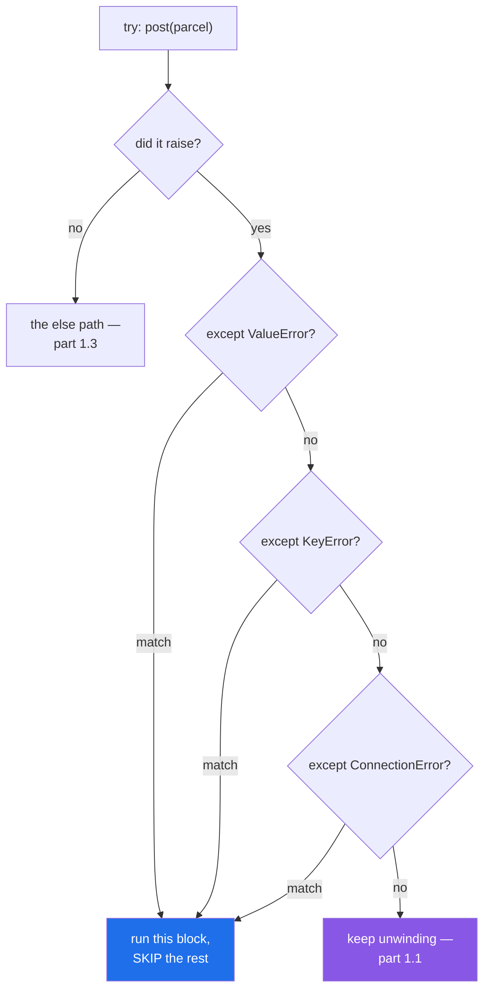

# 1.2 — `try` / `except`, and catching by type

## One-line answer

`except` is a **filter by type**: the first clause whose type matches wins, the rest are skipped, and a
broad clause written above a narrow one makes the narrow one unreachable.

---

## The story

Three things can go wrong at the counter, and they are not the same kind of wrong.

**The parcel is too heavy.** That is yours to fix. Repack it, split it into two, or pick the service that
takes heavier parcels. You will be at the counter again in five minutes.

**You left the address off the form.** Also yours, and even simpler: fill it in.

**The system is down.** Not yours at all. Nothing you do to the parcel changes anything, and the right
answer is to come back later.

The clerk says a different sentence for each, and you do a different thing after each. Nobody at that
counter would find it helpful if all three came back as "there was a problem" — because the first thing
you need to know is not *that* it failed, it is **which of those three it was**, since that decides
whether you repack, write, or leave.

---

## The idea in plain language

`try` marks a block that might raise. `except` says what to do about one kind of exception.

```text
try:
    <the risky thing>
except SomeType as name:
    <what to do about it>
```

If nothing raises, the `except` block never runs. If something raises, Python looks at the `except`
clauses **in order** and takes the first one whose type matches. Matching means the exception is an
instance of that class **or of any subclass of it**, which is the whole subject of
[2.1](../02-the-hierarchy/2.1-catching-catches-subclasses.md); for now the point is that matching is by
type, not by message.

Four rules follow, and they are all you need to write correct handlers.

**First match wins, and the rest are skipped.** Even if a later clause would also match. Order therefore
matters, and a broad clause above a narrow one makes the narrow one dead code — Python does not warn about
this, and the failure below is what it looks like.

**Narrow first, broad last.** `except ValueError` before `except Exception`, always. The general rule is
that the clauses go from most specific to least.

**One clause can take several types**, as a tuple: `except (ValueError, KeyError) as error:`. Use it when
the *response* is the same; use separate clauses when the response differs, which is the story above.

**`as error` binds the exception object**, and only inside the block. Python deletes the name at the end
of the `except` clause — deliberately, because the exception holds a reference to the whole stack of local
variables through its traceback, and keeping it alive would keep all of them alive. If you need it
afterwards, assign it to another name inside the block.

The thing this document is really teaching is **what not to put in the `try`**. A `try` block is a claim:
"an exception from anywhere in here means the thing my `except` clause describes". Wrap three statements
and that claim is false for two of them — the handler will catch a typo in the third statement and report
it as the failure it was written for. Keep the `try` around **the smallest thing that can fail**, which
gets its own part in [4.2](../04-in-anger/4.2-eafp-and-lbyl.md).

---

## Why Setu needs it

- **Day 3's four provider doors fail four different ways**, and telling "no key" from "rate limited" from
  "the model name is wrong" is what makes the router on Day 172 able to fail over instead of giving up
  ([Day 3, 4.2](../../../day-03-keys-and-budget/parts/04-rate-budget/4.2-429-and-real-backoff.md)).
- **Day 6's retry loop only retries some errors** ([Day 6, 3.3](../../../day-06-loops/parts/03-capped-retry/3.3-which-errors-are-retryable.md)),
  and "some" is expressed as an `except` clause naming types.
- **Day 16's `read_jsonl(on_error="skip")`** catches one line's parse failure and lets everything else
  through ([Day 16, 2.5](../../../day-16-files-and-context-managers/parts/02-reading-and-writing/2.5-jsonl.md)),
  which only works if the `try` is around the parse and not around the loop.
- **Today's `src/setu/errors.py`** defines the types these clauses will name, so the vocabulary comes from
  one place rather than from whichever library raised last.

---

## The mechanism

One function with three ways to fail, and a caller that responds to each differently:

```python
def post(parcel):
    if "address" not in parcel:
        raise KeyError("address")
    if parcel["grams"] > 2000:
        raise ValueError("too heavy for this counter")
    if parcel["address"] == "CLOSED":
        raise ConnectionError("the system is down")
    return "posted to " + parcel["address"]


for parcel in [
    {"address": "Bristol", "grams": 500},
    {"address": "Bristol", "grams": 5000},
    {"grams": 500},
    {"address": "CLOSED", "grams": 500},
]:
    try:
        print("ok      :", post(parcel))
    except ValueError as error:
        print("yours   :", error, "- repack and try again")
    except KeyError as error:
        print("yours   : missing field", error, "- fill it in")
    except ConnectionError as error:
        print("not you :", error, "- come back later")
```

**Line by line:**

- `raise KeyError("address")` — the missing field. `KeyError` is chosen because a key is missing; that
  choice is [2.2](../02-the-hierarchy/2.2-which-built-in-to-raise.md).
- `raise ValueError(...)` and `raise ConnectionError(...)` — three different types for three different
  situations, which is what makes three different handlers possible. **If all three raised `Exception`,
  the caller could not tell them apart**, and would have to read the message, which is
  [4.4](../04-in-anger/4.4-pytest-raises.md)'s warning.
- `try:` around **one statement**, the `print(post(parcel))`. The claim is "a failure here came from
  `post`", and it is true because there is nothing else in the block.
- three `except` clauses, **narrow to broad** — here they are all equally narrow and unrelated, so order
  does not matter yet. The failure below is what happens when it does.
- `as error` in each — the object, used for its message. Each block does something *different*, which is
  the reason for three clauses rather than one tuple.
- the last one prints `not you`, and says *come back later* rather than *repack* — the response, not just
  the report. **A handler that only prints has not handled anything.**

Run on Python 3.12.12 on 2026-09-02:

```
ok      : posted to Bristol
yours   : too heavy for this counter - repack and try again
yours   : missing field 'address' - fill it in
not you : the system is down - come back later
```

Note the third line: `'address'` with quotes. `KeyError`'s message is the key itself, printed as a `repr`
([Day 7, 3.3](../../../day-07-strings/parts/03-formatting/3.3-repr-and-the-debugging-f-string.md)), which
is a small oddity of that one type and surprises people the first time.

One clause, two types, when the response is the same:

```python
for exc in (ValueError("too heavy"), KeyError("address")):
    try:
        raise exc
    except (ValueError, KeyError) as error:
        print("caught both with one clause:", type(error).__name__, "->", error)
```

**Line by line:**

- `for exc in (ValueError(...), KeyError(...))` — exception **instances** built and stored in a tuple.
  They are ordinary objects until raised ([1.1](1.1-what-raising-does.md)); building one does nothing at
  all.
- `raise exc` — raising an instance rather than a class. Both forms are legal, and this one is what lets
  the loop drive the demonstration.
- `except (ValueError, KeyError) as error:` — a **tuple**, and the parentheses are required. Without them
  this is a syntax error, and in Python 2 it meant something else entirely, which is why old code
  sometimes has `except ValueError, e:`.
- `type(error).__name__` — showing which one actually arrived, since one clause caught both.

```
caught both with one clause: ValueError -> too heavy
caught both with one clause: KeyError -> 'address'
```

How the clauses are tried:



---

## When it breaks

**The broad clause written first, and the narrow one that never runs:**

```text
$ uv run python -c "
try:
    raise ValueError('too heavy')
except Exception:
    print('the broad handler ran')
except ValueError:
    print('the specific handler never runs')
"
the broad handler ran
```

**What it means.** `ValueError` **is an** `Exception`
([2.1](../02-the-hierarchy/2.1-catching-catches-subclasses.md)), so the first clause matches and the
second is unreachable — for every exception, not just this one. There is **no error and no warning**:
Python runs this happily, `ruff` with this project's rule selection passes it, and the second block is
simply dead. The habit that prevents it is mechanical: **write the clauses narrowest first**, and when you
add a new one, put it above the general ones rather than at the bottom where there is room.

**The name that is gone after the block:**

```text
$ uv run python -c "
try:
    raise ValueError('too heavy')
except ValueError as error:
    kept = error
print(error)
"
Traceback (most recent call last):
  File "<string>", line 7, in <module>
NameError: name 'error' is not defined. Did you mean: 'OSError'?
```

**What it means.** Python deletes the name bound by `as` when the `except` block ends. This is
deliberate: the exception holds its traceback, the traceback holds every frame's local variables, and
leaving the name bound would keep all of that alive for as long as the enclosing function runs. The fix is
in the code above — `kept = error` inside the block — and `kept` survives. The suggestion of `OSError` is
Python being helpful about a name that looks similar, and is a coincidence rather than a clue.

**The `try` that was too big.** Nine lines inside it, one handler, and a typo on the last line — `totl`
instead of `total`:

```text
$ uv run python -c "
def load(row):
    return int(row['grams'])

rows = [{'grams': '500'}]
try:
    total = 0
    for row in rows:
        total += load(row)
    print('average:', totl / len(rows))
except ValueError:
    print('a row had a bad weight')
"
Traceback (most recent call last):
  File "<string>", line 10, in <module>
NameError: name 'totl' is not defined. Did you mean: 'total'?
```

That one is fine — the handler catches `ValueError`, a `NameError` is not one, and the typo surfaces. Now
change nothing except the type in the handler:

```text
$ uv run python -c "
def load(row):
    return int(row['grams'])

rows = [{'grams': '500'}]
try:
    total = 0
    for row in rows:
        total += load(row)
    print('average:', totl / len(rows))
except Exception:
    print('a row had a bad weight')
"
a row had a bad weight
```

**What it means.** Exit status zero, one tidy line of output, and a completely false statement: there is
nothing wrong with the row. The typo is invisible, the average was never printed, and somebody will spend
an afternoon looking at the data. **A wide `try` plus a wide `except` is how a bug gets reported as a data
problem** — the full version of that failure is
[4.1](../04-in-anger/4.1-the-except-that-was-too-wide.md). The fix is to put the `try` around `load(row)`
alone, so the handler's claim is true of everything it covers.

**Catching the message instead of the type:**

```python
try:
    post(parcel)
except Exception as error:
    if "too heavy" in str(error):
        repack()
```

**Line by line:**

- `except Exception as error:` — catches everything, including the failures this code cannot handle.
- `if "too heavy" in str(error):` — **matching on the message text**. It works today and breaks the day
  somebody improves the wording, translates it, or adds the weight to it.
- `repack()` — and if the message does not match, nothing happens at all: the exception was caught,
  silently, and the function returns `None`.

**What it means.** The type *is* the machine-readable part of an exception; the message is for humans. Code
that reads the message has made a human sentence into an API, and it will break on a change nobody thought
was breaking. This is the argument for defining your own types
([3.1](../03-your-own/3.1-one-base-class-per-project.md)): when the built-ins cannot express the
distinction you need, add a type rather than parsing a sentence.

---

## In production

**The professional habit is that every `except` clause names the narrowest type that fits, and does
something.** "Does something" means one of four: recover, retry, translate to a different exception with
`raise ... from` ([2.3](../02-the-hierarchy/2.3-raise-from-and-the-chain.md)), or log and re-raise
([2.4](../02-the-hierarchy/2.4-re-raising.md)). A handler that catches and continues without doing any of
those has not handled anything; it has hidden something.

**What changes at scale is that the type becomes the routing key.** In a real system the same exception is
handled differently at three levels: retried in the client, converted to a status code at the boundary,
and counted in a dashboard. All three of those look at the **type**, so a codebase where everything raises
`Exception` cannot retry selectively, cannot return 400 rather than 500, and cannot alert on the failures
that matter. Types are how the system stays able to tell "the caller sent nonsense" from "we are broken".

**The failure that only appears with real data is the handler that was right for one of the two ways a
call fails.** A `try` around a network call with `except ConnectionError` is correct until the day the
server responds with a body the parser rejects — a `ValueError`, uncaught, in a function whose caller
believes network problems are handled. Real data produces failure modes the author did not enumerate,
which is why the boundary handler is broad-and-logging while the inner handlers are narrow-and-acting.

**The review comment a senior engineer leaves.** *"The `try` here wraps twelve lines and the `except
ValueError` is for the `int()` on line three. Any `ValueError` from the other nine — and there are two
that can — is reported as a bad weight. Put the `try` around the conversion, or better, do the conversion
in its own function."*

**The interview question.** *"How do you decide what to catch?"* The used answer has two halves. The type:
the narrowest one that describes the situation you can actually do something about, never `Exception` in
inner code, and never the message text, because the message is for humans and the type is the interface.
The scope: the smallest block that can produce it, because a wide `try` makes the handler's claim false
for most of its contents — which is how a typo gets reported as a data error.

---

## Check yourself

```bash
uv run python -c "
def post(grams):
    if grams > 2000:
        raise ValueError('too heavy for this counter')
    return 'posted'

for grams in (500, 5000):
    try:
        print('ok   :', post(grams))
    except ValueError as error:
        print('fail :', type(error).__name__, '-', error)

try:
    raise ValueError('x')
except Exception:
    print('broad won')
except ValueError:
    print('you will never see this')
"
```

The last two lines prove the ordering rule with no error anywhere. Now swap those two clauses and run it
again.

**Answer out loud, without scrolling up:**

> You have `except Exception:` and `except ValueError:` in that order. Say which one runs for a
> `ValueError`, and say what Python does about the other one.

---

**Next:** [1.3 — `else` and `finally`, the two clauses that decide what runs when](1.3-else-and-finally.md).
