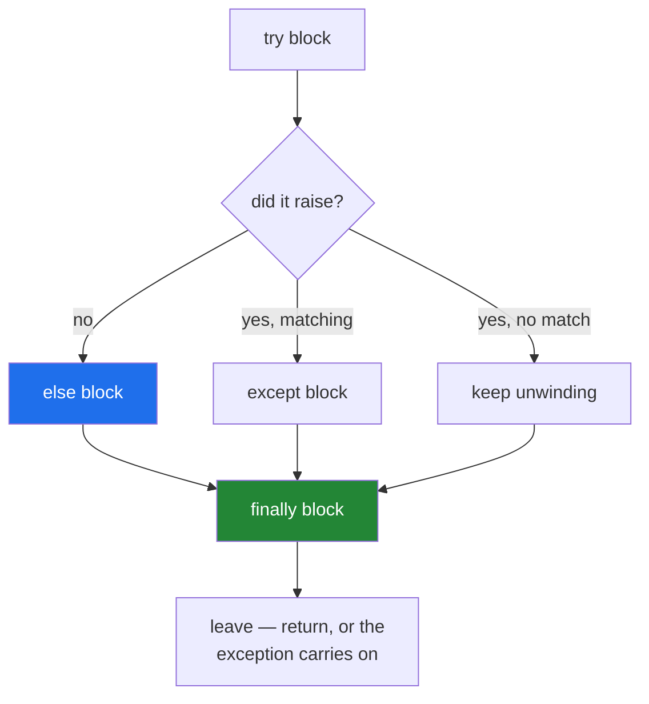

# 1.3 — `else` and `finally`: the two clauses that decide what runs when

## One-line answer

`else` runs **only when the `try` did not raise**, which keeps the `try` small enough for its handler to
be honest; `finally` runs **on every path**, including a `return` — and a `return` inside it silently
throws the exception away.

---

## The story

The counter has a rhythm to it, and it has four parts, not two.

**Weigh the parcel.** That is the bit that can go wrong.

**If it did go wrong,** say so, hand it back, and stop.

**If it did not,** print the label and put it in the bag. That is not part of the weighing, and nobody
would describe it as "the risky bit" — it happens *because* the weighing succeeded.

**And whatever happened,** wipe the counter and call the next person. Heavy parcel, light parcel, the
system going down halfway — the counter gets cleared, because the next person is waiting either way.

Those are genuinely four different jobs, and the reason it is worth separating the third from the first is
this: if the label printer jams while you are printing the label, that is a printer problem. If printing
the label happens *inside* "the bit that can go wrong", the clerk will say "there is a problem with your
parcel" — and there is nothing wrong with your parcel at all.

---

## The idea in plain language

A `try` statement has up to four parts, and each answers a different question:

| Clause | Runs when |
|---|---|
| `try` | always — this is the block being watched |
| `except` | the `try` raised something matching that clause |
| `else` | the `try` finished **without** raising |
| `finally` | always, on every way out |

**`else` exists to keep the `try` small.** The code in an `else` block runs only on success, and — this is
the part that matters — **it is not covered by the `except` clauses**. So an exception raised in the
`else` travels outward like any other, instead of being caught by a handler written for a different
problem. That is exactly [1.2](1.2-try-except-and-catching-by-type.md)'s "the `try` was too big", solved by
the language rather than by discipline.

**`finally` runs on every way out.** Success, a caught exception, an uncaught exception on its way past, a
`return`, a `break`, a `continue`. It is the cleanup clause, and it is what `with` is built out of
([Day 16, 4.2](../../../day-16-files-and-context-managers/parts/04-context-managers/4.2-try-finally-is-what-with-is.md)).

Two rules about `finally`, both of which cost people evenings.

**Never `return` from a `finally`.** A `return` there discards whatever was happening — including an
exception in flight, which is thrown away silently. The caller gets a normal return value from a call that
failed. `ruff` reports this as `B012` in this project, and the message says exactly that.

**Never let a `finally` raise.** If the cleanup raises while an exception is already travelling, the new
one replaces the old one as what the caller sees. The original is still attached, as `__context__`
([2.3](../02-the-hierarchy/2.3-raise-from-and-the-chain.md)), but the top line of the traceback is now
about a jammed drawer rather than a heavy parcel.

And one thing `finally` cannot do: it does not run if the process is killed outright, or on a power cut.
`finally` is a promise inside a running Python program, not a promise about the machine
([Day 16, 4.2](../../../day-16-files-and-context-managers/parts/04-context-managers/4.2-try-finally-is-what-with-is.md)).

In practice you will write `try` / `except` most often, `try` / `finally` when there is cleanup and no
handler, and all four together rarely — but when you do, it is because the four jobs really are separate,
and the code reads like the counter.

---

## Why Setu needs it

- **`with` is `try` / `finally`**, so every file and connection in this project since
  [Day 16, 4.1](../../../day-16-files-and-context-managers/parts/04-context-managers/4.1-with-the-block-that-cleans-up.md)
  has been using this clause without naming it.
- **Day 16's `atomic_write` is a `try` / `except` / `else`** — remove the temporary file on failure, rename
  it on success — and the `else` is what makes "on success" mean success rather than "we got here"
  ([Day 16, 4.5](../../../day-16-files-and-context-managers/parts/04-context-managers/4.5-contextmanager-decorator.md)).
- **Every provider call from Day 172 records its request in a budget counter** (Principle 5), and that
  counter must be incremented whether the call succeeded, failed or timed out — which is a `finally`.
- **Today's `src/setu/errors.py` and its tests** use `else` to separate "the call worked" from "the call
  was made", which is the distinction a retry loop needs.

---

## The mechanism

All four clauses, driven down both paths:

```python
def serve(grams):
    print(f"--- parcel of {grams}g ---")
    try:
        if grams > 2000:
            raise ValueError("too heavy for this counter")
        weighed = grams
    except ValueError as error:
        print("  except  :", error)
    else:
        print("  else    : weighed", weighed, "- printing the label now")
    finally:
        print("  finally : counter free for the next person")


serve(500)
serve(5000)
```

**Line by line:**

- `try:` contains **only the weighing** — the check and the one assignment. Nothing else is in the block,
  so the handler's claim about it is true.
- `weighed = grams` — the last line of the `try`, and the value the `else` needs. Note it is bound in the
  `try` and read in the `else`; they share a scope, so this works
  ([Day 10, 2.1](../../../day-10-functions/parts/02-scope/2.1-legb-where-a-name-is-found.md)).
- `except ValueError as error:` — one type, one response
  ([1.2](1.2-try-except-and-catching-by-type.md)).
- `else:` — **the success work.** Printing the label is not risky weighing; it is what happens when the
  weighing worked. Crucially, if this line raised, `except ValueError` would **not** catch it.
- `print(..., weighed, ...)` — reading a name the `try` bound. On the failure path this line never runs, so
  it does not matter that `weighed` was never assigned.
- `finally:` — the cleanup, and the only clause that appears in both runs below.
- `serve(500)` and `serve(5000)` — the two paths, so the difference is visible rather than described.

Run on Python 3.12.12 on 2026-09-02:

```
--- parcel of 500g ---
  else    : weighed 500 - printing the label now
  finally : counter free for the next person
--- parcel of 5000g ---
  except  : too heavy for this counter
  finally : counter free for the next person
```

**`else` appears once, `except` appears once, `finally` appears twice.** That is the entire semantics, and
it is worth reading the two blocks side by side until it is obvious.

Now the property that makes `finally` different from "the line after the `try`":

```python
def serve(grams):
    try:
        return "posted"
    finally:
        print("  finally ran, even though we returned")


print(serve(500))
```

**Line by line:**

- `return "posted"` inside the `try` — the function is leaving. A line written *after* the whole `try`
  statement would never run.
- `finally:` — runs anyway, **before** the value is actually handed back. That ordering is why `finally`
  can close a file the `return` statement's expression just used.
- `print(serve(500))` — proving the return value survived the detour.

```
  finally ran, even though we returned
posted
```

The four clauses, and when each runs:



Every path goes through the green box. Only the left path goes through the blue one.

---

## When it breaks

**The success work left inside the `try`:**

```text
$ uv run python -c "
def label(grams):
    raise ValueError('the printer is out of paper')

def serve(grams):
    try:
        if grams > 2000:
            raise ValueError('too heavy for this counter')
        print('  label:', label(grams))
    except ValueError as error:
        print('  reported as a weight problem:', error)

serve(500)
"
  reported as a weight problem: the printer is out of paper
```

**What it means.** A 500g parcel, well under the limit, and the program says there is a weight problem —
because the label printer raised a `ValueError` and it happened inside a `try` whose handler is about
weight. Nothing raised an unexpected type; the handler simply caught something it was not written for.
**Moving that one line into an `else` fixes it completely**, and the printer's `ValueError` then travels
outward to somebody who can say what it really is.

**A `return` inside `finally`:**

```text
$ uv run python -c "
def serve(grams):
    try:
        raise ValueError('too heavy')
    finally:
        return 'posted'

print('caller got:', serve(5000))
"
caller got: posted
```

**What it means. The exception is gone.** Not caught, not logged, not re-raised — discarded, because a
`return` in a `finally` overrides whatever was in flight. The caller has a perfectly ordinary string from
a call that failed, and there is no evidence anywhere that anything went wrong. This project's linter
catches it:

```text
$ uv run ruff check --select B .
B012 `return` inside `finally` blocks cause exceptions to be silenced
 --> f.py:5:9
  |
3 |         raise ValueError("too heavy")
4 |     finally:
5 |         return "posted"
  |         ^^^^^^^^^^^^^^^
```

**Read `ruff`'s wording**: *cause exceptions to be silenced*. `break` and `continue` inside a `finally`
do the same thing for the same reason.

**A `finally` that raises, on top of a failure that was already travelling:**

```text
$ uv run python -c "
def close():
    raise RuntimeError('the drawer is jammed')

try:
    try:
        raise ValueError('too heavy')
    finally:
        close()
except Exception as error:
    print('caller saw   :', repr(error))
    print('and the cause:', repr(error.__context__))
"
caller saw   : RuntimeError('the drawer is jammed')
and the cause: ValueError('too heavy')
```

**What it means.** The caller's top-line error is now about the drawer. The real problem — the heavy
parcel — is still attached as `__context__` and does appear in the printed traceback under *During
handling of the above exception, another exception occurred*
([2.3](../02-the-hierarchy/2.3-raise-from-and-the-chain.md)), but it is no longer the headline, and in a
log where somebody greps the last line it is invisible. **Cleanup runs at the worst moment, on the least
complete state**, so it must be written defensively: guard it, or wrap the risky part of the cleanup in
its own `try` that logs and moves on.

**Expecting `finally` to survive a kill:**

```text
$ uv run python -c "
import os
try:
    print('working', flush=True)
    os._exit(1)
finally:
    print('you will never see this')
"
working
```

**What it means.** `os._exit` ends the process immediately, without unwinding anything, and a `SIGKILL`
from outside does the same. The `flush=True` is there for the same reason: without it, even the `working`
line is lost, because `os._exit` does not flush the output buffer either
([Day 16, 3.1](../../../day-16-files-and-context-managers/parts/03-buffering/3.1-the-write-that-had-not-happened.md)).
`finally` is a guarantee about Python's control flow, not about the machine —
which is why durability needs `fsync`
([Day 16, 3.2](../../../day-16-files-and-context-managers/parts/03-buffering/3.2-flush-fsync-and-what-saved-means.md))
rather than a cleanup block.

---

## In production

**The professional habit is that the `try` holds one risky call, the `else` holds everything that follows
from it, and the `finally` holds cleanup that cannot fail.** Written that way, the shape of the code is
also its documentation: a reader can see what was expected to fail, and a handler can never accidentally
claim responsibility for the code that came after.

**What changes at scale is that `finally` becomes the accounting.** Metrics, spans, budget counters,
connection returns and lock releases all belong there, because they must happen on the failure path
exactly as much as on the success path — arguably more, since the failure path is the one being
investigated. A latency histogram updated only on success is the classic version of this mistake: the
dashboard looks healthy precisely while things are timing out.

**The failure that only appears with real data is the cleanup that assumed success.** Code in a `finally`
often reads state the `try` was supposed to fill in — a row count, a connection, a committed identifier —
and on the failure path that state is missing or half-formed. The cleanup then raises, replaces the real
exception, and the incident report is about a `NoneType` in a teardown routine rather than about the
timeout that caused it. The habit is that a `finally` block touches only what it knows exists, and takes
its own precautions.

**The review comment a senior engineer leaves.** *"The parse and the database write are both inside the
`try`, so `except ValueError` will report a write failure as a bad row. Move the write into an `else`.
And the `finally` returns — that is silently eating every exception this function can raise; `ruff --select
B` flags it as B012."*

**The interview question.** *"What is the `else` clause of a `try` for?"* Most people have never used it,
and the good answer is not "it runs on success" — it is *why that matters*: the `else` is **not** protected
by the `except` clauses, so moving the success work there stops the handler catching failures it was not
written for, which keeps the `try` honestly small. The natural follow-up is `finally`, and the two things
worth saying there are that it runs even on a `return`, and that returning *from* it discards an exception
in flight.

---

## Check yourself

```bash
uv run python -c "
def serve(grams):
    try:
        if grams > 2000:
            raise ValueError('too heavy')
        weighed = grams
    except ValueError as error:
        print('  except :', error)
    else:
        print('  else   : label printed for', weighed)
    finally:
        print('  finally: counter cleared')

serve(500)
serve(5000)

def sneaky():
    try:
        raise ValueError('too heavy')
    finally:
        return 'posted'

print('sneaky returned:', sneaky())
"
```

`finally` prints twice; `else` prints once; and the last line shows a failed call returning a value. Now
run `uv run ruff check --select B` on a file containing that `sneaky` function.

**Answer out loud, without scrolling up:**

> Why is moving one line from the `try` into the `else` a bug fix rather than a tidy-up? Say what the
> `except` clause could catch before the move that it cannot after.

---

**Next:** [1.4 — the bare `except`, and what else it catches](1.4-the-bare-except.md).
