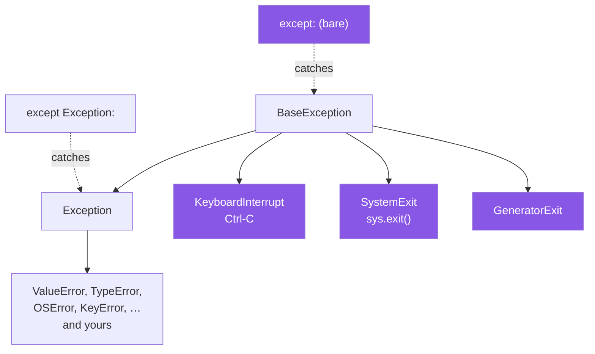

# 1.4 — The bare `except`, and what else it catches

## One-line answer

`except:` with no type catches `BaseException`, which includes Ctrl-C and `sys.exit()` — so it does not
mean "catch every error", it means "catch every error **and** every attempt to stop this program".

---

## The story

The counter has a shutter, and one day somebody wedged it open with a folded card, because it kept
sliding down while they were working.

It solved the problem. The shutter stayed up all day.

It also stayed up at closing time, when the manager pulled the cord to bring it down. And it stayed up
during the fire drill, when the instruction was to close the counter and leave.

The wedge does not know the difference between the shutter sliding down by accident and the shutter being
brought down on purpose. It stops the shutter. That is all it does, and it does it every time.

Nobody wedged the shutter meaning "ignore the fire drill". They meant "stop this annoying thing". The
fire drill was simply also a thing that came down that way.

---

## The idea in plain language

Every exception class inherits from `BaseException`. Just below it there are two groups.

**`Exception`** — everything that means "something went wrong in the program": `ValueError`, `TypeError`,
`OSError`, `KeyError`, and every exception you will ever define
([3.1](../03-your-own/3.1-one-base-class-per-project.md)).

**Three siblings of `Exception`, which are not errors at all:**

- **`KeyboardInterrupt`** — you pressed Ctrl-C. This is a person asking the program to stop.
- **`SystemExit`** — `sys.exit()` was called. This is the program asking to stop; the number you pass is
  the exit code.
- **`GeneratorExit`** — a generator is being closed
  ([Day 11, 2.1](../../../day-11-iterators-and-generators/parts/02-generators/2.1-yield-the-function-that-pauses.md)).

They inherit from `BaseException` **directly**, and that placement is deliberate. It is the language
saying: these three are not failures to be handled, they are shutdown, and code that catches errors should
not catch them by accident.

So there are two ways to write "catch everything", and they mean different things:

| Written | Catches | Means |
|---|---|---|
| `except Exception:` | every error | "something went wrong" |
| `except:` or `except BaseException:` | every error **plus** Ctrl-C, `sys.exit()`, generator close | "nothing gets past here, including shutdown" |

A bare `except:` is the second one. Inside a loop, it makes Ctrl-C stop one iteration instead of the
program — press it again and it catches that too. In a service, it turns `sys.exit(1)` into a normal
return, so a process that decided to die keeps running and reports success.

`ruff` reports the bare form as `E722`, and its own explanation is the summary of this document: *A bare
`except` catches `BaseException` which includes `KeyboardInterrupt`, `SystemExit`, `Exception`, and
others. Catching `BaseException` can make it hard to interrupt the program (e.g., with Ctrl-C) and can
disguise other problems.*

The rule is simple and has one exception. **Never write a bare `except:`.** Write `except Exception:` when
you genuinely want every error — which is rare, and belongs at a boundary where you log and re-raise
([4.1](../04-in-anger/4.1-the-except-that-was-too-wide.md)). The one legitimate use of `BaseException` is
a cleanup handler that catches it, does the cleanup, and **re-raises immediately**
([2.4](../02-the-hierarchy/2.4-re-raising.md)) — and even there, `try` / `finally`
([1.3](1.3-else-and-finally.md)) says the same thing more clearly.

---

## Why Setu needs it

- **Day 6's retry loop must not retry a Ctrl-C** ([Day 6, 3.3](../../../day-06-loops/parts/03-capped-retry/3.3-which-errors-are-retryable.md)).
  A bare `except` there means a long-running fetch cannot be stopped, which is the worst possible time for
  that to be true.
- **`./m check` depends on exit codes.** `scripts/gate.py` and `scripts/depth_check.py` end with
  `sys.exit(...)`, and a bare `except` anywhere in their call chain would turn a red gate green.
- **Day 172's router loops over four providers.** A bare `except` in that loop would make an interrupted
  batch job impossible to stop, while it burns through the free-tier quota you were trying to save
  (Principle 5).
- **Day 233's eval suite runs long.** Anything long-running is something you will want to interrupt.

---

## The mechanism

Where the four classes actually sit:

```python
for cls in (SystemExit, KeyboardInterrupt, GeneratorExit, ValueError):
    print(f"{cls.__name__:20}", " -> ".join(c.__name__ for c in cls.__mro__[:-1]))
```

**Line by line:**

- `cls.__mro__` — the method resolution order, which for an exception class is just its inheritance chain
  ([Day 13, 1.3](../../../day-13-inheritance-and-abstraction/parts/01-inheritance/1.3-the-mro.md)).
- `[:-1]` — drops the final `object`, which every class ends with and which adds nothing here.
- `" -> ".join(...)` — the chain read left to right, from the class to its most general ancestor
  ([Day 7, 2.2](../../../day-07-strings/parts/02-methods/2.2-split-and-join.md)).
- `f"{cls.__name__:20}"` — a fixed-width column so the four chains line up and the difference is visible at
  a glance ([Day 7, 3.2](../../../day-07-strings/parts/03-formatting/3.2-the-format-spec.md)).

Run on Python 3.12.12 on 2026-09-02:

```
SystemExit           SystemExit -> BaseException
KeyboardInterrupt    KeyboardInterrupt -> BaseException
GeneratorExit        GeneratorExit -> BaseException
ValueError           ValueError -> Exception -> BaseException
```

**Three of them skip `Exception` entirely.** That single fact is the whole document: `except Exception:`
cannot catch them, and `except:` can.

Now the consequence, with an exit code as the evidence:

```python
import sys


def run():
    try:
        sys.exit(3)
    except:  # noqa: E722
        print("  the bare except swallowed sys.exit")
        return "carried on"


print(run())
print("exit code will be 0, not 3")
```

**Line by line:**

- `sys.exit(3)` — **this raises**. `sys.exit` does not stop the process directly; it raises `SystemExit`,
  which unwinds the stack normally ([1.1](1.1-what-raising-does.md)) and is turned into an exit code at the
  top. That is why it is catchable at all, and it surprises nearly everyone.
- `except:  # noqa: E722` — the bare form. The `noqa` is here so the demonstration runs under this
  project's linter; **its presence in real code is the smell**.
- `return "carried on"` — the function completes normally, so its caller has no idea anything happened.
- `print("exit code will be 0, not 3")` — the line that should have been unreachable.

```text
$ uv run python -c "..."
  the bare except swallowed sys.exit
carried on
exit code will be 0, not 3
$ echo $?
0
```

**The process asked to exit with code 3 and exited with 0.** In CI, that is a failing build reported as a
pass.

The same code with one word changed:

```text
$ uv run python -c "
import sys

try:
    sys.exit(3)
except Exception:
    print('  never printed')
"
$ echo $?
3
```

Nothing printed, and the exit code is 3. `SystemExit` is not an `Exception`, so the handler did not match,
so the shutdown continued.

The hierarchy, drawn:



The purple boxes are everything a bare `except:` adds over `except Exception:`, and none of them are
errors.

---

## When it breaks

**`ruff` on the bare form, in this project's own configuration:**

```text
$ uv run ruff check --select E,F,B,SIM bare.py
SIM105 Use `contextlib.suppress(BaseException)` instead of `try`-`except`-`pass`
 --> bare.py:1:1
  |
1 | / try:
2 | |     pass
3 | | except:
4 | |     pass
  | |________^
help: Replace `try`-`except`-`pass` with `with contextlib.suppress(BaseException): ...`

E722 Do not use bare `except`
 --> bare.py:3:1
  |
1 | try:
2 |     pass
3 | except:
  | ^^^^^^
4 |     pass
  |

Found 2 errors.
```

**What it means.** Two findings for four lines. `E722` is the type — bare `except` — and `SIM105` is the
shape: a `try` / `except` / `pass` is `contextlib.suppress` written the long way
([Day 16, 4.4](../../../day-16-files-and-context-managers/parts/04-context-managers/4.4-the-exit-that-swallowed-the-exception.md)).
Note that `SIM105`'s suggestion says `suppress(BaseException)`, faithfully preserving the bug: `ruff` is
translating, not fixing. **The fix is a type, not a rewrite.**

**The tidier-looking version, which `ruff` also objects to:**

```text
$ uv run ruff check --select E,F,B,SIM,S110 bare2.py
SIM105 Use `contextlib.suppress(Exception)` instead of `try`-`except`-`pass`
 --> bare2.py:1:1
...
S110 `try`-`except`-`pass` detected, consider logging the exception
 --> bare2.py:3:1
  |
1 |   try:
2 |       x = 1
3 | / except Exception:
4 | |     pass
  | |________^
```

**What it means.** `except Exception: pass` fixes the `BaseException` problem and leaves the other one:
something failed and nobody will ever know. `S110`'s wording is the advice — *consider logging the
exception* ([4.3](../04-in-anger/4.3-logging-exception.md)). Note that `S` rules are not in this project's
selection today; the finding is real, and you have to ask for it.

**A bare `except` inside a loop, and a Ctrl-C that does not work.** This one is hard to show as a
transcript, because it needs a key press, and it is worth reproducing yourself: a `while True:` with a
`time.sleep(1)` inside a bare `except`. Ctrl-C raises `KeyboardInterrupt` in the sleeping frame, the
handler catches it, the loop continues, and the only way out is closing the terminal or killing the
process from elsewhere. **The interrupt is not lost — it is handled**, by a handler that was written for
network errors.

**`except BaseException` used correctly, and why you still would not:**

```python
try:
    do_the_work()
except BaseException:
    release_the_lock()
    raise
```

**Line by line:**

- `except BaseException:` — deliberately catches shutdown too, because a lock must be released even when
  the program is being stopped.
- `release_the_lock()` — the only thing in the block, and it does not raise.
- `raise` — a **bare re-raise** ([2.4](../02-the-hierarchy/2.4-re-raising.md)), which sends the original
  exception onward untouched, so Ctrl-C still stops the program. **Without this line the code is the wedge
  in the story.**

**What it means.** This is correct, and it is still the wrong way to write it: `try` / `finally`
([1.3](1.3-else-and-finally.md)) does the same job in one clause, with no chance of forgetting the
`raise`. If you find yourself typing `except BaseException`, the question to ask is whether you meant
`finally`.

---

## In production

**The professional rule is that `except:` never appears, and `except Exception:` appears once, at a
boundary.** The boundary is the request handler, the worker's task loop, the top of a command-line
program — one place per process where an unexpected error is logged with its traceback and turned into a
status code or a failed job. Everywhere else, exceptions are caught by type or not at all. A codebase
with a broad handler in every function has no boundary at all, because every failure is absorbed before
it reaches one.

**What changes at scale is that shutdown becomes something the system does routinely.** Containers get
`SIGTERM` on every deploy; batch jobs are cancelled; workers are told to drain. That shutdown arrives as
`KeyboardInterrupt` or `SystemExit`, and a broad handler in the wrong place turns "please stop" into "one
iteration failed, carry on" — so the pod does not exit, the orchestrator waits, and eventually kills it,
losing the graceful shutdown you wrote. **The symptom is a deploy that takes thirty seconds longer than
it should**, every time, and nobody ever looks into it.

**The failure that only appears with real data is the swallowed exit code.** A script ends with
`sys.exit(1)` when validation fails, something in its call chain has a bare `except`, and CI has been
green for months on data that has been failing validation the whole time. Nothing in the logs looks
wrong, because the handler that ate the `SystemExit` also ate the reason. This is why `./m check`'s exit
codes are treated as the contract they are.

**The review comment a senior engineer leaves.** *"The bare `except` on line 40 catches `KeyboardInterrupt`,
so this retry loop cannot be stopped with Ctrl-C — and since it sleeps between attempts, that is exactly
when somebody will try. Use `except (ConnectionError, TimeoutError):`. If you really need the cleanup on
every path, that is `finally`."*

**The interview question.** *"What is wrong with a bare `except`?"* The weak answer is "it catches too
much" or "it hides bugs" — true, but that is equally an argument against `except Exception`. The specific
answer is the hierarchy: a bare `except` catches `BaseException`, and `KeyboardInterrupt`, `SystemExit`
and `GeneratorExit` are siblings of `Exception` rather than children of it — deliberately, because they
are shutdown rather than failure. So a bare `except` makes your program uninterruptible and can turn a
non-zero exit code into zero. Adding that `sys.exit()` works *by raising* is what shows you have actually
been bitten by it.

---

## Check yourself

```bash
uv run python -c "
for cls in (SystemExit, KeyboardInterrupt, ValueError):
    print(f'{cls.__name__:20}', issubclass(cls, Exception))
"
uv run python -c "
import sys
try:
    sys.exit(3)
except Exception:
    print('not reached')
"
echo "exit code: $?"
```

The last line prints 3. Now change `except Exception:` to a bare `except:` and watch the exit code become
0.

**Answer out loud, without scrolling up:**

> Name the three classes a bare `except:` catches that `except Exception:` does not, and say what each of
> them means when it arrives.

---

**Next:** [1.5 — `except Exception as error`: what the object carries](1.5-the-exception-object.md).
