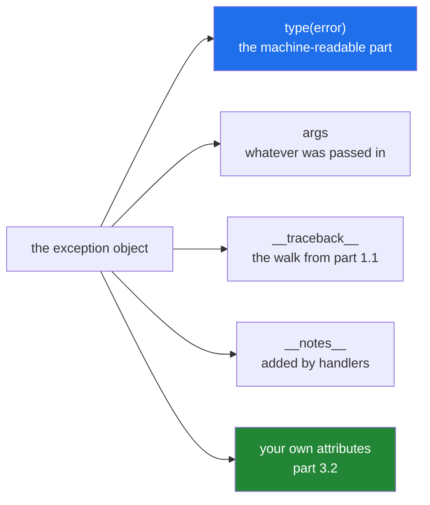

# 1.5 — `except Exception as error`: what the object carries

## One-line answer

An exception is an ordinary object with a type, an `args` tuple, a traceback and any attributes you give
it — so a handler can *use* it rather than only print it, and `str()` throws away the half that matters.

---

## The story

When the clerk hands the parcel back, she does not just say "no".

She hands back a slip. On it: **too heavy for this service**, the weight it came out at, and the limit for
the service you asked for. Underneath, in a different pen, she has added a line — *weighed at the Bristol
desk, scale 2* — because somebody complained last month that the scales upstairs read differently.

Every one of those is doing a different job. The sentence tells you what is wrong. The two numbers let
you work out how much to take out, without going back to ask. The line about the desk is for whoever
investigates if you complain.

If all you had was the sentence, you would be back at the counter twice: once to find out how heavy, once
to find out the limit.

---

## The idea in plain language

`except SomeType as error:` binds an object. It is a completely ordinary object
([Day 4, 1.1](../../../day-04-objects/parts/01-objects/1.1-identity-type-value.md)), and it carries four
useful things.

**The type.** `type(error)` is the class, and `type(error).__name__` is its name as a string. This is the
machine-readable part — the thing tests assert on and routers switch on
([1.2](1.2-try-except-and-catching-by-type.md)).

**`args`.** The tuple of everything passed to the constructor. `ValueError("too heavy")` has
`args == ("too heavy",)`. Every exception has this attribute, which is what lets code inspect an exception
raised by a library it does not control.

**The traceback**, as `error.__traceback__`. The walk from [1.1](1.1-what-raising-does.md), attached to the
object, which is how a handler can print the whole thing long after the raise
([4.3](../04-in-anger/4.3-logging-exception.md)).

**Whatever attributes it defines.** Built-in exceptions already do this: `OSError` has `.errno` and
`.filename`, `UnicodeDecodeError` has `.start` and `.end`. Your own exceptions can too, and that is
[3.2](../03-your-own/3.2-an-exception-that-carries-data.md)'s whole subject — a `RateLimited` with a
`retry_after` is an exception a retry loop can *act* on rather than guess about.

Two habits follow, and they are small.

**`repr()`, not `str()`, when you are recording it.** `str(error)` is the message alone, so
`print(f"failed: {e}")` produces `failed: too heavy` — which does not say it was a `ValueError`, and reads
identically to a `TypeError` with the same wording. `repr(error)` gives `ValueError('too heavy')`. In an
f-string, `{error!r}` is the short way
([Day 7, 3.3](../../../day-07-strings/parts/03-formatting/3.3-repr-and-the-debugging-f-string.md)).

**`add_note()` when you learn something the raiser could not know.** Since Python 3.11 every exception has
`add_note(str)`, which appends a line that is printed with the traceback and kept in `__notes__`. It is
for context you have and the raising code did not: which row, which file, which parcel. The mechanism is
*PEP 678 — Enriching Exceptions with Notes* (2022, <https://peps.python.org/pep-0678/>), and it exists
because the alternative — catching, wrapping and re-raising with a longer message — loses the original
type.

One more piece of vocabulary. An exception **class** and an exception **instance** are different things,
and both can be raised. `raise ValueError` builds an instance for you with no arguments;
`raise ValueError("too heavy")` builds one with a message. `except` clauses always name classes, never
instances.

---

## Why Setu needs it

- **Day 6's retry loop needs to know how long to wait** ([Day 6, 3.3](../../../day-06-loops/parts/03-capped-retry/3.3-which-errors-are-retryable.md)),
  and a provider's 429 response carries that number. Getting it out of the exception rather than guessing is
  the difference between backing off correctly and hammering a rate limit
  ([3.2](../03-your-own/3.2-an-exception-that-carries-data.md)).
- **Day 16's `read_jsonl` must report the file's line number** on a bad line
  ([Day 16, 2.5](../../../day-16-files-and-context-managers/parts/02-reading-and-writing/2.5-jsonl.md)),
  and `json`'s own message always says line 1. `add_note` is one way; a wrapped exception with an
  attribute is the other ([3.2](../03-your-own/3.2-an-exception-that-carries-data.md)).
- **Every log line from Day 172 onward records a failure**, and one that records `str(e)` loses the type —
  which is the field you will want to group by when something is wrong.
- **Today's `src/setu/errors.py`** defines exceptions with attributes, so callers can branch on data rather
  than parse sentences.

---

## The mechanism

What the object carries, printed four ways:

```python
error = ValueError("too heavy", 5000, 2000)

print("str :", str(error))
print("repr:", repr(error))
print("args:", error.args)
grams, limit = error.args[1], error.args[2]
print("over by:", grams - limit, "g")
```

**Line by line:**

- `ValueError("too heavy", 5000, 2000)` — **built, not raised.** An exception is an object first; raising
  is something you do to one ([1.1](1.1-what-raising-does.md)). Three arguments, because `args` takes as
  many as you give it.
- `str(error)` — with more than one argument this is the whole tuple, printed. **That is a surprise**, and
  it is the reason multi-argument exceptions are usually a worse idea than an attribute
  ([3.2](../03-your-own/3.2-an-exception-that-carries-data.md)).
- `repr(error)` — the class name and the arguments. This is the form to log.
- `error.args` — the tuple itself, which any code can read without knowing the class.
- `error.args[1], error.args[2]` — pulling data back out by position. It works, and it is exactly the
  brittleness a named attribute removes: positions are not documented anywhere and nothing checks them.

Run on Python 3.12.12 on 2026-09-02:

```
str : ('too heavy', 5000, 2000)
repr: ValueError('too heavy', 5000, 2000)
args: ('too heavy', 5000, 2000)
over by: 3000 g
```

Adding what the raiser could not know:

```python
try:
    try:
        raise ValueError("too heavy for this counter")
    except ValueError as error:
        error.add_note("parcel 7741, weighed at the Bristol desk")
        error.add_note("limit for this service is 2000g")
        raise
except ValueError as error:
    print("notes:", error.__notes__)
```

**Line by line:**

- the inner `raise ValueError(...)` — raised by code that knows about weight and nothing about parcels.
- `error.add_note(...)` — the handler adding what *it* knows. Two calls, because notes accumulate; each one
  is a separate line.
- `raise` on its own — a **bare re-raise**, which sends the same object onward with its traceback intact
  ([2.4](../02-the-hierarchy/2.4-re-raising.md)). Writing `raise error` instead would also work but is
  worth avoiding for reasons that part covers.
- the outer handler reading `error.__notes__` — a plain list of strings. Present only if `add_note` was
  called at least once, so code that reads it should use `getattr(error, "__notes__", [])`.

```
notes: ['parcel 7741, weighed at the Bristol desk', 'limit for this service is 2000g']
```

And what they look like when nobody catches them:

```text
$ uv run python -c "
try:
    raise ValueError('too heavy for this counter')
except ValueError as error:
    error.add_note('parcel 7741, weighed at the Bristol desk')
    raise
"
Traceback (most recent call last):
  File "<string>", line 3, in <module>
ValueError: too heavy for this counter
parcel 7741, weighed at the Bristol desk
```

**The note is printed under the exception, unquoted, as part of the traceback.** That is the whole point:
the extra context reaches whoever reads the log, without changing the type or the message.

Capturing the traceback as text, which is what a log handler does:

```python
import traceback


def weigh(g):
    raise ValueError("too heavy")


try:
    weigh(5000)
except ValueError as error:
    text = "".join(traceback.format_exception(error))
    print("captured", len(text.splitlines()), "lines into a string:")
    print(text.rstrip())
```

**Line by line:**

- `import traceback` — the standard-library module for turning traceback objects into text.
- `traceback.format_exception(error)` — since Python 3.10 this takes just the exception; older code passes
  three arguments from `sys.exc_info()`, which is why you will see both forms.
- it returns a **list of strings**, each already ending in a newline, so `"".join(...)` is the way to
  assemble it — not `"\n".join(...)`, which would double every line break
  ([Day 7, 2.2](../../../day-07-strings/parts/02-methods/2.2-split-and-join.md)).
- `text.rstrip()` — drops the trailing newline so `print` does not add a blank line.
- **This is what `logging.exception` does for you** ([4.3](../04-in-anger/4.3-logging-exception.md)), and
  doing it by hand once is what makes that function stop being magic.

```
captured 4 lines into a string:
Traceback (most recent call last):
  File "<string>", line 8, in <module>
  File "<string>", line 5, in weigh
ValueError: too heavy
```

What is attached to one exception:



---

## When it breaks

**The log line that lost the type:**

```text
$ uv run python -c "
for error in (ValueError('too heavy'), TypeError('too heavy')):
    print(f'failed: {error}')
    print(f'failed: {error!r}')
"
failed: too heavy
failed: ValueError('too heavy')
failed: too heavy
failed: TypeError('too heavy')
```

**What it means.** Lines one and three are identical, and they come from two completely different problems
— one is bad input, the other is a bug. In a log file with a million lines, `failed: too heavy` cannot be
grouped, counted or alerted on, and nobody can tell whether it is one issue or two. **`{error!r}` costs
two characters** and keeps the type.

**Reading `args` by position, from an exception you do not own:**

```text
$ uv run python -c "
try:
    open('no-such-file.txt')
except OSError as error:
    print('args     :', error.args)
    print('by index :', error.args[1])
    print('by name  :', error.strerror, '|', error.filename, '|', error.errno)
"
args     : (2, 'No such file or directory')
by index : No such file or directory
by name  : No such file or directory | no-such-file.txt | 2
```

**What it means.** `args[1]` works and tells you nothing about what it is; `error.strerror` says what it
is, and `error.filename` is not in `args` at all — so the positional approach cannot reach it. Built-in
exceptions carry named attributes precisely so callers do not have to count. **When you define your own
([3.2](../03-your-own/3.2-an-exception-that-carries-data.md)), do the same.**

**`__notes__` read on an exception that has none:**

```text
$ uv run python -c "
try:
    raise ValueError('too heavy')
except ValueError as error:
    print(error.__notes__)
"
Traceback (most recent call last):
  File "<string>", line 5, in <module>
AttributeError: 'ValueError' object has no attribute '__notes__'. Did you mean: '__ne__'?
```

**What it means.** The attribute is created by the first `add_note` call and does not exist before it —
so code that reads it must use `getattr(error, "__notes__", [])`. This is the one rough edge of an
otherwise very useful feature, and it is easy to hit when writing a log formatter that handles every
exception.

**Keeping the exception object alive after the handler:**

```python
failures = []

for row in rows:
    try:
        process(row)
    except ValueError as error:
        failures.append(error)
```

**Line by line:**

- `failures.append(error)` — keeping the object, which is legal: the `as` name is deleted at the end of
  the block ([1.2](1.2-try-except-and-catching-by-type.md)), but the object survives if something else
  references it.
- **The cost is invisible.** Each exception holds its `__traceback__`, and a traceback holds every frame it
  passed through, and each frame holds all of that function's local variables. Ten thousand kept
  exceptions can hold ten thousand copies of whatever `process` had in scope.

**What it means.** For a handful of failures this is fine and useful. For a long run over real data it is
a memory leak with a respectable-looking cause. If you need to keep failures, keep what you need —
`(row_number, type(error).__name__, str(error))` — rather than the objects.

---

## In production

**The professional habit is that a handler uses the exception rather than printing it.** The type decides
what to do; the attributes supply the numbers; the traceback goes into the log once, at the boundary. A
handler whose entire body is `print(e)` has converted a structured object into a sentence and thrown the
rest away, and everything downstream — grouping, alerting, retry timing — has to be reconstructed by
parsing that sentence.

**What changes at scale is that the exception becomes a record in an aggregation system.** Structured
logging emits the type as one field, the message as another, and the traceback as a third, so a dashboard
can show "1,200 `RateLimited`, 3 `ValueError`" instead of a wall of text. That only works if the type is
distinct and the data is on attributes; a codebase where everything is `Exception("failed: " + str(x))`
produces one bucket with a million members.

**The failure that only appears with real data is the retry that guessed.** A rate limit response carries
a retry-after value, and code that catches a generic error and sleeps a fixed number of seconds is either
too slow — wasting most of a free tier's daily allowance waiting — or too fast, hitting the limit again
and sometimes extending it. The information was in the exception; nobody put it on an attribute, so
nobody could use it (Principle 5).

**The review comment a senior engineer leaves.** *"`log.error(f'failed: {e}')` drops the exception type
and the traceback. Use `log.exception('failed to weigh parcel %s', parcel_id)` inside the handler — that
records the traceback automatically — and if you want the weight in the log, put it on the exception as an
attribute instead of formatting it into the message."*

**The interview question.** *"What can you do with the exception object besides print it?"* The answer
worth giving lists the four: the type, which is what you branch and assert on; `args`, which every
exception has; `__traceback__`, which is why a handler can log the full walk long after the raise; and its
own attributes, which is how `OSError` gives you `.errno` and `.filename` and how your own exceptions
should give you the retry delay. Mentioning `add_note` for context the raiser could not have known is the
detail that dates you as somebody using a current Python.

---

## Check yourself

```bash
uv run python -c "
try:
    open('no-such-file.txt')
except OSError as error:
    print('type    :', type(error).__name__)
    print('str     :', str(error))
    print('repr    :', repr(error))
    print('args    :', error.args)
    print('errno   :', error.errno)
    print('filename:', error.filename)
    error.add_note('while loading the parcel manifest')
    print('notes   :', error.__notes__)
"
```

Six different views of one object. Now find which of them survives `print(f'failed: {error}')`.

**Answer out loud, without scrolling up:**

> Two different bugs both log the line `failed: too heavy`. Say what the log lost, what one character
> would have kept it, and why that matters more in a log file than in a terminal.

---

**Next:** [2.1 — exceptions are classes, and catching catches subclasses](../02-the-hierarchy/2.1-catching-catches-subclasses.md).
