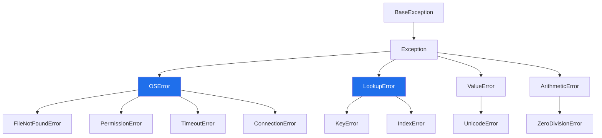

# 2.1 — Exceptions are classes, and catching catches subclasses

## One-line answer

`except X` matches anything that **is an** `X` — every subclass included — which is why one clause can
catch a whole family, and why writing the family above one of its members makes that member unreachable.

---

## The story

Behind the counter there is a laminated sheet of the things that can go wrong, and it is grouped, not
alphabetical.

Under **"parcel problems"** there are four: too heavy, too big, badly wrapped, prohibited contents.

Under **"system problems"** there are three: card reader down, network down, printer out of paper.

The grouping is doing real work. The person training on their first day is told: *anything under parcel
problems, you hand it back and explain. Anything under system problems, you apologise and say when to come
back.* Two sentences instead of seven, and they will still be right when somebody adds an eighth row to
the sheet.

And the grouping is what makes the specific rows worth having as well. "Too heavy" is a parcel problem
*and* it is too heavy, and which of those two you need depends on whether you are the trainee or the
person who has to say how much to take out.

---

## The idea in plain language

Exception types are classes, and they inherit from each other
([Day 13, 1.1](../../../day-13-inheritance-and-abstraction/parts/01-inheritance/1.1-one-form-that-starts-from-another.md)).
`FileNotFoundError` inherits from `OSError`, which inherits from `Exception`, which inherits from
`BaseException`.

`except X` uses that: it matches an exception if `isinstance(error, X)` — so it matches `X` **and every
class descended from it**. That is the same "is a" question you have been asking since Day 13, applied at
the moment an exception goes past.

Three consequences, and they are the whole document.

**One clause can catch a family.** `except OSError:` catches `FileNotFoundError`, `PermissionError`,
`TimeoutError`, `ConnectionError` and about fifteen others, because the standard library grouped them on
purpose — everything that comes from the operating system is an `OSError`.

**Ordering is not style, it is meaning.** A clause catches everything below it in the tree, so a general
clause written first makes every specific clause after it dead
([1.2](../01-raising-and-catching/1.2-try-except-and-catching-by-type.md)). Narrow first, always.

**Where you attach your own exception decides who catches it.** If your `RateLimited` inherits from
`Exception`, only code that names it will catch it. If it inherits from `ConnectionError`, every existing
`except ConnectionError:` in the codebase will catch it too — which may be exactly right, or a surprise
somebody discovers in production. That choice is [3.1](../03-your-own/3.1-one-base-class-per-project.md),
and this part is the reason it is a choice at all.

The groups worth knowing by name, because they are the ones you will catch as a family:

| Family | Covers |
|---|---|
| `OSError` | files, permissions, sockets, timeouts — anything from the operating system |
| `LookupError` | `KeyError` and `IndexError` — something was not there |
| `ArithmeticError` | `ZeroDivisionError`, `OverflowError`, `FloatingPointError` |
| `ValueError` | right type, wrong value — and `UnicodeError` lives under it |
| `Exception` | everything that is a failure, but not shutdown ([1.4](../01-raising-and-catching/1.4-the-bare-except.md)) |

`ArithmeticError` matters more than it looks from Day 20 onward, where a division in a metric can produce
`ZeroDivisionError` on an empty group.

---

## Why Setu needs it

- **Day 6's retry loop retries `OSError` and not `ValueError`** ([Day 6, 3.3](../../../day-06-loops/parts/03-capped-retry/3.3-which-errors-are-retryable.md)),
  and that one line covers every network failure the operating system can produce, because they are all
  under `OSError`.
- **Day 16's file work catches `FileNotFoundError` specifically and `OSError` at the boundary**
  ([Day 16, 1.4](../../../day-16-files-and-context-managers/parts/01-the-path/1.4-exists-mkdir-and-the-race.md)) —
  the specific one to act on, the family one to report.
- **Today's `src/setu/errors.py` needs one base class**, and the reason is this: `except SetuError:`
  catches every failure this project defines and nothing that a library raised
  ([3.1](../03-your-own/3.1-one-base-class-per-project.md)).
- **Day 172's router distinguishes "this provider is rate-limited" from "this provider is broken"** by
  catching two branches of one family, then falling over to the next provider only for one of them.

---

## The mechanism

One clause, three different exceptions:

```python
for exc in (FileNotFoundError("gone"), PermissionError("no"), TimeoutError("slow")):
    try:
        raise exc
    except OSError as error:
        print(f"{type(error).__name__:20} caught by except OSError")
```

**Line by line:**

- three instances in a tuple — built, not raised, so the loop can raise each in turn
  ([1.5](../01-raising-and-catching/1.5-the-exception-object.md)).
- `except OSError as error:` — **one clause**. None of the three types is named anywhere in it.
- `type(error).__name__` — printing what actually arrived, so it is clear the clause is not converting
  anything. The object is still a `FileNotFoundError`; it was simply *matched* as an `OSError`.
- `:20` — a fixed-width column ([Day 7, 3.2](../../../day-07-strings/parts/03-formatting/3.2-the-format-spec.md)).

Run on Python 3.12.12 on 2026-09-02:

```
FileNotFoundError    caught by except OSError
PermissionError      caught by except OSError
TimeoutError         caught by except OSError
```

And why:

```python
print(" -> ".join(c.__name__ for c in FileNotFoundError.__mro__))
print(" -> ".join(c.__name__ for c in KeyError.__mro__))
print(" -> ".join(c.__name__ for c in TimeoutError.__mro__))
print(
    "IndexError and KeyError share:",
    [c.__name__ for c in IndexError.__mro__ if c in KeyError.__mro__],
)
```

**Line by line:**

- `__mro__` — the inheritance chain
  ([Day 13, 1.3](../../../day-13-inheritance-and-abstraction/parts/01-inheritance/1.3-the-mro.md)).
  For exceptions it is a plain line rather than a lattice, because none of them use multiple inheritance.
- `TimeoutError` in the list — worth including because people expect it to be its own thing. It is an
  `OSError`, which is why `except OSError:` covers a hung socket.
- the last expression — a comprehension filtering one chain by membership in the other
  ([Day 9, 1.2](../../../day-09-comprehensions/parts/01-list-comprehensions/1.2-the-filter-clause.md)),
  which finds the common ancestors. `LookupError` is the useful answer: one clause for "it was not
  there", whether the container was a dict or a list.

```
FileNotFoundError -> OSError -> Exception -> BaseException -> object
KeyError -> LookupError -> Exception -> BaseException -> object
TimeoutError -> OSError -> Exception -> BaseException -> object
IndexError and KeyError share: ['LookupError', 'Exception', 'BaseException', 'object']
```

The question `except` is really asking:

```python
e = FileNotFoundError("gone")

print("isinstance OSError    :", isinstance(e, OSError))
print("isinstance Exception  :", isinstance(e, Exception))
print("isinstance ValueError :", isinstance(e, ValueError))
```

**Line by line:**

- `isinstance(e, OSError)` — **this is exactly what an `except OSError:` clause evaluates.** Knowing that
  means you can answer "will this be caught?" at a REPL rather than by running the program.
- `isinstance(e, ValueError)` — `False`, and it is worth seeing a negative: `FileNotFoundError` and
  `ValueError` are in different branches, so neither clause catches the other's exceptions.

```
isinstance OSError    : True
isinstance Exception  : True
isinstance ValueError : False
```

A slice of the tree:



`except OSError:` catches everything below the left blue box. `except LookupError:` catches both children
of the right one.

---

## When it breaks

**The specific clause below the general one:**

```text
$ uv run python -c "
try:
    open('no-such-file.txt')
except OSError:
    print('some kind of OS problem')
except FileNotFoundError:
    print('the file is missing - you will never see this')
"
some kind of OS problem
```

**What it means.** `FileNotFoundError` **is an** `OSError`, so the first clause matched and the second is
unreachable for every exception, forever. There is no error and no warning — Python is doing exactly what
it says. The habit that prevents it: when adding a clause, ask "is this a subclass of anything already in
the list", and if it is, put it **above**.

**Catching a family and meaning one member:**

```text
$ uv run python -c "
import os

def load(path):
    try:
        with open(path, encoding='utf-8') as f:
            return f.read()
    except OSError:
        return ''

os.mkdir('a-folder') if not os.path.isdir('a-folder') else None
print('content:', repr(load('a-folder')))
print('content:', repr(load('no-such-file.txt')))
os.rmdir('a-folder')
"
content: ''
content: ''
```

**What it means.** Two very different situations — a missing file, which may be fine, and *a directory
where a file should be*, which is a real problem — both come back as an empty string. `except OSError:`
covers `IsADirectoryError`, `PermissionError` and about fifteen others, and the author was thinking about
one of them. **Catch the family when you mean the family**; here the intent was `except FileNotFoundError:`,
and everything else should have travelled.

**A custom exception attached in the wrong place:**

```text
$ uv run python -c "
class RateLimited(ConnectionError):
    pass

try:
    raise RateLimited('slow down')
except ConnectionError as error:
    print('an existing handler somewhere caught it:', type(error).__name__)
"
an existing handler somewhere caught it: RateLimited
```

**What it means.** Nothing is broken and that may be exactly what you want — a rate limit *is* a
connection-level problem, and existing retry code will now handle it for free. But it is a decision, not a
detail: every `except ConnectionError:` already written in the codebase and in your dependencies now
catches your new exception, including ones you have never read. **Inheriting from a built-in enrols you in
everybody else's handlers**, which is the argument for a project base class that inherits from `Exception`
([3.1](../03-your-own/3.1-one-base-class-per-project.md)).

**Assuming a name implies a family:**

```text
$ uv run python -c "
print('TimeoutError is an OSError      :', issubclass(TimeoutError, OSError))
print('UnicodeError is a ValueError    :', issubclass(UnicodeError, ValueError))
print('KeyError is an IndexError       :', issubclass(KeyError, IndexError))
print('StopIteration is an Exception   :', issubclass(StopIteration, Exception))
"
TimeoutError is an OSError      : True
UnicodeError is a ValueError    : True
KeyError is an IndexError       : False
StopIteration is an Exception   : True
```

**What it means.** Two of these surprise people. `UnicodeDecodeError` being a `ValueError` means
`except ValueError:` around a file read catches an encoding failure
([Day 16, 2.2](../../../day-16-files-and-context-managers/parts/02-reading-and-writing/2.2-encoding.md)) —
usually not what was meant. And `KeyError` is **not** an `IndexError`; they are siblings under
`LookupError`, so code that catches one and expects to cover both is wrong. **`issubclass` at a REPL
settles all of these in a second**, and guessing settles none of them.

---

## In production

**The professional habit is to catch the narrowest class that describes what you can handle, and to use a
family only when the whole family gets the same response.** In practice that means specific classes deep
in the code where something is being recovered, and families at boundaries where things are being
reported. A retry loop catching `OSError` is right — every operating-system failure is worth one more
attempt. A parser catching `OSError` is not; it should catch nothing at all, and let its caller decide.

**What changes at scale is that your own hierarchy becomes the contract with everything downstream.**
Once a service raises `PaymentError` with `CardDeclined` and `GatewayUnavailable` beneath it, callers can
choose their level: retry the second, show a message for the first, or catch the base and log. Adding a
third subclass later does not break anybody, because existing handlers catch the base. Getting this shape
right is why the base class comes first ([3.1](../03-your-own/3.1-one-base-class-per-project.md)) and the
specific types are added as they are needed.

**The failure that only appears with real data is the family that grew.** `except OSError:` written when
the only failure imaginable was a missing file starts silently absorbing `PermissionError` the day the
service runs as a different user, and `OSError: [Errno 28] No space left on device` the day the disk
fills. Both are returned as an empty result, and the symptom is missing data rather than an error. Real
environments produce members of a family that the developer's laptop never did.

**The review comment a senior engineer leaves.** *"`except OSError` here means a full disk and a
permissions problem both come back as an empty list, and the caller cannot tell them from a legitimately
empty file. Catch `FileNotFoundError` — that is the one we can handle — and let the rest through to the
boundary handler, which logs."*

**The interview question.** *"What does `except Exception` actually match?"* The answer is `isinstance`:
every class descended from `Exception`, which is everything except `KeyboardInterrupt`, `SystemExit` and
`GeneratorExit` ([1.4](../01-raising-and-catching/1.4-the-bare-except.md)). The follow-up that separates
people is what it implies for your own exceptions: where you attach them in the tree decides who catches
them, so inheriting from a built-in like `ConnectionError` silently enrols you in every existing handler
for it — sometimes exactly what you want, and never something to do by accident.

---

## Check yourself

```bash
uv run python -c "
for pair in [
    ('FileNotFoundError', 'OSError'),
    ('KeyError', 'LookupError'),
    ('IndexError', 'KeyError'),
    ('UnicodeDecodeError', 'ValueError'),
    ('ZeroDivisionError', 'ArithmeticError'),
]:
    child, parent = (eval(n) for n in pair)
    print(f'{pair[0]:22} is a {pair[1]:16}: {issubclass(child, parent)}')
"
```

Four `True` and one `False`. Say which one is the `False` before you look, then say why the pair that
surprised you is arranged that way.

**Answer out loud, without scrolling up:**

> You write `except Exception:` above `except ValueError:`. Say what Python does with the second clause,
> and say what question `except X` is really asking about the exception object.

---

**Next:** [2.2 — reading the built-in tree: which one to raise when](2.2-which-built-in-to-raise.md).
