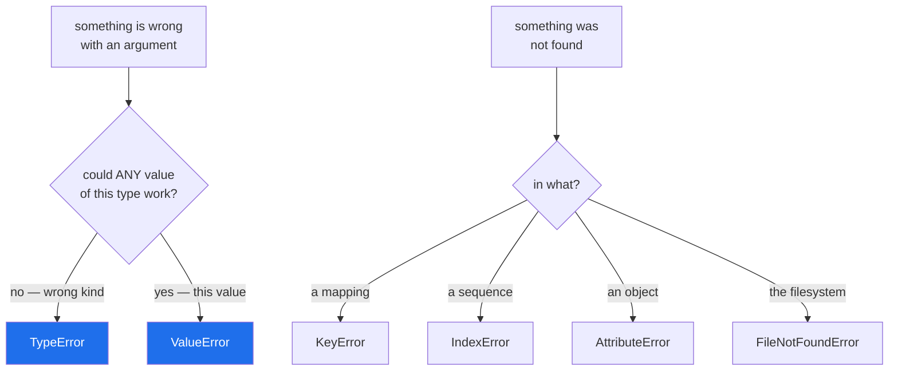

# 2.2 — Reading the built-in tree: which one to raise when

## One-line answer

Match what Python itself would raise for the same shape of problem — `TypeError` for the wrong *kind* of
thing, `ValueError` for the right kind with an unusable value, `KeyError` and `IndexError` for something
that was not there — because callers already know those.

---

## The story

The laminated sheet behind the counter has the same wording as the sheets in every other branch.

That is not tidiness. It is so that the customer who was told "too heavy for this service" in Leeds hears
the same sentence in Bristol, and already knows what it means and what to do. Nobody has to learn a local
vocabulary.

The branch that decided to be helpful and print its own sheet — with *parcel non-compliant* instead of
*too heavy* — did not make anything clearer. Every customer now asks what it means, and the staff explain
it in the words the old sheet used.

There is a real cost to inventing a word for something that already has one, and the cost lands on
everybody except the person who invented it.

---

## The idea in plain language

Python's built-in exceptions are a shared vocabulary. Every Python programmer already knows what a
`ValueError` means, and every retry loop, test and log dashboard is already written against them. Raising
the one that fits means your function behaves like the standard library, and the caller needs no
documentation.

The choices you will actually make, with the question each one answers:

| Raise | When | Example |
|---|---|---|
| `TypeError` | the **kind** of thing is wrong | a string where a number was needed |
| `ValueError` | the kind is right, the **value** is not usable | `int("abc")`, a negative weight |
| `KeyError` | a mapping had no such key | a missing field in a record |
| `IndexError` | a sequence had no such position | past the end of a list |
| `AttributeError` | an object has no such attribute | duck typing failing a check |
| `FileNotFoundError` | a path is not there | and its siblings under `OSError` |
| `NotImplementedError` | an abstract method that a subclass must supply | Day 13's loader base class |
| `RuntimeError` | none of the above, and it is genuinely a bug | last resort, and say so |

Four rules to apply them by.

**`TypeError` versus `ValueError` is about kind versus value.** `int("abc")` is a `ValueError` because a
string is a perfectly good argument to `int` — that particular string is not. `len(1)` is a `TypeError`
because an integer has no length at all. When you cannot decide, ask: would *any* value of this type
work?

**Do not invent when a built-in fits.** A `ValueError("weight must be positive")` says everything a custom
`InvalidWeightError` would, and every caller already handles it. Custom exceptions earn their place when
callers need to **branch** on the difference ([3.1](../03-your-own/3.1-one-base-class-per-project.md)) —
not merely to be more specific in a message.

**Do not raise the base classes.** `raise Exception("...")` is the exception equivalent of naming a
variable `data`. It is catchable only by a clause that catches everything, so it forces every caller to
be broad ([4.1](../04-in-anger/4.1-the-except-that-was-too-wide.md)). `BaseException` is worse.

**Two names look identical and are not.** `NotImplementedError` is an exception class, for a method a
subclass is supposed to override
([Day 13, 4.1](../../../day-13-inheritance-and-abstraction/parts/04-abstraction/4.1-abc-and-abstractmethod.md)).
`NotImplemented` is a **value**, returned from comparison dunder methods to say "I cannot compare these,
try the other operand"
([Day 15, 3.3](../../../day-15-constructors-and-dunders/parts/03-the-dunders/3.3-eq-and-the-duplicate.md)).
Raising the value gives you a `TypeError`, and the confusion is common enough to be worth a line here.

The full tree is in the library reference at
<https://docs.python.org/3/library/exceptions.html>, laid out as an indented list. It is one of the
pages worth reading once, front to back.

---

## Why Setu needs it

- **`src/setu/config.py` raises when a required key is missing**, and the type it picks decides whether
  Day 3's gate can tell "you have not set up your keys" from "the network is down"
  ([Day 3, 5.1](../../../day-03-keys-and-budget/parts/05-the-gate/5.1-the-phase-0-gate.md)).
- **Day 12's `Paper.__init__` validates** ([Day 12, 3.2](../../../day-12-classes/parts/03-the-paper-object/3.2-validation-in-init.md)),
  and every one of those checks has to choose between `TypeError` and `ValueError`.
- **Day 13's `BaseLoader` raises `NotImplementedError`** ([Day 13, 4.1](../../../day-13-inheritance-and-abstraction/parts/04-abstraction/4.1-abc-and-abstractmethod.md)),
  which is the one place a "not written yet" exception is the correct answer rather than a placeholder.
- **Today's `src/setu/errors.py` should be small**, and it will only stay small if the rule is "a built-in
  unless a caller needs to branch".

---

## The mechanism

What Python raises for eight everyday mistakes — the reference you are matching:

```python
cases = [
    ('int("abc")', lambda: int("abc")),
    ('"a" + 1', lambda: "a" + 1),
    ("[1, 2][5]", lambda: [1, 2][5]),
    ('{}["k"]', lambda: {}["k"]),
    ("1 / 0", lambda: 1 / 0),
    ('open("nope")', lambda: open("nope")),
    ("(1).nope", lambda: (1).nope),
    ("len(1)", lambda: len(1)),
]
for label, fn in cases:
    try:
        fn()
    except Exception as error:
        print(f"{label:16} -> {type(error).__name__:20} {error}")
```

**Line by line:**

- `lambda: int("abc")` — each case wrapped in a lambda
  ([Day 11, 3.1](../../../day-11-iterators-and-generators/parts/03-lambda-and-map/3.1-lambda-a-function-with-no-name.md))
  so it is *not* evaluated when the list is built. Written as bare expressions, the first one would raise
  before the loop started.
- `except Exception as error:` — deliberately broad **in a demonstration**, because the point is to see
  what arrives. In real code this is the shape to avoid
  ([4.1](../04-in-anger/4.1-the-except-that-was-too-wide.md)).
- `type(error).__name__` and `error` side by side — the type and the message, which is what you are trying
  to imitate. Read the messages as well as the types: they say what was wrong, not that something was
  wrong.

Run on Python 3.12.12 on 2026-09-02:

```
int("abc")       -> ValueError           invalid literal for int() with base 10: 'abc'
"a" + 1          -> TypeError            can only concatenate str (not "int") to str
[1, 2][5]        -> IndexError           list index out of range
{}["k"]          -> KeyError             'k'
1 / 0            -> ZeroDivisionError    division by zero
open("nope")     -> FileNotFoundError    [Errno 2] No such file or directory: 'nope'
(1).nope         -> AttributeError       'int' object has no attribute 'nope'
len(1)           -> TypeError            object of type 'int' has no len()
```

**Compare rows one and two.** `int("abc")` is a `ValueError` — a string is the right kind of argument.
`"a" + 1` is a `TypeError` — no integer can be concatenated to a string. That is the whole kind-versus-value
distinction, in two lines of the standard library's own behaviour.

Applied to the counter:

```python
def weigh(parcel, limit_grams=2000):
    """Return the weight, or say precisely what is wrong with the parcel."""
    if not isinstance(parcel, dict):
        raise TypeError(f"parcel must be a dict, got {type(parcel).__name__}")
    if "grams" not in parcel:
        raise KeyError("grams")
    grams = parcel["grams"]
    if not isinstance(grams, int):
        raise TypeError(f"grams must be an int, got {type(grams).__name__}")
    if grams <= 0:
        raise ValueError(f"grams must be positive, got {grams}")
    if grams > limit_grams:
        raise ValueError(f"{grams}g is over the {limit_grams}g limit for this service")
    return grams
```

**Line by line:**

- `raise TypeError(f"parcel must be a dict, got {type(parcel).__name__}")` — wrong **kind**, so
  `TypeError`. The message names both what was wanted and what arrived, which is what the standard
  library's own messages do.
- `raise KeyError("grams")` — a mapping with no such key. **The argument is the key itself**, not a
  sentence, because that is the convention `KeyError` follows everywhere else — which is why it prints
  with quotes ([1.2](../01-raising-and-catching/1.2-try-except-and-catching-by-type.md)).
- `if not isinstance(grams, int)` — a second `TypeError`, on the inner value. Checking the container and
  then its contents is two different questions and deserves two different messages.
- `raise ValueError(f"grams must be positive, got {grams}")` — right kind, unusable value. Including the
  value is what lets somebody fix it without reproducing the failure
  ([3.3](../03-your-own/3.3-the-message-is-an-interface.md)).
- the last `ValueError` — also a value problem, and note it names **both** numbers. "Too heavy" would be
  true and useless.
- `return grams` — reached only when every check passed. Validate first, work after
  ([1.1](../01-raising-and-catching/1.1-what-raising-does.md)).

Choosing:



---

## When it breaks

**`raise Exception(...)`, which forces every caller to be broad:**

```text
$ uv run python -c "
def weigh(grams):
    if grams > 2000:
        raise Exception('too heavy')
    return grams

try:
    weigh(5000)
except ValueError:
    print('the sensible handler does not match')
except Exception as error:
    print('so you are forced to write this:', error)
"
so you are forced to write this: too heavy
```

**What it means.** The caller wanted to handle a bad weight and could not name it, so it had to catch
`Exception` — which now also swallows every typo, every `AttributeError`, and every genuine bug in
`weigh`. **One lazy raise made one caller's handler unsafe**, and that spreads: every function up the
chain has the same problem. `ValueError` costs the same number of keystrokes.

**The two `NotImplemented`s:**

```text
$ uv run python -c "
print('NotImplementedError is a class :', isinstance(NotImplementedError, type))
print('NotImplemented is a value      :', repr(NotImplemented), type(NotImplemented).__name__)
try:
    raise NotImplemented
except TypeError as error:
    print('raising the value gives       :', error)
"
NotImplementedError is a class : True
NotImplemented is a value      : NotImplemented NotImplementedType
raising the value gives       : exceptions must derive from BaseException
```

**What it means.** `raise NotImplemented` is a `TypeError` with the message from
[1.1](../01-raising-and-catching/1.1-what-raising-does.md) — *exceptions must derive from BaseException* —
because `NotImplemented` is a singleton value, not a class. The tell is the missing `Error` at the end. If
you meant "a subclass must write this", it is `NotImplementedError`; if you meant "I cannot compare these
two", it is `return NotImplemented` from a dunder
([Day 15, 3.3](../../../day-15-constructors-and-dunders/parts/03-the-dunders/3.3-eq-and-the-duplicate.md)).

**`ValueError` where `TypeError` belonged:**

```text
$ uv run python -c "
def weigh(grams):
    if not isinstance(grams, int):
        raise ValueError(f'grams must be an int, got {type(grams).__name__}')
    return grams

try:
    weigh('500')
except ValueError as error:
    print('caught:', error)
    print('and now a retry loop that converts and retries will loop forever')
"
caught: grams must be an int, got str
```

**What it means.** It is caught, and the message is fine, and it is still the wrong type — because
callers use the type to decide what to do. A caller that treats `ValueError` as "the data was bad, skip
this row and carry on" will skip a row that was actually a programming error upstream, and the real bug —
somebody passing strings where integers were meant — is now indistinguishable from dirty data. **The type
is a claim about whose fault it is**, and getting it wrong sends the investigation to the wrong place.

**Being more specific than anybody needs:**

```python
class ParcelTooHeavyError(Exception):
    pass


class ParcelTooLightError(Exception):
    pass


class ParcelWeightMissingError(Exception):
    pass
```

**Line by line:**

- three classes, each with `pass` for a body, each carrying no data
  ([1.5](../01-raising-and-catching/1.5-the-exception-object.md)) beyond a message.
- **None of them is caught separately anywhere**, which is the test: if every caller writes
  `except (ParcelTooHeavyError, ParcelTooLightError, ParcelWeightMissingError):`, the three types are one
  type with extra typing.
- they inherit from `Exception` directly, so they are also unrelated to each other — a caller cannot catch
  "any parcel weight problem" without listing all three
  ([2.1](2.1-catching-catches-subclasses.md)).

**What it means.** Three `ValueError`s with three good messages would serve every caller equally well and
need no imports. **The question that decides is always "will a caller branch on this?"** — if the answer
is no, the built-in wins ([3.1](../03-your-own/3.1-one-base-class-per-project.md)).

---

## In production

**The professional habit is that a function's exception types are part of its signature.** They are chosen
once, documented in the docstring, and changed as carefully as a return type — because callers write
handlers against them, and swapping a `ValueError` for a `KeyError` breaks code that never touched your
module. Sticking to the built-ins keeps that contract small and immediately legible to anyone who has
written Python.

**What changes at scale is that types become the operational vocabulary.** Alerting groups by exception
type; retry policy is a list of types; error budgets are counted per type; and an on-call engineer's first
question about an incident is which type spiked. A service whose failures are all `Exception("something
went wrong: " + detail)` has none of that, and cannot get it back without changing every raise site.

**The failure that only appears with real data is the miscategorised input error.** A validation that
raises `RuntimeError` because it felt serious means every batch job treats a single malformed record as a
crash rather than as a skippable row — so one bad record in ten million stops the run. The opposite is
worse: a genuine bug raised as `ValueError` inside a loop that skips bad rows silently drops good data for
months.

**The review comment a senior engineer leaves.** *"`raise Exception('user not found')` — make that a
`KeyError`, or a `LookupError` subclass if you want your own. As written, the only way to handle it is
`except Exception`, which also swallows the connection errors from the line above it."*

**The interview question.** *"When would you raise `TypeError` rather than `ValueError`?"* The answer is
the kind-versus-value rule: `TypeError` when no value of that type could ever work, `ValueError` when the
type is right and this particular value is not — `int("abc")` is a `ValueError` and `len(1)` is a
`TypeError`. The follow-up worth pre-empting is when to define your own, and the honest answer is: when a
caller needs to branch on it. Specificity that nobody catches separately is not specificity, it is
vocabulary.

---

## Check yourself

```bash
uv run python -c "
for label, fn in [
    ('int(\"abc\")', lambda: int('abc')),
    ('len(1)', lambda: len(1)),
    ('[1][9]', lambda: [1][9]),
    ('{}[\"k\"]', lambda: {}['k']),
    ('1/0', lambda: 1 / 0),
]:
    try:
        fn()
    except Exception as error:
        print(f'{label:12} -> {type(error).__name__}')
"
```

Five expressions, five types. Now write a `weigh()` that rejects a string, a negative number and an
over-limit number with three *different* built-in types, and say why they are different.

**Answer out loud, without scrolling up:**

> Someone writes `raise Exception("too heavy")`. Say what that costs the caller, and give the one-question
> test for choosing between `TypeError` and `ValueError`.

---

**Next:** [2.3 — `raise ... from`, and the two sentences in a chained traceback](2.3-raise-from-and-the-chain.md).
