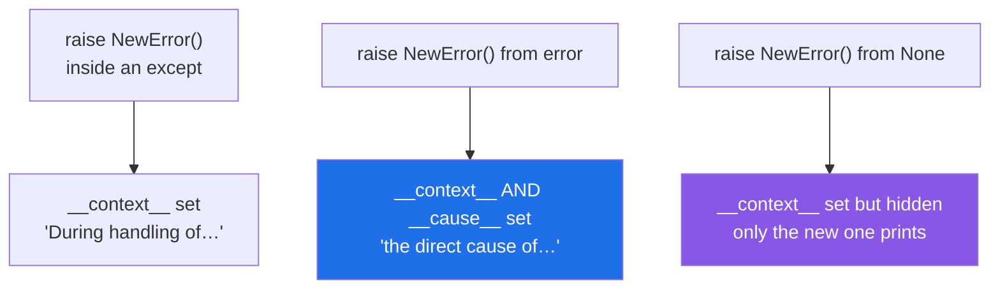

# 2.3 — `raise` versus `raise ... from`: the chain, and the two sentences in a traceback

## One-line answer

Raising inside a handler always keeps the original as `__context__` and prints *During handling of the
above exception*; adding `from error` sets `__cause__` and changes it to *the direct cause*, which is the
difference between "and then this happened" and "this is why".

---

## The story

The counter cannot open, and the note taped to the shutter says **"counter closed"**.

That is true, and it is not what anybody needs. Two people ask the same question within a minute: *why?*

Because the sheet of postage rates for today did not arrive, and the clerk cannot price anything without
it.

Now there are two versions of the note somebody could have written. One says *counter closed*, and
underneath, smaller: *the rate sheet did not arrive*. That is a note you can act on — somebody goes and
finds a rate sheet.

The other version says *counter closed* and, underneath, *while dealing with the rate sheet not arriving,
the kettle also broke*. Both sentences are true. Only one of them is the reason, and a note that lists
everything that happened without saying which one caused the closure sends people to look at the kettle.

The difference between those two notes is one word.

---

## The idea in plain language

When you raise a new exception inside an `except` block, Python does not throw the old one away. It
attaches it, and there are two ways it can be attached.

**Implicitly, as `__context__`.** This happens automatically, always, whenever an exception is raised
while another is being handled. The traceback then prints both, joined by:

```text
During handling of the above exception, another exception occurred:
```

That sentence is a statement of *timing*, not of cause. It is what you get when the second exception is a
surprise — the cleanup broke, a log call failed, there was a bug in the handler.

**Explicitly, as `__cause__`, by writing `from error`.** This says the first exception is *why* the second
one exists — you caught it deliberately and translated it. The traceback then prints:

```text
The above exception was the direct cause of the following exception:
```

Both keep the full original traceback. The only difference is which sentence appears, and what it tells
the reader about the relationship. The mechanism comes from *PEP 3134 — Exception Chaining and Embedded
Tracebacks* (2005, <https://peps.python.org/pep-3134/>), which added both attributes.

There is a third form: **`raise X from None`**, which sets `__suppress_context__` so the original is not
printed at all. It is for the case where the original is noise — an internal implementation detail the
caller cannot act on and does not want to read. Use it rarely and deliberately; it hides evidence, and the
original is still on `__context__` if something goes looking.

Why translate at all? Because a caller should not have to know what your function is made of. If
`load_config()` raises `FileNotFoundError`, every caller now depends on the fact that the configuration
comes from a file — and the day it comes from an environment variable instead, their handler breaks. A
`ConfigError` raised `from` the original keeps the caller's contract stable and loses nothing, because the
original is right there in the traceback. That is [3.4](../03-your-own/3.4-translate-at-the-boundary.md).

The rule is one line: **inside an `except` block, if you raise, write `from`.** If the old exception is
the reason, `from error`. If it is genuinely irrelevant, `from None` and be sure. Bare `raise NewThing()`
inside a handler is almost always somebody who did not know about `from`.

---

## Why Setu needs it

- **`src/setu/config.py` will translate a missing environment variable into a `ConfigError`**, and the
  caller on Day 3's gate needs the original `KeyError` in the traceback to know *which* variable
  ([Day 3, 1.2](../../../day-03-keys-and-budget/parts/01-secrets/1.2-dotenv-and-os-environ.md)).
- **Day 16's `read_jsonl` wraps `json.JSONDecodeError` to add the file's line number**
  ([Day 16, 2.5](../../../day-16-files-and-context-managers/parts/02-reading-and-writing/2.5-jsonl.md)),
  and `from error` is what keeps the parser's own explanation of *what* was malformed.
- **Day 172's router turns four providers' four different client exceptions into one `ProviderError`**,
  so the retry logic is written once — and every one of those translations needs `from`, or a support
  question becomes unanswerable.
- **Today's `src/setu/errors.py` exists to be raised `from` something else**, which is why this part comes
  before it.

---

## The mechanism

The same failure, twice, one word apart. First without `from`:

```python
def read_limit():
    return int(open("limits.txt").read())


try:
    read_limit()
except OSError:
    raise RuntimeError("cannot start the counter")
```

**Line by line:**

- `open("limits.txt")` — the real failure, and note there is no `encoding=`, which would be a bug in real
  code ([Day 16, 2.2](../../../day-16-files-and-context-managers/parts/02-reading-and-writing/2.2-encoding.md));
  it is left out here to keep the example to one line.
- `except OSError:` — **no `as`**, so the original object is not bound to a name. That is the first clue
  that this version cannot use `from`: there is nothing to name.
- `raise RuntimeError(...)` — a new exception, raised inside the handler. Python attaches the original as
  `__context__` automatically.

Run on Python 3.12.12 on 2026-09-02:

```text
Traceback (most recent call last):
  File "<string>", line 6, in <module>
  File "<string>", line 3, in read_limit
FileNotFoundError: [Errno 2] No such file or directory: 'limits.txt'

During handling of the above exception, another exception occurred:

Traceback (most recent call last):
  File "<string>", line 8, in <module>
RuntimeError: cannot start the counter
```

Now the same thing with `as error` and `from error`:

```python
def read_limit():
    return int(open("limits.txt").read())


try:
    read_limit()
except OSError as error:
    raise RuntimeError("cannot start the counter") from error
```

**Line by line:**

- `except OSError as error:` — binds the original ([1.5](../01-raising-and-catching/1.5-the-exception-object.md)),
  which is what makes the next line possible.
- `from error` — sets `__cause__`. **The whole change is these two words**, and everything below is the
  effect.

```text
Traceback (most recent call last):
  File "<string>", line 6, in <module>
  File "<string>", line 3, in read_limit
FileNotFoundError: [Errno 2] No such file or directory: 'limits.txt'

The above exception was the direct cause of the following exception:

Traceback (most recent call last):
  File "<string>", line 8, in <module>
RuntimeError: cannot start the counter
```

**Everything is identical except the middle sentence.** *During handling* means "and then"; *the direct
cause* means "because". A reader triaging at speed uses that sentence to decide whether the first
traceback is the bug or a distraction.

And the three attributes underneath:

```python
def show(label, fn):
    try:
        fn()
    except Exception as error:
        print(label)
        print("  __context__         :", repr(error.__context__))
        print("  __cause__           :", repr(error.__cause__))
        print("  __suppress_context__:", error.__suppress_context__)


def implicit():
    try:
        int("abc")
    except ValueError:
        raise RuntimeError("outer")


def explicit():
    try:
        int("abc")
    except ValueError as e:
        raise RuntimeError("outer") from e


def suppressed():
    try:
        int("abc")
    except ValueError:
        raise RuntimeError("outer") from None


show("implicit  (no from)  :", implicit)
show("explicit  (from e)   :", explicit)
show("suppressed(from None):", suppressed)
```

**Line by line:**

- `def show(label, fn)` — one harness, three cases, so the only thing that varies is the `raise` line
  ([Day 10, 3.3](../../../day-10-functions/parts/03-the-module/3.3-pure-functions-and-the-seam.md)).
- `error.__context__` — set in **all three** cases, automatically. It is never your choice.
- `error.__cause__` — set only by `from e`. This is the "because" flag.
- `error.__suppress_context__` — set to `True` by *any* `from`, including `from None`. That is the switch
  the traceback printer reads.

```
implicit  (no from)  :
  __context__         : ValueError("invalid literal for int() with base 10: 'abc'")
  __cause__           : None
  __suppress_context__: False
explicit  (from e)   :
  __context__         : ValueError("invalid literal for int() with base 10: 'abc'")
  __cause__           : ValueError("invalid literal for int() with base 10: 'abc'")
  __suppress_context__: True
suppressed(from None):
  __context__         : ValueError("invalid literal for int() with base 10: 'abc'")
  __cause__           : None
  __suppress_context__: True
```

**Look at the last block.** `from None` did not delete anything — `__context__` still holds the original.
It only stopped it being printed. That is worth knowing when you are debugging code that suppresses:
the evidence is on the object.

The three forms:



---

## When it breaks

**`from None` used to make the output tidy:**

```text
$ uv run python -c "
try:
    int('abc')
except ValueError:
    raise ValueError('weight must be a whole number of grams') from None
"
Traceback (most recent call last):
  File "<string>", line 5, in <module>
ValueError: weight must be a whole number of grams
```

**What it means.** The message is better than `int`'s, and the traceback is short and clean — and it has
thrown away the line and column information from the original. Here that is arguably fine, because the
new message is complete. It stops being fine the moment the wrapped operation is complicated: a JSON parse
that failed at line 4,182 becomes "the file is malformed", and somebody has to reproduce the failure to
find out where. **The test is whether the new message contains everything the old one did.** If not, use
`from error`.

**No `as`, so no `from` is possible, so the chain is only implicit:**

```text
$ uv run python -c "
import json

def load(text):
    try:
        return json.loads(text)
    except json.JSONDecodeError:
        raise ValueError('the manifest is malformed')

load('{oops')
" 2>&1 | tail -6
During handling of the above exception, another exception occurred:

Traceback (most recent call last):
  File "<string>", line 10, in <module>
  File "<string>", line 8, in load
ValueError: the manifest is malformed
```

**What it means.** The original is still there — above the cut, Python attached it automatically as
`__context__`. But the relationship is described as coincidence rather than cause, and to a reader
skimming, *during handling* reads like "there was also a second, unrelated bug in the error handler". The
original's real value here is the **position** it reports, `Expecting property name enclosed in double
quotes: line 1 column 2 (char 1)`, and that is exactly the part a hurried reader will now skip. Writing
`except json.JSONDecodeError as error:` and `... from error` costs eleven characters and says what is
actually true.

**A `finally` that raises, producing an implicit chain nobody intended:**

```text
$ uv run python -c "
def close():
    raise RuntimeError('the drawer is jammed')

try:
    raise ValueError('too heavy')
finally:
    close()
"
Traceback (most recent call last):
  File "<string>", line 6, in <module>
ValueError: too heavy

During handling of the above exception, another exception occurred:

Traceback (most recent call last):
  File "<string>", line 8, in <module>
  File "<string>", line 3, in close
RuntimeError: the drawer is jammed
```

**What it means.** This is [1.3](../01-raising-and-catching/1.3-else-and-finally.md)'s failure, seen from
this part's angle: the traceback shows *During handling of the above exception*, correctly, because the
drawer really did jam while the heavy parcel was being reported. **This is the case the implicit form
exists for**, and it is why the implicit form's wording is deliberately weaker. Nobody would write
`from error` here, because the jam was not caused by the weight.

**Chaining an exception to itself:**

```text
$ uv run python -c "
try:
    int('abc')
except ValueError as error:
    raise error from error
" 2>&1 | tail -3
  File "<string>", line 5, in <module>
  File "<string>", line 3, in <module>
ValueError: invalid literal for int() with base 10: 'abc'
```

**What it means.** Legal, harmless, and pointless — the exception is its own cause, so the chain has one
link. It happens when somebody applies "always write `from`" mechanically to a bare re-raise. The right
form there is `raise` on its own ([2.4](2.4-re-raising.md)), which sends the original onward with no new
frame at all.

---

## In production

**The professional habit is that every translation carries its cause.** Wrapping a low-level exception in
a domain one is good design; wrapping it without `from` is throwing away the only information that says
what actually failed. In review, `raise SomethingElse(...)` inside an `except` with no `from` is treated
the same way as a swallowed exception, because operationally it is close to one: the new message says what
layer noticed, and the original said what happened.

**What changes at scale is that the chain is what makes a layered system debuggable.** A request fails
with `CheckoutFailed`; its cause is `PaymentGatewayError`; whose cause is `ConnectionResetError`. Three
layers, three tracebacks, one incident, and the on-call engineer can see in one screen that the payment
gateway dropped a connection rather than that checkout is broken. Break any `from` in that chain and the
bottom line becomes guesswork — which is why error-tracking services index on the innermost cause rather
than the outermost exception.

**The failure that only appears with real data is the suppressed context in a rare branch.** `from None`
is usually added while looking at one example, where the new message really does say everything. Then a
different input takes a different path into the same wrapper — a permission error rather than a missing
file, say — and the new message is now actively misleading, with the truth deliberately hidden. **A
`from None` should be justified by the message it replaces**, and if the message is generic, it cannot be.

**The review comment a senior engineer leaves.** *"`raise StorageError('could not save') from None` hides
the underlying `botocore` exception, so an expired credential and a bucket-does-not-exist look identical
in the logs. Use `from error`. If the concern is noisy output, the place to filter is the log formatter,
not the raise."*

**The interview question.** *"What does `raise ... from` do?"* The recited answer is "it chains
exceptions". The used answer distinguishes the two chains: Python **always** attaches the exception being
handled as `__context__`, printing *During handling of the above exception*; `from error` additionally
sets `__cause__` and changes the wording to *the direct cause of*, which is the difference between
coincidence and causation. And the third form, `from None`, suppresses the printing while leaving
`__context__` in place — so the evidence is still on the object even when it is not in the log.

---

## Check yourself

```bash
uv run python -c "
def wrap(use_from):
    try:
        int('abc')
    except ValueError as error:
        if use_from:
            raise RuntimeError('bad weight') from error
        raise RuntimeError('bad weight')

for flag in (False, True):
    try:
        wrap(flag)
    except RuntimeError as error:
        print('from =', flag)
        print('  __cause__  :', repr(error.__cause__))
        print('  __context__:', repr(error.__context__))
"
```

`__context__` is set both times; `__cause__` only once. Now run each version uncaught and read which
sentence appears between the two tracebacks.

**Answer out loud, without scrolling up:**

> A traceback says *During handling of the above exception, another exception occurred*. Say what that
> tells you about the relationship between the two, and what the author would have written to say
> something stronger.

---

**Next:** [2.4 — re-raising: bare `raise`, and the traceback you destroyed](2.4-re-raising.md).
