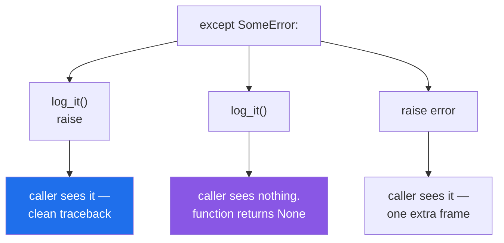

# 2.4 — Re-raising: bare `raise`, and the frame you added

## One-line answer

A bare `raise` inside a handler sends the **same exception** onward with its traceback untouched;
`raise error` does almost the same thing but inserts your handler's own line into the traceback, which is
noise in the one place people read carefully.

---

## The story

The clerk cannot price the parcel — the rate sheet did not arrive — so she calls the supervisor.

There are two ways she can pass it on.

She can put the original note in the supervisor's hand: *no rate sheet, 08:40, Bristol desk.* One piece
of paper, the original handwriting, the original time.

Or she can copy it onto a fresh note, sign it, and add today's date, and hand that over. The words are the
same. But now there is an extra line in the middle of the record — *copied by the counter clerk, 09:15* —
and when somebody reads the file next month trying to work out when the rate sheet went missing, that line
is one more thing to read past.

Neither is wrong. But the first one has one fewer person in it, and the file is shorter and truer for it.

---

## The idea in plain language

Sometimes a handler catches an exception, does something, and wants it to carry on outward. Logging it,
counting it, releasing a lock, adding a note
([1.5](../01-raising-and-catching/1.5-the-exception-object.md)) — none of those are *handling* it, and the
caller still needs to know.

There are two ways to write that, and one word between them.

**`raise` on its own** re-raises the exception currently being handled, exactly as it was. Same object,
same traceback, no new frame. It is only legal inside an `except` block (or a `finally` while one is in
flight) — outside, it is the `RuntimeError: No active exception to reraise` from
[1.1](../01-raising-and-catching/1.1-what-raising-does.md).

**`raise error`** raises the object you name. The object and its traceback are the same, and Python
**appends the current line** to that traceback — so the printed traceback now has an extra frame pointing
at your `raise error` line, sandwiched in the middle of the real path.

Neither loses information. The difference is one line of noise in the traceback, and a small ambiguity: a
reader has to work out whether that middle frame is where the exception came from. Multiply it across four
layers and the traceback has four spurious frames in it.

So the rule is: **inside a handler, re-raise with a bare `raise`.** Use `raise error` only when `error` is
not the exception currently being handled — for example, an exception you saved earlier and are raising
now.

And the third option, which is the one this part exists to argue for. The shape

```text
except SomeError:
    log_it()
    raise
```

is called **log and re-raise**, and it is how you record something at the layer that has the context while
still letting the caller decide. Its opposite —

```text
except SomeError:
    log_it()
```

— is **log and swallow**, and it is the most common way a real bug becomes invisible: the log line is a
warning nobody reads, the function returns `None`, and the caller carries on believing it worked
([4.1](../04-in-anger/4.1-the-except-that-was-too-wide.md)). One missing word, four characters.

---

## Why Setu needs it

- **Day 16's `atomic_write` must clean up and then re-raise** ([Day 16, 4.5](../../../day-16-files-and-context-managers/parts/04-context-managers/4.5-contextmanager-decorator.md)),
  because a context manager that catches to tidy up and forgets the `raise` tells every caller a failed
  write succeeded. The test that catches that is the only one that can.
- **Day 6's retry loop re-raises on the final attempt** ([Day 6, 3.2](../../../day-06-loops/parts/03-capped-retry/3.2-the-capped-retry-from-scratch.md)),
  and the caller needs the original exception rather than "retries exhausted" with no cause.
- **Day 172's router logs which provider failed, then re-raises** so the next provider is tried by the
  layer that knows about providers — one log line per attempt, one decision at the top.
- **Today's `src/setu/errors.py` tests** include one that asserts an exception *escapes* a handler, which
  is the only assertion that can see a missing `raise`.

---

## The mechanism

The same failure, re-raised two ways. `weigh` raises, `middle` catches and passes it on:

```python
def weigh(g):
    raise ValueError("too heavy")


def middle(g):
    try:
        return weigh(g)
    except ValueError:
        raise


middle(5000)
```

**Line by line:**

- `except ValueError:` — **no `as`**, because nothing here needs the object. That is a small signal in
  itself: a handler with no `as` and a bare `raise` is doing something other than inspecting the error.
- `raise` on its own — re-raise. Note there is nothing to get wrong: no name, no `from`, no new object.

```text
$ uv run python tb_bare.py
Traceback (most recent call last):
  File "...\tb_bare.py", line 12, in <module>
    middle(5000)
  File "...\tb_bare.py", line 7, in middle
    return weigh(g)
           ^^^^^^^^
  File "...\tb_bare.py", line 2, in weigh
    raise ValueError("too heavy")
ValueError: too heavy
```

**Three frames**, and they are the three real ones: the call, the call inside `middle`, and the raise. The
handler is invisible, which is correct — it did not cause anything.

Now the named form, changing two lines:

```python
def weigh(g):
    raise ValueError("too heavy")


def middle(g):
    try:
        return weigh(g)
    except ValueError as error:
        raise error


middle(5000)
```

**Line by line:**

- `except ValueError as error:` — binds the object, which is needed only because the next line names it.
- `raise error` — raises the same object. **Python appends this line to the traceback**, which is the
  entire difference.

```text
$ uv run python tb_named.py
Traceback (most recent call last):
  File "...\tb_named.py", line 12, in <module>
    middle(5000)
  File "...\tb_named.py", line 9, in middle
    raise error
  File "...\tb_named.py", line 7, in middle
    return weigh(g)
           ^^^^^^^^
  File "...\tb_named.py", line 2, in weigh
    raise ValueError("too heavy")
ValueError: too heavy
```

**Four frames, and `middle` appears twice** — once at line 9 (the re-raise) and once at line 7 (the real
call). A reader scanning for where this started now has an extra candidate, at the top of the two, which
is where the eye lands first.

Counting the frames directly, rather than by eye:

```python
def top(style):
    try:
        middle(5000, style)
    except ValueError as error:
        tb = error.__traceback__
        frames = []
        while tb is not None:
            frames.append(tb.tb_frame.f_code.co_name)
            tb = tb.tb_next
        print(f"{style:10} frames: {frames}")
```

**Line by line:**

- `error.__traceback__` — the traceback object attached to the exception
  ([1.5](../01-raising-and-catching/1.5-the-exception-object.md)). It is a linked list, not a list.
- `while tb is not None:` — walking it. `tb_next` goes **toward** the raise, so the first name is the
  outermost frame, matching the printed order.
- `tb.tb_frame.f_code.co_name` — the function's name. Three attribute hops: the frame, its code object,
  its name. This is the machinery the `traceback` module wraps
  ([1.5](../01-raising-and-catching/1.5-the-exception-object.md)).
- printing a list of names — so the difference is a count rather than an impression.

```
bare       frames: ['top', 'middle', 'weigh']
named      frames: ['top', 'middle', 'middle', 'weigh']
```

**`middle` twice**, from one extra word.

The three shapes:



---

## When it breaks

**Log and swallow, which looks almost identical to log and re-raise:**

```text
$ uv run python -c "
def weigh(g):
    if g > 2000:
        raise ValueError('too heavy')
    return g

def middle(g):
    try:
        return weigh(g)
    except ValueError as error:
        print('[log]', error)

def top(g):
    grams = middle(g)
    return grams * 2

print('price:', top(5000))
" 2>&1 | tail -5
[log] too heavy
Traceback (most recent call last):
  File "<string>", line 17, in <module>
  File "<string>", line 15, in top
TypeError: unsupported operand type(s) for *: 'NoneType' and 'int'
```

**What it means.** The log line is right there, and the program still failed — with a `TypeError` about
`NoneType`, in `top`, which has nothing to do with weight. This is
[1.1](../01-raising-and-catching/1.1-what-raising-does.md)'s "returns `None` on failure", produced by a
handler rather than by a `return` statement. **Adding `raise` after the `print` fixes it entirely**, and
the traceback then names `weigh`. The version where `top` does *not* fail — where it happily writes
`None` into a database — is the same bug without the courtesy of an error.

**A bare `raise` outside a handler:**

```text
$ uv run python -c "
def cleanup():
    raise

cleanup()
" 2>&1 | tail -3
  File "<string>", line 5, in <module>
  File "<string>", line 3, in cleanup
RuntimeError: No active exception to reraise
```

**What it means.** A bare `raise` needs an exception currently being handled, and there is not one. This
usually appears after a refactor that moved the `raise` out of the `except` block it belonged to — into a
helper function, say. Note it *does* work inside a function called from an `except` block in some
versions of this mistake, which makes it inconsistent and worth avoiding: keep the bare `raise` lexically
inside its handler.

**`raise error` where the object came from somewhere else:**

```python
first_error = None
for candidate in providers:
    try:
        return candidate.call()
    except ProviderError as error:
        first_error = first_error or error
raise first_error
```

**Line by line:**

- `first_error = first_error or error` — keeps the first failure and ignores later ones
  ([Day 5, 2.4](../../../day-05-operators-and-conditionals/parts/02-conditionals/2.4-and-or-return-operands.md)).
- `raise first_error` **outside the loop** — and here the named form is **correct**, because there is no
  exception currently being handled at that point. A bare `raise` here is the `RuntimeError` above.
- The cost of keeping the object is real: it holds its traceback, which holds every frame's locals
  ([1.5](../01-raising-and-catching/1.5-the-exception-object.md)). For one saved exception that is fine.

**What it means.** "Always use bare `raise`" is a rule about re-raising *the current* exception. When you
are raising one you stored, name it — and if you also want the last failure in the chain, `raise
first_error from error` inside the loop's final iteration is the fuller form
([2.3](2.3-raise-from-and-the-chain.md)).

**A context manager that catches, cleans up and forgets:**

```python
@contextlib.contextmanager
def atomic_write(path):
    tmp = path.with_suffix(".tmp")
    try:
        yield tmp.open("w", encoding="utf-8")
    except Exception:
        tmp.unlink(missing_ok=True)
```

**Line by line:**

- `except Exception:` around the `yield` — correct so far; the cleanup must happen on failure
  ([Day 16, 4.5](../../../day-16-files-and-context-managers/parts/04-context-managers/4.5-contextmanager-decorator.md)).
- `tmp.unlink(missing_ok=True)` — the cleanup, and it works.
- **There is no `raise`.** In a generator-based context manager, catching *is* suppressing
  ([Day 16, 4.4](../../../day-16-files-and-context-managers/parts/04-context-managers/4.4-the-exit-that-swallowed-the-exception.md)),
  so the `with` block's exception is discarded and the caller believes the write succeeded.

**What it means.** Every test about content passes. Every test about cleanup passes. The temporary file is
gone, the original file is intact, and the caller has been told a lie. **The only test that can see this
is one that asserts the exception escapes** — `pytest.raises` around the failing block
([4.4](../04-in-anger/4.4-pytest-raises.md)) — which is why Day 16's checklist made deleting that test its
"watch everything stay green" exercise.

---

## In production

**The professional habit is that a handler which is not handling ends with `raise`.** Logging, counting,
tracing, releasing, annotating — all of those are things you do *on the way past*, and the caller's right
to know is not yours to waive. In review, an `except` block whose last statement is not `raise`, a
`return`, or a recovery is treated as a swallowed exception until somebody explains why it is not.

**What changes at scale is that swallowed exceptions become invisible data loss.** A pipeline that catches
and logs per record produces a run that "succeeded" with 3% of rows missing, and nothing above it can
tell. The standard defences are that a handler which drops work must **count** what it dropped and make
the count reachable ([Day 16, 2.5](../../../day-16-files-and-context-managers/parts/02-reading-and-writing/2.5-jsonl.md)),
and that a job's success criterion includes that count. A log line is not a count; nobody sums a log.

**The failure that only appears with real data is the handler written for the one case that occurs in
testing.** `except Exception: log(); continue` inside a loop is fine when the only failures are malformed
rows. On real data the same handler absorbs a database connection drop and skips a thousand good records
in a second, quietly, while the log fills with identical lines nobody is watching. The narrow-type rule
([1.2](../01-raising-and-catching/1.2-try-except-and-catching-by-type.md)) and the re-raise rule are the
same defence from two directions.

**The review comment a senior engineer leaves.** *"This `except` logs and falls through, so `load_batch`
returns `None` on failure and the caller multiplies it. Add `raise` — the logging here is useful, it just
must not be the end of the story. And use a bare `raise`, not `raise error`; the named form puts this line
into the traceback for no benefit."*

**The interview question.** *"What is the difference between `raise` and `raise e` inside an `except`
block?"* Both re-raise the same object with the same traceback; `raise e` additionally appends the current
line to that traceback, so the handler shows up as an extra frame in the middle of the real path. The
answer that shows judgement continues: bare `raise` is the default, `raise e` is for an exception you
saved rather than the one being handled — and the far more important question in the same neighbourhood is
whether there is a `raise` at all, because a handler that logs and falls through returns `None` and moves
the failure somewhere unrelated.

---

## Check yourself

```bash
uv run python -c "
def weigh(g):
    raise ValueError('too heavy')

def middle(g, named):
    try:
        return weigh(g)
    except ValueError as error:
        if named:
            raise error
        raise

for named in (False, True):
    try:
        middle(5000, named)
    except ValueError as error:
        tb, names = error.__traceback__, []
        while tb:
            names.append(tb.tb_frame.f_code.co_name)
            tb = tb.tb_next
        print('raise error' if named else 'bare raise ', '->', names)
"
```

One list is longer than the other, and the extra entry is a repeat. Now delete both `raise` lines and see
what the caller gets.

**Answer out loud, without scrolling up:**

> A handler logs the error and does nothing else. Say what the function returns, and name the only kind of
> test that can detect the missing `raise`.

---

**Next:** [3.1 — one base class per project, and why](../03-your-own/3.1-one-base-class-per-project.md).
