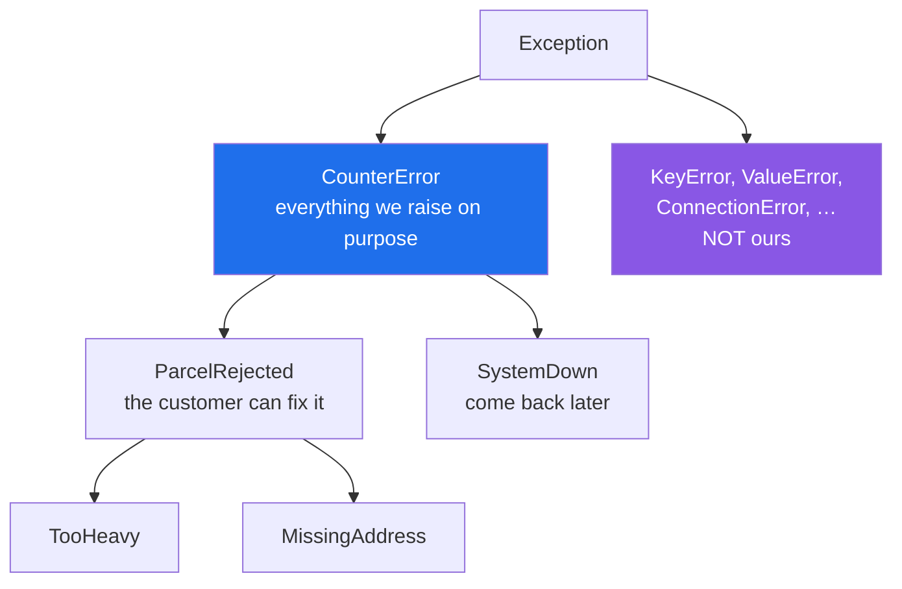

# 3.1 — One base class per project, and why

## One-line answer

Define one exception class the whole project inherits from, so a caller can write `except CounterError:`
and catch **everything you raise on purpose** without also catching every bug and every library failure.

---

## The story

The laminated sheet grew a heading, and the heading turned out to be the useful part.

At the top of the parcel-problems column somebody wrote: **"things we decided to refuse"**. At the top of
the other: **"things that are broken"**.

The point was not the two columns — those already existed. It was that everything on the sheet is now
under one of two headings, and there is a third category which is *not on the sheet at all*: the things
nobody anticipated. The till catching fire. A customer fainting.

That third category matters more than either of the first two, because the instruction for it is
completely different. Anything on the sheet, the clerk deals with. Anything not on the sheet, the clerk
calls somebody.

Before the headings, the trainee's rule was "if something goes wrong, follow the sheet", and the sheet had
no way of saying *this is not one of mine*.

---

## The idea in plain language

You already know the two halves of this. Exceptions are classes
([2.1](../02-the-hierarchy/2.1-catching-catches-subclasses.md)), and where you attach yours decides who
catches them. And built-ins should be preferred when they fit
([2.2](../02-the-hierarchy/2.2-which-built-in-to-raise.md)).

So when *does* a project need its own?

**When a caller must be able to tell your deliberate refusals from everything else.** That is the whole
answer, and it is why the first class you define is a base class that carries no meaning of its own.

```text
class CounterError(Exception):
    """Anything this project raises on purpose."""
```

That one class buys three things immediately.

**A caller can catch everything you meant and nothing you did not.** `except CounterError:` matches every
exception in your family and no `KeyError` from a dict lookup you got wrong, no `AttributeError` from a
typo, no `ConnectionError` from a library. Compare with `except Exception:`
([4.1](../04-in-anger/4.1-the-except-that-was-too-wide.md)), which catches your bugs too.

**You can add types later without breaking anybody.** A caller catching the base keeps working when you
add a fourth subclass. A caller who wants the new distinction opts in by naming it. This is the property
that makes the hierarchy worth having at all.

**Levels of the tree become levels of response.** Group your exceptions the way the *caller* will respond
to them, not the way you would file them. `ParcelRejected` and `SystemDown` under one base, with the
specific types under those, means three useful `except` clauses at three levels — and a caller picks the
level it can act on.

Two decisions to make deliberately.

**Inherit from `Exception`, not from a built-in.** `class RateLimited(ConnectionError)` enrols you in
every `except ConnectionError:` already written, in your code and in your dependencies
([2.1](../02-the-hierarchy/2.1-catching-catches-subclasses.md)). Sometimes that is exactly right; more
often it is a surprise. `Exception` is the default, and inheriting from a built-in is a choice you write
a comment about.

**Do not define classes nobody will catch separately.** Three classes that every caller lists together are
one class ([2.2](../02-the-hierarchy/2.2-which-built-in-to-raise.md)). The test is always: *will somebody
write an `except` clause naming just this one?* If not, it is a message, not a type.

Where to put them: **one module, imported by everything, importing nothing of yours** — a leaf, in the
layering sense from [Day 17, 4.4](../../../day-17-modules-and-packages/parts/04-the-project/4.4-designing-the-public-surface.md).
An errors module that imports the rest of the package is a circular import waiting to close
([Day 17, 4.2](../../../day-17-modules-and-packages/parts/04-the-project/4.2-the-circular-import.md)).

---

## Why Setu needs it

- **Today's build is `src/setu/errors.py`**, and it is the first module in this project deliberately
  designed as a leaf — nothing of ours imported, everything else free to import it
  ([Day 17, 4.4](../../../day-17-modules-and-packages/parts/04-the-project/4.4-designing-the-public-surface.md)).
- **The plan names `class RateLimited(Exception)` as this day's example**, and it is a subclass of
  `SetuError` rather than of `ConnectionError` for exactly the reason above.
- **Day 172's router catches `ProviderError` to fail over** and lets anything else through, which is only
  safe because "anything else" excludes the router's own deliberate failures.
- **Day 233's eval suite counts failures by type**, and a base class is what makes "how many of these were
  ours" answerable at all.

---

## The mechanism

A family, defined and then used at two levels:

```python
"""One base class, then the family under it."""


class CounterError(Exception):
    """Anything this project raises on purpose."""


class ParcelRejected(CounterError):
    """The customer can fix this."""


class TooHeavy(ParcelRejected):
    """Over the limit for the chosen service."""


class MissingAddress(ParcelRejected):
    """No address on the form."""


class SystemDown(CounterError):
    """Nobody at the counter can fix this. Come back later."""
```

**Line by line:**

- `class CounterError(Exception):` — the root. It inherits from `Exception`, not `BaseException`
  ([1.4](../01-raising-and-catching/1.4-the-bare-except.md)), so it is caught by `except Exception:` at a
  boundary and never confused with shutdown.
- the docstring as the entire body — **no `pass` needed.** A docstring is a statement, so it satisfies the
  block, and it is more useful than `pass`. This is the whole definition of a custom exception in most
  cases; there is no `__init__` until [3.2](3.2-an-exception-that-carries-data.md).
- `class ParcelRejected(CounterError):` — a **middle** layer, which exists because callers will respond to
  the whole group the same way. It is not a leaf and never raised directly.
- `class TooHeavy(ParcelRejected):` and `MissingAddress` — the specific ones, which are what actually get
  raised. Each is worth its own class only because somebody will catch it alone.
- `class SystemDown(CounterError):` — the other branch. Note it sits beside `ParcelRejected`, not under
  it, because the response is different — which is the rule for where a class goes.

Now three exceptions and two clauses:

```python
for exc in (TooHeavy("5000g"), MissingAddress("no line 1"), SystemDown("card reader")):
    try:
        raise exc
    except ParcelRejected as error:
        print(f"{type(error).__name__:16} -> hand it back: {error}")
    except CounterError as error:
        print(f"{type(error).__name__:16} -> apologise:    {error}")
```

**Line by line:**

- `except ParcelRejected` **first**, `except CounterError` second — narrow before broad
  ([1.2](../01-raising-and-catching/1.2-try-except-and-catching-by-type.md)). Reversed, the second clause
  would be dead.
- **Neither clause names `TooHeavy` or `MissingAddress`**, and both are handled. That is the point of the
  middle layer: two lines of handling for a family that can grow.
- `SystemDown` falls through to the second clause because it is a `CounterError` and not a
  `ParcelRejected` — the tree doing the routing.

Run on Python 3.12.12 on 2026-09-02:

```
TooHeavy         -> hand it back: 5000g
MissingAddress   -> hand it back: no line 1
SystemDown       -> apologise:    card reader
```

And the property that makes the base class worth defining:

```python
print("one clause catches every one of them:")
for exc in (TooHeavy("x"), MissingAddress("y"), SystemDown("z")):
    try:
        raise exc
    except CounterError as error:
        print("  ", type(error).__name__)

print()
print("and a library's exception is NOT one of them:")
try:
    int("abc")
except CounterError:
    print("   never reached")
except ValueError:
    print("   ValueError escaped the project's own family, correctly")
```

**Line by line:**

- one `except CounterError:` catching all three — the "everything we meant" clause.
- `int("abc")` — a `ValueError` from the standard library, which is **not** a `CounterError` and therefore
  travels straight past the first clause.
- `except ValueError:` — proving the fall-through rather than letting the program crash. In real code
  there would be no second clause here at all; the exception would keep going.

```
one clause catches every one of them:
   TooHeavy
   MissingAddress
   SystemDown

and a library's exception is NOT one of them:
   ValueError escaped the project's own family, correctly
```

**That last line is the whole argument for a base class.** With `except Exception:` it would have been
caught and reported as one of yours.

The shape:



`except CounterError:` catches the blue subtree and nothing in the purple box.

---

## When it breaks

**A custom exception that forgets to inherit:**

```text
$ uv run python -c "
class TooHeavy:
    pass

raise TooHeavy()
" 2>&1 | tail -2
TypeError: exceptions must derive from BaseException
```

**What it means.** [1.1](../01-raising-and-catching/1.1-what-raising-does.md)'s message again, from a
different direction. A class is only raisable if it inherits from `BaseException`, directly or through
your own base. The mistake is usually a missing parenthesised parent after a copy-paste, and the error
arrives at the `raise`, not at the `class` — so the class definition looks fine in review.

**Inheriting from a built-in without meaning to:**

```text
$ uv run python -c "
class RateLimited(ConnectionError):
    pass

import time

def call():
    raise RateLimited('slow down, 30s')

for attempt in range(3):
    try:
        call()
    except ConnectionError:
        print('  a generic network retry swallowed the rate limit and hammered again')
"
  a generic network retry swallowed the rate limit and hammered again
  a generic network retry swallowed the rate limit and hammered again
  a generic network retry swallowed the rate limit and hammered again
```

**What it means.** The retry loop was written for dropped connections and is correct for those. It now
also catches `RateLimited`, so it retries immediately — three requests in a row against a provider that
just asked you to wait, which on a free tier can extend the block (Principle 5). **Nobody changed the
retry loop.** Inheriting from `ConnectionError` changed its behaviour from a different file. That is why
the default is `Exception`, and why inheriting from a built-in gets a comment saying who you intended to
enrol.

**A base class nobody inherits from:**

```python
class SetuError(Exception):
    """The project's base error."""


class RateLimited(Exception):  # <- not SetuError
    """Provider asked us to slow down."""
```

**Line by line:**

- `class SetuError(Exception):` — defined, documented, and about to be useless.
- `class RateLimited(Exception):` — inherits from `Exception` directly. It is a perfectly good exception
  and it is **not** a `SetuError`.

**What it means.** `except SetuError:` at the boundary silently stops catching one of your own errors, and
the failure is invisible: the exception is simply handled at a higher, broader level than intended, or not
at all. There is no error message for this, which is why the day's test suite asserts it —
`issubclass(RateLimited, SetuError)` is one line and catches every future slip.

**Too many classes, none of them caught separately:**

```text
$ uv run python -c "
class TooHeavy(Exception): pass
class TooLight(Exception): pass
class TooWide(Exception): pass
class TooLong(Exception): pass

try:
    raise TooWide('40cm')
except (TooHeavy, TooLight, TooWide, TooLong) as error:
    print('every caller writes this line:', type(error).__name__)
"
every caller writes this line: TooWide
```

**What it means.** Four classes, one handler, and the handler has to be updated every time a fifth is
added. This is a **middle layer missing**: `class ParcelRejected(CounterError)` with the four beneath it
turns that clause into `except ParcelRejected:` and makes the fifth class free. The rule from
[2.2](../02-the-hierarchy/2.2-which-built-in-to-raise.md) — will anybody catch this one alone? — applies
at every level, and when the answer is no for all four, they need a parent, not deletion.

---

## In production

**The professional habit is that a library or service defines exactly one base exception, and everything
else it raises inherits from it.** This is close to universal in well-designed packages: `requests` has
`RequestException`, `SQLAlchemy` has `SQLAlchemyError`, `httpx` has `HTTPError`. It exists so that a user
of the library can write one clause meaning "this library failed" without catching their own bugs, and so
the library can add types without a breaking change.

**What changes at scale is that the tree becomes the boundary between "expected" and "alarming".** A
service's boundary handler typically has two branches: your base class, which is logged at warning level
and turned into a 4xx or a retry, and everything else, which is logged at error level with a traceback and
paged on. That split is only possible because the deliberate failures are identifiable as a group. Without
a base class, every failure is in one bucket and the alerting is either constant or useless.

**The failure that only appears with real data is the exception you did not anticipate arriving in a
handler written for one you did.** A parser raising `ValueError` on a malformed row is expected; the same
`ValueError` coming from a bug in your own numeric code is not, and `except ValueError:` cannot tell them
apart. Wrapping the expected one in your own type at the point you raise it — and letting the unexpected
one through — is what makes the distinction survive contact with data you have never seen.

**The review comment a senior engineer leaves.** *"`class CacheMiss(KeyError)` means every `except
KeyError:` in the codebase now catches a cache miss, including the three in the serialiser that are about
dict lookups. Inherit from `SetuError` instead, and if you specifically want dict-like behaviour, say so in
a comment and list who you expect to catch it."*

**The interview question.** *"Would you define custom exceptions, and how would you organise them?"* The
answer worth giving is the base class first: one root per project or library so callers can catch "our
failures" without catching their own bugs, then subclasses grouped by *how the caller responds* rather
than by what went wrong, and specific types only where somebody will write a clause naming just that one.
The detail that shows experience is inheriting from `Exception` rather than from a built-in, because
subclassing `ConnectionError` or `KeyError` quietly enrols you in every existing handler for it — in your
code and in your dependencies.

---

## Check yourself

```bash
uv run python -c "
class SetuError(Exception):
    '''Everything this project raises on purpose.'''

class RateLimited(SetuError):
    '''Slow down.'''

print('RateLimited is a SetuError :', issubclass(RateLimited, SetuError))
print('RateLimited is an Exception:', issubclass(RateLimited, Exception))
print('ValueError is a SetuError  :', issubclass(ValueError, SetuError))

for raiser in (lambda: (_ for _ in ()).throw(RateLimited('30s')), lambda: int('abc')):
    try:
        raiser()
    except SetuError as error:
        print('ours    :', type(error).__name__)
    except Exception as error:
        print('not ours:', type(error).__name__)
"
```

One is ours and one is not, from the same two clauses. Now change `RateLimited` to inherit from
`ConnectionError` and say which existing handlers in a real codebase would start catching it.

**Answer out loud, without scrolling up:**

> Why is `except SetuError:` better than `except Exception:` for a caller who wants to handle your
> failures, and what is the one-question test for whether a new exception class is worth defining?

---

**Next:** [3.2 — `RateLimited`: an exception that carries data](3.2-an-exception-that-carries-data.md).
