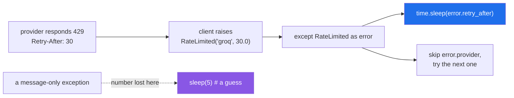

# 3.2 — `RateLimited`: an exception that carries data

## One-line answer

Put the numbers the caller needs on **attributes** — `error.retry_after`, not a sentence to parse — so a
retry loop can act on the exception instead of guessing, and keep `args` matching `__init__` so the object
still copies and pickles.

---

## The story

The slip the clerk hands back has a number on it.

*Card system busy — try again in 30 seconds.*

Thirty. Not "shortly", not "in a while". You can look at the clock, wait, and come back once. Whoever
wrote the slip knew the number, because the till told them, and they passed it on.

The branch that prints *please try again later* is not being vague to annoy anyone. It simply throws the
number away between the till and the customer, and every customer then has to guess. Some come back in
five seconds and are turned away again. Some go home.

The number existed the whole time. It just never got onto the slip.

---

## The idea in plain language

You already know an exception is an ordinary object that can carry attributes
([1.5](../01-raising-and-catching/1.5-the-exception-object.md)), and that built-ins do this — `OSError`
has `.errno` and `.filename`. This part is that idea applied to your own exceptions, and it is where a
custom exception starts earning its keep.

The plan names the example: `RateLimited`, the exception every provider call raises from Day 172 onward.
A rate limit response tells you **how long to wait**. If that number does not reach the retry loop, the
loop guesses — too short and it hits the limit again, too long and it wastes most of a free tier's daily
allowance sleeping (Principle 5).

So the class takes what it knows and keeps it:

```text
class RateLimited(SetuError):
    def __init__(self, provider, retry_after):
        super().__init__(provider, retry_after)
        self.provider = provider
        self.retry_after = retry_after
```

Three things to get right, and the third is the one nobody mentions.

**Give the attributes names the caller will use.** `retry_after`, not `t`. This is an interface; the
caller writes `error.retry_after` in their retry loop and that name is what they read six months later.

**Keep `args` equal to what the constructor takes.** Python rebuilds an exception when it is copied or
pickled, and it does that by calling `cls(*args)`. So `args` must be a tuple the constructor would accept.
`args` is set for you — by `BaseException.__new__`, from the arguments the class was called with — and it
is **overwritten by any `super().__init__(...)` you make**. So `super().__init__(provider, retry_after)`
keeps it correct and says so out loud; `super().__init__(f"...")` replaces it with a one-element tuple of
prose, and the rebuild then calls a two-argument constructor with one argument. That is the failure below.

**Write `__str__` separately.** Once `args` holds fields rather than a sentence, the default `str()` is the
raw tuple — `("groq", 30.0)` — which is not what you want in a log. `__str__`
([Day 15, 3.2](../../../day-15-constructors-and-dunders/parts/03-the-dunders/3.2-repr-and-str.md)) is
where the readable sentence lives, computed from the attributes so it cannot drift out of step with them.

Two consequences of the `cls(*args)` rebuild that are worth knowing before you hit them: **keyword-only
parameters break it** — the replay is positional — and so does any constructor that transforms its
arguments before storing them.

That matters more than it sounds: exceptions cross process boundaries in `multiprocessing`
([Day 19, 4.4](../../../day-19-typing-dataclasses-and-concurrency/parts/04-concurrency/4.4-processes.md)),
in `concurrent.futures`, and in most task queues. An exception that cannot be pickled becomes a different,
much less helpful exception by the time the parent process sees it.

**When not to do this.** If there is no data — nothing but a name and a message — do not write an
`__init__` at all. `class TooHeavy(ParcelRejected): """Over the limit."""` is complete
([3.1](3.1-one-base-class-per-project.md)). Adding a constructor that only stores a message duplicates
what `Exception` already does.

---

## Why Setu needs it

- **The plan names `class RateLimited(Exception)` as this day's example**, and says it is "the one every
  provider call raises later". Today is when it is designed.
- **Day 6's retry loop sleeps between attempts** ([Day 6, 3.2](../../../day-06-loops/parts/03-capped-retry/3.2-the-capped-retry-from-scratch.md))
  and **Day 14's `@retry` backs off** ([Day 14, 3.2](../../../day-14-decorators/parts/03-decorators-with-arguments/3.2-backoff-jitter-and-which-errors.md)).
  Both currently guess. `retry_after` is what turns the guess into an instruction.
- **Day 3's budget work counts requests per provider** ([Day 3, 4.1](../../../day-03-keys-and-budget/parts/04-rate-budget/4.1-rpm-rpd-tpm.md)),
  and `error.provider` is what lets a shared retry loop record *which* door closed.
- **Day 172's router fails over between four providers**, and it needs both fields: the provider to skip
  and the delay before that provider is worth trying again.

---

## The mechanism

The class, with `args` deliberately matching the constructor:

```python
class SetuError(Exception):
    """Everything this project raises on purpose."""


class RateLimited(SetuError):
    """A provider asked us to slow down, and said for how long."""

    def __init__(self, provider: str, retry_after: float) -> None:
        super().__init__(provider, retry_after)
        self.provider = provider
        self.retry_after = retry_after

    def __str__(self) -> str:
        return f"{self.provider} rate-limited us; retry in {self.retry_after:.0f}s"
```

**Line by line:**

- `class RateLimited(SetuError):` — under the project's base, not under `ConnectionError`
  ([3.1](3.1-one-base-class-per-project.md)), so no existing network retry catches it by accident.
- `def __init__(self, provider: str, retry_after: float) -> None:` — two named parameters. The type hints
  are documentation today and become checkable tomorrow
  ([Day 19, 1.1](../../../day-19-typing-dataclasses-and-concurrency/parts/01-type-hints/1.1-a-hint-is-a-note.md)).
- `super().__init__(provider, retry_after)` — **the fields, not a message.** This sets
  `args == (provider, retry_after)`, which is what `copy` and `pickle` replay through `cls(*args)`.
  `BaseException.__new__` would have set the same tuple anyway; writing it explicitly states the intent
  and stops a later edit quietly replacing `args` with something unrebuildable. Passing a formatted string
  here is the bug in the failure below.
- `self.provider = provider` and `self.retry_after = retry_after` — the interface. Attributes, with the
  names callers will type ([Day 12, 1.2](../../../day-12-classes/parts/01-the-blank-form/1.2-init-and-self.md)).
- `def __str__(self) -> str:` — the readable sentence, computed rather than stored. Because it is derived
  from the attributes, it cannot drift out of step with them.
- `{self.retry_after:.0f}` — a format spec so `30.0` prints as `30`
  ([Day 7, 3.2](../../../day-07-strings/parts/03-formatting/3.2-the-format-spec.md)). Small, and the
  difference between a slip that reads well and one that does not.

Run on Python 3.12.12 on 2026-09-02:

```text
$ uv run python -c "
import copy, pickle
from ratelimited2 import RateLimited

e = RateLimited('groq', 30.0)
print('str  :', e)
print('repr :', repr(e))
print('args :', e.args)
back = pickle.loads(pickle.dumps(e))
print('pickle round trip:', back, '| retry_after', back.retry_after)
print('copy :', copy.copy(e))
"
str  : groq rate-limited us; retry in 30s
repr : RateLimited('groq', 30.0)
args : ('groq', 30.0)
pickle round trip: groq rate-limited us; retry in 30s | retry_after 30.0
copy : groq rate-limited us; retry in 30s
```

**`repr` shows the constructor call and `str` shows the sentence** — exactly the split
[Day 15, 3.2](../../../day-15-constructors-and-dunders/parts/03-the-dunders/3.2-repr-and-str.md) argued
for, and the round trip works because `args` can be replayed.

And the caller that can now act:

```python
from ratelimited import RateLimited, SetuError

CALLS = {"n": 0}


def call_provider():
    CALLS["n"] += 1
    if CALLS["n"] < 3:
        raise RateLimited("groq", 30.0 / CALLS["n"])
    return "the answer"


def with_backoff(attempts=4):
    slept = []
    for _ in range(attempts):
        try:
            return call_provider(), slept
        except RateLimited as error:
            slept.append(error.retry_after)
    raise SetuError("gave up")


answer, slept = with_backoff()
print("answer :", answer)
print("slept  :", slept, "<- taken from the exception, not guessed")
```

**Line by line:**

- `CALLS = {"n": 0}` — a dictionary so the counter can be mutated from inside the function without
  `global` ([Day 10, 2.3](../../../day-10-functions/parts/02-scope/2.3-global-and-nonlocal.md)). A stand-in
  for a provider that recovers after two refusals.
- `raise RateLimited("groq", 30.0 / CALLS["n"])` — a shrinking delay, so the two recorded values differ
  and it is obvious they came from the exception rather than from a constant.
- `except RateLimited as error:` — one type, named, not `except Exception`
  ([1.2](../01-raising-and-catching/1.2-try-except-and-catching-by-type.md)).
- `slept.append(error.retry_after)` — **the whole point.** The number came from the provider, through the
  exception, to the loop. In real code this is `time.sleep(error.retry_after)`; recording it instead keeps
  the demonstration instant.
- `raise SetuError("gave up")` after the loop — the attempts ran out, which is a different failure from
  any single refusal. In production this would carry the last error with `from`
  ([2.3](../02-the-hierarchy/2.3-raise-from-and-the-chain.md)).

```
answer : the answer
slept  : [30.0, 15.0] <- taken from the exception, not guessed
```

Where the number travels:



---

## When it breaks

**A formatted message passed to `super().__init__`, and an exception that cannot be copied:**

```text
$ uv run python -c "
import copy, pickle
from ratelimited import RateLimited

e = RateLimited('groq', 30.0)
try:
    pickle.loads(pickle.dumps(e))
except Exception as err:
    print('pickle failed:', type(err).__name__, err)
try:
    copy.copy(e)
except Exception as err:
    print('copy failed  :', type(err).__name__, err)
"
pickle failed: TypeError RateLimited.__init__() missing 1 required positional argument: 'retry_after'
copy failed  : TypeError RateLimited.__init__() missing 1 required positional argument: 'retry_after'
```

Where that version of the class did this:

```python
def __init__(self, provider: str, retry_after: float) -> None:
    super().__init__(f"{provider} rate-limited us; retry in {retry_after:.0f}s")
    self.provider = provider
    self.retry_after = retry_after
```

**Line by line:**

- `super().__init__(f"...")` — one argument, a sentence. `args` becomes a **one**-element tuple.
- the two attribute assignments — fine, and irrelevant to the failure.
- The rebuild does `RateLimited(*args)`, which is `RateLimited("groq rate-limited us; retry in 30s")` —
  one argument for a constructor that needs two.

**What it means.** The class works perfectly until something copies it, and the things that copy it are
`multiprocessing`, `concurrent.futures`, task queues and some logging handlers — so it works locally and
fails when the work moves to a pool
([Day 19, 4.4](../../../day-19-typing-dataclasses-and-concurrency/parts/04-concurrency/4.4-processes.md)).
Worse, the worker's real exception is replaced by this `TypeError` on the way home, so the parent process
is told about a constructor rather than about a rate limit. **The fix is to pass the fields and write
`__str__`**, as above.

**No `__str__`, so the log line is a tuple:**

```text
$ uv run python -c "
class RateLimited(Exception):
    def __init__(self, provider, retry_after):
        super().__init__(provider, retry_after)
        self.provider = provider
        self.retry_after = retry_after

e = RateLimited('groq', 30.0)
print('args :', e.args)
print('str  :', repr(str(e)))
print('log  :', f'call failed: {e}')
"
args : ('groq', 30.0)
str  : "('groq', 30.0)"
log  : call failed: ('groq', 30.0)
```

**What it means.** `args` is right and the exception is picklable, and the log line reads
`call failed: ('groq', 30.0)`. That is the cost of putting fields in `args`: with more than one argument,
`BaseException.__str__` prints the tuple ([1.5](../01-raising-and-catching/1.5-the-exception-object.md)).
Every generic handler that formats the message — `logging` included — produces that. **The fix is
`__str__`**, and this is why the two changes go together: fields in `args` for the machinery, a sentence in
`__str__` for the humans.

**A keyword-only field, which also breaks the rebuild:**

```text
$ uv run python -c "
import pickle

class RateLimited(Exception):
    def __init__(self, provider, *, retry_after=0):
        super().__init__(provider, retry_after)
        self.provider = provider
        self.retry_after = retry_after

e = RateLimited('groq', retry_after=30.0)
print('args:', e.args)
try:
    pickle.loads(pickle.dumps(e))
except Exception as err:
    print('picklable: NO', type(err).__name__, err)
"
args: ('groq', 30.0)
picklable: NO TypeError RateLimited.__init__() takes 2 positional arguments but 3 were given
```

**What it means.** `args` is a perfectly good two-element tuple and the constructor still cannot accept it,
because the rebuild is **positional** — `cls(*args)` — and `retry_after` is keyword-only. Keyword-only
parameters are usually good design
([Day 10, 1.5](../../../day-10-functions/parts/01-the-signature/1.5-keyword-only-and-positional-only.md));
on an exception they collide with how Python copies exceptions. Either make them positional, or define
`__reduce__` — and for a two-field exception, positional is the smaller answer.

**Data in the message, to be parsed back out:**

```text
$ uv run python -c "
import re

class RateLimited(Exception):
    pass

try:
    raise RateLimited('groq rate-limited us; retry in 30s')
except RateLimited as error:
    match = re.search(r'retry in (\d+)s', str(error))
    print('parsed:', match.group(1) if match else 'FAILED')

try:
    raise RateLimited('groq asked us to wait 30 seconds')
except RateLimited as error:
    match = re.search(r'retry in (\d+)s', str(error))
    print('parsed:', match.group(1) if match else 'FAILED')
"
parsed: 30
parsed: FAILED
```

**What it means.** The first works. The second is the same exception after somebody improved the wording,
and the retry loop now has no delay at all — silently, because `match` is `None` and the code has a
fallback. **The message is for humans and the attributes are for code**
([3.3](3.3-the-message-is-an-interface.md)); a regular expression over an error message is a dependency
nobody knows exists, and it breaks on a change that no reviewer would flag.

**An `__init__` that adds nothing:**

```python
class TooHeavy(ParcelRejected):
    def __init__(self, message):
        super().__init__(message)
```

**Line by line:**

- `def __init__(self, message)` — one parameter, passed straight through.
- `super().__init__(message)` — exactly what `Exception.__init__` does by itself.

**What it means.** Four lines that change nothing, and now the class *requires* an argument where the
inherited version would have accepted zero or several. Delete the constructor and leave the docstring
([3.1](3.1-one-base-class-per-project.md)). **A custom `__init__` earns its place only when there is data
to store.**

---

## In production

**The professional habit is that an exception carries whatever the caller would otherwise have to guess.**
A retry delay, the provider, the field that failed validation, the row number, the HTTP status. The test
is mechanical: look at every `except` clause for this type and ask what it needs. If any of them is
parsing the message, extracting from a log line, or hard-coding a constant, that thing belongs on the
exception.

**What changes at scale is that these attributes become the inputs to policy.** A rate limiter's delay
feeds the backoff; the provider feeds the failover order and the per-provider budget; the status code
feeds whether to retry at all. All of it is written once, in one place, against attribute names — and none
of it works on an exception that carries only prose. This is also why `args` and picklability matter: the
moment work moves into a process pool or a task queue, an exception that cannot survive the trip stops
carrying anything at all.

**The failure that only appears with real data is the retry that made things worse.** A provider returns
429 with `Retry-After: 60`; the loop, having no number, sleeps 1 second and retries five times. Some
providers extend the block on repeated requests during a cool-off, so the guess turns a one-minute pause
into a much longer one — and on a free tier that is the day's allowance gone (Principle 5). The number was
in the response the whole time.

**The review comment a senior engineer leaves.** *"`RateLimited` only takes a message, so the caller in
`router.py` sleeps a fixed 5 seconds and the `Retry-After` header is dropped in the client. Add
`retry_after` and `provider` as attributes, pass them to `super().__init__` so the thing still pickles when
we move this into a worker pool, and put the sentence in `__str__`."*

**The interview question.** *"How would you design an exception for a rate limit?"* The answer is: a
subclass of the project's base error, with the delay and the provider as named attributes, so callers act
on data rather than parsing a message — plus the detail that separates people who have shipped this: pass
those fields to `super().__init__` so `args` matches the constructor, because Python rebuilds exceptions as
`cls(*args)` when copying or pickling, and a message-only `args` makes the exception un-picklable exactly
when the work moves to a process pool.

---

## Check yourself

```bash
uv run python -c "
import pickle

class SetuError(Exception):
    pass

class RateLimited(SetuError):
    def __init__(self, provider, retry_after):
        super().__init__(provider, retry_after)
        self.provider = provider
        self.retry_after = retry_after
    def __str__(self):
        return f'{self.provider} rate-limited us; retry in {self.retry_after:.0f}s'

e = RateLimited('groq', 30.0)
print('str :', e)
print('repr:', repr(e))
print('args:', e.args)
print('round trip:', pickle.loads(pickle.dumps(e)).retry_after)
"
```

All four lines work. Now change `super().__init__(provider, retry_after)` to pass the formatted string
instead, and watch only the last line break.

**Answer out loud, without scrolling up:**

> Your `RateLimited` takes two constructor arguments and passes a formatted sentence to
> `super().__init__`. Say what breaks, when it breaks, and why the failure appears only after the code
> moves into a worker pool.

---

**Next:** [3.3 — the message is an interface](3.3-the-message-is-an-interface.md).
