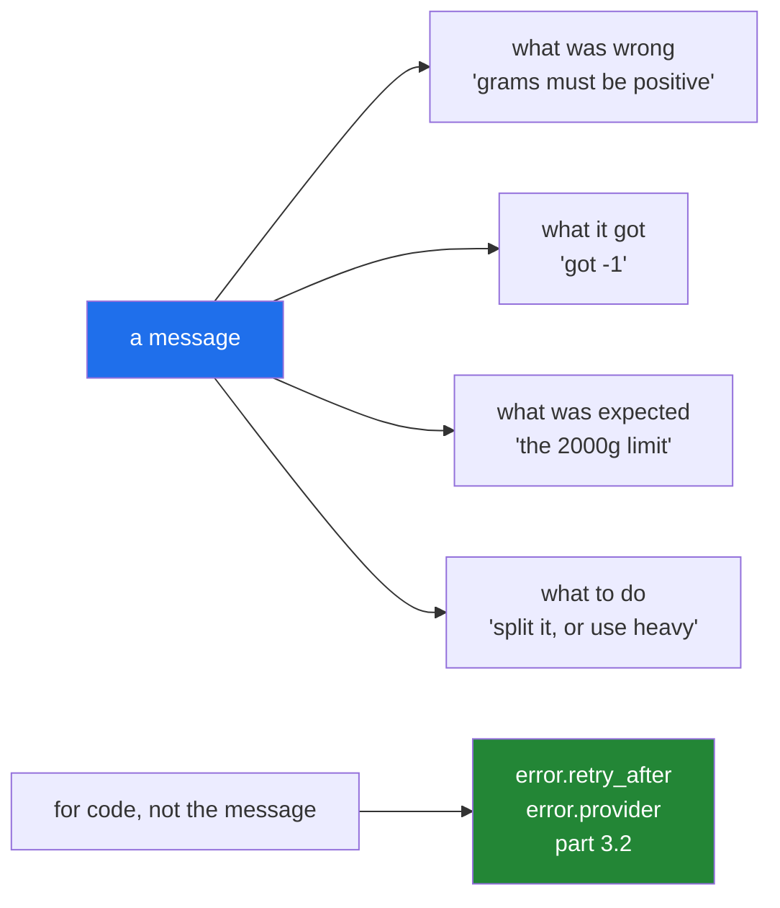

# 3.3 — The message is an interface: what a good one says

## One-line answer

A message is read by a person at the worst moment, so it must name **what was wrong, what was given, what
was expected, and what to do** — and never be the thing code parses, which is what the attributes are for.

---

## The story

Two slips, for the same refused parcel.

The first says: **"Rejected."**

The second says: **"5000g is over the 2000g limit for standard post. Split it, or ask for the heavy
service."**

The clerk who wrote the first is not being unhelpful on purpose. From where she is standing, she has just
said the thing she knows, and she knows the rest as well — the limit, the weight, the other service — so
the word "rejected" feels like it carries all of that with it.

It does not carry any of it. It carries the fact that you are not posting this parcel today.

The second slip costs the same to write, and the person holding it walks away knowing what to do next
without asking anybody anything.

---

## The idea in plain language

An exception's message is text a human reads, usually in a log, usually while something is broken, usually
without the code in front of them. Treating it as a throwaway string is the difference between a five-minute
incident and an hour of reproducing the failure.

A good message answers four questions, and it takes one sentence:

1. **What was wrong** — in the words of the problem, not "error" or "invalid".
2. **What it got** — the actual value, printed. This is the one people leave out most.
3. **What it expected** — the limit, the allowed set, the required type.
4. **What to do** — where it is not obvious from the other three.

Compare `"Invalid input"` with `"grams must be positive, got -1"`. The second needs no reproduction step:
whoever reads it already knows what to change.

Four habits that get you there:

**Include the value, safely.** Use `!r` so a string shows its quotes and an empty string is visible —
`got ''` reads clearly, `got ` does not
([Day 7, 3.3](../../../day-07-strings/parts/03-formatting/3.3-repr-and-the-debugging-f-string.md)). And
truncate: a message containing a whole file is a message nobody reads.

**Never put a secret in a message.** Exceptions are logged, shipped to error trackers, and pasted into
tickets. An API key, a password, a connection string or personal data in a message is now in all three
(Principle 11). Say `"GEMINI_API_KEY is not set"`, never the value; say "the row for customer 7741 failed
validation", never the row.

**Do not say "error" in an error message.** The traceback already says it is an error, and the type
already says which kind. `ValueError: Error: invalid weight` is one word of information in four.

**No trailing punctuation, and no capital letter unless it is a name.** This is a convention rather than a
rule, and it matters because the message gets embedded: `f"failed: {error}"` reads better without a full
stop in the middle. The standard library follows it almost everywhere.

And the rule the rest of this day rests on: **the message is for humans; the attributes are for code**
([3.2](3.2-an-exception-that-carries-data.md)). Once anything parses a message, that message is frozen —
improving the wording becomes a breaking change, and nobody will know until it breaks.

---

## Why Setu needs it

- **Day 3's gate is the first thing a new reader runs**, and `"GEMINI_API_KEY is not set - see
  days/day-03.../1.2"` is the difference between finishing setup and giving up
  ([Day 3, 1.2](../../../day-03-keys-and-budget/parts/01-secrets/1.2-dotenv-and-os-environ.md)).
- **`src/setu/config.py` already does this**: its `_HELP` constant points at the part that explains the
  fix, so the message carries an address rather than a complaint.
- **Day 16's `read_jsonl` must name the file's line number** on a malformed row
  ([Day 16, 2.5](../../../day-16-files-and-context-managers/parts/02-reading-and-writing/2.5-jsonl.md)) —
  a message saying only "malformed" makes a fifty-thousand-line file unsearchable.
- **Principle 11 is blast radius**, and a secret in a message has a blast radius of every log sink, error
  tracker and support ticket it ever reaches.

---

## The mechanism

The two sets, side by side:

```python
BAD = [
    "Error",
    "Invalid input",
    "Something went wrong",
    "ValueError",
    "failed to process record",
]
GOOD = [
    "grams must be positive, got -1",
    "missing required field 'address' in parcel 7741",
    "groq rate-limited us; retry in 30s",
    "limit is 2000g for 'standard'; this parcel is 5000g - try 'heavy' or split it",
]
print("unactionable:")
for m in BAD:
    print("  ", m)
print("actionable:")
for m in GOOD:
    print("  ", m)
```

**Line by line:**

- `"Error"` and `"ValueError"` — the type, repeated as the message. The traceback prints the type
  immediately before the message ([1.1](../01-raising-and-catching/1.1-what-raising-does.md)), so this is
  the same word twice.
- `"Invalid input"` — names a category, not a value. Every one of the four questions is unanswered.
- `"failed to process record"` — **which record?** In a run over a million records this is unactionable by
  construction.
- `"grams must be positive, got -1"` — what was wrong, what was expected, what it got. Three of the four
  questions, in six words.
- `"missing required field 'address' in parcel 7741"` — the identifier is what makes it searchable. Note
  `'address'` in quotes, which is what `!r` gives you.
- `"groq rate-limited us; retry in 30s"` — this one is generated by `__str__` from the attributes
  ([3.2](3.2-an-exception-that-carries-data.md)), so it cannot disagree with `error.retry_after`.
- the last one — all four questions, including **what to do**. Longer, and it is the one that ends the
  conversation.

Run on Python 3.12.12 on 2026-09-02:

```
unactionable:
   Error
   Invalid input
   Something went wrong
   ValueError
   failed to process record
actionable:
   grams must be positive, got -1
   missing required field 'address' in parcel 7741
   groq rate-limited us; retry in 30s
   limit is 2000g for 'standard'; this parcel is 5000g - try 'heavy' or split it
```

Building one properly, with the value included safely:

```python
MAX_SHOWN = 40


def check_address(value):
    """Raise a message somebody can act on without reproducing the failure."""
    if not isinstance(value, str):
        raise TypeError(f"address must be a str, got {type(value).__name__}: {value!r}")
    shown = value if len(value) <= MAX_SHOWN else value[:MAX_SHOWN] + "..."
    if not value.strip():
        raise ValueError(f"address is empty or whitespace only, got {shown!r}")
    if "\n" in value:
        raise ValueError(f"address must be one line, got {shown!r}")
    return value.strip()


for candidate in [42, "", "   ", "12 High St\nBristol", "x" * 60 + "\nBristol", " 12 High St "]:
    try:
        print("ok  :", repr(check_address(candidate)))
    except (TypeError, ValueError) as error:
        print(f"{type(error).__name__:10}: {error}")
```

**Line by line:**

- `MAX_SHOWN = 40` — a named constant rather than a magic number in three f-strings, so the truncation
  length is one edit.
- `f"... got {type(value).__name__}: {value!r}"` — **both** the type name and the value. The type answers
  "what kind of wrong" and the value answers "which one".
- `value if len(value) <= MAX_SHOWN else value[:MAX_SHOWN] + "..."` — the truncation, computed once and
  reused. Three dots rather than the single `…` character, because a Windows console using a legacy
  codepage prints that as a replacement character and the message becomes harder to read, not easier
  ([Day 16, 2.2](../../../day-16-files-and-context-managers/parts/02-reading-and-writing/2.2-encoding.md)).
  A conditional expression
  ([Day 5, 2.5](../../../day-05-operators-and-conditionals/parts/02-conditionals/2.5-the-conditional-expression.md))
  keeps it to one line.
- `{shown!r}` rather than `{shown}` — quotes round the value, so `''` and `'   '` are distinguishable and
  a trailing space is visible ([Day 7, 3.3](../../../day-07-strings/parts/03-formatting/3.3-repr-and-the-debugging-f-string.md)).
  **This is the single highest-value character in the whole document.**
- `"address is empty or whitespace only"` — says which of the two, because the fix differs.
- `if "\n" in value:` — a separate check with a separate message, rather than one "invalid address" for
  three different problems.
- the loop's `except (TypeError, ValueError)` — one clause for two types because the response is the same
  ([1.2](../01-raising-and-catching/1.2-try-except-and-catching-by-type.md)); the type name is printed so
  the distinction is still visible.

```
TypeError : address must be a str, got int: 42
ValueError: address is empty or whitespace only, got ''
ValueError: address is empty or whitespace only, got '   '
ValueError: address must be one line, got '12 High St\nBristol'
ValueError: address must be one line, got 'xxxxxxxxxxxxxxxxxxxxxxxxxxxxxxxxxxxxxxxx...'
ok  : '12 High St'
```

**Read lines two and three.** `''` and `'   '` are different problems and they are visibly different in
the output, entirely because of `!r`. Without it both would read `got ` and `got    `.

What the four questions look like:



---

## When it breaks

**The value left out, and the search that cannot be done:**

```text
$ uv run python -c "
rows = [{'grams': 500}, {'grams': -1}, {'grams': 900}]
for row in rows:
    try:
        if row['grams'] <= 0:
            raise ValueError('invalid weight')
    except ValueError as error:
        print('[warn]', error)
"
[warn] invalid weight
```

**What it means.** One line in a log, and it says nothing about which row, what the value was, or what
"invalid" means here. With three rows you can find it by eye. With three million, the only way to find out
is to run the job again with better logging — which means reproducing a failure you have already had.
**`f"grams must be positive, got {row['grams']} in row {i}"` costs nothing at the raise site** and removes
the second run entirely.

**A secret in a message:**

```text
$ uv run python -c "
KEY = 'sk-live-abc123def456'

def call(key):
    raise ConnectionError(f'auth failed for key {key}')

try:
    call(KEY)
except ConnectionError as error:
    print('[log]', error)
"
[log] auth failed for key sk-live-abc123def456
```

**What it means.** That key is now in the log file, in whatever ships the log file, in the error tracker,
and in the ticket somebody pastes it into. Rotating it is the only fix, and the trigger for rotating it is
somebody noticing — which may be months. **Name the variable, never the value**: `"auth failed for
GEMINI_API_KEY"` says as much to the person debugging and nothing to anyone else (Principle 11). The same
applies to connection strings, which carry a password in the middle, and to any row of real customer data.

**The message that became an API:**

```text
$ uv run python -c "
class ProviderError(Exception):
    pass

def handle(error):
    if 'rate limit' in str(error).lower():
        return 'back off'
    return 'fail'

print(handle(ProviderError('rate limit exceeded')))
print(handle(ProviderError('too many requests - slow down')))
"
back off
fail
```

**What it means.** Somebody improved the wording — *too many requests* is arguably clearer than *rate
limit exceeded* — and the retry logic stopped working. No test caught it, because no test asserts on
message text, and no reviewer would flag a wording change as behavioural. **This is why a message must
never be the thing code branches on**, and why the fix is a type
([3.1](3.1-one-base-class-per-project.md)) or an attribute
([3.2](3.2-an-exception-that-carries-data.md)).

**A message that is a whole file:**

```text
$ uv run python -c "
payload = 'x' * 100_000
try:
    raise ValueError(f'could not parse: {payload}')
except ValueError as error:
    print('message length:', len(str(error)), 'characters')
"
message length: 100017 characters
```

**What it means.** A hundred thousand characters into a log line, per failure. Log ingestion truncates it,
so the *end* — which is where a parser's position usually is — is cut off; the terminal wraps for two
screens; and the error tracker groups every one of these as a distinct issue because the payload differs.
**Truncate to something like forty characters and put the rest on an attribute** if the caller genuinely
needs it.

---

## In production

**The professional habit is to write the message for the person who will read it at 3am with no context.**
That person has a log line and nothing else — not your code, not the input, not the run. Everything they
need to know what to do next has to be in that line, and everything that would be a security or size
problem has to be out of it. Reading your own messages back with that in mind, once, catches most of the
bad ones.

**What changes at scale is that messages become the grouping key in error tracking.** A tracker groups by
type plus message shape, so a message with a value baked into it — `"could not parse row 8,441"` —
produces a separate issue per row, and one bad batch creates thousands of issues nobody can triage. The
standard shape is a **stable** message with the variable part in structured fields: `"could not parse
row"` as the message, `row=8441` as an attribute or a logging extra. That is the same fields-versus-prose
split as [3.2](3.2-an-exception-that-carries-data.md), arriving from the operational side.

**The failure that only appears with real data is the message that leaks under one input.** A validator
that includes the offending value is exactly right for `got -1` and exactly wrong the day the offending
value is a customer's identity document number. Any message that interpolates user data needs a decision
about what that data can be, and the safe default is to interpolate the **shape** — the type, the length,
the field name — rather than the content.

**The review comment a senior engineer leaves.** *"`raise ValueError('bad row')` gives on-call nothing.
Include the row number and the field that failed, and use `!r` on the value so an empty string is
distinguishable from whitespace. And drop the full payload from the message — put it behind a debug log
if we need it."*

**The interview question.** *"What makes a good exception message?"* The answer is the four questions —
what was wrong, what it got, what was expected, what to do — plus the two rules that are less often said:
never put a secret or unbounded user data in it, and never let code parse it, because the moment something
does, the wording is frozen and improving it is a silent breaking change. Mentioning that the variable
part belongs in structured fields rather than in the message text, so error tracking can group, is the
operational half.

---

## Check yourself

```bash
uv run python -c "
def check(value):
    if not isinstance(value, str):
        raise TypeError(f'address must be a str, got {type(value).__name__}: {value!r}')
    if not value.strip():
        raise ValueError(f'address is empty or whitespace only, got {value!r}')
    return value.strip()

for candidate in [42, '', '   ', ' 12 High St ']:
    try:
        print('ok  :', repr(check(candidate)))
    except (TypeError, ValueError) as error:
        print(f'{type(error).__name__:10}: {error}')
"
```

```
TypeError : address must be a str, got int: 42
ValueError: address is empty or whitespace only, got ''
ValueError: address is empty or whitespace only, got '   '
ok  : '12 High St'
```

Lines two and three are different problems and look different. Now remove the two `!r` and run it again.

**Answer out loud, without scrolling up:**

> Name the four questions a message should answer, and say why code must never branch on it.

---

**Next:** [3.4 — which errors are yours to raise, and translating at the boundary](3.4-translate-at-the-boundary.md).
