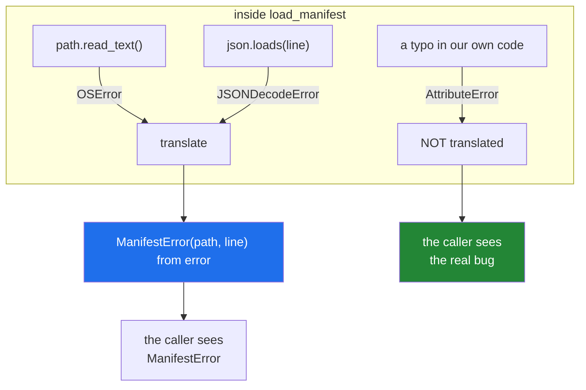

# 3.4 — Which errors are yours to raise, and translating at the boundary

## One-line answer

At the edge of your module, turn the exceptions your dependencies raise into your own — always with
`from error` — so callers depend on what your function *promises* rather than on what it is built out of;
and let genuine bugs through untouched.

---

## The story

The counter has a back room, and the customer never sees it.

Back there, the scales are a particular brand, the label printer takes a particular cartridge, and the
card machine talks to a particular bank. All three of those get replaced every few years.

What the customer hears at the counter has never changed: *too heavy for this service*, *the system is
down, come back after four*, *that address is not complete*. Three sentences, stable for twenty years,
while everything behind them was swapped out twice.

Nobody planned that as a policy. It happened because the clerk translates. She does not lean back and
shout "the printer is showing E-04" — she says the counter version of what that means for you.

And there is one thing she does not translate. If the ceiling starts leaking, she does not say "the
system is down, come back after four". That is not a counter problem with a counter sentence; that is
something nobody anticipated, and it goes straight to somebody who can deal with it.

---

## The idea in plain language

Every function has a set of exception types it can raise, and that set is part of its interface whether
anybody wrote it down or not ([2.2](../02-the-hierarchy/2.2-which-built-in-to-raise.md)). If
`load_manifest()` lets `json.JSONDecodeError` escape, then every caller now handles a `json` exception —
and the day you switch to a different format, every one of those handlers is wrong.

**Translation** is catching what your dependency raised and raising your own type instead, with
`from error` ([2.3](../02-the-hierarchy/2.3-raise-from-and-the-chain.md)) so nothing is lost. It buys two
things: callers depend on your promise rather than on your implementation, and the whole family is
catchable with one clause ([3.1](3.1-one-base-class-per-project.md)).

**Where** to translate is the important half, and the answer is: at the boundary of the module, not at
every call. Inside `load_manifest`, `json` exceptions are expected and meaningful. At its edge, they are
an implementation detail leaking out. One translation, at the door.

Now the part people get wrong: **not everything should be translated.**

| Kind | What to do |
|---|---|
| an **expected** failure of the outside world — a missing file, malformed input, a rate limit | translate to your type, `from error` |
| a **bug** — `AttributeError`, `TypeError`, `NameError` from your own code | let it through, untouched |
| **shutdown** — `KeyboardInterrupt`, `SystemExit` | let it through ([1.4](../01-raising-and-catching/1.4-the-bare-except.md)) |

The reason bugs are not translated is that translation is a claim: *this is a known failure mode of this
operation*. Wrapping an `AttributeError` from your own typo in a `ManifestError` says the manifest was
bad, which is false, and it sends whoever is investigating to look at the data rather than at the code.

That is why the translation catches **narrow types** — `OSError`, `json.JSONDecodeError` — and not
`Exception`. Catching `Exception` at a boundary and wrapping it is how every bug in a module becomes a
data problem ([4.1](../04-in-anger/4.1-the-except-that-was-too-wide.md)).

One more piece: **carry the context the caller will want.** The dependency's exception knows *what* was
malformed; only your code knows *which file and which line*. Putting those on the new exception
([3.2](3.2-an-exception-that-carries-data.md)) is what makes the translation an improvement rather than a
rename.

---

## Why Setu needs it

- **Day 16's `read_jsonl` is exactly this shape.** `json`'s own message always says "line 1" whatever
  line it was ([Day 16, 2.5](../../../day-16-files-and-context-managers/parts/02-reading-and-writing/2.5-jsonl.md)),
  so the file's line number can only come from a translation.
- **Day 172's router faces four provider libraries with four different exception types.** Translating each
  to `ProviderError` and `RateLimited` is what lets one retry loop serve all four
  ([3.2](3.2-an-exception-that-carries-data.md)).
- **`src/setu/config.py` should raise a `ConfigError`, not a `KeyError`** — a caller should not have to
  know that configuration is a dictionary lookup
  ([Day 3, 1.2](../../../day-03-keys-and-budget/parts/01-secrets/1.2-dotenv-and-os-environ.md)).
- **Phase 18 swaps Chroma for FAISS in places** (plan Part 2), and a vector-store module that leaks its
  library's exceptions makes that swap a change to every caller.

---

## The mechanism

A module that promises one exception type and is built out of two others:

```python
"""Translate at the door, and let bugs through."""

import json
from pathlib import Path


class SetuError(Exception):
    """Everything this project raises on purpose."""


class ManifestError(SetuError):
    """The manifest could not be loaded or is not usable."""

    def __init__(self, path, line=None):
        super().__init__(path, line)
        self.path = path
        self.line = line

    def __str__(self):
        where = f"{self.path}" if self.line is None else f"{self.path}:{self.line}"
        return f"could not load the manifest at {where}"


def load_manifest(path: Path) -> list[dict]:
    """Return the records, or raise ManifestError. Never leaks json or OSError."""
    try:
        text = path.read_text(encoding="utf-8")
    except OSError as error:
        raise ManifestError(path) from error

    records = []
    for number, line in enumerate(text.splitlines(), start=1):
        if not line.strip():
            continue
        try:
            records.append(json.loads(line))
        except json.JSONDecodeError as error:
            raise ManifestError(path, number) from error
    return records
```

**Line by line:**

- `class ManifestError(SetuError):` — under the project base, so one clause catches it with everything else
  of ours ([3.1](3.1-one-base-class-per-project.md)).
- `def __init__(self, path, line=None)` — `line` optional, because a missing file has no line. Both go to
  `super().__init__` so `args` replays ([3.2](3.2-an-exception-that-carries-data.md)).
- `__str__` branching on `line is None` — one class, two readable messages, and neither is stored.
- **The docstring says what it raises.** `"Never leaks json or OSError"` is the promise this function is
  making, and it is the thing the tests should check.
- `except OSError as error:` — **narrow**: file problems only. A `MemoryError` or an `AttributeError` from
  a typo above is untouched.
- `raise ManifestError(path) from error` — the translation. `from error`
  ([2.3](../02-the-hierarchy/2.3-raise-from-and-the-chain.md)) is what makes this lossless: the original
  `FileNotFoundError`, with its errno and filename, is still in the traceback.
- `enumerate(text.splitlines(), start=1)` — **`start=1`**, because humans count lines from one
  ([Day 6, 1.3](../../../day-06-loops/parts/01-iteration/1.3-enumerate-and-zip.md)). This number is the
  entire reason the translation is worth doing.
- `if not line.strip(): continue` — blank lines skipped, so a trailing newline is not an error
  ([Day 16, 2.5](../../../day-16-files-and-context-managers/parts/02-reading-and-writing/2.5-jsonl.md)).
- `except json.JSONDecodeError as error:` — narrow again, and note it is **inside the loop**, wrapping one
  `json.loads` and nothing else ([1.2](../01-raising-and-catching/1.2-try-except-and-catching-by-type.md)).
- `raise ManifestError(path, number) from error` — the same translation with the line number attached.
  `json`'s own message will say "line 1" because it only ever saw one line; `number` is the file's.

Run on Python 3.12.12 on 2026-09-02:

```
good : [{'a': 1}, {'a': 2}]
bad.jsonl      -> could not load the manifest at bad.jsonl:2
                  cause: JSONDecodeError: Expecting property name enclosed in double quotes: line 1 column 2 (char 1)
                  line : 2
missing.jsonl  -> could not load the manifest at missing.jsonl
                  cause: FileNotFoundError: [Errno 2] No such file or directory: 'missing.jsonl'
                  line : None
```

**Read the second block carefully.** `json` says *line 1* and the translation says *line 2*, and both are
correct: `json` was handed one line, and that line was the file's second. Neither piece of information is
sufficient alone, and the caller has both — the summary from `ManifestError.__str__`, the detail from
`__cause__`, the machine-readable position from `error.line`.

Where the wrapping happens:



---

## When it breaks

**Translating without `from`, which loses the only detail that mattered:**

```text
$ uv run python -c "
import json

class ManifestError(Exception):
    pass

def load(text):
    try:
        return json.loads(text)
    except json.JSONDecodeError:
        raise ManifestError('the manifest is malformed')

load('{oops')
" 2>&1 | tail -4
Traceback (most recent call last):
  File "<string>", line 13, in <module>
  File "<string>", line 11, in load
ManifestError: the manifest is malformed
```

**What it means.** The full output does still contain the original under *During handling of the above
exception* ([2.3](../02-the-hierarchy/2.3-raise-from-and-the-chain.md)) — but only because Python does it
automatically, and it is labelled as coincidence rather than cause. Anybody skimming the last few lines,
which is what everybody does, sees only "malformed" and has no position at all. **`as error` and
`from error` cost eleven characters.**

**Catching `Exception` at the boundary, so a bug becomes a data problem:**

```text
$ uv run python -c "
class ManifestError(Exception):
    pass

def load_manifest(path):
    try:
        return path.reed_text(encoding='utf-8')   # typo: reed
    except Exception as error:
        raise ManifestError('could not load the manifest') from error

from pathlib import Path
try:
    load_manifest(Path('anything.jsonl'))
except ManifestError as error:
    print('reported as :', error)
    print('actually was:', repr(error.__cause__))
"
reported as : could not load the manifest
actually was: AttributeError("'WindowsPath' object has no attribute 'reed_text'")
```

**What it means.** The manifest is fine. The code has a typo, and it has been reported to every caller,
every log and every dashboard as a manifest problem. Somebody will check the file, find nothing wrong,
and check it again. **The `from error` saved this one** — the cause is right there — but the *type* is a
lie, and the type is what routing and alerting use. Catch `OSError`, not `Exception`.

**Translating in the wrong place — every call instead of the boundary:**

```python
def read_one(path):
    try:
        return path.read_text(encoding="utf-8")
    except OSError as error:
        raise ManifestError(path) from error


def read_all(paths):
    out = []
    for path in paths:
        try:
            out.append(read_one(path))
        except ManifestError as error:
            raise ManifestError(path) from error
    return out
```

**Line by line:**

- `read_one` translates, correctly — it is the function that touches the outside world.
- `except ManifestError as error:` in `read_all` — catching **your own type** and re-wrapping it. Legal,
  and it does nothing except add a layer.
- `raise ManifestError(path) from error` — the chain is now `ManifestError` caused by `ManifestError`
  caused by `OSError`, and the traceback is three blocks long for a missing file.

**What it means.** Translation belongs at the module's edge, once. Re-wrapping your own exceptions makes
tracebacks longer, buries the cause a level deeper per layer, and adds no information. If `read_all` has
something to add — which path it was on — that is `error.add_note(...)` and a bare `raise`
([1.5](../01-raising-and-catching/1.5-the-exception-object.md), [2.4](../02-the-hierarchy/2.4-re-raising.md)),
not a new exception.

**Leaking the dependency, and the migration that could not happen:**

```python
def load_manifest(path):
    """Returns records. Raises json.JSONDecodeError on a bad line."""
    return [json.loads(line) for line in path.read_text(encoding="utf-8").splitlines()]
```

**Line by line:**

- the docstring **promising `json.JSONDecodeError`** — honest, and it has just made a third-party
  exception type part of this project's public interface.
- the comprehension — fine, and it means every caller now writes `except json.JSONDecodeError:` and
  therefore `import json`.

**What it means.** The day the manifest becomes CSV, or YAML, or a database table, every one of those
callers breaks — and they break at run time, in the handler, on the failure path, which is the least
tested code in any system. The function's *job* never changed. Only its insides did, and the insides were
in the contract.

---

## In production

**The professional habit is that a module's public functions raise only that module's own exception
types, plus the built-ins that genuinely fit
([2.2](../02-the-hierarchy/2.2-which-built-in-to-raise.md)).** It is written in the docstring, it is
checked by a test, and it is what lets the implementation change without a coordinated release. The
smaller the module's exception surface, the more freely its insides can be replaced.

**What changes at scale is that this becomes the seam between teams and services.** A service's API
contract lists its error codes, and those map to its exception types; nobody outside should ever see a
`psycopg` exception or a `botocore` one, because those are answers to "what are you built out of", not to
"what went wrong with my request". Getting this wrong shows up as a client library that has to import
your dependencies to handle your errors.

**The failure that only appears with real data is the untranslated exception from a rare path.** A module
translates the three failures its tests cover and lets a fourth — a timeout, a decoding error, a disk-full
`OSError` — escape untouched. Callers catch the module's own type and are unaffected by the escapee, so it
travels to the top and takes the process down. The defence is catching the **family** at the boundary
(`OSError` rather than `FileNotFoundError`) while still refusing to catch `Exception`, and a test that
asserts the promise: no exception other than ours escapes for any of these inputs.

**The review comment a senior engineer leaves.** *"`fetch()` lets `httpx.ConnectError` out, so every
caller imports `httpx` to handle it and we cannot swap the client. Wrap it in `ProviderError` with
`from error`, and catch `httpx.HTTPError` — the family — rather than the three subclasses we happen to have
seen."*

**The interview question.** *"Should you wrap third-party exceptions in your own?"* The answer is yes at
the boundary of your module, always with `from` so nothing is lost, so that callers depend on your promise
rather than on your dependencies — and the second half is the part that shows judgement: **not** for bugs.
Catching `Exception` and wrapping it turns your own `AttributeError` into a domain error and sends the
investigation to the data instead of the code, so the translation catches narrow, expected types and lets
everything else through.

---

## Check yourself

```bash
uv run python -c "
import json
from pathlib import Path

class ManifestError(Exception):
    def __init__(self, path, line=None):
        super().__init__(path, line)
        self.path, self.line = path, line
    def __str__(self):
        return f'could not load {self.path}' + ('' if self.line is None else f' at line {self.line}')

def load(path):
    for number, line in enumerate(path.read_text(encoding='utf-8').splitlines(), start=1):
        try:
            json.loads(line)
        except json.JSONDecodeError as error:
            raise ManifestError(path, number) from error

Path('bad.jsonl').write_text('{\"a\": 1}\n{oops\n', encoding='utf-8')
try:
    load(Path('bad.jsonl'))
except ManifestError as error:
    print('ours :', error)
    print('cause:', repr(error.__cause__))
    print('line :', error.line)
Path('bad.jsonl').unlink()
"
```

Our line number is 2 and `json`'s message says line 1. Say why both are right. Now delete `from error` and
see what the last two lines become.

**Answer out loud, without scrolling up:**

> Name the two kinds of exception you should translate at a module boundary and the two you should not,
> and say what goes wrong when a boundary catches `Exception`.

---

**Next:** [4.1 — the `except` that was too wide, and the bug that hid for a month](../04-in-anger/4.1-the-except-that-was-too-wide.md).
