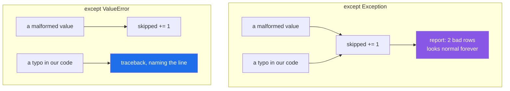

# 4.1 — The `except` that was too wide, and the bug that hid for a month

## One-line answer

`except Exception:` catches your own bugs alongside the failure you meant, so a typo becomes "a bad row"
— and the wider the `try` block, the more of your code is being reported as somebody else's data problem.

---

## The story

There is a tray behind the counter marked **"problems"**, and at the end of the day somebody counts it and
writes the number on the board.

For a month the number was two or three a day, which is normal. Nobody looked in the tray, because the
number was normal.

What was actually in it, on most days, was one genuinely bad parcel and two forms that the clerk had
filled in wrongly herself — a box ticked in the wrong column, twice a day, for a month.

Both kinds of problem went in the same tray, and the tray is counted rather than read. So the number stayed
normal, and the mistake stayed uncorrected, and everybody agreed there was nothing to look into because the
number was normal.

The tray was doing exactly what it was built to do. The trouble is that it was built to hold two different
things.

---

## The idea in plain language

You already know the two rules this part is about, from
[1.2](../01-raising-and-catching/1.2-try-except-and-catching-by-type.md): catch the narrowest type, and
keep the `try` block small. This part is what happens when you do not, at the scale where it matters — and
it is the single most expensive mistake in this whole day.

`except Exception:` catches everything that is a failure
([1.4](../01-raising-and-catching/1.4-the-bare-except.md)). That includes:

- the failure you were thinking about — a malformed row, a missing file;
- **`AttributeError` and `NameError` from your own typos**;
- `TypeError` from calling something with the wrong arguments after a refactor;
- `KeyError` from a field that was renamed;
- `MemoryError`, `RecursionError`, and every other sign that the process is in trouble.

A handler cannot tell those apart. So when it responds — skip the row, return a default, log a warning —
it responds to *all* of them the same way, and the ones that were bugs are now indistinguishable from
data.

Two things make this worse than it sounds.

**The counting hides it.** A pipeline that reports "3 rows skipped" looks healthy. Nobody investigates a
small number, and the number is small because most rows are fine — so a bug that affects one row shape in
a thousand produces a perfectly normal-looking report, forever.

**The `try` block's size multiplies it.** A `try` around one call makes a claim about one call. A `try`
around twenty lines makes the same claim about twenty, and nineteen of them are code you wrote, which is
where bugs live. That is why "keep the `try` small" and "catch narrow" are the same rule from two
directions.

The three places `except Exception:` is legitimate, and they are all at edges:

**One boundary handler per process** — the request handler, the worker's task loop, the top of a
command-line program — which **logs the traceback**
([4.3](4.3-logging-exception.md)) and converts to a status code or a failed job. It absorbs everything
precisely because it is the last thing before the outside world, and it is loud.

**A cleanup path**, which does its cleanup and **re-raises**
([2.4](../02-the-hierarchy/2.4-re-raising.md)).

**A plugin or task runner** isolating third-party code it does not trust — and even there, logged with the
traceback and counted.

Every one of those either re-raises or logs a full traceback. **A broad handler that does neither is where
bugs go to hide.**

---

## Why Setu needs it

- **Day 16's `read_jsonl(on_error="skip")` is exactly this risk**
  ([Day 16, 2.5](../../../day-16-files-and-context-managers/parts/02-reading-and-writing/2.5-jsonl.md)),
  which is why that day insisted the skipped count be *reachable* rather than logged.
- **Day 172's router loops over four providers** and must not treat a bug in its own request-building code
  as "this provider is down" — otherwise it fails over four times and reports every provider as broken.
- **Day 233's eval suite runs many cases** and must distinguish "the model got it wrong" from "our
  scoring code crashed". A broad handler makes those the same number.
- **Principle 7 is evals before features**, and a broad handler is precisely what stops a test from being
  able to go red: the failure is caught before the assertion sees it.

---

## The mechanism

Three rows, one typo, and a report that looks fine:

```python
ROWS = [
    {"id": 1, "grams": "500", "service": "standard"},
    {"id": 2, "grams": "900", "servce": "standard"},
    {"id": 3, "grams": "heavy", "service": "standard"},
]


def price(row):
    grams = int(row["grams"])
    return grams * (2 if row["service"] == "standard" else 5)


total, skipped = 0, 0
for row in ROWS:
    try:
        total += price(row)
    except Exception:
        skipped += 1
print("total  :", total)
print("skipped:", skipped, "- and the report says 2 bad rows")
```

**Line by line:**

- row 2 has `"servce"` — a typo **in the data**, standing in for the far more common case of a typo in
  your own code or a field renamed upstream. It causes a `KeyError` inside `price`.
- row 3 has `"grams": "heavy"` — a genuinely bad value, causing a `ValueError` from `int()`. **This is the
  one the handler was written for.**
- `except Exception:` — catches both, identically.
- `skipped += 1` — a counter, which is better than nothing and is exactly what makes the number look
  normal.
- the final `print` — **the report a person reads.** It says two bad rows. One of them was not a bad row.

Run on Python 3.12.12 on 2026-09-02:

```
total  : 1000
skipped: 2 - and the report says 2 bad rows
```

Now change one word — `Exception` to `ValueError` — and change nothing else:

```text
$ uv run python -c "..."
Traceback (most recent call last):
  File "<string>", line 15, in <module>
  File "<string>", line 10, in price
KeyError: 'service'
```

**The typo is now a loud, located failure** naming the exact line and the exact field, and the run stops
rather than producing a total that is quietly wrong. The `ValueError` from row 3 would still be caught and
counted, because that is what the handler is for.

The two shapes:



---

## When it breaks

**The default that was returned instead of a failure:**

```text
$ uv run python -c "
def limit_for(service, table):
    try:
        return table[service]
    except Exception:
        return 2000

TABLE = {'standard': 2000, 'heavy': 30000}
print('heavy   :', limit_for('heavy', TABLE))
print('typo    :', limit_for('heavey', TABLE))
print('no table:', limit_for('heavy', None))
"
heavy   : 30000
typo    : 2000
no table: 2000
```

**Lines two and three are identical and mean completely different things.** Line two is a service that is
not in the table, which is a real lookup miss and where the fallback belongs. Line three is `None` where a
dictionary should have been — a bug, upstream, in whatever built the arguments — and it comes back as a
perfectly ordinary 2000. Nothing anywhere records that it happened.

Change one word to `except KeyError:` and the same three calls behave as they should:

```text
heavy   : 30000
typo    : 2000
Traceback (most recent call last):
  File "<string>", line 11, in <module>
  File "<string>", line 4, in limit_for
TypeError: 'NoneType' object is not subscriptable
```

**What it means.** The lookup miss still gets its fallback; the bug now announces itself, with the line
and the reason. The wide handler was not "safer" — it was **less able to tell two situations apart**, and
that is the whole of the cost.

**A broad handler that stops a test from failing:**

```text
$ uv run python -c "
def process(row):
    try:
        return int(row['grams']) * 2
    except Exception:
        return 0

def test_bad_row_is_rejected():
    assert process({'grams': 'heavy'}) == 0

def test_good_row_is_priced():
    assert process({'gram': '500'}) == 1000

test_bad_row_is_rejected()
print('first test passed')
try:
    test_good_row_is_priced()
except AssertionError:
    print('second test failed - and it took the typo to make it')
"
first test passed
second test failed - and it took the typo to make it
```

**What it means.** The first test passes for the wrong reason — `0` is returned for a bad value *and* for
a bug, so the assertion cannot tell which happened. It would still pass if `process` were
`return 0` with no logic at all. **A broad handler makes a function's failure path untestable**, because
every input produces the same tidy result (Principle 7).

**`except Exception: pass`, which the linter has an opinion about:**

```text
$ uv run ruff check --select E,F,B,SIM,S110 quiet.py
SIM105 Use `contextlib.suppress(Exception)` instead of `try`-`except`-`pass`
 --> quiet.py:1:1
S110 `try`-`except`-`pass` detected, consider logging the exception
 --> quiet.py:3:1
```

**What it means.** Two rules for the same three lines
([1.4](../01-raising-and-catching/1.4-the-bare-except.md)). `S110`'s advice — *consider logging the
exception* — is the minimum. The better fix is nearly always a narrower type, because most `pass`
handlers are there for one specific expected condition and the author reached for `Exception` out of
habit.

**A broad handler in a loop, absorbing an outage:**

```text
$ uv run python -c "
def fetch(row):
    if row > 2:
        raise ConnectionError('the database went away')
    return row * 2

done, skipped = [], 0
for row in range(6):
    try:
        done.append(fetch(row))
    except Exception:
        skipped += 1
print('processed:', done)
print('skipped  :', skipped, 'rows - reported as bad data')
"
processed: [0, 2, 4]
skipped  : 3 rows - reported as bad data
```

**What it means.** The database dropped and the job finished successfully with half the data, reporting
the loss as bad rows. Every subsequent run does the same. **This is the failure that only shows up with
real infrastructure**: in testing the connection never drops, so the handler is only ever exercised by the
case it was written for. A narrow `except ValueError:` would have let the `ConnectionError` out and failed
the job, which is the correct outcome — a job that cannot reach its database has not succeeded.

---

## In production

**The professional rule is: one broad handler per process, at the edge, and it logs the traceback.**
Everywhere inside, exceptions are caught by type. This is not purism; it is what makes the difference
between "the pipeline reported 4,000 bad rows" and "the pipeline hit a `KeyError` in `normalise_service`
on line 88". The first takes a day to investigate. The second takes a minute.

**What changes at scale is that broad handlers become silent data loss with a healthy dashboard.** Every
metric a broad handler feeds — rows processed, jobs succeeded, requests served — counts the swallowed
failures as ordinary outcomes, so the system reports health while losing work. The standard defences are
that any handler which drops work must **count what it dropped and expose the count**
([Day 16, 2.5](../../../day-16-files-and-context-managers/parts/02-reading-and-writing/2.5-jsonl.md)),
and that the job's success criterion includes that count being within a threshold. A log line is not a
count.

**The failure that only appears with real data is the new failure mode arriving in an old handler.** A
handler written when the only possible failure was a malformed date starts absorbing timeouts, decode
errors and permission failures as the system grows — none of which the author considered, all of which
now look like malformed dates. Narrow types are what make a new failure mode *visible*: it does not match
any clause, so it travels to the boundary and is logged as itself.

**The review comment a senior engineer leaves.** *"`except Exception` around the whole `for` body means a
`KeyError` from a renamed column is counted as a bad row. Catch `ValueError` around the parse only, and
let everything else reach the job's top-level handler — the point of that handler is that it fails the
job, and a schema change should fail the job."*

**The interview question.** *"When is `except Exception` acceptable?"* The answer is: at exactly one place
per process — the boundary — where it logs the traceback and turns the failure into a status code or a
failed job, plus cleanup handlers that re-raise. Everywhere else it catches your own bugs alongside the
condition you meant, so a typo is reported as a data problem and the metric that would have shown it is
counting it as normal. The follow-up worth pre-empting is that the *size* of the `try` block matters just
as much: a broad handler around one call is a much smaller lie than the same handler around twenty lines.

---

## Check yourself

```bash
uv run python -c "
ROWS = [
    {'id': 1, 'grams': '500', 'service': 'standard'},
    {'id': 2, 'grams': '900', 'servce': 'standard'},
    {'id': 3, 'grams': 'heavy', 'service': 'standard'},
]

def price(row):
    return int(row['grams']) * (2 if row['service'] == 'standard' else 5)

for catching in (Exception, ValueError):
    total, skipped = 0, 0
    try:
        for row in ROWS:
            try:
                total += price(row)
            except catching:
                skipped += 1
        print(f'{catching.__name__:10} total={total} skipped={skipped}')
    except Exception as error:
        print(f'{catching.__name__:10} stopped with {type(error).__name__}: {error}')
"
```

One line reports a tidy, wrong answer. The other names the bug. Now say which of the two you would rather
get at 3am.

**Answer out loud, without scrolling up:**

> A pipeline reports "3 rows skipped" every day and the number never changes. Say what a broad `except`
> could be hiding, and name the two things a broad handler must do to be acceptable.

---

**Next:** [4.2 — EAFP over LBYL, and the race that makes checking first wrong](4.2-eafp-and-lbyl.md).
