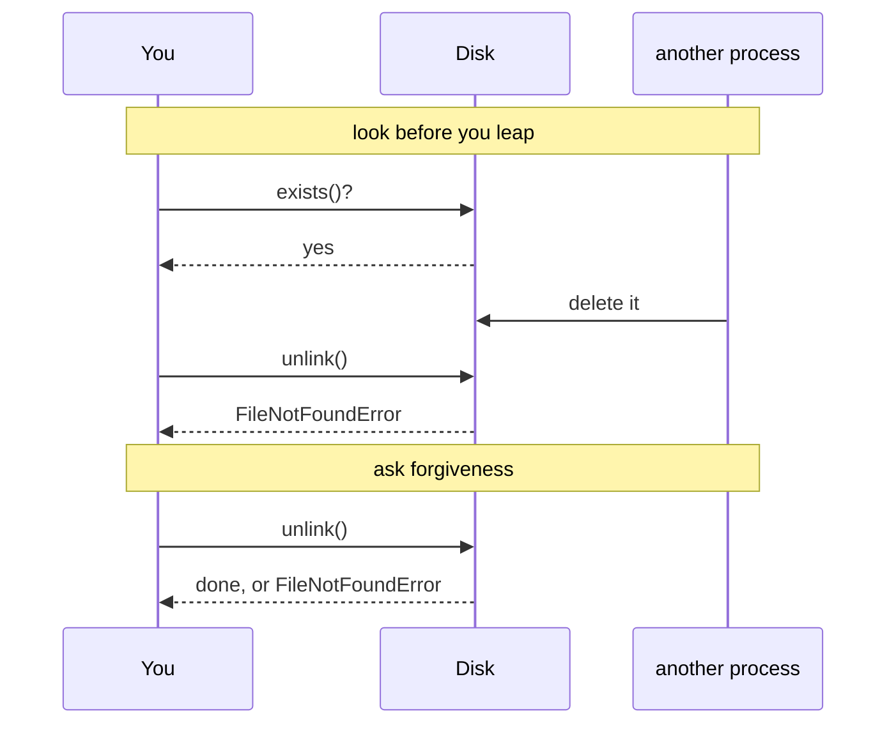

# 4.2 — Ask forgiveness or ask permission, and the race that decides it

## One-line answer

Checking first and then acting leaves a gap in which the world can change, so for anything outside your
own process — files, networks, databases — **do the thing and catch the failure**; checking first is for
cheap, local decisions where the answer cannot go stale.

---

## The story

Two ways to get a parcel into the last van of the day.

The first: walk to the loading bay, look at the van, see there is room, walk back, fetch the parcel, walk
out again — and find the van full, because in the ninety seconds you were away somebody loaded four sacks
of catalogues.

The second: pick up the parcel, walk out once, and try to put it in. If there is room, it is in. If there
is not, you find out at the moment it matters, holding the parcel, ready to do the other thing.

The second way is not less careful. It is careful about the right moment. The first way answered the
question *"is there room?"* at a time when nobody was asking it, and by the time anybody needed the answer
it had gone out of date.

---

## The idea in plain language

Two names for two habits, and Python has a preference.

**LBYL — look before you leap.** Check the condition, then act. `if key in d: use(d[key])`.
`if path.exists(): path.unlink()`.

**EAFP — easier to ask forgiveness than permission.** Act, and handle the failure.
`try: use(d[key]) except KeyError: ...`. `try: path.unlink() except FileNotFoundError: ...`.

Both are readable, and the choice is not taste. It comes down to one question: **can the answer to the
check go stale between the check and the act?**

For a dictionary in your own process, no. Nothing else touches it, so `if key in d` is still true one line
later, and either style is correct.

For anything outside your process — a file, a directory, a socket, a row in a database, an API — **yes**.
Another process, another thread, another machine, or the operating system itself can act in the gap. The
check told you what was true a moment ago; the act needs what is true now. That gap has a name: a **race
condition** — two things racing, and the result depending on which gets there first. You met it on
[Day 16, 1.4](../../../day-16-files-and-context-managers/parts/01-the-path/1.4-exists-mkdir-and-the-race.md),
where `exists()` then `mkdir()` was the example.

The important part: **EAFP does not merely tidy the race away, it removes it.** The operating system
performs "delete this file" as one indivisible operation; either it happens or it raises. There is no gap
in the middle for anything to change, because there is no middle.

There is a second, smaller argument, and it is about cost. Python's exceptions are cheap to set up and
expensive to raise. So the two styles differ measurably in exactly one case — when the failure is common —
and that is the guidance:

| Situation | Prefer |
|---|---|
| touching the filesystem, network, or database | **EAFP**, always — the check can go stale |
| a local check, failure rare | either; EAFP reads better and is marginally faster |
| a local check, failure **common** (say, half the time) | **LBYL**, or `dict.get` / `getattr` with a default |

And the third argument, which is often the deciding one: **LBYL duplicates the condition.** `if
isinstance(x, int) and x > 0 and x < LIMIT:` before a call whose body checks the same three things means
two places to keep in step. EAFP has the condition once, in the code that owns it.

Two things that are neither style and beat both when they fit: `dict.get(key, default)` and
`getattr(obj, name, default)`. One call, no gap, no exception. Reach for them first.

---

## Why Setu needs it

- **Day 16 built `data_dir()` on `mkdir(parents=True, exist_ok=True)`**
  ([Day 16, 1.4](../../../day-16-files-and-context-managers/parts/01-the-path/1.4-exists-mkdir-and-the-race.md)) —
  which is EAFP pushed down into the standard library, and is why that function has no `if exists()` in
  it.
- **Day 42's Supabase project pauses when idle** (plan Part 2.1), so "is the database awake?" is stale the
  moment you ask it. The only workable shape is to try the query and catch.
- **Every provider call from Day 172** is a network round trip, so checking a rate limit before calling is
  guesswork; the 429 response is the truth ([3.2](../03-your-own/3.2-an-exception-that-carries-data.md)).
- **`./m check` runs in CI on a fresh runner**, where files a laptop happens to have do not exist — which
  is where check-then-act code diverges between machines.

---

## The mechanism

The two styles, measured, on the same dictionary:

```python
import timeit


def lbyl(d):
    if "grams" in d:
        return d["grams"]
    return 0


def eafp(d):
    try:
        return d["grams"]
    except KeyError:
        return 0


hit = {"grams": 500}
miss = {}
for label, d in (("present", hit), ("missing", miss)):
    l = timeit.timeit(lambda: lbyl(d), number=200_000)
    e = timeit.timeit(lambda: eafp(d), number=200_000)
    print(f"{label}: look-before {l * 1e6 / 200_000:.3f} us   try-it {e * 1e6 / 200_000:.3f} us")
```

**Line by line:**

- `import timeit` — the standard library's timing helper. It runs the callable many times and returns
  total seconds, which is more honest than one wall-clock reading.
- `number=200_000` — enough repetitions that per-call noise averages out. **A single measurement of a
  microsecond operation measures the clock, not the code.**
- `lambda: lbyl(d)` — a zero-argument callable for `timeit`
  ([Day 11, 3.1](../../../day-11-iterators-and-generators/parts/03-lambda-and-map/3.1-lambda-a-function-with-no-name.md)).
- two dictionaries, `hit` and `miss` — the same code on the success path and the failure path, because
  that is the only axis on which the two styles differ.
- `l * 1e6 / 200_000` — seconds to microseconds per call.

Run on Python 3.12.12 on 2026-09-02:

```
present: look-before 0.069 us   try-it 0.066 us
missing: look-before 0.058 us   try-it 0.214 us
```

Those are per-call figures on this machine; yours will differ, and the **ratio** is the part that carries
over.

**Read both rows.** When the key is there, the two are the same — the `try` costs nothing when nothing
raises. When it is missing, raising and catching costs about three times as much. Both numbers are
fractions of a microsecond, so this only matters in a hot loop where failure is the common case; and that
is exactly the row of the table above that says use LBYL, or `dict.get`.

Now the argument that is not about speed:

```python
from pathlib import Path

p = Path("gone.txt")
p.write_text("hi", encoding="utf-8")

if p.exists():
    p.unlink()  # somebody else deleted it here, in real life
    try:
        p.unlink()  # the same call again = what the race looks like
    except FileNotFoundError as error:
        print("check-then-act raised anyway:", type(error).__name__)

try:
    p.unlink()
except FileNotFoundError:
    print("try-it handled it with no gap at all")
```

**Line by line:**

- `p.write_text("hi", encoding="utf-8")` — a real file, so `exists()` is genuinely `True`
  ([Day 16, 2.2](../../../day-16-files-and-context-managers/parts/02-reading-and-writing/2.2-encoding.md)).
- `if p.exists():` — the check. It is correct at the instant it runs, and that is all it can ever be.
- the first `p.unlink()` — **standing in for another process** doing exactly this, in the gap. In real
  code you would not see this line; you would see nothing, which is the problem.
- the second `p.unlink()` — the act, now on a file that is gone. It raises **despite the check**, which is
  the entire demonstration: `exists()` did not protect it.
- the final `try` / `except FileNotFoundError:` — the same job, done in one operation. There is no gap,
  because there is no first step.

```
check-then-act raised anyway: FileNotFoundError
try-it handled it with no gap at all
```

**The `if exists()` bought nothing.** The code still needed the handler, so all the check added was a line
and a false sense of safety.

The gap:



In the second exchange there is nowhere for the third participant to act.

---

## When it breaks

**A check that duplicates the condition, and drifts:**

```text
$ uv run python -c "
LIMIT = 2000

def weigh(grams):
    if grams <= 0 or grams > LIMIT:
        raise ValueError(f'grams must be 1..{LIMIT}, got {grams}')
    return grams

# the caller checks too
def price(grams):
    if 0 < grams < 2000:          # <- LIMIT inlined, and off by one
        return weigh(grams) * 2
    return 0

print('at 1999:', price(1999))
print('at 2000:', price(2000), '<- rejected by the caller, allowed by weigh')
"
at 1999: 3998
at 2000: 0 <- rejected by the caller, allowed by weigh
```

**What it means.** Two copies of one rule, and they already disagree — `weigh` allows exactly 2000 and
`price` does not. Nothing raises, nothing logs, and a valid parcel is silently priced at zero. **The
condition belongs in one place**, and EAFP is what puts it there: `price` calls `weigh` and catches
`ValueError`, so there is one definition of the limit and the caller cannot get it wrong.

**Checking something that is not the thing you are about to do:**

```text
$ uv run python -c "
from pathlib import Path

p = Path('reports')
p.mkdir(exist_ok=True)

print('exists()?', p.exists())
try:
    text = p.read_text(encoding='utf-8')
    print('read it :', repr(text))
except OSError as error:
    print('read raised:', type(error).__name__, '-', error)
p.rmdir()
"
exists()? True
read raised: PermissionError - [Errno 13] Permission denied: 'reports'
```

**What it means.** `exists()` returned `True` and reading failed, and neither is wrong. `exists()` answers
*is there something at this path* — a directory counts — while the read needs *is there a readable file
here*, which is a different question. **A check that is not the operation cannot guarantee the
operation**, and this is the general shape of every "is it possible?" call: `os.access` has the same
problem in a worse form, which is why its own documentation recommends the EAFP form instead. The fix is
either to try the read and catch, or — if you genuinely need to branch first — to ask the question you
actually mean, `p.is_file()`.

**EAFP with a `try` that is too big**, which is [4.1](4.1-the-except-that-was-too-wide.md)'s failure
wearing this part's clothes:

```python
try:
    row = fetch(record_id)
    grams = int(row["grams"])
    save(grams * 2)
except KeyError:
    skipped += 1
```

**Line by line:**

- `fetch(record_id)` — can raise all sorts of things, none of them `KeyError`, so this line is not what
  the handler is about.
- `int(row["grams"])` — the `KeyError` this handler was written for is here, and only here.
- `save(grams * 2)` — a database write, inside the `try`, so a `KeyError` from **anywhere inside `save`**
  is counted as a missing field.

**What it means.** EAFP is not licence to wrap everything. The `try` still goes around the smallest
operation that can produce the exception you are naming — here, one subscript. Everything else moves out.

**Using EAFP where a default already exists:**

```python
try:
    limit = table["heavy"]
except KeyError:
    limit = 2000
```

**Line by line:**

- four lines, one dictionary lookup, and a correct result.
- `table.get("heavy", 2000)` is the same thing in one line, with no exception raised and no handler to get
  wrong.

**What it means.** Not a bug, and worth mentioning because it is extremely common. Where the standard
library gives you a default-taking call — `dict.get`, `getattr`, `next(it, default)`, `Path.unlink(missing_ok=True)`
([Day 16, 1.4](../../../day-16-files-and-context-managers/parts/01-the-path/1.4-exists-mkdir-and-the-race.md)) —
that is better than either style, because it is one operation *and* has no handler.

---

## In production

**The professional rule is EAFP for anything the world can change under you, and a default-taking call
where one exists.** Filesystem, network, database, another thread's shared state — all of those are
racing with you whether or not anybody says so, and a check followed by an act is two operations with a
window between them. The window is small, which is why this bug is rare on a laptop and reliable in
production.

**What changes at scale is that the window stops being theoretical.** At ten requests a day a race
condition may never fire. At ten thousand a second, "rare" means several times an hour, and the failures
are the worst kind: intermittent, unreproducible, and different every time. This is also why the useful
primitives are the atomic ones — `mkdir(exist_ok=True)`, `open(path, "x")`, `Path.replace` for an atomic
rename ([Day 16, 4.5](../../../day-16-files-and-context-managers/parts/04-context-managers/4.5-contextmanager-decorator.md)),
`INSERT ... ON CONFLICT` in a database. Each of them replaces a check-then-act pair with one operation.

**The failure that only appears with real data is the check that was true for every row until it was
not.** A validator that checks `if "grams" in row` before parsing works for a million clean rows and then
meets a row where `grams` is present and empty — which the check passes and the parse fails on, uncaught,
because the author believed the check covered it. EAFP puts the handler where the failure actually is, so
it covers every way that operation can fail rather than the one the author imagined.

**The review comment a senior engineer leaves.** *"`if path.exists(): path.unlink()` still needs the
`except FileNotFoundError` — another worker can delete it between those two lines, and on this box there
are four workers. Use `path.unlink(missing_ok=True)` and drop the check entirely."*

**The interview question.** *"What is EAFP and why does Python prefer it?"* The recited answer is "try it
and catch the error, it is more Pythonic". The used answer gives the two real reasons: check-then-act
leaves a window in which anything outside your process can change the answer, so for files, sockets and
databases the check is a race rather than a safeguard; and it duplicates the condition, so the caller's
copy and the callee's copy drift apart. Then the honest limit — when failure is the common case, raising
is measurably more expensive than a test, so a hot loop with a fifty per cent miss rate is one of the few
places to look first, and `dict.get` beats both.

---

## Check yourself

```bash
uv run python -c "
import timeit

def lbyl(d):
    return d['grams'] if 'grams' in d else 0

def eafp(d):
    try:
        return d['grams']
    except KeyError:
        return 0

for label, d in (('present', {'grams': 500}), ('missing', {})):
    l = timeit.timeit(lambda: lbyl(d), number=200_000)
    e = timeit.timeit(lambda: eafp(d), number=200_000)
    print(f'{label}: look-before {l:.3f}s  try-it {e:.3f}s')
"
```

The two are level when the key is there and diverge when it is not. Now write the same thing as
`d.get('grams', 0)` and time that too.

**Answer out loud, without scrolling up:**

> Why is `if path.exists(): path.unlink()` not safer than `try: path.unlink() except FileNotFoundError:`?
> Name the window and say who can act in it.

---

**Next:** [4.3 — `logging.exception`, and the traceback you threw away](4.3-logging-exception.md).
