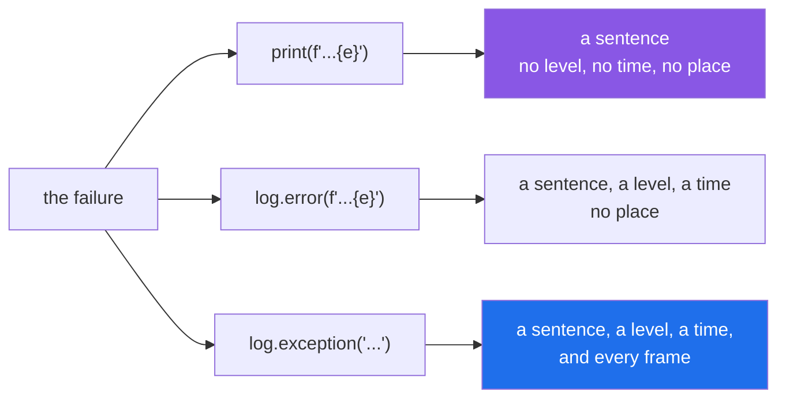

# 4.3 — `logging.exception`, and the traceback you threw away

## One-line answer

Inside an `except` block, `log.exception("what you were doing")` records the message **and the full
traceback**; `log.error(f"failed: {e}")` records one sentence and throws away the only thing that says
where.

---

## The story

The end-of-day book behind the counter has one line per problem.

For months the lines looked like this: **"card machine — 14:20"**. Somebody was diligently writing them
down, every time.

Then the card machine started failing twice a week and somebody had to work out why, and the book was
useless. It said the machine had failed. It did not say what the machine had said, which terminal it was,
what the transaction was, or what the clerk had been doing at the moment it happened.

All of that had been on the screen, for about four seconds, every single time.

The new book has a slot for the receipt. The clerk tears off the strip the machine prints and staples it
in. It takes the same four seconds, and the line is now the beginning of an answer instead of a record
that there was a question.

---

## The idea in plain language

When a handler records a failure, there are four ways to do it and they preserve very different amounts.

| Written | Records |
|---|---|
| `print(f"failed: {e}")` | one line, no level, no timestamp, no traceback, to stdout |
| `log.error(f"failed: {e}")` | one line with a level and a timestamp — **no traceback** |
| `log.error("failed", exc_info=True)` | the line **and** the traceback |
| `log.exception("failed")` | the same as the line above; this is the short form |

`log.exception` is exactly `log.error(..., exc_info=True)`. It works **only inside an `except` block**,
because it reads the exception currently being handled — the same one a bare `raise` would re-raise
([2.4](../02-the-hierarchy/2.4-re-raising.md)).

Why the traceback matters so much: the message says *what layer noticed*; the traceback says *which line,
in which function, called from where*. A log without it turns every investigation into a search — you know
something failed, and you have to find out where by reading code or by reproducing it.

Three habits go with it.

**Use `%s` placeholders, not an f-string, for the message.** `log.exception("could not weigh parcel %s",
parcel_id)` rather than `log.exception(f"could not weigh parcel {parcel_id}")`. Two reasons: the
formatting is skipped entirely if the level is disabled, and — more importantly — the **message stays
constant** while the value goes in a separate field, so an error tracker can group a thousand of these as
one issue rather than a thousand ([3.3](../03-your-own/3.3-the-message-is-an-interface.md)).

**Say what you were trying to do, not what went wrong.** The exception already says what went wrong; you
are the only one who knows the intent. "could not weigh parcel 7741" plus a traceback is complete;
"ValueError occurred" is the traceback said twice.

**Log once, at the layer that knows what to say.** A failure logged at four levels appears four times, and
the reader has to work out whether that is four failures. The usual arrangement is: inner code raises,
one place logs — either the boundary ([4.1](4.1-the-except-that-was-too-wide.md)), or the layer that has
the identifiers worth recording, which then re-raises ([2.4](../02-the-hierarchy/2.4-re-raising.md)).

One more distinction, because the levels are used carelessly. `log.exception` logs at **ERROR**. If the
failure is expected and handled — a retry that will succeed, a skipped bad row — that is a warning, and
`log.warning("...", exc_info=True)` is the honest form. Reserve ERROR for things somebody should look at.

---

## Why Setu needs it

- **Day 172's router logs each provider's failure before failing over.** Which provider, which model, and
  the traceback — otherwise a systematic failure and four transient ones look identical.
- **Day 16's `read_jsonl(on_error="skip")` skips bad lines**
  ([Day 16, 2.5](../../../day-16-files-and-context-managers/parts/02-reading-and-writing/2.5-jsonl.md)),
  and a skip that is invisible is data loss. It is a **warning** with the line number, not an error.
- **Day 233's eval suite must separate "the model was wrong" from "our code crashed"**, and the traceback
  is the only thing that tells them apart in a log.
- **Principle 5 says every lab states its request budget**, and a provider failure that is logged without
  the provider name cannot be attributed to a budget.

---

## The mechanism

The same failure, recorded four ways:

```python
"""What each way of logging a failure actually records."""

import logging
import sys

logging.basicConfig(level=logging.INFO, format="%(levelname)-8s %(message)s", stream=sys.stdout)
log = logging.getLogger("counter")


def weigh(grams):
    return int(grams)


def report(style, parcel_id, grams):
    print(f"--- {style} ---")
    try:
        weigh(grams)
    except ValueError as error:
        if style == "print":
            print(f"could not weigh: {error}")
        elif style == "log.error(str)":
            log.error("could not weigh: %s", error)
        elif style == "log.error(exc_info)":
            log.error("could not weigh parcel %s", parcel_id, exc_info=True)
        elif style == "log.exception":
            log.exception("could not weigh parcel %s", parcel_id)


for style in ("print", "log.error(str)", "log.error(exc_info)", "log.exception"):
    report(style, 7741, "heavy")
```

**Line by line:**

- `logging.basicConfig(...)` — configures the root logger once. **In a library you never call this**; it is
  the application's decision, and calling it in a module makes that decision for everybody who imports you
  ([Day 17, 1.1](../../../day-17-modules-and-packages/parts/01-the-module/1.1-a-module-is-a-file-that-has-already-run.md)).
- `stream=sys.stdout` — only so the output appears in order in this demonstration; logging goes to stderr
  by default, which is correct.
- `log = logging.getLogger("counter")` — a **named** logger, at module level. The name is how a
  configuration can turn this module's logging up without turning everything else up.
- `log.error("could not weigh: %s", error)` — the common form, and the one this part argues against. Note
  it uses `%s` correctly and still records no traceback.
- `log.error("could not weigh parcel %s", parcel_id, exc_info=True)` — the traceback, requested
  explicitly. `exc_info=True` means "attach the exception currently being handled".
- `log.exception("could not weigh parcel %s", parcel_id)` — **the same thing, shorter.** This is the form
  to type.
- `parcel_id` passed as an argument rather than interpolated — so the message text is the same string
  every time and a tracker can group on it.

Run on Python 3.12.12 on 2026-09-02:

```
--- print ---
could not weigh: invalid literal for int() with base 10: 'heavy'
--- log.error(str) ---
ERROR    could not weigh: invalid literal for int() with base 10: 'heavy'
--- log.error(exc_info) ---
ERROR    could not weigh parcel 7741
Traceback (most recent call last):
  File "...\logdemo.py", line 17, in report
    weigh(grams)
  File "...\logdemo.py", line 11, in weigh
    return int(grams)
           ^^^^^^^^^^
ValueError: invalid literal for int() with base 10: 'heavy'
--- log.exception ---
ERROR    could not weigh parcel 7741
Traceback (most recent call last):
  File "...\logdemo.py", line 17, in report
    weigh(grams)
  File "...\logdemo.py", line 11, in weigh
    return int(grams)
           ^^^^^^^^^^
ValueError: invalid literal for int() with base 10: 'heavy'
```

**The bottom two blocks are identical**, which is the point: `log.exception` is the short spelling. And
compare either of them with the second block — same failure, and one of them names `weigh`, line 11, and
the expression that failed.

What each form keeps:



---

## When it breaks

**`log.exception` outside a handler:**

```text
$ uv run python -c "
import logging, sys
logging.basicConfig(level=logging.INFO, stream=sys.stdout)
logging.getLogger('x').exception('something went wrong')
"
ERROR:x:something went wrong
NoneType: None
```

**What it means.** `NoneType: None` where a traceback should be. There is no exception being handled, so
`exc_info` found nothing, and rather than raising, `logging` printed that. It is a strange line to meet in
a log and the cause is always the same: the call is not inside an `except` block — usually because
somebody moved it into a helper, or into a `finally`, or after the handler ended.

**The f-string that made a thousand issues:**

```text
$ uv run python -c "
import logging, sys
logging.basicConfig(level=logging.INFO, format='%(message)s', stream=sys.stdout)
log = logging.getLogger('x')

for parcel in (7741, 7742, 7743):
    try:
        int('heavy')
    except ValueError:
        log.exception(f'could not weigh parcel {parcel}')
"
could not weigh parcel 7741
...
could not weigh parcel 7742
...
could not weigh parcel 7743
...
```

**What it means.** Three different message strings for one problem. Locally that is fine and even nicer to
read. In an error tracker, which groups by message, it is three issues — and with a million parcels it is
a million, which makes the tracker useless exactly when it is needed. `log.exception("could not weigh
parcel %s", parcel)` produces one message string and three values, which groups as one issue with a count.
(The `...` above stands in for the traceback each of the three printed.)

**Logging and re-raising at every layer:**

```python
def middle(row):
    try:
        return price(row)
    except ValueError:
        log.exception("pricing failed")
        raise


def top(rows):
    try:
        return [middle(r) for r in rows]
    except ValueError:
        log.exception("batch failed")
        raise
```

**Line by line:**

- both handlers use `log.exception` and both re-raise, which is individually correct
  ([2.4](../02-the-hierarchy/2.4-re-raising.md)).
- **one failure now writes two full tracebacks**, plus a third if the boundary logs as well.
- the two messages overlap: "pricing failed" and "batch failed" describe the same event at two zoom
  levels.

**What it means.** Log volume triples and the reader has to work out that three entries are one incident.
The convention that fixes it: **inner layers raise, one layer logs.** If a middle layer has context worth
recording, `error.add_note(...)`
([1.5](../01-raising-and-catching/1.5-the-exception-object.md)) attaches it to the exception, and the
single log at the boundary prints it with the traceback.

**Logging at ERROR something that was handled fine:**

```text
$ uv run python -c "
import logging, sys
logging.basicConfig(level=logging.INFO, format='%(levelname)s %(message)s', stream=sys.stdout)
log = logging.getLogger('x')

for attempt in range(3):
    try:
        if attempt < 2:
            raise ConnectionError('transient')
        print('succeeded on attempt', attempt)
    except ConnectionError:
        log.exception('call failed')
"
ERROR call failed
...
ERROR call failed
...
succeeded on attempt 2
```

**What it means.** Two ERROR entries for a call that succeeded. If ERROR pages somebody, this pages them
twice for a non-event; if it does not, ERROR has stopped meaning anything. A retry that is going to retry
is a **warning**: `log.warning("call failed, retrying", exc_info=True)`, and the ERROR is reserved for the
attempt that runs out.

---

## In production

**The professional habit is that a handler which records a failure uses `log.exception` with a message
saying what it was trying to do, and passes identifiers as arguments rather than interpolating them.**
That one line gives an on-call engineer the level, the time, the intent, the identifiers, and the exact
line — which is the difference between reading a log and reproducing a bug.

**What changes at scale is that logs stop being read and start being queried.** Nobody scrolls a million
lines; they filter by level, group by message, and facet by fields. That only works if the message text is
constant and the variable parts are separate — the same fields-versus-prose split as
[3.2](../03-your-own/3.2-an-exception-that-carries-data.md) and
[3.3](../03-your-own/3.3-the-message-is-an-interface.md), arriving for the third time from a different
direction. It is the reason `%s` placeholders are not a stylistic preference in logging.

**The failure that only appears with real data is the log line that is too big or too sensitive.** A
handler that logs the whole record for context is fine on a test fixture and, on real data, writes
personal information into a log with a long retention and a broad audience (Principle 11). The same is
true of a traceback in some frameworks, which can include local variables. The rule is to log
identifiers — a row number, a customer id — not contents, so an investigator can look the record up
through a system that checks whether they are allowed to.

**The review comment a senior engineer leaves.** *"`log.error(f'failed: {e}')` here loses the traceback,
so we know something failed in this module and not where. Use `log.exception('could not sync account %s',
account_id)` — and drop the f-string so this groups as one issue in the tracker instead of one per
account."*

**The interview question.** *"How do you log an exception?"* The answer is `logging.exception` inside the
handler, because it attaches the traceback, and a message that says what you were attempting rather than
repeating what the exception says. The details that show you have carried a pager: `%s` arguments rather
than an f-string so the message groups; log once, at one layer, rather than at every layer that re-raises;
and ERROR only for things somebody should look at — a retry that will succeed is a warning.

---

## Check yourself

```bash
uv run python -c "
import logging, sys
logging.basicConfig(level=logging.INFO, format='%(levelname)-8s %(message)s', stream=sys.stdout)
log = logging.getLogger('counter')

try:
    int('heavy')
except ValueError as error:
    log.error('lost the traceback: %s', error)
    log.exception('kept it, while weighing parcel %s', 7741)
"
```

Two entries, and only one of them tells you where. Now call `log.exception` from outside the `except`
block and read the two words it prints instead of a traceback.

**Answer out loud, without scrolling up:**

> Name what `log.exception` records that `log.error(f'failed: {e}')` does not, and give the reason for
> passing the parcel id as an argument rather than putting it in the f-string.

---

**Next:** [4.4 — `pytest.raises`, and asserting on the type rather than the message](4.4-pytest-raises.md).
