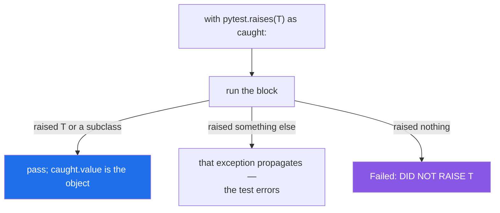

# 4.4 — `pytest.raises`: testing the failure path

## One-line answer

`with pytest.raises(SomeError) as caught:` asserts that the block raised that type, and `caught.value` is
the object — so assert on the **type and the attributes**, keep the block to one call, and use `match=`
only as a hint.

---

## The story

The fire drill happens twice a year, and everybody grumbles about it.

The reason it happens is that the alarm is the only part of the building nobody uses. Every day proves the
doors open, the lights work and the till adds up, because people open doors and add up all day. Nothing
proves the alarm sounds, because nothing sounds it.

So twice a year somebody sounds it on purpose. Not to see whether the building is on fire — to see whether
the alarm still works, and whether the doors people have been propping open all year still close.

The second half is the part that catches things. It is never the alarm that fails. It is the door that
somebody wedged in March.

---

## The idea in plain language

Every test you have written so far checks what a function *returns*
([Day 2, 3.1](../../../day-02-quality-gate/parts/03-pytest/3.1-the-test-that-can-go-red.md)). The failure
path needs a different tool, because a function that raises does not return anything to compare.

`pytest.raises` is a context manager
([Day 16, 4.1](../../../day-16-files-and-context-managers/parts/04-context-managers/4.1-with-the-block-that-cleans-up.md))
that inverts the usual rule: the block is **expected** to raise, and the test fails if it does not.

```text
with pytest.raises(ValueError):
    weigh(-1)
```

Three things about it.

**It fails loudly when nothing raises.** The message is `Failed: DID NOT RAISE ValueError`, and it is the
most useful failure in the whole tool: it means the thing you thought was rejected is being accepted.

**`as caught` gives you the exception object**, on `caught.value` — not on `caught`, which is a wrapper.
That is where you assert on attributes ([3.2](../03-your-own/3.2-an-exception-that-carries-data.md)):
`caught.value.retry_after == 30.0` is a test of the interface that actually matters.

**Keep the block to one call.** Everything after the raising line is dead code, so a `with` block with
three statements silently stops executing at the first one that raises — including any assertions you put
there. This is [4.1](4.1-the-except-that-was-too-wide.md)'s "the `try` was too big" in test form, and it
is worse here, because a dead assertion looks like a passing one.

Then the rule this part is named for: **assert on the type, not on the message.**

The type is the interface ([2.2](../02-the-hierarchy/2.2-which-built-in-to-raise.md)); the message is prose
for humans, and improving it should never break a test
([3.3](../03-your-own/3.3-the-message-is-an-interface.md)). `pytest.raises` offers `match=`, which does a
regular-expression **search** over `str(exception)` — note search, not full match, so a fragment is enough.
Used well it is a hint that keeps the test honest: `match="over the 2000g limit"` distinguishes the
over-limit `ValueError` from the negative-number `ValueError` when both are the same type. Used badly —
anchored to the whole sentence — it freezes the wording.

And the shape that matters most on this day: **a test that asserts an exception escapes.** A context
manager that swallows, a handler that logs and falls through, a translation that forgets to re-raise —
none of those can be caught by a test about return values, because the return value looks fine
([2.4](../02-the-hierarchy/2.4-re-raising.md)). Only `pytest.raises` around the failing operation can see
them. That is why Day 16 made deleting exactly that test its "watch everything stay green" exercise
([Day 16, 4.5](../../../day-16-files-and-context-managers/parts/04-context-managers/4.5-contextmanager-decorator.md)).

---

## Why Setu needs it

- **Principle 7 is evals before features**: a behaviour is not done until a test can go red. Half of
  today's behaviours are refusals, and this is the only tool that can assert one.
- **Today's `tests/test_errors.py`** asserts that `RateLimited` carries `retry_after`, that it is a
  `SetuError`, and that `load_manifest` never leaks a `json` exception
  ([3.4](../03-your-own/3.4-translate-at-the-boundary.md)).
- **Day 16's `atomic_write` needed exactly one test that could see a swallowed exception**, and it is this
  shape.
- **Day 233's eval suite asserts that bad inputs are rejected**, which is a `pytest.raises` per rule.

---

## The mechanism

The module under test, and then the tests:

```python
class SetuError(Exception):
    """Everything this project raises on purpose."""


class RateLimited(SetuError):
    def __init__(self, provider, retry_after):
        super().__init__(provider, retry_after)
        self.provider = provider
        self.retry_after = retry_after

    def __str__(self):
        return f"{self.provider} rate-limited us; retry in {self.retry_after:.0f}s"


def weigh(grams, limit=2000):
    if not isinstance(grams, int):
        raise TypeError(f"grams must be an int, got {type(grams).__name__}")
    if grams <= 0:
        raise ValueError(f"grams must be positive, got {grams}")
    if grams > limit:
        raise ValueError(f"{grams}g is over the {limit}g limit")
    return grams


def call(provider):
    raise RateLimited(provider, 30.0)
```

**Line by line:**

- three different rejections, **two of them the same type** — that is deliberate, because it is what makes
  `match=` earn its place below.
- `raise TypeError(...)` for the wrong kind and `raise ValueError(...)` for the wrong value
  ([2.2](../02-the-hierarchy/2.2-which-built-in-to-raise.md)).
- `RateLimited` with two attributes and `args` matching the constructor
  ([3.2](../03-your-own/3.2-an-exception-that-carries-data.md)).

```python
import pytest

from counter import RateLimited, SetuError, call, weigh


def test_raises_the_right_type():
    with pytest.raises(ValueError):
        weigh(-1)


def test_the_type_not_the_message():
    with pytest.raises(TypeError):
        weigh("500")


def test_match_is_a_regex_search():
    with pytest.raises(ValueError, match=r"over the 2000g limit"):
        weigh(5000)


def test_inspecting_the_object():
    with pytest.raises(RateLimited) as caught:
        call("groq")
    assert caught.value.provider == "groq"
    assert caught.value.retry_after == 30.0
    assert isinstance(caught.value, SetuError)


def test_it_does_not_raise_on_a_good_value():
    assert weigh(500) == 500
```

**Line by line:**

- `with pytest.raises(ValueError):` and **one call inside it**. Nothing else, so the assertion is about
  that call and only that call.
- `test_the_type_not_the_message` passing `"500"` — a string that *looks* like a valid weight, so the test
  is about the type check rather than about the value.
- `match=r"over the 2000g limit"` — a **fragment**, and a raw string because it is a regular expression.
  It distinguishes this `ValueError` from the negative-number one; it does not pin the whole sentence, so
  rewording the start or end of the message keeps the test green.
- `as caught` — and note that the assertions come **after** the `with` block, not inside it. Inside, they
  would be after the raising line and would never run.
- `caught.value` — the exception object. `caught` itself is `ExceptionInfo`, a wrapper; `caught.value` is
  the mistake people make once.
- `assert caught.value.retry_after == 30.0` — **the assertion that matters.** This is the interface a
  retry loop uses ([3.2](../03-your-own/3.2-an-exception-that-carries-data.md)), and no message assertion
  covers it.
- `assert isinstance(caught.value, SetuError)` — the base-class check
  ([3.1](../03-your-own/3.1-one-base-class-per-project.md)), one line, and it catches the day somebody
  defines a new exception under the wrong parent.
- `test_it_does_not_raise_on_a_good_value` — the happy path, in the same file. A file of only-rejection
  tests passes for a function that rejects everything.

Run on Python 3.12.12 with pytest 9.1.1 on 2026-09-02:

```text
$ uv run python -m pytest -q
.....                                                                    [100%]
5 passed in 0.02s
```

What the tool checks:



Note the middle branch: a *different* exception is not reported as "wrong type", it simply escapes, and
the test fails with that exception's own traceback — which is usually more informative anyway.

---

## When it breaks

**Nothing raised, which is the failure worth having:**

```text
$ uv run python -m pytest test_fail.py -q
    def test_this_one_does_not_raise():
>       with pytest.raises(ValueError):
             ^^^^^^^^^^^^^^^^^^^^^^^^^
E       Failed: DID NOT RAISE ValueError

test_fail.py:7: Failed
=========================== short test summary info ===========================
FAILED test_fail.py::test_this_one_does_not_raise - Failed: DID NOT RAISE Val...
1 failed in 0.06s
```

**What it means.** `weigh(500)` is valid, so nothing raised, so the test failed. Read as a real failure it
is the most valuable message in the file: **something you believe is rejected is being accepted.** If a
validation rule is removed by accident, this is the test that notices.

**A `with` block containing more than one statement:**

```text
$ uv run python -m pytest test_wide.py -q
.                                                                        [100%]
1 passed in 0.01s
```

Where the test is:

```python
def test_wide_block():
    with pytest.raises(ValueError):
        weigh(500)
        weigh(-1)
        assert False, "this line never runs"
```

**Line by line:**

- `weigh(500)` — succeeds, returns 500, and the return value is discarded.
- `weigh(-1)` — raises, which satisfies `pytest.raises`.
- `assert False` — **never reached**, and the test passes with a deliberately failing assertion inside it.

**What it means.** A passing test containing `assert False`. Everything after the raising line is dead, so
any assertion written there is decoration. The rule is one call inside the `with` and every assertion
after it — and if you find yourself wanting two calls, that is two tests.

**A `match=` anchored to the whole message:**

```python
def test_message_text():
    with pytest.raises(ValueError, match=r"^5000g is over the 2000g limit$"):
        weigh(5000)
```

**Line by line:**

- `^` and `$` — anchoring to the start and end, which turns `match`'s *search* into an exact comparison.
- the full sentence in the pattern — every word now part of the test.

**What it means.** It passes today. It fails the day somebody improves the message to `"5000g is over the
2000g limit for standard post"` — a change that improves the product and breaks a test, which teaches the
team that improving messages is expensive. **Match on the distinguishing fragment**, or better, give the
two cases different types or attributes so no message assertion is needed at all.

**Asserting the type when the attributes are what matter:**

```python
def test_rate_limited():
    with pytest.raises(RateLimited):
        call("groq")
```

**Line by line:**

- the type is asserted, and nothing else.
- **`retry_after` is never checked**, so this test passes if the constructor stores `None`, or `0`, or the
  provider name in the wrong field.

**What it means.** The test covers the part that rarely breaks and skips the part that does. An exception's
type is set once, in one place; its attributes are populated at every raise site, and a raise site that
passes them in the wrong order is exactly the bug that reaches production. `caught.value` is one extra
line.

---

## In production

**The professional habit is one test per rejection rule, each asserting the type and any attribute a
caller uses, with the happy path tested alongside.** The failure path is where the least-exercised code
lives — handlers, cleanup, translations — and it is where an untested change is least likely to be noticed
by anything else.

**What changes at scale is that these tests become the specification of the error contract.** When callers
depend on your exception types ([3.4](../03-your-own/3.4-translate-at-the-boundary.md)), a test asserting
"this input raises `ManifestError` and nothing else escapes" is what stops a refactor from leaking a
`json` exception into somebody's handler. Some teams write exactly one such test per public function, and
it catches more real breakage than most of the happy-path tests.

**The failure that only appears with real data is the exception that is never raised in testing.** A rule
that has no `pytest.raises` test is a rule you find out about when it fires in production, and the usual
discovery is that it does not fire — the condition was written with the wrong comparison, or the check is
after the work it was supposed to guard. The fire-drill point from the story: the alarm is the only part
nobody uses, so it is the only part that has to be tested on purpose.

**The review comment a senior engineer leaves.** *"`pytest.raises(SetuError)` will pass for any of our
seven exception types — assert the specific one, and check `retry_after` on `caught.value`, because that
is what the retry loop reads. Also, the two calls inside the `with` mean the second one is never
evaluated."*

**The interview question.** *"How do you test that something raises?"* `pytest.raises` as a context
manager, one call inside it, assertions on `caught.value` afterwards. The parts that show you have used
it: assert the **type and the attributes**, not the message, because the message is for humans and
anchoring a test to it makes rewording a breaking change; `match=` is a regex search and belongs on a
fragment that distinguishes two same-typed failures; and the most valuable test of this shape is the one
asserting an exception *escapes* a handler, because a swallowed exception is invisible to every other kind
of test.

---

## Check yourself

```bash
uv run python -c "
import pytest

class Boom(Exception):
    def __init__(self, code):
        super().__init__(code)
        self.code = code

def call():
    raise Boom(429)

with pytest.raises(Boom) as caught:
    call()
print('type      :', type(caught.value).__name__)
print('attribute :', caught.value.code)
print('caught is :', type(caught).__name__, '- not the exception')

try:
    with pytest.raises(Boom):
        pass
except BaseException as error:
    print('nothing raised ->', error)
"
```

The last block shows the `DID NOT RAISE` failure without a test runner. Now add a second statement inside
a `pytest.raises` block in a real test and confirm it never runs.

**Answer out loud, without scrolling up:**

> Why should a test assert the exception type and its attributes rather than its message, and what is
> wrong with putting three statements inside one `pytest.raises` block?

---

**Next:** [4.5 — `ExceptionGroup` and `except*`: many failures at once](4.5-exception-groups.md).
